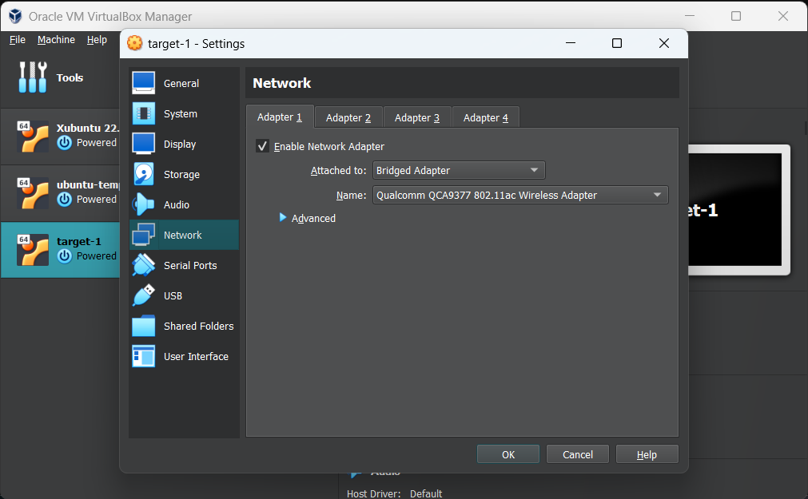
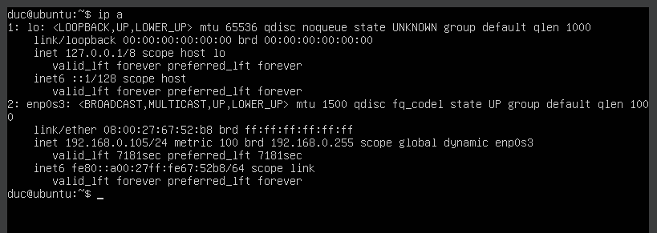
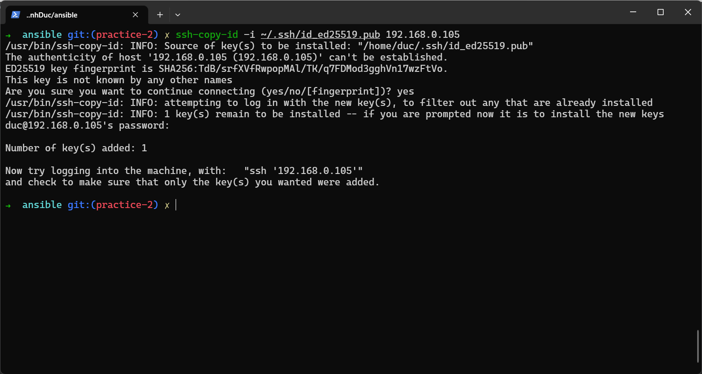
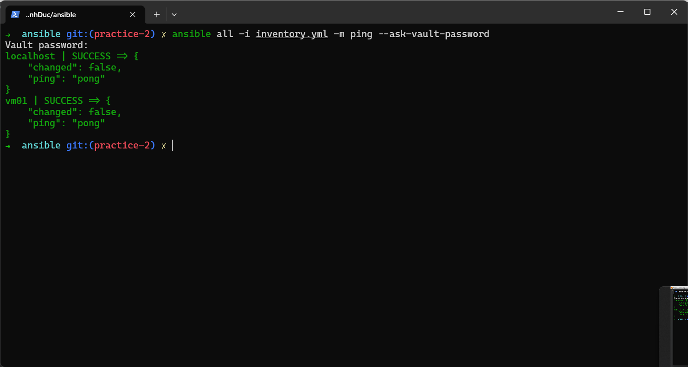
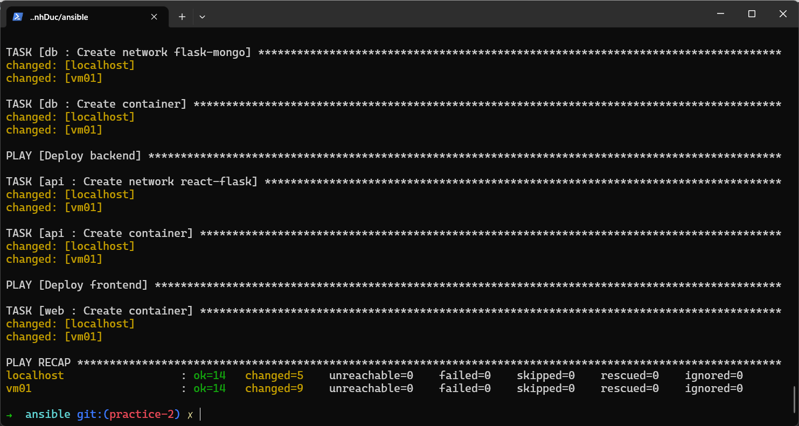
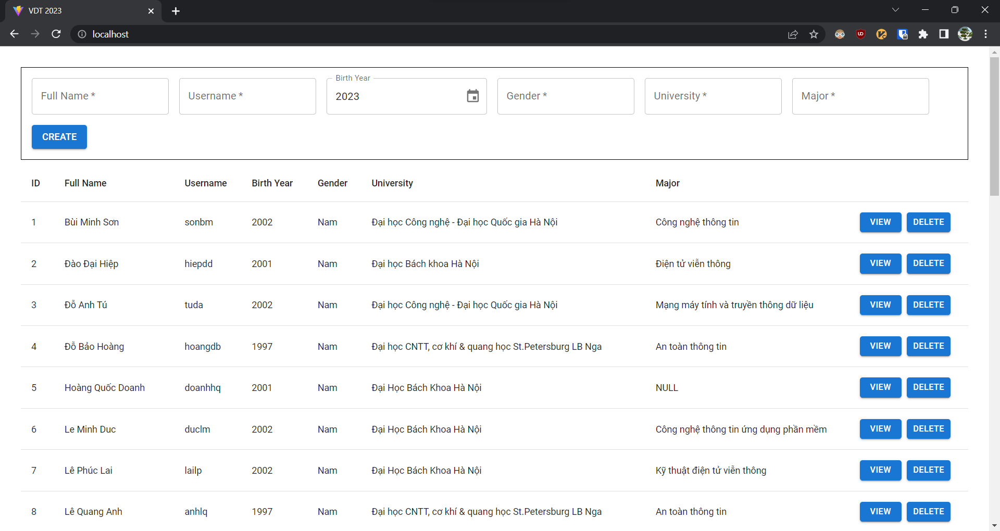
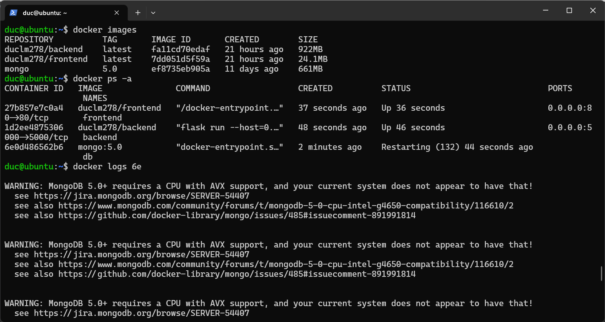

# Practice 2: Ansible <!-- omit in toc -->

Author: **Le Minh Duc**

## Table of Contents <!-- omit in toc -->

- [1. Requirements](#1-requirements)
- [2. Setting up nodes](#2-setting-up-nodes)
- [3. Setting up docker using role `common`](#3-setting-up-docker-using-role-common)
- [4. Splitting application into 3 roles: `web`, `api` and `db`](#4-splitting-application-into-3-roles-web-api-and-db)
- [5. Conclusion](#5-conclusion)
- [6. References](#6-references)

## 1. Requirements

Deploy the application in the docker-compose homework using ansible:

- Set up docker for the target environments using role "common".
- Split the application into 3 roles: "web", "api" and "db".

## 2. Setting up nodes

- First I installed `Ubuntu Server` as a virtual machine and enable bridged network adapter. I choose `Ubuntu Server` because its lightweight and ease of use.


*Setting up VirtualBox VM*

- Install Ansible for controller node:

```shell
pip3 install -U ansible
sudo apt install openshh-server
```

- Get IP address of virtual machine:

```shell
$ ip a
...
    inet 192.168.0.x/24 ...
...
```


*Getting IP address of VM*

- Set up SSH connection between controller and target nodes.

```shell
# 1. Generating new SSH key
ssh-keygen -t ed25519 -C "email@example.com"
# 2. Adding SSH key to ssh-agent
eval "$(ssh-agent -s)"
ssh-add ~/.ssh/id_ed25519
# 3. Copying SSH key to target nodes
ssh-copy-id -i ~/.ssh/id_ed25519.pub <username>@<target-node-ip>
```

-I only need to enter password once for each node. In future connections, SSH won't ask for password again.


*Setting up SSH connection*


*Testing SSH connection*

- Add target nodes to `inventory.yml` file:

```yml
---
vm:
  hosts:
    vm01:
      remote_user: duc
      ansible_host: 192.168.0.102
      ansible_user: "{{ remote_user }}"
      ansible_python_interpreter: /usr/bin/python3
      ansible_become_user: root
      ansible_become_password: "{{ become_password }}"

local:
  hosts:
    localhost:
      remote_user: duc
      ansible_connection: local
      ansible_user: "{{ remote_user }}"
      ansible_python_interpreter: /usr/bin/python3
      ansible_become_user: root
      ansible_become_password: "{{ become_password }}"
```

- Passwords will be encrypted using `ansible-vault` and stored in `group_vars/vault.yml`:

```shell
$ ansible-vault create group_vars/vault.yml
---
vault_become_password: <secret_password>
```

- Load passwords from vault to `group_vars/vars.yml`:

```yml
---
become_password: "{{ vault_become_password }}"
```

- I can enter vault authentication password using `--ask-vault-pass` option at runtime:

```shell
$ ansible-playbook -i inventory.yml site.yml --ask-vault-pass
Vault password: ...
```

## 3. Setting up docker using role `common`

- Docker is needed to deploy the application, so I create a role `common` to install docker on target nodes. The role is defined in `roles/common` directory.

- The goal is to make this module idempotent and avoid using `shell` module. The [Install Docker in Debian-like systems](https://www.ansiblepilot.com/articles/install-docker-in-debian-like-systems-ansible-module-apt_key-apt_repository-and-apt/) is a good reference to follow but is not error-free:

```yml
- name: Add repository into sources list
    ansible.builtin.apt_repository:
      repo: "deb [arch={{ ansible_architecture }}] ...
      state: present
      filename: docker
```

- Here `ansible_architecture` returns `x86_64` for my machine when the actual deb architecture is `amd64`.

- Setting it wrong will cause the `docker-ce` and other packages not available for installation. The author fixes it by install alternative packages.

- I fixed it by creating a new variable `deb_architecture` in `common/defaults/main.yml`:

```yml
deb_architecture: {
  "aarch64": "arm64",
  "x86_64": "amd64"
}
```

- Then I can use `deb_architecture[ansible_architecture]` to get the correct architecture. Now, `docker-ce` and other packages are available for installation.

```yml
- name: Install Docker engine
  ansible.builtin.apt:
    name:
      - docker-ce
      - docker-ce-cli
      - containerd.io
      - docker-buildx-plugin
      - docker-compose-plugin
    state: present
```

- I also added `remote_user` to group `docker` to run Docker in rootless mode. A reset of the SSH connection is required to re-evaluate group membership:

```yml
- name: Ensure docker-group added user {{ remote_user }}
  ansible.builtin.user:
    name: "{{ remote_user }}"
    groups: docker
    append: true

- name: Reset SSH connection to re-evaluate group membership
  ansible.builtin.meta: reset_connection
```

## 4. Splitting application into 3 roles: `web`, `api` and `db`

- To make sure the app deployed correctly, the order of deployment is important: `db` -> `api` -> `web`.

- Each role simply creates its missing network, pull its image and connect the container to the network:

```yml
---
- name: Create network {{ api_db_network }}
  community.docker.docker_network:
    name: "{{ api_db_network }}"

- name: Create container
  community.docker.docker_container:
    name: "{{ db_name }}"
    hostname: "{{ db_name }}"
    restart_policy: unless-stopped
    image: "{{ db_image }}"
    volumes:
      - ../app/db:/docker-entrypoint-initdb.d
    networks:
      - name: "{{ api_db_network }}"
    ports:
      - 27017:27017
```

- At first I intended to run task "Create network" to create all networks each role belongs to. I expected rerunning the task will add the new network to the container. However, it turns out recreating the network will cause the previous container to be disconnected from the network.

- Fix it by running task "Create network" only if the network does not exist. Still, it still took me a while to figure out the problem :smile:

- Thanks `hoangndst` and `khanhlinhh`. Only after referring to their code did I realize the problem :bow:

- I also need to update my `nginx.conf` as my `nginx` service is suddenly stopped because the proxy_pass one got unreachable. The reason is that `upstream` requires including `resolver` as well.

- Here is the link to the StackOverflow [question](https://stackoverflow.com/questions/64834956/nginx-docker-compose-host-not-found-in-upstream-nuxt3000) that explains the problem if you are interested.

- Well, I minimalized my `nginx.conf` by removing `upstream` and following this [answer](https://stackoverflow.com/questions/42720618/docker-nginx-stopped-emerg-11-host-not-found-in-upstream) to fix the problem:

```conf
...
http {
  server {
    ...
    location /api/ {
      resolver 127.0.0.11;
      set $example backend:5000;
      proxy_pass http://$example;
    }
  }
}
```

## 5. Conclusion

Here are the final results after deploying the application to my local machine and virtual machine:


*Deploying application to local machine*


*Result of deploying application to local machine*

Well, the application isn't accessible from my VM. Let's SSH into the VM and debug it:



It turns out that the MongoDB requires a CPU with AVX support, which my VM doesn't have.

Although I failed to deploy the application to my VM, I would still consider it a success as I have gained a lot of experience of working with SSH, Ansible, Docker and Nginx.

Next challenge will be integrating a load balancer into the application. I will also try to deploy the application to a cloud server instead of a VM this time.
Until then, goodbye and have a nice day :smile:

## 6. References

[1] [Ansible in 100 Seconds](https://youtu.be/xRMPKQweySE)

[2] [Keep vaulted variables safely visible](https://docs.ansible.com/ansible/latest/tips_tricks/ansible_tips_tricks.html#keep-vaulted-variables-safely-visible)

[3] [Install Docker in Debian-like systems](https://www.ansiblepilot.com/articles/install-docker-in-debian-like-systems-ansible-module-apt_key-apt_repository-and-apt/)

[4] [Ansible Role - Docker](https://github.com/geerlingguy/ansible-role-docker)

[5] [Repo of `hoangndst`](https://github.com/hoangndst/Viettel-Digital-Talent-2023/tree/practice2/2.%20Ansible)

[6] [Repo of `khanhlinhh`](https://github.com/khanhlinhh/Viettel-Digital-Talent-2023/tree/ansible-lab/2.%20Ansible)

[7] [Docker Nginx Stopped: Host Not Found in Upstream](https://stackoverflow.com/questions/42720618/docker-nginx-stopped-emerg-11-host-not-found-in-upstream)

[8] [Nginx docker-compose - Host Not Found in Upstream](https://stackoverflow.com/questions/64834956/nginx-docker-compose-host-not-found-in-upstream-nuxt3000)
