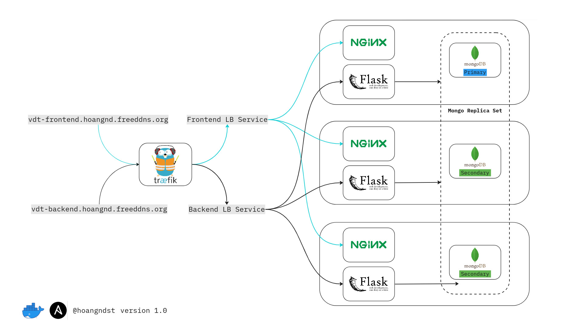

## Deploy your application in the docker-compose homework using ansible:
1. Setup docker for your target environments in role “common”
2. Split your application into 3 roles: “web”, “api” and “db”


### Ansible
1. What is Ansible?
  - Ansible is an open-source software provisioning, configuration management, and application-deployment tool enabling infrastructure as code. It runs on many Unix-like systems, and can configure both Unix-like systems as well as Microsoft Windows. It includes its own declarative language to describe system configuration.
  - Ansible is agentless, temporarily connecting remotely via SSH or Windows Remote Management (allowing remote PowerShell execution) to do its tasks.
  - Ansible is built on Python, in contrast to the Ruby foundation of Puppet and Chef.
2. Ansible Project Structure
    - Ansible project structure is as follows:
        ```bash
        .
        ├── inventories
        │   └── digital_ocean
        │       ├── group_vars
        │       │   └── vm.yaml
        │       └── hosts
        ├── roles
        │   ├── api
        │   │   ├── defaults
        │   │   |   └── main.yaml
        │   │   ├── tasks
        │   │   |   ├── deploy.yaml
        │   │   |   ├── main.yaml
        │   │   |   └── setup.yaml
        │   ├── common
        │   │   └── tasks
        │   │       ├── docker.yaml
        │   │       ├── main.yaml
        │   │       └── repository.yaml
        │   ├── db
        │   │   ├── defaults
        │   │   |   └── main.yaml
        │   │   ├── tasks
        │   │   |   ├── deploy.yaml
        │   │   |   ├── init.yaml
        │   │   |   ├── main.yaml
        │   │   |   └── setup.yaml
        │   ├──  lb
        │   |   ├── defaults
        │   |   |   └── main.yaml
        │   |   ├── tasks
        │   |   |   ├── deploy.yaml
        │   |   |   ├── main.yaml
        │   |   |   └── setup.yaml
        |   |   └── templates
        |   |       ├── dynamic.yaml.j2
        |   |       └── traefik.yaml.j2
        │   └── web
        │       ├── defaults
        │       |   └── main.yaml
        │       └── tasks
        │           ├── deploy.yaml
        │           ├── init.yaml
        │           ├── main.yaml
        │           └── setup.yaml
        ├── install_docker.yaml
        └── deploy.yml
        
        ```
        - **`inventories`**: This directory contains all the inventory files for different environments. In this project, we only have one environment which is `digital_ocean`.
        - **`roles`**: This directory contains all the roles of the project. Each role contains `defaults`, `tasks` and `templates` directories. 
            - **`defaults`**: This directory contains all the default lower priority variables for this role
            - **`tasks`**: This directory contains all the tasks of the role.
            - **`templates`**: This directory contains all the files for use with the template resource, templates end in `.j2`
        - **`install_docker.yaml`**: This file contains the playbook for installing docker on the target hosts.
        - **`deploy.yaml`**: This file contains the playbook for deploying the application on the target hosts.


### Create NFS server for sharing data between nodes
1. Overview
We will use 10GB disk to create NFS server for sharing data between containers. **`/dev/sda`**
    <div align="center">
        
    </div>
2. Install **`nfs-kernel-server`** package
    ```bash
    sudo apt update
    sudo apt install nfs-kernel-server
    ```
3. Create directory for sharing data
    ```bash
    sudo mkdir -p /mnt/nfs_volume/docker_nfs_share
    ```
4. Change ownership of the directory to nobody user
    ```bash
    sudo chown nobody:nogroup /mnt/nfs_volume/docker_nfs_share
    ```
5. Export the directory
    ```bash
    sudo vi /etc/exports
    ```
    Add the following line to the file
    ```bash
    /mnt/nfs_volume/docker_nfs_share    *(rw,sync,no_subtree_check,no_root_squash,no_all_squash,insecure)
    ```
    - **`rw`**: Allow both read and write requests on the NFS volume.
    - **`sync`**: Reply to requests only after the changes have been committed to stable storage.
    - **`no_subtree_check`**: Disable subtree checking. When a shared directory is the subdirectory of a larger file system, nfs performs scans of every directory above it, in order to verify its permissions and details. Disabling the subtree check may increase the reliability of NFS, but reduce security.
    - **`no_root_squash`**: Enable root squashing. This prevents root users connected remotely from having root privileges and assigns them the user ID for the user nfsnobody.
    - **`no_all_squash`**: Enable all squashing. This option is the converse of no_root_squash and makes root users on the client machine appear as root users on the NFS server. This option is generally used for diskless clients.
    - **`insecure`**: This option allows the NFS server to respond to requests from unprivileged ports (ports greater than 1024). This option is useful for mounting NFS volumes from older clients such as NFS version 3.
6. Restart the NFS server
    ```bash
    sudo systemctl restart nfs-kernel-server
    ```

### Build Frontend and Backend Docker Images
1. Move to [`frontend`](./webapp/frontend/) directory and build docker image
    ```bash
    docker build -t hoangndst/vdt-frontend:latest .
    ```
2. Move to [`backend`](./webapp/backend/) directory and build docker image
    ```bash
    docker build -t hoangndst/vdt-backend:latest .
    ```
3. Login to docker hub if you have not logged in
    ```bash
    docker login
    ```
4. Push docker images to docker hub
    ```bash
    docker push hoangndst/vdt-frontend:latest
    docker push hoangndst/vdt-backend:latest
    ```

### Project Structure Overview
<div align="center">
  
</div>

1. Infrastructure
- **`Digital Ocean`**: We will use Digital Ocean to create 3 droplets for our project. 
  - **`VM1`**: This droplet will be used to deploy application and act as NFS server.
  - **`VM2`**: This droplet will be used to deploy application.
  - **`VM3`**: This droplet will be used to deploy application.
2. Technologies
- **`Ansible`**: We will use Ansible to provision and deploy application to our droplets.
- **`Docker`**: We will use Docker to containerize our application.
- **`NFS`**: We will use NFS to share data between containers.
- **`Traefik`**: We will use Traefik as a reverse proxy and load balancer for our application.
- **`MongDB Replica Set`**: We will use MongoDB Replica Set to store data of our application.
  <div align="center">
    
  </div>
  A replica set in MongoDB is a group of mongod processes that maintain the same data set. Replica sets provide redundancy and high availability, and are the basis for all production deployments. This section introduces replication in MongoDB as well as the components and architecture of replica sets. The section also provides tutorials for common tasks related to replica sets.

- **`Nginx`**: We will use Nginx as web server for our application.
- **`Flask`**: We will use Flask as backend framework for our application.

### Deploy Application
1. Move to [`ansible`](./ansible/) directory
2. Setup docker for your target environments in role **`common`**
- Tasks:
  - [**`repository.yaml`**](./ansible/roles/common/tasks/repository.yaml): Add docker repository to apt source list
  - [**`docker.yaml`**](./ansible/roles/common/tasks/docker.yaml): Install Docker Engine, containerd, and Docker Compose
  - [**`main.yaml`**](./ansible/roles/common/tasks/main.yaml): Include all tasks
- Ansible:
  ```bash
  ansible-playbook -i inventories/digitalocean/hosts install_docker.yaml -K
  ```
  Type your sudo password when prompted
  <div align="center">
    
  </div>
3. Deploy MongoDB Replica Set
- Default variables:
  - [**`main.yaml`**](./ansible/roles/db/defaults/main.yaml): Default variables for MongoDB Replica Set
- Tasks:
  - [**`setup.yaml`**](./ansible/roles/db/tasks/setup.yaml): Setup required docker models for ansible, create docker network, volume if not exists.
  - [**`deploy.yaml`**](./ansible/roles/db/tasks/deploy.yaml): Deploy MongoDB
  - [**`init.yaml`**](./ansible/roles/db/tasks/init.yaml): Initiate MongoDB Replica Set
  - [**`main.yaml`**](./ansible/roles/db/tasks/main.yaml): Include all tasks
- Ansible:
  ```bash
  ansible-playbook -i inventories/digitalocean/hosts deploy.yaml -K
  ```
  Type your sudo password when prompted
  <div align="center">
    
  </div>
- Init MongoDB root user on Primary node
  ```bash
  docker exec -it database mongosh admin --eval "db.createUser({user: 'hoangndst', pwd: 'Hoang2002',roles: [ 'root' ]});"
  ```
  <div align="center">
    
  </div>
- For backend connect to MongoDB Replica Set: [**`models`**](./webapp/backend/app/models/__init__.py)
  ``` python
  client = MongoClient(
    host=[Config.MONGO_HOST1, Config.MONGO_HOST2, Config.MONGO_HOST3],
    replicaset=Config.MONGO_REPLICASET,
    port=Config.MONGO_PORT,
    username=Config.MONGO_USERNAME,
    password=Config.MONGO_PASSWORD,
  )
  ```
- Show config, status of MongoDB Replica Set
  ```bash
  docker exec -it database mongosh admin --eval "rs.conf();"
  docker exec -it database mongosh admin --eval "rs.status();"
  ```
  It should look like this:
  ``` bash
  set: 'mongo-rs',
  date: ISODate("2023-05-11T06:23:04.502Z"),
  myState: 2,
  term: Long("2"),
  syncSourceHost: '10.114.0.4:27017',
  ...
  members: [
    {
      _id: 0,
      name: '10.114.0.2:27017',
      health: 1,
      state: 2,
      stateStr: 'SECONDARY',
      uptime: 321,
      ...
    },
    {
      _id: 1,
      name: '10.114.0.3:27017',
      health: 1,
      state: 1,
      stateStr: 'PRIMARY',
      uptime: 319,
      ...
    },
    {
      _id: 2,
      name: '10.114.0.4:27017',
      health: 1,
      state: 2,
      stateStr: 'SECONDARY',
      uptime: 319,
      ...
    }
  ],
  ok: 1,
  '$clusterTime': {
    clusterTime: Timestamp({ t: 1683786175, i: 1 }),
    signature: {
      hash: Binary(Buffer.from("0000000000000000000000000000000000000000", "hex"), 0),
      keyId: Long("0")
    }
  },
  operationTime: Timestamp({ t: 1683786175, i: 1 })
  ```
4. Deploy API
- Default variables:
  - [**`main.yaml`**](./ansible/roles/api/defaults/main.yaml): Default variables for API
    - `NETWORK_NAME`: Name of docker network
    - `MONGO_HOST1`, `MONGO_HOST2`, `MONGO_HOST3`: IP address of MongoDB Replica Set
    - `MONGO_REPLICASET`: Mongo Replica Set name
    - `MONGO_PORT`: MongoDB port
    - `MONGO_USERNAME`: MongoDB username
    - `MONGO_PASSWORD`: MongoDB password
- Tasks:
  - [**`setup.yaml`**](./ansible/roles/api/tasks/setup.yaml): Setup required docker models for ansible, create docker network if not exists.
  - [**`deploy.yaml`**](./ansible/roles/api/tasks/deploy.yaml): Deploy API
  - [**`main.yaml`**](./ansible/roles/api/tasks/main.yaml): Include all tasks
- Ansible:
  ```bash
  ansible-playbook -i inventories/digitalocean/hosts deploy.yaml -K
  ```
  Type your sudo password when prompted
  <div align="center">
    
  </div>
- Backend URL: [**`https://vdt-backend.hoangnd.freeddns.org`**](https://vdt-backend.hoangnd.freeddns.org/test)
5. Deploy web
-  Default variables:
  - [**`main.yaml`**](./ansible/roles/web/defaults/main.yaml): Default variables for web
    - `NETWORK_NAME`: Name of docker network
- Tasks:
  - [**`setup.yaml`**](./ansible/roles/web/tasks/setup.yaml): Setup required docker models for ansible, create docker network if not exists.
  - [**`deploy.yaml`**](./ansible/roles/web/tasks/deploy.yaml): Deploy web
  - [**`main.yaml`**](./ansible/roles/web/tasks/main.yaml): Include all tasks
- Ansible:
  ```bash
  ansible-playbook -i inventories/digitalocean/hosts deploy.yaml -K
  ```
  Type your sudo password when prompted
  <div align="center">
    
  </div>
- Frontend URL: [**`https://vdt-frontend.hoangnd.freeddns.org`**](https://vdt-frontend.hoangnd.freeddns.org)
6. Deploy Traefik
- Default variables:
  - [**`main.yaml`**](./ansible/roles/lb/defaults/main.yaml): Default variables for Traefik
    - `NETWORK_NAME`: Name of docker network
    - `LB_VOLUME`: Volume name of Traefik
    - `NFS_SERVER_IP`: IP address of NFS server
    - `NFS_SHARE_PATH`: Path of NFS share folder
    - `MAIN_DOMAIN`: Your main domain
    - `FRONTEND_DOMAIN`: Your frontend domain (subdomain)
    - `BACKEND_DOMAIN`: Your backend domain (subdomain)
    - `TRAEFIK_DOMAIN`: Your Traefik domain (subdomain)
    - `VM1_IP`: IP address of VM1
    - `VM2_IP`: IP address of VM2
    - `VM3_IP`: IP address of VM3
    - `DYNU_API_KEY`: Your dns provider API key (This depends on your dns provider: [**`Traefik DNS providers docs`**](https://doc.traefik.io/traefik/https/acme/#providers))
    - `EMAIL`: Your email
- Templates:
  - [**`traefik.yaml.j2`**](./ansible/roles/lb/templates/traefik.yaml.j2): Traefik static configuration
  - [**`dynamic.yaml.j2`**](./ansible/roles/lb/templates/dynamic.yaml.j2): Traefik dynamic configuration
    
    Set up Load Balancer service
    ``` yaml
    ...
    services:
    vdt-frontend:
      loadBalancer:
        healthCheck:
          path: /
          port: 3000
        servers:
          - url: http://{{ VM1_IP }}:3000
          - url: http://{{ VM2_IP }}:3000
          - url: http://{{ VM3_IP }}:3000
    vdt-backend:
      loadBalancer:
        healthCheck:
          path: /test
          port: 5000
        servers:
          - url: http://{{ VM1_IP }}:5000
          - url: http://{{ VM2_IP }}:5000
          - url: http://{{ VM3_IP }}:5000
    ```
- Tasks:
  - [**`setup.yaml`**](./ansible/roles/lb/tasks/setup.yaml): Setup required docker models for ansible, create docker network if not exists. Copy Traefik configuration files to NFS share folder. This is preparation step for clustering Traefik.
  - [**`deploy.yaml`**](./ansible/roles/lb/tasks/deploy.yaml): Deploy Traefik
  - [**`main.yaml`**](./ansible/roles/lb/tasks/main.yaml): Include all tasks
- Ansible:
  ```bash
  ansible-playbook -i inventories/digitalocean/hosts deploy.yaml -K
  ```
  Type your sudo password when prompted
  <div align="center">
    
  </div>
- Traefik Dashboard: [**`https://traefik.hoangnd.freeddns.org`**](https://traefik.hoangnd.freeddns.org/)
  <div align="center">
    
  </div>

- Frontend Load Balancer:
  <div align="center">
    
  </div>
- Backend Load Balancer:
  <div align="center">
    
  </div>