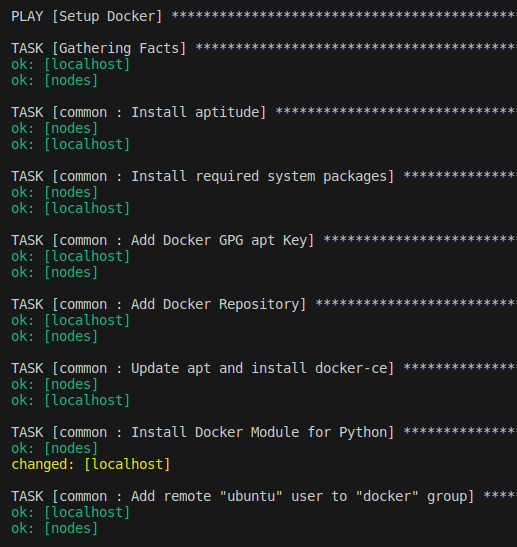
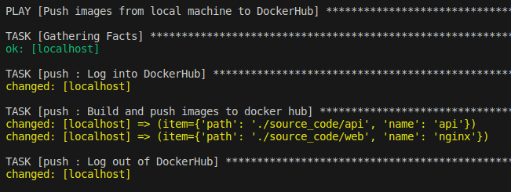
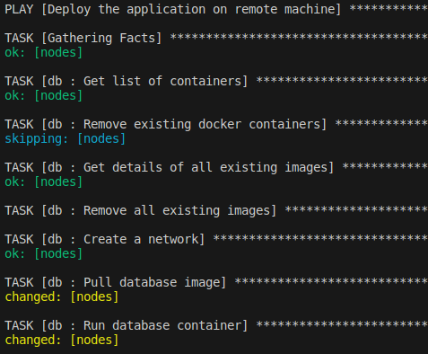
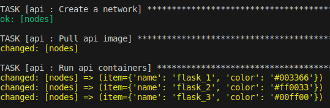
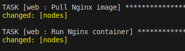
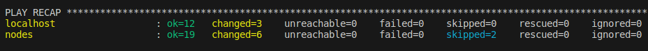
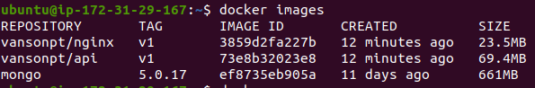
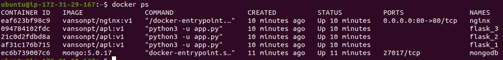
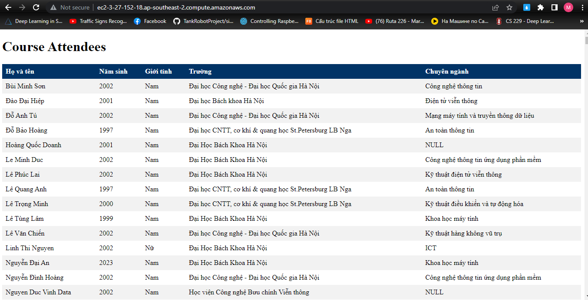

**Table of contents**

- [1. Overview of Ansible](#1-overview-of-ansible)
  - [1.1 Infrastructure as Code](#11-infrastructure-as-code)
  - [1.2 Ansible](#12-ansible)
- [2 Homework](#2-homework)
  - [2.1 Requirements](#21-requirements)
  - [2.2 Installation](#22-installation)
  - [2.3 Using ansible to deploy](#23-using-ansible-to-deploy)
  - [2.4 Results](#24-results)
- [3 References](#3-references)

## 1. Overview of Ansible
### 1.1 Infrastructure as Code

**Infrastructure as Code (IaC)** is the **managing** and **provisioning** of infrastructure through code instead of through *manual* processes.

With IaC, configuration files are created that contain your infrastructure specifications, which makes it easier to edit and distribute configurations. It also ensures that you provision the same environment every time.

**Benefits of IaC**

- Cost reduction
- Increase in speed of deployments
- Fewer errors 
- High consistency
- Reduce configuration drift
- Improved security strategies

**Declarative vs. imperative approaches to IaC**

A declarative approach defines the desired state of the system, including what resources you need and any properties they should have, and an IaC tool will configure it for you.

An imperative approach instead defines the specific commands needed to achieve the desired configuration, and those commands then need to be executed in the correct order.

**Immutable vs. mutable infrastructure**

*Mutable infrastructure* is a term used to describe the practice of modifying infrastructure components in a production environment without disrupting the overall operation of a service or application. In this approach, changes are made to the infrastructure while the system continues to function seamlessly.

*Immutable infrastructure* involves the process of constructing a complete service or application by assembling and configuring components and resources. When a change is necessary for any component, rather than modifying or reconfiguring it, the entire set of components is updated and redeployed as a cohesive unit.

Immutable infrastructure has gained favor particularly for cloud and microservices environments, which are highly scalable and involve many more interdependent components and services

### 1.2 Ansible

Ansible is an open-source automation tool that simplifies the *management* and *configuration* of systems, applications, and networks. It provides a declarative language to describe system configurations, which allows administrators to define the desired state of their infrastructure, rather than scripting specific commands or procedures. Ansible follows a "Infrastructure as Code" approach, enabling automation and consistent management of infrastructure through human-readable, version-controlled playbooks.

**Key features and benefits of Ansible**

- **Agentless Architecture**: Ansible operates over SSH or PowerShell and does not require any agents to be installed on target systems. This simplifies setup and reduces the overhead associated with managing agent deployments.
- **Simplicity**: Ansible uses a simple YAML syntax, making it easy to learn and understand. Playbooks, which are written in YAML, describe the desired state of systems, define tasks, and specify configuration details.
- **Idempotency**: Ansible ensures idempotent operations, meaning that applying the same playbook multiple times produces consistent results. This allows for safe and repeatable configuration management without causing unintended changes.
- **Orchestration**: Ansible supports orchestrating complex workflows by defining dependencies, running tasks in parallel, and controlling the order of operations. This enables the coordination of multi-tier deployments and the management of interconnected systems.
- **Inventory Management**: Ansible provides inventory management capabilities to organize and group systems based on specific criteria. This simplifies the process of targeting and managing specific sets of systems.
- **Extensibility**: Ansible can be extended using modules, plugins, and custom scripts to cater to unique requirements and integrate with various systems, platforms, and APIs.
- **Community and Ecosystem**: Ansible has a vibrant community that contributes to the development of modules, playbooks, and roles. The **Ansible Galaxy** repository offers a vast collection of pre-built roles that can be readily used to automate common tasks.

**Basic Concepts of Ansible**

- **Nodes**: refer to the systems or devices that are managed and controlled by Ansible. 
    - **Control node** is the system where Ansible is installed and from which Ansible commands and playbooks are executed. The control node is where you define your playbooks, inventory, and configurations. It is responsible for connecting to and communicating with the managed nodes to perform automation tasks.
    - **Managed nodes** are the systems or devices that are under the control of Ansible. Managed nodes are accessed and controlled by the control node during the execution of Ansible playbooks and tasks.
- **Inventory**: The inventory in Ansible is a file or collection of files that define the nodes or systems Ansible will manage. The inventory file can be written in INI format or YAML format and specifies details like the hostname, IP address, connection details, and groups to which each node belongs.

- **Playbook**: A playbook in Ansible is a YAML file that contains a set of instructions, called tasks, to define the desired state of systems.
    - Each **playbook** contains a list of plays that run in order from top to
bottom
    - Each play defines a list of **tasks** and a list of hosts that these tasks
run on
    - Each task defines how a **module** is executed in order to achieve a
given goal
    - **Handlers**: A special form of a task, that only executes when notified by a previous task which resulted in a ‘changed’ status.
- **Module**: is a reusable, standalone unit of code that performs a specific task or action on the managed nodes. Modules encapsulate functionality that can be executed by Ansible playbooks to automate various operations, such as installing packages, configuring services, managing files, running commands, or interacting with cloud providers and network devices.

## 2 Homework

### 2.1 Requirements

Deploy your application in the docker-compose homework using ansible:
- Setup docker for your target environments in role “common”
- Split your application into 3 roles: “web”, “api” and “db"

*Note: The number of target nodes is chosen appropriately based on your lab environment. You can run all tasks on the same host if there
are not enough resources.*

### 2.2 Installation

- **Creating a Virtual Enviroment**: for maintaining a clean and controlled development environment, ensures reproducibility, simplifies dependency management, and promotes portability and security
```shell
        mkdir -p venv
        sudo apt install python3-virtualenv
        virtualenv venv
        source venv/bin/activate
```
- **Installing Ansible**: 
```shell
        pip install ansible
```

### 2.3 Using ansible to deploy

**Approach to solving homework exercises**

In the exercise, I will use Ansible to deploy the application on the remote EC2 instance of AWS. On the local machine, I will build and push the images (API and Nginx) to Docker Hub. On the remote machine, I will pull the images and deploy the product. I will perform four roles as required: 

1. The `common` role is used to install Docker on both the local and remote machines.
2. The `db` role is responsible for setting up the database to store information. It will pull the MongoDB image from Docker Hub.
3. The `api` role will handle the deployment of the RESTful API. It will pull the API image previously uploaded to Docker Hub.
4. The `web` role will deploy the Nginx web server. It will pull the Nginx image from Docker Hub, which was previously uploaded.
   
Additionally, there will be an extra `push` role to build and push the API and Nginx images to Docker Hub on the local machine.

**Inventory file**

Inventory file defines two groups of hosts: `localhost` (local machine) and `nodes` (EC2 instance of AWS). 
```yaml
all:
    hosts:
        localhost:
            ansible_connection: local
            ansible_python_interpreter: ./venv/bin/python3
            ansible_become_user: root
            ansible_become_password: vanson1997
            hostname: vdt-23
        nodes:
            ansible_ssh_host: 3.27.152.18 
            ansible_ssh_user: ubuntu
            ansible_ssh_private_key_file: ~/Desktop/vdt-2023.pem
```

**Creating playbook**

An Ansible playbook consisting of three plays:

1. Setup Docker
2. Push images from local machine to DockerHub
3. Deploy the application on remote machine

```yaml
- name: Setup Docker
  hosts: all
  become: true
  gather_facts: true
  roles:
  - common

- name: Push images from local machine to DockerHub
  hosts: localhost
  become: true
  gather_facts: true
  roles:
  - push

- name: Deploy the application on remote machine
  hosts: nodes
  become: true
  gather_facts: true
  roles:
  - db
  - api
  - web
```
I have decided to use `Ansible Galaxy` as a tool for creating roles within my playbook. Ansible Galaxy provides a convenient platform for accessing and utilizing a wide range of pre-built roles developed by the community. By leveraging these existing roles, I can save time and effort in writing code from scratch and promote code reuse in my playbook development process. 

**Initialize a new role**
```shell
ansible-galaxy init <role_name>
```
Take a look at the hierarchy represents a role `common`
```
roles/
    common/               # this hierarchy represents a role "common"
        defaults/         #
            main.yml      #  <-- default lower priority variables for this role
        handlers/         #
            main.yml      #  <-- handlers, which may be used within or outside this role.
        tasks/            #
            main.yml      #  <-- the main list of tasks that the role executes.
        templates/        #  <-- templates that the role deploys.
        tests/            #
            inventory     #  <-- specifying the target hosts for the tests
            main.yml      #  <-- defining the tests for the role.
        vars/             #
            main.yml      #  <-- other variables for the role
```

**Role `common` for installing Docker**

Running playbook will perform the following actions on the hosts:
1. Install aptitude, which is preferred by Ansible as an alternative to the apt package manager
2. Install the required system packages.
3. Install the Docker GPG APT key.
4. Add the official Docker repository to the apt sources.
5. Install Docker.
6. Install the Python Docker module via pip.
7. Add remote "ubuntu" user to "docker" group
```yaml
- name: Install aptitude
  apt:
    name: aptitude
    state: latest
    update_cache: true

- name: Install required system packages
  apt:
    pkg:
      - apt-transport-https
      - ca-certificates
      - curl
      - software-properties-common
      - python3-pip
      - virtualenv
      - python3-setuptools
    state: latest
    update_cache: true
    
- name: Add Docker GPG apt Key
  apt_key:
    url: https://download.docker.com/linux/ubuntu/gpg
    state: present

- name: Add Docker Repository
  apt_repository:
    repo: deb https://download.docker.com/linux/ubuntu focal stable
    state: present

- name: Update apt and install docker-ce
  apt:
    name: docker-ce
    state: latest
    update_cache: true

- name: Install Docker Module for Python
  pip:
    name: docker
  
- name: Add remote "ubuntu" user to "docker" group
  user:
    name: "ubuntu"
    groups: "docker"
    append: yes
  tags:
    - docker
```
<p align = "center">
 
<br>Picture 1. Running play `Setup Docker` with role `common`
</p>

**Role `push` for pushing images (`api`, `nginx`) to DockerHub**

Running playbook will perform the following actions on the hosts:
1. Login into DockerHub. Using **Ansible Vault** for encrypting sensitive variables `dockerhub_username` and `dockerhub_password` (in file default/main.yaml) (To ensure the security when pushing source to GitHub. No one can access or view sensitive information such as my DockerHub username and password. Additionally, Ansible Vault provides the capability to encrypt sensitive files):

```shell
ansible-vault encrypt_string <string_to_encrypt> --ask-vault-pass
```
```yaml
dockerhub_username: !vault |
          $ANSIBLE_VAULT;1.1;AES256
          66363133653563633866386664623437383063646661653038636231653761613463363636303434
          3036336365383766366365333539323838343834393739620a646338326664633266303931353163
          30376539343137373261333532323962376331666133373031646363643832373031356434383336
          3561323139353336610a306531373331313534346466393534326231303664373563333635626433
          6333
dockerhub_password: !vault |
          $ANSIBLE_VAULT;1.1;AES256
          39636161353637303834663264346234366631393934306439663537653534363434373066333834
          3830656337613536656664663933656362373864393633370a323432663435326532636234636436
          39353530616266326236356536383138303932626431366566373435616631663165663365363964
          6435313033333534620a316263663332626662613531393862383062376333623064386666663363
          3634
```

2. Build and push images `api` and `nginx` to DockerHub.
3. Log out of DockerHub.

**Main list of tasks for role `push`**
```yaml
- name: Log into DockerHub
  docker_login:
    username: "{{ dockerhub_username }}"
    password: "{{ dockerhub_password }}"

- name: Build and push images to docker hub
  docker_image:
    build:
      path: "{{ item.path }}"
    name: "vansonpt/{{ item.name }}"
    tag: "{{ image_version }}"
    push: true
    source: build
  loop:
    - { path: "./source_code/api", name: "api" }
    - { path: "./source_code/web", name: "nginx" }

- name: Log out of DockerHub
  docker_login:
    state: absent
```
<p align = "center">
 
<br>Picture 2. Running play with role `push`
</p>

**Role `db` for setting up the database**

Running playbook will perform the following actions on the `nodes` hosts (remote machine):
1. Delete all existing containers and images
2. Create a network named `backend` for backend
3. Pull image `Mongodb:5.0.17` from DockerHub
4. Run mongodb container
```yaml
- name: Get list of containers
  docker_host_info:
    containers: true
  register: docker_info

- name: Remove existing docker containers
  shell: docker container rm -f $(docker ps -aq)
  when: (docker_info.containers | length) != 0
  
- name: Get details of all existing images
  docker_host_info:
    images: yes
    verbose_output: yes
  register: image_info

- name: Remove all existing images
  docker_image:
    name: "{{ item }}"
    state: absent
  loop: "{{ image_info.images | map(attribute='Id') | list }}"

- name: Create a network
  docker_network:
    name: backend

- name: Pull database image
  docker_image:
    name: "{{ db_docker_image }}"
    tag: "{{ db_image_tag }}"
    source: pull
    state: present
    force_source: true
    
- name: Run database container
  docker_container:
    name: "{{ db_container_name }}"
    image: "{{ db_docker_image }}:{{ db_image_tag }}"
    restart_policy: unless-stopped
    state: started
    env: 
      DB_DATABASE: database
    volumes: ./database:/data/db
    networks:
      - name: backend
    networks_cli_compatible: no
  register: db_container
```
<p align = "center">
 
<br>Picture 3. Running play with role `db`
</p>

**Role `api` will handle the deployment tasks specifically related to the API component**

Running playbook will perform the following actions on the `nodes` hosts (remote machine):
1. Create a network named `frontend` for frontend
2. Pull images `api` previously uploaded to Docker Hub
3. Run 3 containers for web server (flask_1, flask_2, flask_3). Each container will host a different application with a distinct font color: blue, red, and green. This setup will demonstrate how a load balancer distributes incoming traffic across multiple servers

```yaml
- name: Create a network
  docker_network:
    name: frontend

- name: Pull api image
  docker_image:
    name: "{{ api_image_name }}"
    tag: "{{ image_version }}"
    source: pull
    state: present
    force_source: true

- name: Run api containers
  docker_container:
    name: "{{ item.name }}"
    image: "{{ api_image_name }}:{{ image_version }}"
    restart_policy: unless-stopped
    state: started
    env: 
      DB_DATABASE: "{{ db_database }}"
      DB_HOSTNAME: "{{ db_container_name }}"
      COLOR: "{{ item.color }}"

    networks:
      - name: backend
      - name: frontend
  loop:
    - { name: 'flask_1', color: "#003366" }
    - { name: 'flask_2', color: "#ff0033" }
    - { name: 'flask_3', color: "#00ff00" }

```
<p align = "center">
 
<br>Picture 4. Running play with role `api`
</p>

**Role `web` for deploying the Nginx web server**

Running playbook will perform the following actions on the `nodes` hosts (remote machine):
1. Pull images `nginx` previously uploaded to Docker Hub
2. Run container nginx for web server
```yaml
- name: Pull Nginx image
  docker_image:
    name: "{{ nginx_image_name }}"
    tag: "{{ image_version }}"
    source: pull
    state: present
    force_source: true

- name: Run Nginx container
  docker_container:
    name: "{{ nginx_container_name }}"
    image: "{{ nginx_image_name }}:{{ image_version }}"
    restart_policy: unless-stopped
    state: started
    ports:
    - "80:80"
    networks:
      - name: frontend
```
<p align = "center">
 
<br>Picture 5. Running play with role `web`
</p>

**Run playbook**

```shell
ansible-playbook -i inventory.yaml site.yaml --ask-vault-pass
```

### 2.4 Results

After executing the playbook, I received the following outcomes:

<p align = "center">
 
<br>Picture 6. Play recap
</p>

<p align = "center">
 
<br>Picture 7. Built images in remote machine
</p>

<p align = "center">
 
<br>Picture 8. Running containers in remote machine
</p>

<p align = "center">
 
<br>Picture 9. Demo web server
</p>


## 3 References

[1] [What is Infrastructure as Code (IaC)?](https://www.redhat.com/en/topics/automation/what-is-infrastructure-as-code-iac#:~:text=Infrastructure%20as%20Code%20(IaC)%20is,to%20edit%20and%20distribute%20configurations.)

[2] [Ansible Documentation](https://docs.ansible.com/ansible/latest/index.html)

[3] [Ansible Galaxy Documentation](https://galaxy.ansible.com/docs/)

[4] [Ansible Vault](https://docs.ansible.com/ansible/latest/cli/ansible-vault.html)

[5] [Docker_container module](https://docs.ansible.com/ansible/latest/collections/community/docker/docker_container_module.html)

[6] [Docker_login module](https://docs.ansible.com/ansible/latest/collections/community/general/docker_login_module.html)

[7] [Docker_image module](https://docs.ansible.com/ansible/latest/collections/community/docker/docker_image_module.html)

[8] [My api image in DockerHub](https://hub.docker.com/r/vansonpt/api)

[9] [My nginx image in DockerHub](https://hub.docker.com/r/vansonpt/nginx)