# HOME WORK FROM VIETTEL DIGITAL TALENT

### _LittleHawk03-Nguyễn Mạnh Đức_


####Table of contents

[1. Ansible overview](#1-ansible-overview)
  - [1. Ansible](#1-ansible)
    - [1.1 overview](#11-overview)
    - [1.2 important component](#12-important-component)
    - [1.3 Install ansible](#13-install-ansible)

[2. Deploy your application in the docker-compose homework using ansible](#2-deploy-your-application-in-the-docker-compose-homework-using-ansible)
  - [2.1 : To deploy to web application,i creat a deployment plan for that. ](#21--to-deploy-to-web-applicationi-creat-a-deployment-plan-for-that)
  - [2.2 : step 1 setting up 2 nodes running ubuntu 22.04 server](#22--step-1-setting-up-2-nodes-running-ubuntu-2204-server)
  - [2.3 : Create a playbook folder to perform the installations](#23--create-a-playbook-folder-to-perform-the-installations)
  - [2.4 : Create a inventory file](#24--create-a-inventory-file-inventoryyaml)
  - [2.5 : step 2 Install docker to all host](#25--step-2-install-docker-to-all-host)
  - [2.6 : step 3 Install MongoDB to node vps2 uing docker images](#26--step-3-install-mongodb-to-node-vps2-uing-docker-images)
  - [2.7 : step 4 Install Web application to node vps1 uing docker images](#27--step-4-install-web-application-to-node-vps1-uing-docker-images)
  - [2.8 : Delete container and images](#28--delete-container-and-images)
  
[3. reference](#references)


# 1. Ansible overview

#### 1. Ansible

##### 1.1 overview

- Ansible is a simple tool for IT automation, which uses **ssh (secure shell)** to run commands on remote servers. Ansible has been used in cloud automation, application deployment and configuration management among others. Ansible uses both playbooks and ad-hoc commands to run commands and deploy applications on remote servers.
- Ansible is an open-source configuration management and automation tool that simplifies IT orchestration by allowing users to automate tasks across large numbers of computers or servers.

<div align="center">
  
</div>


##### 1.2 important component

**Modules:**
    
  - Modules are the building blocks of automation in Ansible.
  - They are pre-built pieces of code that perform specific tasks, such as managing files, configuring network devices, or managing users and groups.
  - Ansible ships with a large number of built-in modules that cover a wide range of use cases, and custom modules can also be written to extend Ansible's capabilities.
  - Modules can be executed on remote hosts by Ansible using an SSH or PowerShell connection, and they can be used within playbooks or executed directly from the command line.

**Host**

- A host is a remote machine that Ansible manages it call managed node and the machine we use to remote to them is controled node.

**Playbooks**

- A playbook is a configuration management script written in YAML that defines a set of tasks to be executed on remote hosts by Ansible.

**Inventory**

- A file (by default, Ansible uses a simple INI format) that describes Hosts and Groups in Ansible, in addition, they can be use in yaml format.

**Roles**

- a role is a collection of tasks, files, templates, and variables organized in a specific way to facilitate the reuse and sharing of configuration management code.

- Roles help make playbooks more modular, efficient, and easier to manage.

**Task**

- a task is a unit of work that defines a single action to be performed on a target host, such as installing a package, modifying a file, or restarting a service

- Tasks are defined within playbooks or roles and executed sequentially.

**Play**

-  a play is a section of a playbook that defines a set of tasks to be executed on a specific set of hosts, using a specific set of variables and options

##### 1.3 Install ansible

The enviroment for install ansible is ``Ubuntu 22.04`` and make sure use install ``python`` inviroment before because ansible is built in python :

the first, update the systerm' package

```sh
  sudo apt update -y
```

Then we install ``software-properties-common`` .sed by various other packages in Ubuntu, such as the Software Sources application and the ``add-apt-repository`` command.

```sh
  sudo apt install software-properties-common -y
```

after that we add ansible repo to Ubuntu PPA:

```sh
  sudo add-apt-repository --yes --update ppa:ansible/ansible -y
```

Finally, lets install the Ansible by command:

```sh
  sudo apt install ansible -y
```


# 2. Deploy your application in the docker-compose homework using ansible

#### 2.1 : To deploy to web application,i creat a deployment plan for that.  

**step 1 :** Setting up the application running environment: here I will use 2 ``ubuntu server 22.04`` virtual machines as 2 node (one for deploy mongo database, one for deploy web and api, i want setup in 3 vps but my laptop cant do that) which are run by ``oracle virtualbox``

**step 2 :** Install **Docker** for all hosts.

**step 3 :** Install **MongoDB** images and run container in the node name vps2.

**step 4 :** Install **Webapp** and **web server**  images ans run container in the the node vps1.


#### 2.2 : step 1 setting up 2 nodes running ubuntu 22.04 server

In this lab, because my laptop can't afford to run 3 nodes, so i can only install 2 nodes, one node to install database as ``db``, one node to install 2 services, ``web`` and ``api``. 

**2.2.1 nodes** - using Ubuntu-22.04 server

**vps1** (node 1) : using deploy ``web`` and ``api``

```sh
  [vps1]
  192.168.89.124
```

**vps2** (node 2) : using deploy database ``db`` using docker images

```sh
  [vps2]
  192.168.89.125
```

I decide to use oracle virtualbox to install and run the node 

**note :** Note when installing,let the virtual machine use the bridged network adapter to connect directly to the host machine's network card and the ip will be automatically allocated.

<div align="center">
  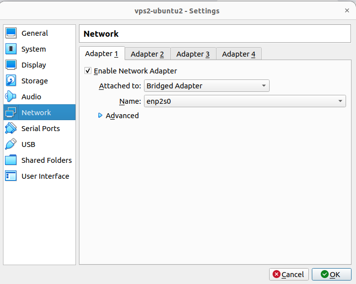
</div>

<div align="center">
  <i>Setup Network Adapter</i>
</div>


**install 2 nodes and check the connection :**

install 2 linux server

<div align="center">
  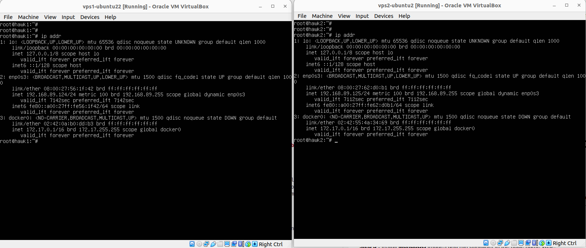
</div>

<div align="center">
  <i>Setup Linux Server</i>
</div>


checking the connection

<div align="center">
  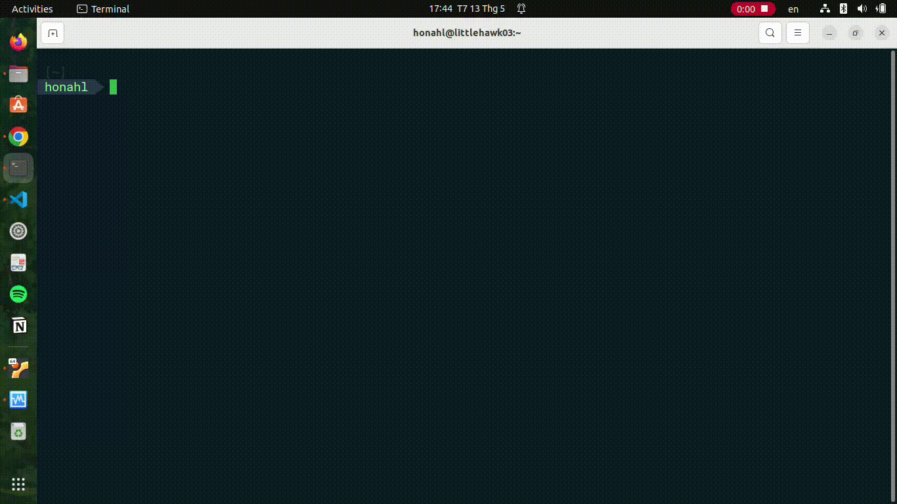
</div>

<div align="center">
  <i>check ssh</i>
</div>


#### 2.3 : Create a playbook folder to perform the installations

**Directory structure**

```sh
playbook
├── inventories
│   └── inventory.yaml
└── roles
    ├── common
    │   ├── defaults
    │   │   └── main.yml
    │   ├── files
    │   ├── handlers
    │   ├── meta
    │   ├── tasks
    │   │   └── main.yml
    │   ├── templates
    │   │   └── main.yaml
    │   └── vars
    │       └── main.yml
    ├── deploy_web_api_vps1
    │   ├── defaults
    │   ├── files
    │   ├── handlers
    │   │   └── nginx.conf
    │   ├── meta
    │   ├── tasks
    │   │   └── main.yaml
    │   ├── templates
    │   └── vars
    │       └── main.yaml
    ├── deploy_db_in_vps2
    │   ├── defaults
    │   ├── files
    │   ├── handlers
    │   ├── meta
    │   ├── tasks
    │   │   └── main.yaml
    │   ├── templates
    │   └── vars
    │       └── main.yaml
    ├── playbook_delete_container.yaml
    ├── playbook_delete_images.yaml
    ├── playbook_deploy_webapp.yaml
    └── playbook_install_docker.yaml

26 directories, 14 files

```

- **inventories :** directory for defining the configuration of the nodes (hosts)
- **roles :** Roles are a way to organize playbooks
- **common :** role ``common`` using for install docker to all node
- **deploy_web_api_vps1 :** role ``deploy_web_api_vps1`` using for deploy webapp in the node vps1.
- **deploy_db_in_vps2 :** role ``deploy_db_in_vps2`` using for deploy databse in the node vps2.
- **playbook_install_docker.yaml :** playbook for install docker to all host
- **playbook_deploy_webapp.yaml :** playbook for install web application in vps1 and mongo database in vps2.
- **playbook_delete_container.yaml :** playbook for detele containers
- **playbook_delete_images.yaml :** playbook for detele images


#### 2.4 : Create a inventory file [inventory.yaml](playbook/inventories/inventory.yaml)

```yaml
  ---
  all:
    hosts:
      vps1:
        ansible_host: 192.168.89.124
        ansible_user: root
        ansible_password: 1
      
      vps2:
        ansible_host: 192.168.89.125
        ansible_user: root
        ansible_password: 1
```

#### 2.5 : step 2 Install docker to all host

the role is used to install docker is [common](playbook/roles/common)

```sh
  common
  ├── defaults
  │   └── main.yml
  ├── files
  ├── handlers
  ├── meta
  ├── tasks
  │   └── main.yml
  ├── templates
  │   └── main.yaml
  └── vars
      └── main.yml

  7 directories, 4 files
```

the variables required for the installation are located at [main.yml](playbook/roles/common/vars/main.yml)

```yaml
  ---
  docker_dependencies:
    - ca-certificates
    - curl
    - gnupg
    - lsb-release
  docker_gpg_key: https://download.docker.com/linux/ubuntu/gpg
  docker_repo_url: https://download.docker.com/linux/ubuntu
  docker_repo_cmd: "deb {{ docker_repo_url }} {{ ansible_distribution_release }} stable"
  docker_apts:
    - docker-ce
    - docker-ce-cli
    - containerd.io
  docker_compose_url: https://github.com/docker/compose/releases/download/v2.2.3/docker-compose-Linux-x86_64

```
**docker_dependencies:** required system packages
**docker_gpg_key :** GPG key is added to verify the download
**docker_repo_url :** install the latest version of Docker from the official repository
**docker_apts:** packages for install docker
**docker_compose_url :** url install docker-compose

The next we will use file [tasks/main.yaml](/playbook/roles/common/tasks/main.yml) to setup the task

- The first, we will use apt again to install required system packages using loop get name of package by ``docker_dependencies`` list

```yaml
  - name: install docker_dependencies
    apt:
      name : "{{ item }}"
      state: present
      update_cache: yes
    loop: "{{ docker_dependencies }}"

```

- The Docker GPG key is added to verify the download, the official repository is added as a new package source, ``state`` parameter is used to ensure the key is present (added).

```yaml
  - name: add GPG key 
    apt_key:
      url: "{{ docker_gpg_key }}"
      state: present
```

- After that we will install the latest version of Docker from the official repository.

```yaml
  - name: add repository of docker to local apt
    apt_repository:
      repo: "{{ docker_repo_cmd }}"
      state: present

```

- And we use ``apt`` to install ```docker-ce``` and some package 

```yaml
  - name: install docker
    apt:
      name: "{{ item }}"
      state: latest
      update_cache: yes
    loop: "{{ docker_apts }}"
```

- to install the module python support docker we must install ```pip```

```yaml
  - name: install pip
    apt: 
      name: python3-pip
      state: latest
      update_cache: yes
```

- Use pip to install the module for ```Python```.

```yaml
  - name: install Docker Module for python using pip
    pip:
      name: docker
      executable: pip3

  - name: install docker-compose module for python using pip
    pip:
      name: docker-compose
      executable: pip3
```
- install docker-compose:

```yaml
  - name: install docker-compose
    get_url:
      url: "{{ docker_compose_url }}"
      dest: /usr/local/bin/docker-compose
      mode: 'u+x,g+x'
```

- and finally, to make sure docker is installed we use enable start docker:
```yaml
  - name: start and enable docker
    service:
      name: docker
      state: started
      enabled: yes
```


To run the role we write a playbook [playbook_install_docker.yaml](playbook/roles/playbook_install_docker.yaml)

```yaml
  ---
  - name: setup docker
    ## hosts : all to install to all hosts in inventory file 
    hosts: all
    become: true
    gather_facts: false
    vars:
      ## The value is the version ubuntu of node
      - ansible_distribution_release: xenial
    roles:
      - common
```

Run ```playbook_install_docker.yaml``` using the command:

```shell
  ansible-playbook -i inventories/inventory.yaml roles/playbook_install_docker.yaml
```

<div align="center">
  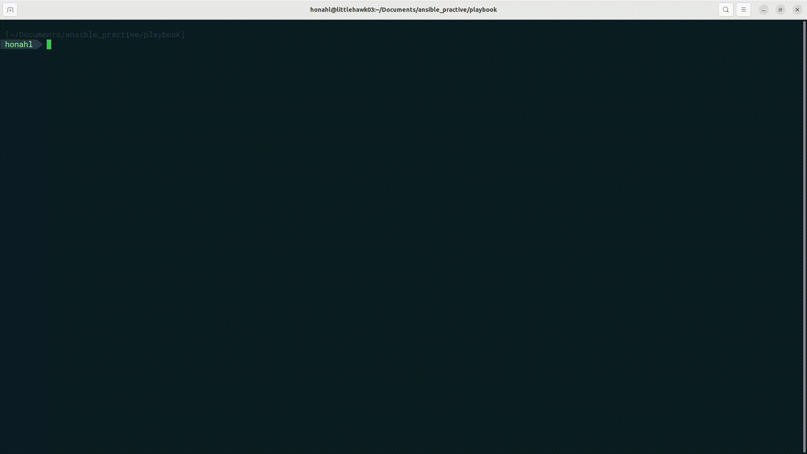
</div>

<div align="center">
  <i>check ssh</i>
</div>

check ``ssh`` to vps1 using ```ssh roor@192.168.89.124```

<div align="center">
  
</div>

check ``ssh`` to vps1 using ```ssh roor@192.168.89.125```

<div align="center">
  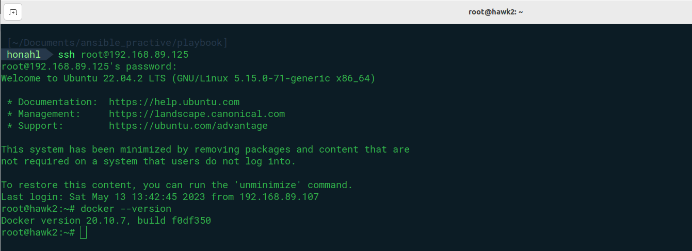
</div>

<div align="center">
  <i>check ssh</i>
</div>


**Yeah, it's finally done, and the next we will install mongo database in vps2**


#### 2.6 : step 3 Install MongoDB to node vps2 uing docker images

the role is used to install docker is [playbook/roles/deploy_db_in_vps2](playbook/roles/deploy_db_in_vps2)

```shell
  deploy_db_in_vps2
  ├── defaults
  ├── files
  ├── handlers
  ├── meta
  ├── tasks
  │   └── main.yaml
  ├── templates
  └── vars
      └── main.yaml

  7 directories, 2 files
```

the first we creat a file vars/main.yaml to store variables that are used in playbooks or roles. [vars/main.yaml](playbook/roles/deploy_db_in_vps2/vars/main.yaml)

```yaml
  ---
  docker_image_name: littlehawk03/mongo-slim
  docker_container_name: mongodb
  docker_image_tag: latest
```
- **docker_image_name:** littlehawk03/mongo-slim, it's name of the images that docker pull from docker hub and the the images ``littlehawk03/mongo-slim`` is the image which i built, optimize and push it to my docker hub ``littlehawk03``

<div align="center">
  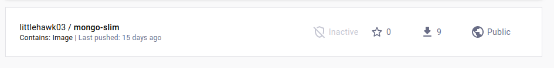
</div>

- **docker_container_name:** mongodb,the variable is container name after we run images 
- **docker_image_tag:** latest, the tag of images

The next we will use file [tasks/main.yaml](playbook/roles/deploy_db_in_vps2/tasks/main.yaml) to setup the task

- the first we pull the image from ```docker hub``` :

```yaml
  - name: full image docker of web server mongo
    docker_image:
      name: "{{ docker_image_name }}"
      tag: "{{ docker_image_tag }}"
      source: pull
```

**docker_image:** ansible module for manager docker images

- Next we run the newly pulled image

```yaml
  - name: creat a docker container and port maping
    docker_container: 
      name: "{{ docker_container_name }}"
      image: "{{ docker_image_name }}:{{ docker_image_tag }}"
      ports: #for port mapping
        - "27017:27017"
      state: started
```

**docker_container:** ansible module for manager docker container


To run the role we write a playbook [roles/playbook_deploy_webapp.yaml](playbook/roles/playbook_deploy_webapp.yaml) and the play will setup and run container.

```yaml
  - name: setup database
    hosts: vps2
    become: true
    gather_facts: false
    roles:
      - deploy_db_in_vps2
```

Run ```playbook_deploy_webapp.yaml``` using the command:

```shell
  ansible-playbook -i inventories/inventory.yaml roles/playbook_deploy_webapp.yaml 
```

<div align="center">
  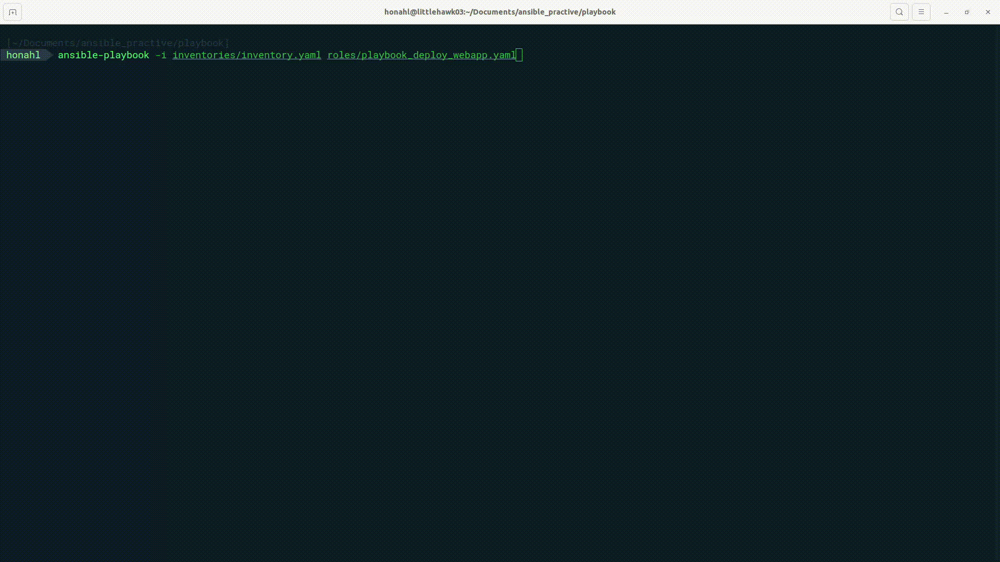
</div>


after run we must ``ssh`` to the ``vps2`` to ensure container is running (container' name is mongodb)

<div align="center">
  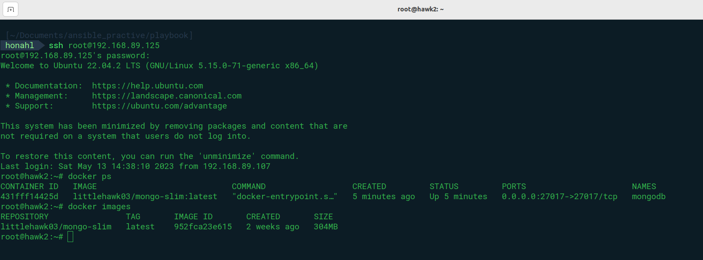
</div>

Done it work, and the next we will set up web application in vsp.


#### 2.7 : step 4 Install Web application to node vps1 uing docker images

the role is used to install docker is [playbook/roles/deploy_web_api_vps1](playbook/roles/deploy_web_api_vps1)


```shell

  deploy_web_api_vps1
  ├── defaults
  ├── files
  ├── handlers
  │   └── nginx.conf
  ├── meta
  ├── tasks
  │   └── main.yaml
  ├── templates
  └── vars
      └── main.yaml

  7 directories, 3 files
```

the first we setup variable:

```yaml
  ---
  webserver_image_name: littlehawk03/web_server
  webserver_container_name: web_server
  webserver_image_tag: latest

  webapp_image_name: littlehawk03/web_app
  webapp_container_name: web_app
  webapp_image_tag: latest

  MONGO_HOST: "192.168.89.125"
  MONGO_PORT: "27017"
  FLASK_ENV: development
```

the varriable is user for setting the web server,it's the web server i built and push it to docker hub. the web server is built in base images nginx and I wrote the config file [nginx.conf](playbook/roles/deploy_web_api_vps1/handlers/nginx.conf) to match the web app I built.

```json
  server {
      listen 80;
      # server_name localhost;

      location / {
          proxy_set_header Host $host;
          proxy_set_header X-Real-IP $remote_addr;
          proxy_set_header X-Forwarded-For $proxy_add_x_forwarded_for;
          proxy_set_header X-Forwarded-Proto $scheme;
          proxy_pass http://$FLASK_SERVER_ADDR:$FLASK_SERVER_PORT;
      }
  }
```

<div align="center">
  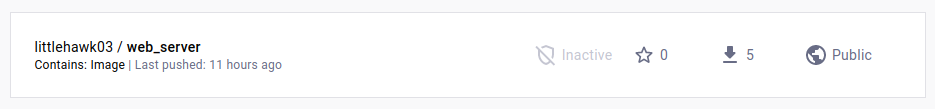
</div>


**webserver_image_name:** littlehawk03/web_server, image's name
**webserver_container_name:** web_server, container's name
**webserver_image_tag:** latest, iamges tag


the varriable is user for setting the web server,it's the web application i built and push it to docker hub. the web app is build by pyhton3 and html, css, javascript and build in python3.8-alpine.

<div align="center">
  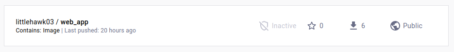
</div>

**webapp_image_name:** littlehawk03/web_app
**webapp_container_name:** web_app
**webapp_image_tag:** latest

and some enviroment variable 


The next we will use file [tasks/main.yaml](playbook/roles/deploy_web_api_vps1/tasks/main.yaml) to setup the task

- the first we pull the image ``web_app`` from ```docker hub``` :

```yaml
  - name: full image of web server from docker hub
    docker_image:
      name: "{{ webserver_image_name }}"
      tag: "{{ webserver_image_tag }}"
      source: pull

```
- next, we pull the image ``web_server`` from ```docker hub``` :

```yaml
  - name: full image of web app from docker hub
    docker_image:
      name: "{{ webapp_image_name }}"
      tag: "{{ webapp_image_tag }}"
      source: pull
```

**docker_image:** ansible module for manager docker images

- Next we run the newly pulled image

**web application**

```yaml
  - name: creat a docker container for web app and mapping port
    docker_container:
      name: "{{ webapp_container_name }}"
      image: "{{ webapp_image_name }}:{{ webapp_image_tag }}"
      ports:
        - "5000:5000"
      env:
        MONGO_HOST: "{{ MONGO_HOST }}"
        MONGO_PORT: "{{ MONGO_PORT }}"
        FLASK_ENV: "{{ FLASK_ENV }}"
      state: started
```

- ```env``` : is user to set value for enviroment variable
- ``port`` : similar -p, it mean port mapping


**web server**

```yaml
  - name: creat a docker container for web server using nginx and
    docker_container:
      name: "{{ webserver_container_name }}"
      image: "{{ webserver_image_name }}:{{ webserver_image_tag }}"
      ports:
        - "80:80"
      links:
        - "{{ webapp_container_name }}:web_app"
      env:
        FLASK_SERVER_ADDR: web_app:5000
```

- ```link``` : it similar --link in ``docker run`` and ``depend_on`` in ```docker-compose``` it will link to container name web_app

**docker_container:** ansible module for manager docker container


To run the role we write a playbook [roles/playbook_deploy_webapp.yaml](playbook/roles/playbook_deploy_webapp.yaml) and the play will setup and run container.

```yaml
  - name: set up web_app in vps1
    hosts: vps1
    become: true
    gather_facts: false
    roles:
      - deploy_web_api_vps1
```

Run ```playbook_deploy_webapp.yaml``` using the command:

```shell
  ansible-playbook -i inventories/inventory.yaml roles/playbook_deploy_webapp.yaml 
```

<div align="center">
  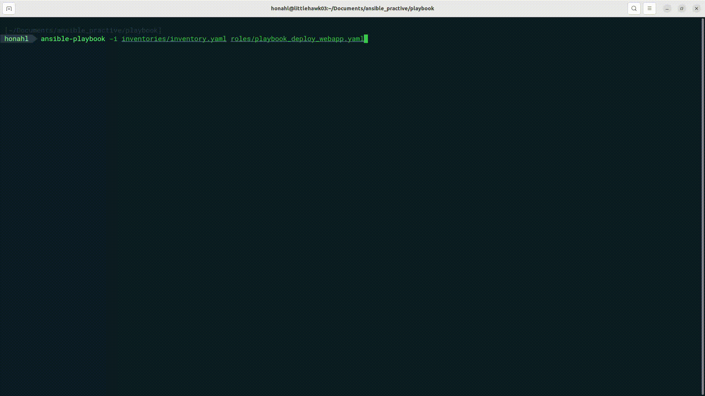
</div>


after run we must ``ssh`` to the ``vps1`` to ensure container is running (container' name is mongodb)

<div align="center">
  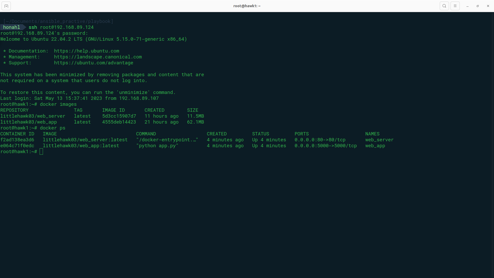
</div>

check web application use ``curl`` to ip ```192.168.89.124``` it use port 80 because we config nginx throught port 80

```sh
  curl 192.168.89.124
```

<div align="center">
  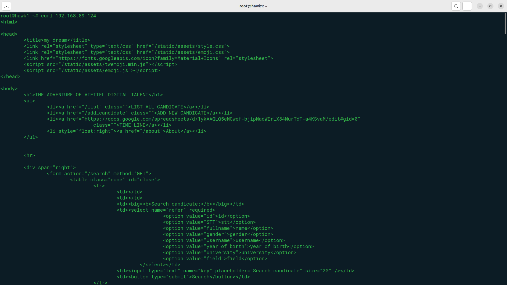
</div>

Yes, it work and then check the web interface by host machine (control node)

<div align="center">
  
</div>

**web interface**


<div align="center">
  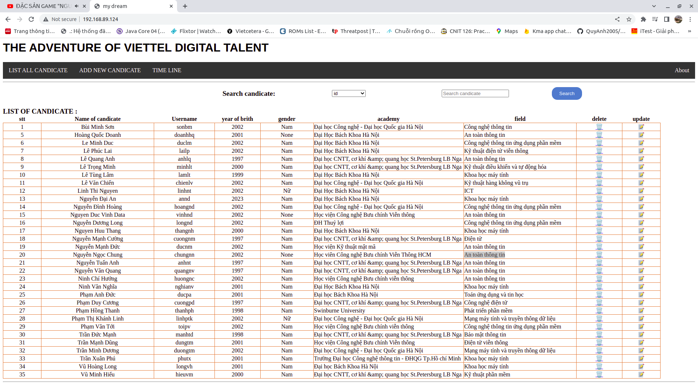
</div>

#### 2.8 : Delete container and images

To delete container i writen a playbook to do that [playbook_delete_container.yaml](playbook/roles/playbook_delete_container.yaml).

```yaml
  ---
  - name: delete all container 
    hosts: all
    gather_facts: false
    tasks:
      - name: get running containert
        docker_host_info:
          containers: yes
        register: docker_info

      - name: stop running container
        docker_container:
          name: "{{ item }}"
          state: stopped
        loop: "{{ docker_info.containers | map(attribute='Id') | list }}"

      - name: remove all running container
        shell: |
          docker rm $(docker ps -a -q)
        when: docker_info.containers != 0
```

**Note :** to delete container you must stop it first.

To delete ``container`` i writen a playbook to do that [playbook_delete_images.yaml](playbook/roles/playbook_delete_images.yaml).

```yaml
  ---
  - name : delete all images
    hosts: all
    become: true
    gather_facts: false
    tasks:
    
      - name: get details of all images
        docker_host_info:
          images: yes
          verbose_output: yes
        register: image_info

      - name: Remove all images
        docker_image:
          name: "{{ item }}"
          state: absent
        loop: "{{ image_info.images | map(attribute='Id') | list }}"

```

**Note :** to delete image you must stop the container and remove it. highly recommend run playbook ``playbook_delete_container.yaml`` before run ``playbook_delete_images.yaml``. 


## It finally done, I would like to thank my mentors for reviewing my homework. hope i did it right

##  References

- https://www.digitalocean.com/community/tutorials/how-to-use-ansible-to-install-and-set-up-docker-on-ubuntu-20-04
- https://cloudinfrastructureservices.co.uk/how-to-install-docker-compose-using-ansible-playbook/
- https://docs.ansible.com/ansible/2.8/user_guide/playbooks_best_practices.html
- https://docs.ansible.com/ansible/latest/collections/community/docker/docker_container_module.html
