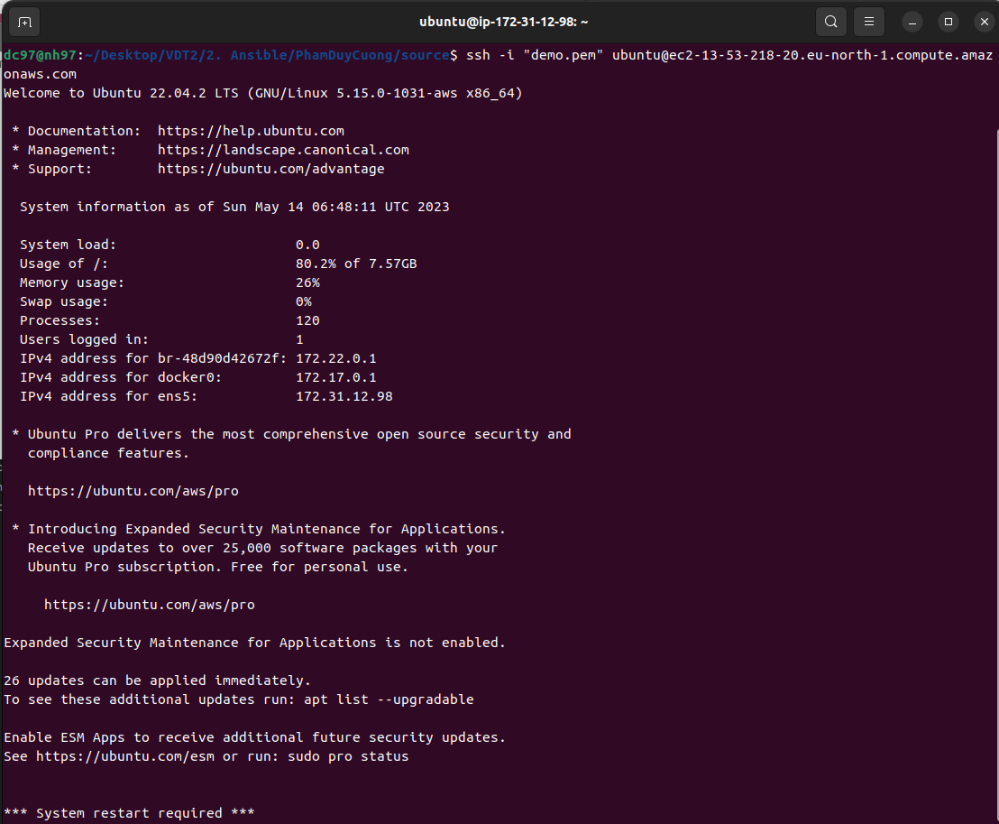
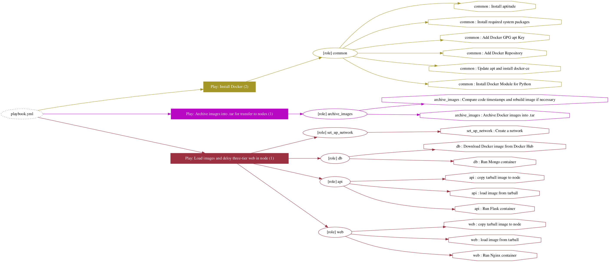
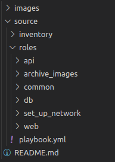
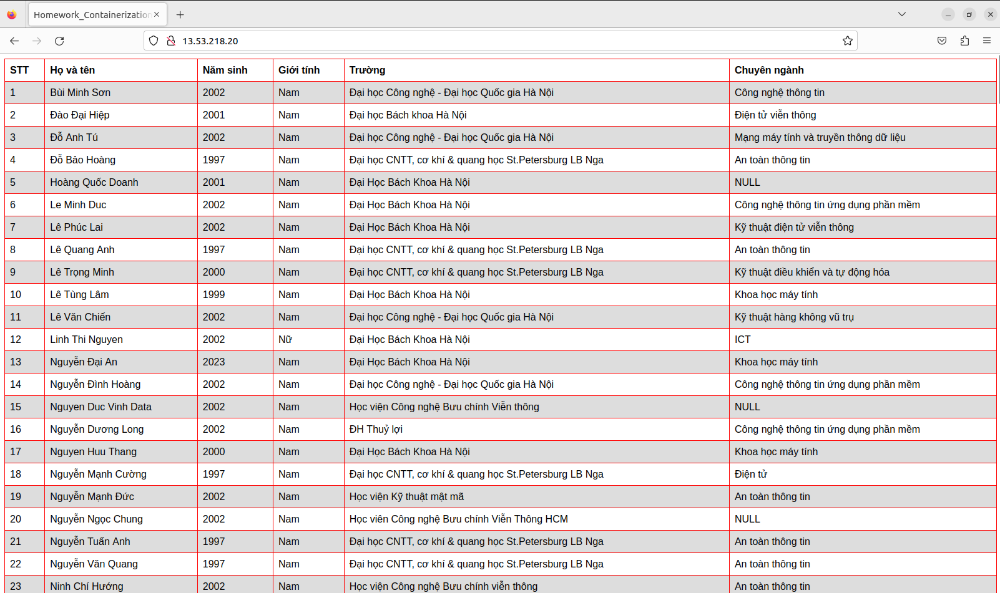

# Using Ansible to deploy three web tier

Author: **Pham Duy Cuong**

----
## Table of contents

<!-- TOC -->

- [A. Prerequisites knowledge](#a-prerequisites-knowledge)
  - [1. Ansible](#ansible)
      - [1.1. Overview](#overview)
      - [1.2. Architecture](#architecture)
      - [1.3. Glossary](#glossary)
  - [2. Ansible Galaxy](#ansible-galaxy)
- [B. Practice](#b-practice)
  - [1. Set up](#set-up)
      - [1.1. Host machine](#host-machine)
      - [1.2. Node machines](#node-machines)
  - [2. Overview](#overview)
  - [3. Deloy](#deloy)
      - [Create inventory](#create-inventory)
      - [3.1.Install Docker  role common](#install-docker--role-common)
      - [3.2.Build images in host and archive it into .tar for transfer to nodes  role archive_images](#build-images-in-host-and-archive-it-into-tar-for-transfer-to-nodes--role-archive_images)
      - [3.3.Create bridge network in node role set_up_network](#create-bridge-network-in-node-role-set_up_network)
      - [3.4.Role db](#role-db)
      - [3.5.Role api](#role-api)
      - [3.6.Role web](#role-web)
  - [Final playbook](#final-playbook)
- [Result](#result)
- [References](#references)

<!-- /TOC -->

## A. Prerequisites knowledge 
<a name='knowledge'></a> 

### 1. Ansible
<a name='ansible'></a> 

#### 1.1. Overview

**Ansible** is an `open-source` software **provisioning**, **configuration 
management**, and **application-deployment** tool enabling 
**infrastructure as code**. 

- Original author: **Michael DeHaan**
- Developer(s): Ansible Community / Ansible Inc. / **Red Hat Inc** (since October 2015)
- Initial release: **February 20, 2012**
- Written in: **Python, PowerShell, Shell, Ruby**
- Operating system: **Linux, Unix-like, MacOS, Windows**

<div align="center">
  
</div>

<div align="center">
  <i>Ansible logo.</i>
</div>

#### 1.2. Architecture

Ansible works by connecting to your nodes and pushing out small programs, 
called **Ansible modules** to them. These programs are written to be resource
models of the desired state of the system. 
Ansible then _executes_ these modules (over `SSH` by default), 
and _removes_ them when finished.

<div align="center">
  
</div>

<div align="center">
  <i>Ansible architecture.</i>
</div>

#### 1.3. Glossary

**Modules**

- Modules are the units of work that Ansible ships out to remote machines.
- Modules can be implemented in any language, including Perl, Bash, Ruby or Python. 
- Modules just have to return JSON. 
- Once modules are executed on remote machines, they are removed, so no long running daemons are used. 


**Host**

- A host is simply a remote machine that Ansible manages. 
- They can have individual variables assigned to them, and can also be organized in groups. 

**Playbooks**

- Playbooks are the language by which Ansible **orchestrates**, **configures**, **administers**, or **deploys systems**. 

**Inventory**

- A file (by default, Ansible uses a simple **INI** format) that describes Hosts and Groups 
in Ansible. 
- Inventory can also be provided via an Inventory Script.

**Roles**

- Roles are units of organization in Ansible. 
- Assigning a role to a group of hosts. 
- A role may include applying certain variable values, certain tasks, and certain handlers. 

**Task**

- Playbooks exist to run tasks. 
- Tasks combine an action (a module and its arguments) with a name. 
- Handlers are also tasks, but they are a special kind of task that do not run unless they are notified by name when a task reports an underlying change on a remote system.

### 2. Ansible Galaxy
<a name='ansible-galaxy'></a>

**Ansible Galaxy** is a utility which lets you generate role scaffolding. The concept of an Ansible role is simple; it is a group of **variables**, **tasks**, **files**, and **handlers** stored 
in a standardised file structure. The difficult part is to recall the directory structure, but there is help.

The `ansible-galaxy` command has a sub-command that will create a directory skeleton for our role.

```shell
ansible-galaxy init <ROLE_NAME>
```

Use this command, we will have a basic structure of a Role as below:

<div align="center">
  
</div>

<div align="center">
  <i>Roles directory structure.</i>
</div>

- **defaults**: default properties/vars;
- **files**: static files to be copied to nodes;
- **handlers**: actions to take on events;
- **meta**: role meta data;
- **tasks**: action to take, using modules;
- **templates**: files generated dynamically;
- **tests**: ansible test;
- **vars**: role specific vars.

We will use a directory name `roles`, which contains all of our roles.


## B. Practice
*Deploy your application in the docker-compose homework using ansible:*
- *Setup docker for your target environments in role “common”*
- *Split your application into 3 roles: “web”, “api” and “db”*

### 1. Set up
<a name='setup'></a> 
<a name='system'></a> 
In this practice I use my current Virtual machine as a Host machine and one instance for deloying  web server in EC2 devices.

#### 1.1. Host machine
<a name='host-machine'></a>

In this homework, I use **Ubuntu** `22.04`  in my virtual machine.

And we need install ansible on this host.
Install the Ansible software with:
```shell
sudo apt install ansible
```
When installing `ansible`, `ansible-galaxy` is already included
#### 1.2. Node machines
<a name='node-machines'></a> 

In this practice, I will create 2 virtual machines using **EC2** (Elastic Compute Cloud) 
of **AWS** (Amazon Web Services). They also use **Ubuntu** `22.04`, similar to host machine.


<div align="center">
  
</div>

<div align="center">
  <i>EC2 logo.</i>
</div>

Then I connect with my EC2 instance via SSH to check.

```ssh -i "demo.pem" ubuntu@ec2-13-53-218-20.eu-north-1.compute.amazonaws.com```
<div align="center">
  
</div>

<div align="center">
  <i>EC2 instance</i>
</div>

### 2. Overview 

<div align="center">
  
</div>

<div align="center">
  <i>Architecture playbook.</i>
</div>
<div align="center">
  
</div>

<div align="center">
  <i>Architecture folder.</i>
</div>

This Ansible playbook will deploy a 3-tier web application using Docker:

- The first play will install Docker on all hosts 
- The second play will run on the host machine. It will:
  - Build Docker images from Dockerfiles
  - Archive the built images into .tar files for transfer to the application nodes
- The third play will run on the nodes hosts. It will:
  - Create an application network on node
  - Run the database container connected to that network
  - Load image in .tar file from  `host` and run container `api`, `web`  connected to the existing network
  
Building container images and placing them into upstream repositories is a common way. If you might encounter scenarios where you don't want to upload a container image to a repository. By this method, we can build, save, and load your images without ever hitting a repository. The use of this Ansible module can also provide a simple mechanism for sharing your images in a small environment

### 3. Deloy
####  Create inventory
<a name='host-inventory'></a>

In this inventory, I will divide into 2 groups: `host` and `nodes`.

- **Host:** Our control machine - `host`.

  In here I will set the control host is `localhost` - which is the name of our control machine.

  And the connection type `ansible_connection` to the host I will set it to `local`. The `local`
  connection is the non-SSH connection type used to deploy the playbook to the control 
  machine itself.

  ```ini
  [host]
  localhost ansible_connection=local
  ```

- **Node:**  EC2 instance - `nodes`.

  Remote host is:

  ec2-13-53-218-20.eu-north-1.compute.amazonaws.com

  The `ansible_ssh_user` is the **SSH** username to use - which by default of EC2 is **ubuntu**.

  And the `ansible_ssh_private_key_file` is the path to the private key file used by **SSH**. In this practice,
  this is file **demo.pem**.
    
  ```ini
  [nodes]
  ec2-13-53-218-20.eu-north-1.compute.amazonaws.com ansible_ssh_user=ubuntu ansible_ssh_private_key_file=./demo.pem
  ```
  Inventory in `./inventory`:

  ```ini
  [host]
  localhost ansible_connection=local

  [nodes]
  ec2-13-53-218-20.eu-north-1.compute.amazonaws.com ansible_ssh_user=ubuntu ansible_ssh_private_key_file=./demo.pem
  ```


#### 3.1. Install Docker ( role `common`)
I created `common` role, which both host and nodes use to install Docker.
```ansible-galaxy init roles/common```

- In `/roles/comnon/tasks/main.yml` :

First, install `aptitude`a tool for interfacing with the Linux package manager, and installing the required system packages. 

We will use module `apt` - an **idempotent** module, which is an Ansible module to manage _apt_ package:
- `name` is the package name (it can be a list, but here we only have **aptitude**).
- `state` the desired package state, and **latest** ensures that the latest version is installed. 
- `update_cache` set to **true** to run `apt-get update` before the operation.

```yaml
- name: Install aptitude
  apt:
    name: aptitude
    state: latest
    update_cache: true
```

Next, we will use `apt` again to install required system packages. 

```yaml
- name: Install required system packages
  apt:
    name:
      - apt-transport-https
      - ca-certificates
      - curl
      - software-properties-common
      - python3-pip
      - virtualenv
      - python3-setuptools
    state: latest
    update_cache: true
```

The Docker GPG key is added to verify the download, the official repository is added as a new package source. 
To do this, we will use `apt_key`, a built-in Ansible module to add _apt_ key by `url` (URL to retrieve key). 

Difference from `apt` module, `state` parameter here is used to ensure the key is present

```yaml
- name: Add Docker GPG apt Key
  apt_key:
    url: https://download.docker.com/linux/ubuntu/gpg
    state: present
```

Then we will install the latest version of Docker from the official repository. 

```yaml
- name: Add Docker Repository
  apt_repository:
    repo: deb https://download.docker.com/linux/ubuntu focal stable
    state: present
```

We continue using `apt` to install `docker-ce`.

```yaml
- name: Update apt and install docker-ce
  apt:
    name: docker-ce
    state: latest
    update_cache: true
```

Finally, we use `pip` to install module `docker` for Python.

```yaml
- name: Install Docker Module for Python
  pip:
    name: docker
```

All tasks are **idempotent** in this role.

#### 3.2. Build images in host and archive it into .tar for transfer to nodes ( role `archive_images`)

Because these task will apply for only host group, so I will set `host: host`.

This YAML defines two tasks:

- `First task`: Build Docker images from a Dockerfile and loop over a list of image names and Dockerfile paths with `with_together`  using the `community.docker.docker_image` module
    ```yaml
    - name: Build images from Dockerfile
        community.docker.docker_image:
          name: "{{ item.0 }}"
          state: present
          build:
            path: "{{ item.1 }}"
          source: build
        with_together:
        - "{{image_name}}"
        - "{{path_to_source}}"
    ```
    - In this case `state: present` indicating that the image should be built if it does not already exist.
    - `source: build` indicating that the Docker build context will be the directory containing the Dockerfile.

    -  using the `with_together` directive. It specifies that the `image_name` and `path_to_source` lists should be iterated over together, with corresponding elements paired up at each iteration of the loop. 

- `Second task`: Archive the built Docker images into .tar files
This uses the community.docker.docker_image module to loop over the list of image names with `with_items`. Archive each local `Docker image` (specified by name) into a .tar file
    ```yaml
    - name: Archive Docker images into .tar
      community.docker.docker_image:
        name: "{{ item }}"
        archive_path: /tmp/{{ item }}.tar
        source: local
        state: present
      with_items:
        - "{{image_name}}"
    ```

- In `playbook.yaml`:
 ```yml
- name: Install Docker
  hosts: all
  become: yes
  roles:
  - common
 ```
Because these task will apply for all group, so I will set `host: all`.

#### 3.3. Create bridge network in node (role `set_up_network`)
``` ansible-galaxy init roles/set_up_network```
```yaml
  - name: Create a network
    community.docker.docker_network:
    name: my-network
    state: present
```
In short:
- This role creat a Docker network named `my-network` that Docker containers can connect to.
- `state: present` means it will create the network if it does not exist

#### 3.4. Role `db`
Role `db` is the role `nodes` use to run container database.
``` ansible-galaxy init roles/db```

In roles/db/tasks/main.yml:
```yaml
  - name: Download Docker image from Docker Hub
  docker_image:
    name: mongo:5.0.6
    source: pull

  - name: Run Mongo container
  community.docker.docker_container:
    name: data_tier
    image: mongo:5.0.6
    state: started
    networks:
      - name: my-network

```
This YAML defines 2 tasks:

1. Pull the `MongoDB 5.0.6` image from Docker Hub
2. Run a MongoDB container named `data_tier` from that image,connecting it to the `my-network` network

#### 3.5. Role `api`
Role `api` is the role `nodes` use to run container backend.
``` ansible-galaxy init roles/api```

In roles/api/tasks/main.yml:
```yaml
  - name: copy tarball image to node
  copy:
    src: /tmp/{{image_name}}.tar
    dest: /root/{{image_name}}.tar

- name: load image from tarball
  community.docker.docker_image:
    name: "{{image_name}}"
    load_path: /root/{{image_name}}.tar
    state: present
    source: load
  
- name: Run Flask container
  community.docker.docker_container:
    name: backend
    image: "{{image_name}}"
    networks:
      - name: my-network
    state: started
```
This YAML defines three tasks:

1. Copy the .tar image file to the node
This uses the `copy` module to copy the Docker image .tar file (created in the previous play) from the host machine to the node.
2. Load the image from the .tar file 
This uses the `community.docker.docker_image` module to:
- Load the Docker image from the .tar file  
- The `source` is set to `load` to indicate loading from a .tar file
3. Run the Flask container
This uses the `community.docker.docker_container` module to:
- Using the Docker image loaded in the previous step  
- Connected to the `my-network` network 
- In the `started` state (i.e. running the container)

The key things to note are:
- The `load_path` parameter specifies the .tar file to load the image from   
- The `networks` parameter connects the container to the desired network

#### 3.6.  Role `web`
Role `web` is the role `nodes` use to run container `nginx`.
``` ansible-galaxy init roles/web```

In roles/web/tasks/main.yml:
```yaml
- name: copy tarball image to node
  copy:
    src: /tmp/{{image_name}}.tar
    dest: /root/{{image_name}}.tar

- name: load image from tarball
  community.docker.docker_image:
    name: "{{image_name}}"
    load_path: /root/{{image_name}}.tar
    state: present
    source: load
    
- name: Run Nginx container
  docker_container:
    name: my-nginx
    image: "{{image_name}}"
    networks:
      - name: my-network
    ports:
      - "80:80"
    state: started
```
This YAML defines three tasks alomost like role `api`:

1. Copy the Docker image .tar file to the node
2. Load the image from that .tar file
3. Run an Nginx Docker container from that image, exposing port 80 and connecting it to the `my-network` network

### Final playbook
<a name='create-playbook'></a>
Plays:

1/ Install **Docker** for all groups.

2/ Build images in `host` and archive it into `.tar` for transfer to `nodes`.

3/ Load images from `.tar` file and deloy three-tier web in `nodes`

**Note:** Because we need execute many tasks with _root privileges_., so i set `become: yes`.

``` yaml
- name: Install Docker
  hosts: all
  become: yes
  roles:
    - common

- name: Build images in host and archive it into .tar for transfer to nodes
  hosts: host
  become: yes
  roles:
    - archive_images

- name: Load images from .tar file and deloy three-tier web in node
  hosts: nodes
  become: yes
  roles:
    # Set up network for containers in nodes
    - set_up_network
    # Run containers and connect to the existing network
    - db
    - api
    - web
```

## Result
Run `playbook.yml` using command:

```ansible-playbook -i ./inventory playbook.yml```
T
<div align="center">
  
</div>

We have successfully built an Ansible project to deploy three-tier web using Docker without docker-compose in remote host.
Through this exercise I also learned how to use ansible, how to use amazon EC2 and what is infrastructure as code and automation.

## References

[1] [Ansible website](https://www.ansible.com/)

[2] [Ansible Galaxy website](https://galaxy.ansible.com/)

[3] [Building, saving, and loading container images with Ansible](https://www.redhat.com/sysadmin/container-images-ansible)

[4] [Set up docker using ansible in ubunto 18.04](https://www.8host.com/blog/ustanovka-i-nastrojka-docker-s-pomoshhyu-ansible-v-ubuntu-18-04/)