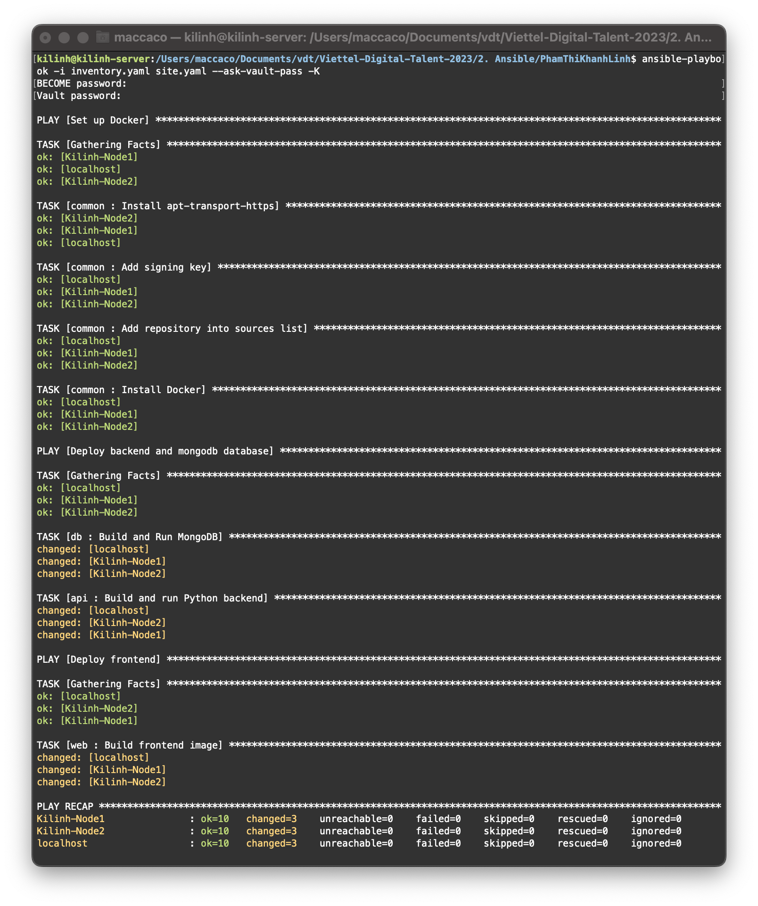
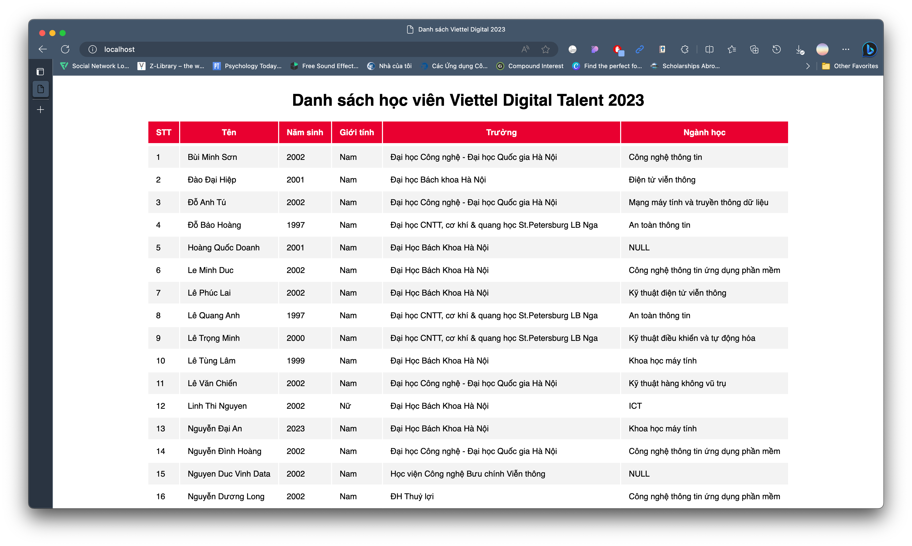
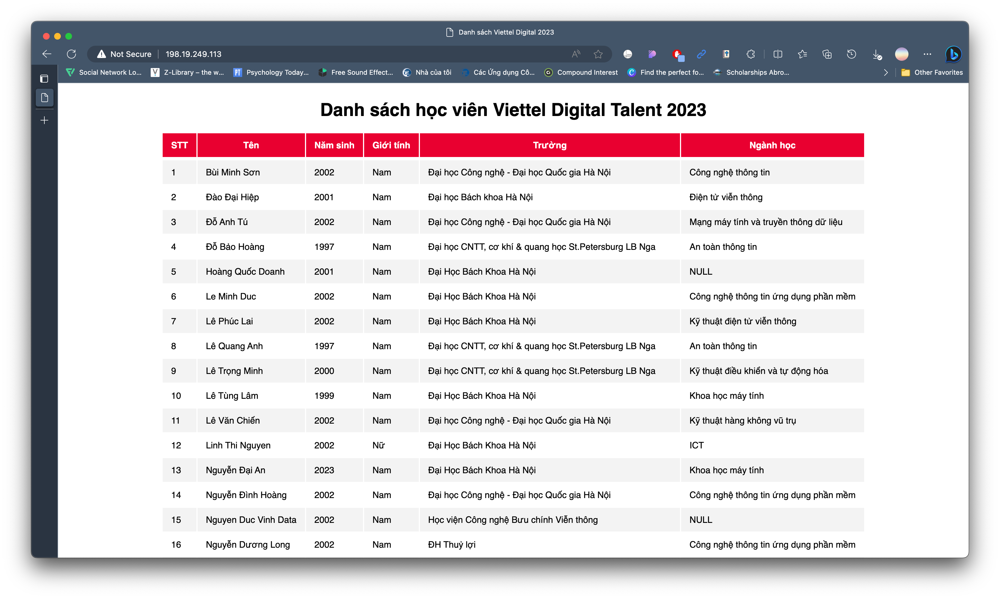

# Ansible Assignment

> Deploy application in the docker-compose homework using ansible:
>
> - Setup docker for your target environments in role “common”
> - Split your application into 3 roles: “web”, “api” and “db”

To deploy on multiple hosts, I use 2 VMs with following IPs:

- 198.19.249.24
- 198.19.249.113

Additionally, I take advantage of `docker compose` in the previous assignment to build images and run 3 containers which are mongodb, api, and web with [`be-compose.yaml`](), [`fe-compose.yaml`](), and [`db-compose.yaml`]().

## Ansible

### 1. Setup

#### a. Inventory

[`inventory.yaml`](): automates tasks on managed nodes or “hosts” in the infrastructure, using a list or group of lists.

```yaml
webapp:
  hosts:
    localhost:
      ansible_connection: local
      ansible_become_user: root

    Kilinh-Node1:
      ansible_host: 198.19.249.24

    Kilinh-Node2:
      ansible_host: 198.19.249.113

  vars:
    ansible_user: kilinh
    ansible_ssh_private_key_file: /home/kilinh/.ssh/id_rsa
    ansible_python_interpreter: /usr/bin/python3
    ansible_become: true
    ansible_become_method: sudo
```

#### b. Roles

- [common](): Set up environment such as installing Docker, Docker Compose Plugin, etc.
- [db](): Pull MongoDB image and run container using `docker compose`.
- [api](): Build Python Back-End image and run container using `docker compose`.
- [web](): Build Front-End image and run container using `docker compose`.

### 2. Deployment

Run `ansible-playbook`:

```
ansible-playbook -i inventory.yaml site.yaml --ask-vault-pass -K
```

After entering the password, all tasks will be executed.


Testing on the browser:

From localhost


From VM with 198.19.249.24 IP Address


From VM with 198.19.249.113 IP Address

