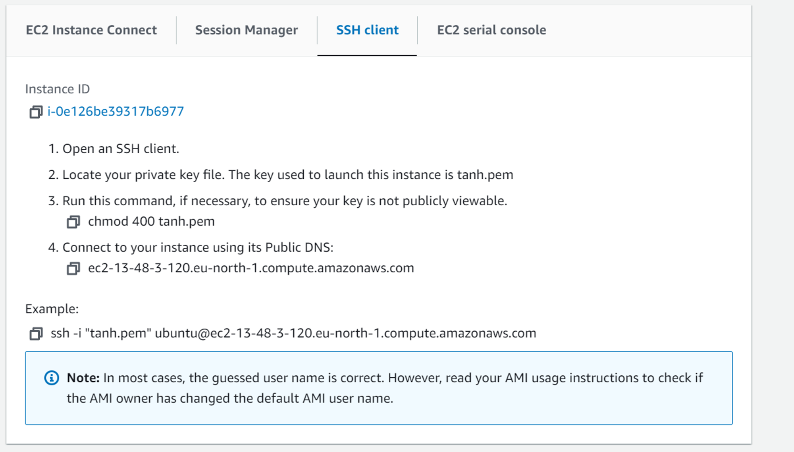
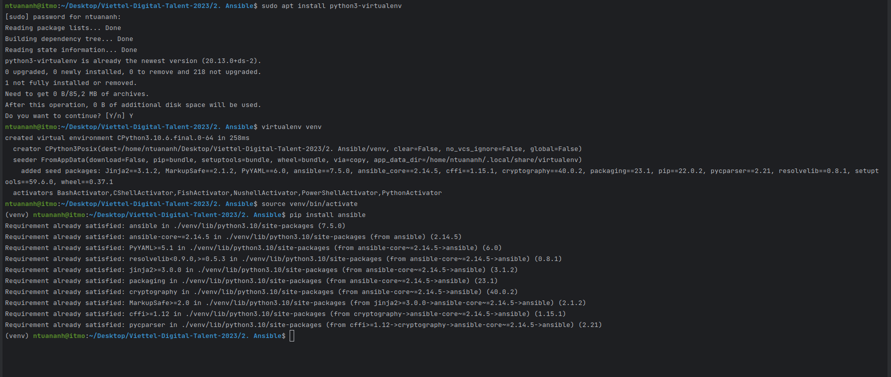
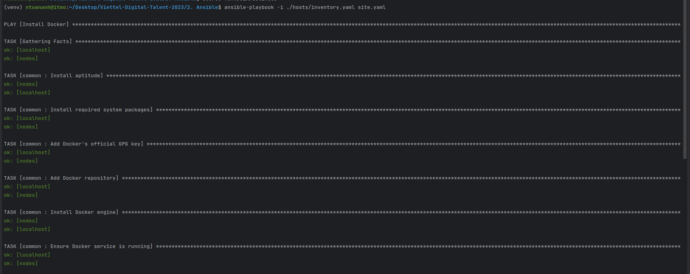
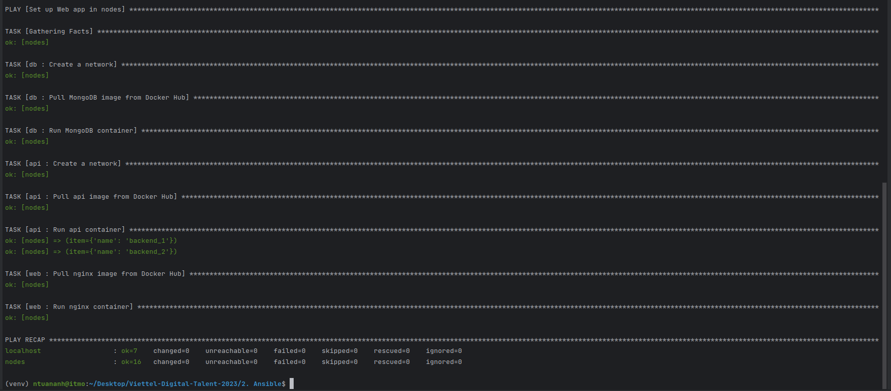
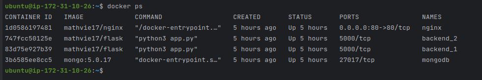
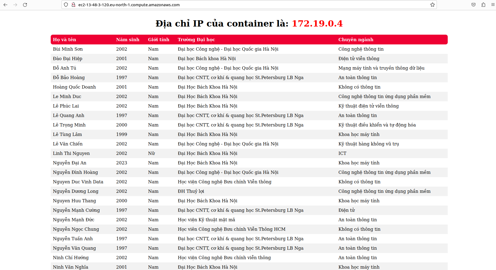

# Viettel-Digital-Talent-2023: Pratice 1
# Task: Ansible
# I. Ansible
## 1. Tổng quan về Ansible

Ansible là một công cụ quản lý cấu hình và triển khai mã nguồn mở. Nó được thiết kế để tự động hóa quy trình triển khai và quản lý hệ thống. Ansible sử dụng ngôn ngữ YAML để xác định các tác vụ và quản lý cấu hình, và nó hoạt động trên các máy chủ từ xa qua SSH.

Ansible có thể được sử dụng để:
- Quản lý cấu hình hệ thống: Ansible cho phép xác định và triển khai cấu hình hệ thống một cách nhất quán trên nhiều máy chủ. Nhờ Ansible chúng ta có thể định nghĩa các tác vụ cần thiết để cài đặt và cấu hình phần mềm, tạo người dùng, cấu hình tường lửa, và nhiều hơn nữa. 
- Triển khai ứng dụng: Ansible giúp tự động hóa quy trình triển khai ứng dụng, bao gồm cài đặt ứng dụng, khởi động dịch vụ, cấu hình cơ sở dữ liệu, và các tác vụ khác liên quan đến triển khai ứng dụng.
- Quản lý cơ sở hạ tầng điện toán đám mây: Ansible có thể làm việc với các nhà cung cấp đám mây như Amazon Web Services (AWS), Microsoft Azure, và Google Cloud Platform (GCP).
- Tự động hóa quy trình: Ansible cung cấp các tính năng mạnh mẽ để tự động hóa quy trình công việc và quản lý hệ thống.

Tóm lại, Ansible được sử dụng rộng rãi trong quản lý hệ thống và triển khai ứng dụng trong các môi trường máy chủ vật lý, máy chủ ảo, và điện toán đám mây.
## 2. Thành phần trong Ansible
Ansible có các thành phần chính sau đây:

- **Inventory**: Inventory là nơi bạn định nghĩa danh sách các máy chủ mà Ansible sẽ quản lý. Inventory cung cấp thông tin về địa chỉ IP, tên máy chủ, nhóm máy chủ, biến môi trường và các thông tin khác liên quan đến các máy chủ.
- **Playbooks**: Playbooks là các tệp YAML chứa các tác vụ mà Ansible sẽ thực hiện trên các máy chủ. Mỗi playbook bao gồm các "task" (tác vụ) và các "play" (trò chơi) chứa các tác vụ đó. Playbooks xác định trạng thái mong muốn của hệ thống và Ansible sẽ tự động thực hiện các bước cần thiết để đạt được trạng thái đó.
- **Modules**: Modules là các tệp thực thi nhỏ được gọi bởi Ansible để thực hiện các tác vụ cụ thể trên các máy chủ.
- **Roles**: Roles là cách để tổ chức và chia sẻ lại các phần của playbooks và các tệp liên quan. Một vai trò bao gồm các tác vụ, các biến, các template và các file khác liên quan đến một phần của hệ thống hoặc ứng dụng cụ thể. Roles giúp tái sử dụng, phân chia khu vực với nhiệm vụ riêng biệt và quản lý mã nguồn một cách hiệu quả.

Ansible sử dụng SSH để kết nối và giao tiếp với các máy chủ từ xa. Điều này cho phép Ansible thực hiện các tác vụ trên các máy chủ mà không cần cài đặt agent hoặc phần mềm bổ sung trên chúng.

Các thành phần khác của Ansible bao gồm:

- **Facts**: Ansible có thể thu thập thông tin về các máy chủ (ví dụ: thông tin hệ điều hành, tài nguyên, biến môi trường) và lưu trữ chúng trong biến đặc biệt được gọi là facts.
- **Handlers**: Handlers là các tác vụ được kích hoạt chỉ khi cần thiết. 
- **Vault**: Ansible cung cấp tính năng mã hóa để bảo vệ thông tin nhạy cảm như mật khẩu, khóa SSH, hoặc các thông tin xác thực khác. Ansible Vault cho phép mã hóa các tệp inventory, playbooks và các tệp khác bằng cách sử dụng khóa và mật khẩu được xác định.
- **Ansible Galaxy**: Ansible Galaxy là một kho lưu trữ công cộng cho các role, playbooks và các phần mở rộng Ansible khác. Nó cung cấp một cách để tìm và sử dụng lại các tài nguyên Ansible đã được tạo sẵn bởi cộng đồng người dùng Ansible.
## 3. Ansible Playbook
Playbook là 1 file được định dạng bằng YAML format, có cú pháp đơn giản để không bị biến thành 1 ngôn ngữ lập trình hay script phức tạp. Trong ansible, playbook thực ra chính là các đoạn script đơn giản, 1 playbook miêu tả những hosts nào được config, và 1 danh sách các tasks hoặc command mà ta sẽ được thực hiện trên những host đó.

Mỗi playbook bao gồm 1 hoặc nhiều **'plays'** trong 1 list. Mỗi play phải chứa các thành phần sau:

- 1 list các hosts để configure
- 1 danh sách các tasks để thực thi trên các hosts trong list trên 

Mục đích của play là map host hoặc 1 nhóm các host với 1 số roles xác định, mỗi role sẽ thực hiện các task nào đó. Ở mức độ cơ bản, 1 task đơn giản chỉ là 1 lời gọi tới 1 ansible module. Modules là nơi thực hiện các công việc thực sự trong ansible, chúng là những gì được thực hiện trong mỗi playbook task.

Mỗi module sẽ có các tham số truyền vào là khác nhau, và hầu như tất cả các module đều có tham số theo dạng **key=value**, các tham số cách nhau bởi dấu cách. 

**Tính Idempotency của playbook:** **Idempotent** là 1 khái niệm có ý nghĩa là ta có thể làm gì đó nhiều lần nhưng kết quả luôn là giống nhau. Trong ansible, 1 playbook được xem xét là có tính idempotent nếu sau lần đầu tiên chạy playbook đó, remotehost sẽ ở 1 trạng thái nào đó thì sẽ vẫn giữ trạng thái đó sau những lần chạy playbook đó tiếp theo. 

# II. Homework 
## 1. Requirements

Deploy your application in the docker-compose homework using ansible:
- Setup docker for your target environments in role “common”
- Split your application into 3 roles: “web”, “api” and “db"

*Note: The number of target nodes is chosen appropriately based on your lab environment. You can run all tasks on the same host if there are not enough resources.*
## 2. Deployment using Ansible
Trong bài em sẽ sử dụng Ansible để triển khai Web app trên một máy chủ ảo EC2 của AWS.
<div align="center">
       
       <br/>
       <i>Thuê máy chủ ảo EC2 của AWS. </i>
</div>

### 2.1. Tạo môi trường ảo và install Ansible
<div align="center">
       
       <br/>
       <i>Tạo môi trường ảo và cài  Ansible.</i>
</div>

### 2.2. Inventory files
File `inventory.yaml` trong thư mục `hosts` sẽ mô tả cấu hình của 2 máy chủ: `localhost` (máy chủ cục bộ) và `nodes` (các máy chủ ảo từ xa).
Với cấu hình này, Ansible sẽ sử dụng các thông tin này để thực hiện các tác vụ trên máy host và các máy nodes khi triển khai.
```yaml
---
all:
  hosts:
    localhost:
      ansible_connection: local
      ansible_python_interpreter: /usr/bin/python3
      ansible_become_user: root
      ansible_become_password: 241631096
      hostname: homework2

    nodes:
      ansible_connection: ssh
      ansible_host: 13.48.3.120
      ansible_user: ubuntu
      ansible_ssh_private_key_file: ~/Desktop/tanh.pem
```
### 2.3. Playbook
Em tạo 1 playbook tên `site.yaml` với mục đích để cài đặt Docker trên tất cả các máy và triển khai Web app trên các nodes.

Role `common` được sử dụng để cài đặt và triển khai Docker trên tất cả các máy (all hosts).

Trong thành phần `roles` của `play` Set up Web app in nodes em sử dụng 3 roles chính là `db`, `api` và `web` để cài đặt cơ sở dữ liệu, triển khai API và triển khai máy chủ web Nginx theo thứ tự tương ứng.
Ngoài ra, em có cài đặt `ansible-galaxy` để tái sử dụng các role đã được xây dựng bởi cộng đồng Ansible. 

Ví dụ: ```
ansible-galaxy collection install community.docker``` để quản lý Docker trong môi trường triển khai tự động với Ansible.
```yaml
---
- name: Install Docker
  hosts: all
  become: yes
  gather_facts: true
  roles:
    - common

- name: Set up Web app in nodes
  hosts: nodes
  become: yes
  gather_facts: true
  roles:
    - db
    - api
    - web
```
- #### Role `common`
Tự động cài đặt và cấu hình Docker trên một máy chủ Ubuntu bất kỳ. Từng task sẽ thực hiện các nhiệm vụ sau:
1. "Install aptitude": Sử dụng mô-đun apt để cài đặt gói aptitude trên hệ thống. Gói này là một công cụ quản lý gói cho hệ thống Ubuntu.

2. "Install required system packages": Sử dụng module apt để cài đặt các gói hệ thống cần thiết, bao gồm apt-transport-https, ca-certificates, curl, software-properties-common, python3-pip, virtualenv và python3-setuptools. Tất cả các gói này được cài đặt ở phiên bản mới nhất và cache được cập nhật trước khi cài đặt.

3. "Add Docker's official GPG key": Sử dụng module apt_key để thêm khóa GPG chính thức của Docker vào hệ thống.

4. "Add Docker repository": Sử dụng module apt_repository để thêm kho lưu trữ Docker vào danh sách các kho lưu trữ hệ thống. Repository này chứa các gói Docker cần thiết để cài đặt Docker Engine.

5. "Install Docker engine": Sử dụng module apt để cài đặt Docker Engine (docker-ce) trên hệ thống. Gói này là phiên bản Docker Engine Community Edition.

6. "Ensure Docker service is running": Sử dụng module service để kiểm tra và đảm bảo rằng dịch vụ Docker đang chạy và được kích hoạt để khởi động cùng với hệ thống.
```yaml
---
- name: Install aptitude
  apt:
    name: aptitude
    state: latest
    update_cache: yes

- name: Install required system packages
  apt:
    pkg:
      - apt-transport-https
      - ca-certificates
      - curl
      - software-properties-common
      - python3-pip
      - virtualenv
      - python3-setuptools
    state: latest
    update_cache: true

- name: Add Docker's official GPG key
  apt_key:
    url: https://download.docker.com/linux/ubuntu/gpg
    state: present


- name: Add Docker repository
  apt_repository:
    repo: deb [arch=amd64] https://download.docker.com/linux/ubuntu {{ ansible_lsb.codename }} stable
    state: present
    filename: docker

- name: Install Docker engine
  apt:
    name: docker-ce
    state: present
    update_cache: true

- name: Ensure Docker service is running
  service:
    name: docker
    state: started
    enabled: yes
```
- #### Role `db`
Mô tả các bước để tạo network backend, pull image MongoDB có sẵn từ Docker Hub và run container MongoDB.
```yaml
---
- name: Create a network
  community.docker.docker_network:
    name: backend

- name: Pull MongoDB image from Docker Hub
  community.docker.docker_image:
    name: mongo:5.0.17
    source: pull
    state: present
    force_source: true

- name: Run MongoDB container
  community.docker.docker_container:
    name: mongodb
    image: mongo:5.0.17
    restart_policy: unless-stopped
    state: started
    env:
      DB_DATABASE: "database"
    volumes: ./database:/data/db
    networks:
      - name: backend
```
- #### Role `api`
Mô tả các bước để tạo network frontend, pull về api image được em push lên Docker Hub và run 2 containers `backend_1` và `backend_2` được  từ run từ api mage đó với cấu hình tương ứng.  
```yaml
---
- name: Create a network
  community.docker.docker_network:
    name: frontend

- name: Pull api image from Docker Hub
  community.docker.docker_image:
    name: "{{ flask_image }}"
    source: pull
    state: present
    force_source: true

- name: Run api container
  community.docker.docker_container:
    name: "{{ item.name }}"
    image: "{{ flask_image }}"
    restart_policy: unless-stopped
    state: started
    env:
      DB_DATABASE: "{{ db_database }}"
      DB_HOSTNAME: "{{ db_container_name }}"

    networks:
      - name: backend
      - name: frontend
  loop:
    - { name: 'backend_1' }
    - { name: 'backend_2' }
```
- #### Role `web`
Mô tả các bước để pull về nginx image được em push lên Docker Hub và run container đó với cấu hình tương ứng.
```yaml
---
- name: Pull nginx image from Docker Hub
  community.docker.docker_image:
    name: "{{ nginx_image }}"
    source: pull
    state: present
    force_source: true

- name: Run nginx container
  community.docker.docker_container:
    name: nginx
    image: "{{ nginx_image }}"
    restart_policy: unless-stopped
    state: started
    ports:
      - "80:80"
    networks:
      - name: frontend
```
### 2.4. Run playbook
Thực hiện câu lệnh sau để run playbook:

`ansile-playbook -i ./hosts/inventory.yaml site.yaml
`

**Kết quả chụp màn hình sau khi chạy:**

- Run `playbook`:

<div align="center">
       
       <br/>
       <i>Run playbook. </i>
</div>

<div align="center">
       
       <br/>
       <i>Run playbook. </i>
</div>

- Running containers in `nodes`:

<div align="center">
       
       <br/>
       <i>Running containers in nodes. </i>
</div>

- Deployment in EC2 instance of AWS: 
<div align="center">
       
       <br/>
       <i>Web Application. </i>
</div>

<div align="center">
       
       <br/>
       <i>Web Application. </i>
</div>
