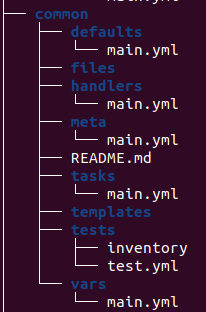
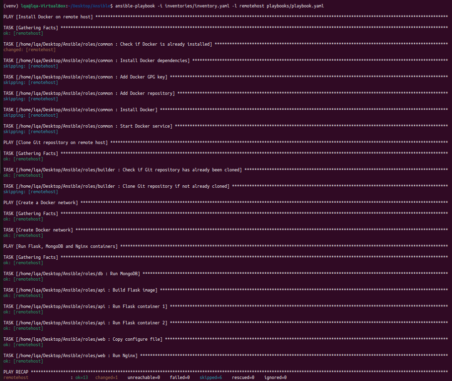
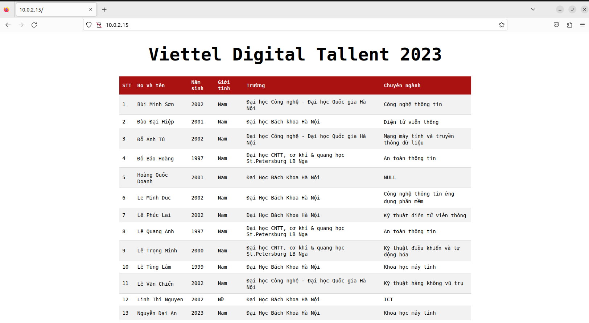
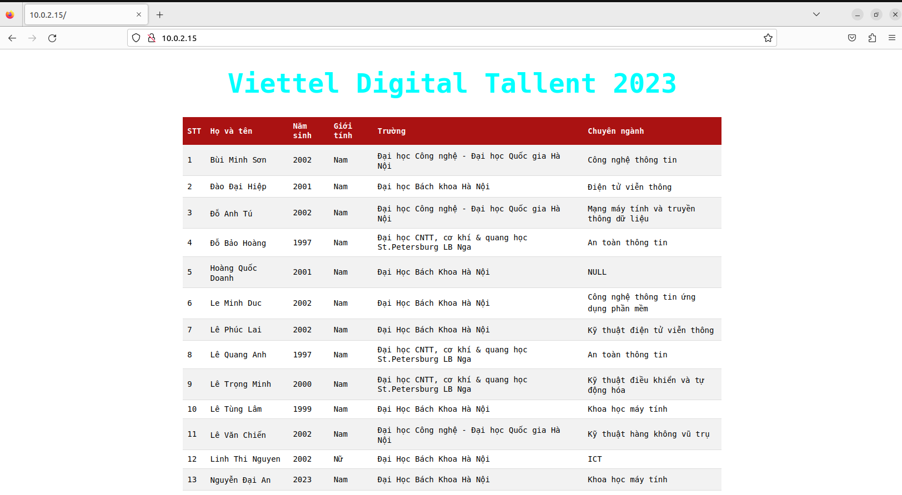

# Ansible

Ansible is an open-source automation tool that allows cloud developers to manage and configure IT infrastructure and applications. It is designed to automate complex tasks, such as deploying applications, configuring network devices, and managing cloud resources, using a simple and powerful automation language.

## How it works

Ansible works by using a declarative language to describe the desired state of a system or application. It then executes a series of tasks to bring the system or application to that state. Ansible uses a client-server architecture, where the controlling machine (the Ansible server) communicates with target machines (the Ansible clients) using SSH or WinRM protocols.

## Benefits

Ansible has several benefits for cloud developers, including:

- **Simplicity**: Ansible uses a simple and easy-to-understand automation language, YAML, which makes it easy to write and read playbooks (automation scripts).
- **Efficiency**: Ansible can manage thousands of servers at once, making it highly scalable and efficient for large-scale deployments.
- **Flexibility**: Ansible can manage a wide range of systems and applications, including servers, network devices, cloud resources, and containers.
- **Reusability**: Ansible playbooks can be reused across different projects and environments, making it easy to standardize and automate IT processes.
- **Community**: Ansible has a large and active community of developers who contribute to its development and share their playbooks and modules.

Sure, here's the homework description in markdown format:

# Homework

Deploy your application in the docker-compose homework using ansible:

## Tasks

- Set up Docker for your target environments in the "common" role.
- Split your application into three roles: "web", "api", and "db".

# Solution
In this homework, we will use 2 ubuntu virtual machine created on `virtualbox`, that connected to each other and the internet on `NAT network`.
## Set up Docker for your target environments in the "common" role.
We create folder `roles` that contain all the role needed for this homework then use `ansible-galaxy` to create role `common`
```
ansible-galaxy init common
```
<p align="center">
  
</p>
<p align="center">
  Figure 1 - Ansible-galaxy file tree
</p>

## Common role task
This is the role used to setup `Docker` to target system.

```
---
- name: Check if Docker is already installed
  become: true
  shell: "docker --version"
  register: docker_version
  ignore_errors: yes

- name: Install Docker dependencies
  apt:
    name:
      - apt-transport-https
      - ca-certificates
      - curl
      - gnupg
      - lsb-release
    state: present
  when: docker_version.stdout is not defined

- name: Add Docker GPG key
  apt_key:
    url: https://download.docker.com/linux/ubuntu/gpg
    state: present
  when: docker_version.stdout is not defined

- name: Add Docker repository
  apt_repository:
    repo: deb [arch=amd64] https://download.docker.com/linux/ubuntu {{ ansible_distribution_release }} stable
    state: present
  when: docker_version.stdout is not defined

- name: Install Docker
  apt:
    name: docker-ce
    state: present
  when: docker_version.stdout is not defined

- name: Start Docker service
  service:
    name: docker
    state: started
    enabled: yes
  when: docker_version.stdout is not defined

```
In this role, we first check if docker is available in the target machine.If docker is not available then we execute steps to install `Docker`, else it will skip all the tasks after `Check if Docker is already installed`.

## Builder role
After install `Docker`, we need to clone our repository from `Github` so we build another role named builder to do this task. This role will check whether if the code is already available in our location of choice, if not it will clone the repository.
```
---
- name: Check if Git repository has already been cloned
  stat:
    path: /home/lqa/web_app
  register: destination_stat

- name: Clone Git repository if not already cloned
  git:
    repo: https://github.com/LeQA/Viettel-Digital-Talent-2023.git
    dest: /home/lqa/web_app
    version: containerization-homework
  when: not destination_stat.stat.exists

```

### Web role
This role is used to create and run `nginx` container on target machine.
```
---
- name: Copy configure file
  become: yes
  copy:
    src: /home/lqa/Desktop/Ansible/roles/web/files/nginx.conf
    dest: ~/default.conf
- name: Run Nginx
  docker_container:
    name: nginx_test
    image: nginx:stable-alpine3.17-slim
    state: started
    restart_policy: unless-stopped
    ports:
      - 80:80
    volumes:
      - ~/default.conf:/etc/nginx/conf.d/default.conf
    network_mode: my-network

```
In this role, first we need to transfer `nginx` configuration file from source machine to target machine with model `copy`. Then we build the container from `nginx:stable-alpine3.17-slim`, expose it port for access and moount the configuration file from target machine to the `nginx` configuration in container.

### Nginx configuration
```
upstream loadbalancer {
    server flask_container_1:5000;
    server flask_container_2:5000;
}
server {
    listen 80;
    server_name localhost;
    location / {
        proxy_pass http://loadbalancer;
    }   
}   
```
This configuration file create a load balancer that split the load between two web app we created.

## Role API
This role is used to build our flask web app.
```
---
- name: Build Flask image
  community.docker.docker_image:
    name: flask_test
    build:
      path: /home/lqa/web_app/1. Containerization/LeQuangAnh/flask/
    source: build

- name: Run Flask container 1
  community.docker.docker_container:
    name: flask_container_1
    image: flask_test
    command: python app.py
    restart_policy: unless-stopped
    env:
      COLOR=black
    exposed_ports:
      - 5000
    network_mode: my-network

- name: Run Flask container 2
  community.docker.docker_container:
    name: flask_container_2
    image: flask_test
    command: python app.py
    restart_policy: unless-stopped
    env:
      COLOR=cyan
    exposed_ports:
      - 5000
    network_mode: my-network

```
The first task in this role is to build a flask app image `flask_test` from the `Dockerfile` in the reposity we cloned from role `Builder`. Next, it create a container named `flask_container_1` and `flask_container_2` from `flask_test` that have distinguish header color (black and cyan). Both these container have their port 5000 expose.

## Role db
This role is setup our mongodb database.
```
---
- name: Run MongoDB
  community.docker.docker_container:
    name: database
    image: mongo:5.0.17
    restart_policy: unless-stopped
    state: started
    ports:
      - "27017:27017"
    network_mode: my-network

```

This role's task in build and run mongodb container named database from image `mongo:5.0.17` and have port `27017` exposed.

## Playbook 
```
---
- name: Install Docker on remote host
  hosts: remotehost
  become: true
  roles:
    - /home/lqa/Desktop/Ansible/roles/common

- name: Clone Git repository on remote host
  hosts: remotehost
  become: yes
  roles:
    - /home/lqa/Desktop/Ansible/roles/builder

- name: Create a Docker network
  hosts: remotehost
  become: yes
  tasks:
    - name: Create Docker network
      docker_network:
        name: my-network
        state: present

- name: Run Flask, MongoDB and Nginx containers
  hosts: remotehost
  become: true
  roles:
    - role: /home/lqa/Desktop/Ansible/roles/db 
    - role: /home/lqa/Desktop/Ansible/roles/api
    - role: /home/lqa/Desktop/Ansible/roles/web

```
This is the playbook that we used to do all the above task on `remotehost`. Before the last task that create and run all the flask app, mongodb database and nginx container, we create a Docker network named `my-network`, that all container will be connected to, so they can communicate with each others.

## Inventory
This file contain all the host, their address and credential needed to SSH to them.
```
---
all:
  hosts:
    remotehost:
      ansible_host: 10.0.2.15
      ansible_user: lqa
      ansible_ssh_pass: 9876541
      ansible_become_user: root
      ansible_become_password: 9876541

```
## Result

<p align="center">
  
</p>
<p align="center">
  Figure 2 - Ansible result
</p>

<p align="center">
  
</p>
<p align="center">
  Figure 3 - Access to webapp deployed on target machine (version 1)
</p>

<p align="center">
  
</p>
<p align="center">
  Figure 4 - Access to webapp deployed on target machine (version 2)
</p>