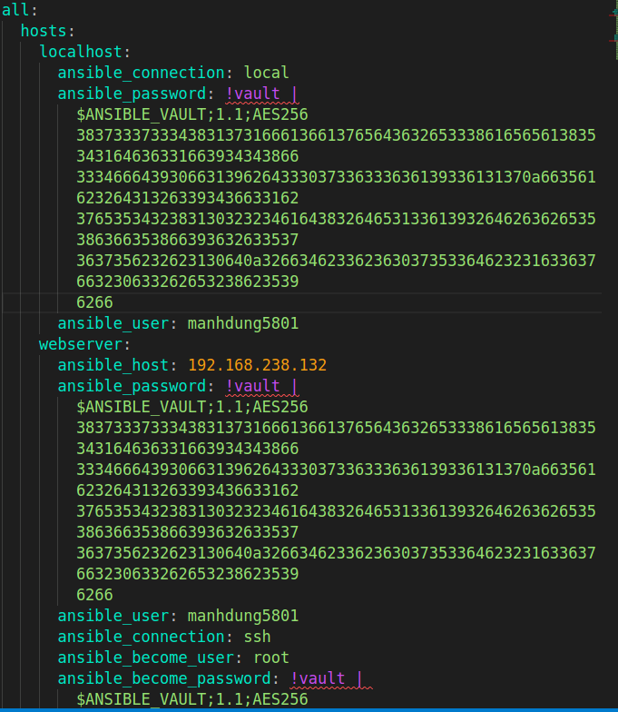
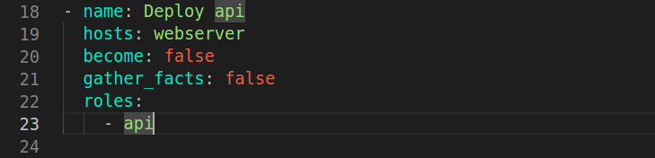

## Bài tập ansible

*Người thực hiện: Trần Mạnh Dũng*

#### 1. Các thành phần trong project
- **Web frontend:**
  - Ngôn ngữ sử dụng: HTML, CSS, JS
  - Hiển thị các thông tin học viên kèm theo các chức năng cơ bản như: thêm, sửa, xóa học viên.
  - Xây dựng Dockerfile chạy base image nginx làm webserver 
  - Một số hình ảnh demo
  

- **API backend:**
  - Ngôn ngữ sử dụng: Django(python)
  - Xây dựng các API: GET, LIST, PUT, PATCH, DELETE
  

- **Database:**
  - Hệ quản trị cơ sở dữ liệu: PostgreSQL
#### 2. Ansible
- Thực hiển triển khai 3 dịch vụ đã trình bày tại mục 1 sử dụng công cụ ansible
- Số lượng managed node là 2 trong đó có 1 node vừa làm control node vừa là managed node (đặt là *MN1*) và 1 node có địa chỉ ip là 192.168.238.132 (đặt là *MN2*).
- **Thực hiện xây dựng role common**
  - Nhiệm vụ: Cài đặt và setup docker cho các managed node. Trong bài này em chỉ thực hiện cài đặt trên MN2 do MN1 là control node đã có sẵn môi trường docker.
  - Xây dựng file inventory:
    - Khai báo 2 host đó là localhost và 192.168.238.132, user sử dụng trong quá trình thao tác với các host.
    - NOTE: Mật khẩu để kết nối tới các host ở đây đã được mã hóa nhằm mục đích bảo mật an toàn thông tin sử dụng ansible-vault. Dùng câu lệnh `ansible-vault create <file_name>` để tạo file chứa mật khẩu của host sau đó ansible sẽ yêu cầu tạo mật khẩu để có thể truy cập vào được file đó vào những lần sau hoặc chạy ansible-playbook. Sau khi ghi mật khẩu vào file ta lưu lại file thì trong file lúc này mở ra sẽ được mã hash kiểu AES256 và ta paste mã hash đó vào mục `ansible_password`. Mỗi lần chạy câu lệnh ansible-playbook thì ta phải thêm chỉ thị `--ask-vault-pass` rồi nhập mật khẩu để truy cập vào file ta đã tạo ở trên để chạy thành công.

    

  - Xây dựng playbook:
    - Cài đặt docker thì em để `become: true` tức là sẽ cài đặt với quyền là root user. Nhưng ở task cuối của play này thì em thêm user khác không phải root vào group docker và sử dụng user này để thực thi docker xuyên suốt project.

    
  - Xây dựng role:
    - Tasks:
      - Chạy lần lượt các task từ trên xuống dưới để cài đặt thành công docker.
      - Task cuối như đã trình bày ở trên thì sẽ add user `manhdung5801` vào group docker và thực thi các lệnh của docker từ user `manhdung5801` này.

    

- **Thực hiện xây dựng role db**
  - Nhiệm vụ: Trỏ tới nơi chứa file docker-compose.yml config service postgreSQL và bật service lên.
  - Deploy: trên MN1
  - Xây dựng playbook:
  
    
  - Xây dựng role:
    - Các task liên quan tới docker, khi sử dụng module docker hay docker-compose đề gặp lỗi. Em đã cố gắng search fix bug, cài các library theo version thỏa mãn requirements nhưng vẫn không hết lỗi :

    

    
    - Vì vậy, em sử dụng module shell. Đầu tiên là stop và kill docker container db đang chạy, sau đó là chạy lại service bằng câu lệnh `docker-compose up -d`

    
  - Xây dựng var:
    
    
- **Thực hiện xây dựng role api**
  - Nhiệm vụ: Kiểm tra sự tồn tại của container và image version cũ sau đó sẽ xóa đi nếu tồn tại. Tiếp theo pull image từ repo trên docker hub với tag image latest (mới nhất). Cuối cùng là chạy container với image vừa pull về.
  - Deploy: trên MN2
  - Xây dựng playbook:
    - Thực thi với user `manhdung5801` đã thêm vào group docker ở bước trước chứ không thực thi với quyền root.
  
    
  - Xây dựng role:
    - Task 1: Dừng và xóa bỏ container đang chạy version cũ. Trong trường hợp tồn tại container có tên cố định sẵn đang chạy thì sẽ thực thi còn nếu không tồn tại thì sẽ bỏ qua task này.
    - Task 2: Xóa image version cũ nhằm mục đích cải thiện dung lượng lưu trữ của server.
    - Task 3: Pull image version mới nhất từ repo về.
    
    

    
  - Xây dựng var:

    
- **Thực hiện xây dựng role web-frontend**
  - Xây dựng tương tự như role api.
  - Xây dựng playbook:
  
    
  - Xây dựng role web:

    

    
  - Xây dựng var:

    
> *NOTE*: Xây dựng file ansible-playbook.yml sắp xếp các play sao cho thỏa mãn điều kiện của từng dịch vụ do ansible sẽ thực thi tuần tự từng play, từng task từ trên xuống dưới. Đầu tiên sẽ là cài đặt và setup môi trường cho các managed node. Sau đó, database sẽ phải là dịch vụ được deploy đầu tiên, sau đó là tới deploy server api backend và cuối cùng là frontend. Bởi vì server backend sẽ thực hiện query vào database nên database sẽ phải sẵn sàng để server backend kết nối tới, nếu không sẽ gặp lỗi ngay lập tức. Còn phía client frontend sẽ gửi request tới backend nên nó sẽ được sinh ra sau backend.

#### 3. Kết quả
- Chạy các plays và tasks qua lệnh ansible-playbook

  

  

  

- Sau khi chạy, ta thu được kết quả sau

  

  

  

  
