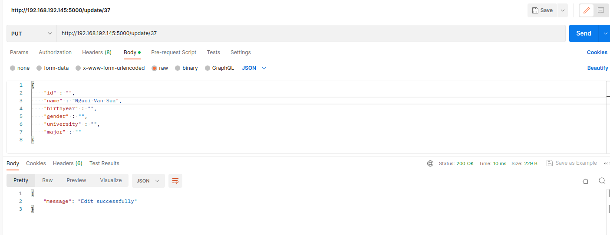

# Practice 2: Ansible

Sinh viên: **Trần Minh Dương**

## Mục lục

[I. Chuẩn bị](#i-chuẩn-bị)

- [1. Hosts](#1-hosts)
- [2. Các Docker Image của 3-tier application](#2-các-docker-image-của-3-tier-application)

[II. Thực hành Ansible](#ii-thực-hành-ansible)

- [1. Viết Ansible Playbooks](#1-viết-ansible-playbooks)
  - [1.1. Inventories](#11-inventories)
  - [1.2. Common role](#12-common-role)
  - [1.3. Api role](#13-api-role)
  - [1.4. Db role](#14-db-role)
  - [1.5. Web role](#15-web-role)
- [2. Triển khai](#2-triển-khai)
  - [2.1. Chạy Ansible Playbooks](#21-chạy-ansible-playbooks)
  - [2.2. Kết quả](#22-kết-quả)

## I. Chuẩn bị

### 1. Hosts

Để tận dụng khả năng của Ansible, em sẽ thử deploy app lên 2 remote host (_managed node_).  
2 host này là 2 máy ảo Ubuntu Server 22.04 đã được đưa ssh publickey của máy chạy demo (_control node_), với địa chỉ IP:

- VM1: 192.168.192.144
- VM2: 192.168.192.145

Trong bài demo này, em sẽ dùng VM1 để triển khai Frontend, VM2 để triển khai Backend + DB.

### 2. Các Docker Image của 3-tier application

_So với application trong practice 1 đã nộp, application này đã có đủ các chức năng CRUD ở cả frontend và backend_.

Từ thư mục `frontend` ta build image của frontend (_frontend sử dụng ReactJS_)

```bash
docker build -t duongtm3102/vtapp-frontend:latest .
```

Từ thư mục `backend` ta build image của backend (_backend sử dụng Flask Python_)

```bash
docker build -t duongtm3102/vtapp-backend:latest .
```

_**Database** sử dụng image mongo:5.0 nên không cần tự build_

Push 2 image trên lên dockerhub

```bash
docker push duongtm3102/vtapp-frontend:latest
docker push duongtm3102/vtapp-backend:latest
```

Giờ ta đã có 2 image để sử dụng ở phần deploy với Ansible:

<div align="center">
    
</div>

## II. Thực hành Ansible

### 1. Viết Ansible Playbooks

- Cấu trúc thư mục Ansible

```bash
.
├── inventories
│   └── inventory.yaml
├── roles
│   ├── api
│   │   └── tasks
│   │       └── main.yaml
│   ├── common
│   │   └── tasks
│   │       └── main.yaml
│   ├── db
│   │   └── tasks
│   │      └── main.yaml
│   └── web
│       ├── defaults
│       |   └── main.yaml
│       └── tasks
│           └── main.yaml
└── site.yaml

```

#### 1.1. Inventories

`inventory.yaml` chứa thông tin các managed node: IP, ansible_user, cách kết nối, group...

- VM1 thuộc group `webserver`, VM2 thuộc group `backend`.

#### 1.2. Common role

Role `common` thực hiện cài đặt docker trên các node (_chi tiết ở [common tasks](./ansible/roles/common/tasks/main.yaml)_):

- Cài đặt các package hệ thống cần thiết: python3-pip, ca-certificates, curl, v.v.
- Thêm Docker GPG apt Key và Add Docker Repository.
- Cài đặt docker: Docker engine, Docker compose, Docker module for Python.
- Thêm user vào group docker.

#### 1.3. Api role

Role `api` thực hiện run backend image (_chi tiết ở [api tasks](./ansible/roles/api/tasks/main.yaml)_):

- Sử dụng các `docker_*_module`.
- Kiểm tra và tạo docker network `vtapp` trên node.
- Run image `duongtm3102/vtapp-backend:latest` (_từ dockerhub_)

#### 1.4. Db role

Role `api` thực hiện run database image (_chi tiết ở [db tasks](./ansible/roles/db/tasks/main.yaml)_):

- Sử dụng các `docker_*_module`.
- Copy [init data](./vtapp/data/) từ _control node_ lên _managed host_.
- Kiểm tra và tạo docker network `vtapp` trên node.
- Run mongo:5.0 image.

#### 1.5. Web role

Role `web` thực hiện run database image (_chi tiết ở [web tasks](./ansible/roles/web/tasks/main.yaml)_):

- [Biến](./ansible/roles/web/defaults/main.yaml) `REACT_APP_BACKEND_URL` là đuờng dẫn API cho React.
- Sử dụng các `docker_*_module`.
- Kiểm tra và tạo docker network `vtapp` trên node.
- Run image `duongtm3102/vtapp-frontend:latest` (_từ dockerhub_)
  - Image `duongtm3102/vtapp-frontend:latest` có thể nhận biến **runtime** environment variables `REACT_APP_BACKEND_URL` để dùng cho React App. ([Tham khảo](https://ainize.ai/kunokdev/cra-runtime-environment-variables))

### 2. Triển khai

#### 2.1. Chạy Ansible Playbooks

File `site.yaml`

```yaml
---
- name: Setup OS environment
  hosts: all
  become: true
  gather_facts: true
  roles:
    - common

- name: Deploy backend + database
  hosts: backend
  become: true
  gather_facts: true
  roles:
    - db
    - api

- name: Deploy webserver
  hosts: webserver
  become: true
  gather_facts: true
  roles:
    - web
```

- Role `common` sẽ được chạy ở cả 2 node.
- Role `db` và `api` được chạy ở node thuộc `backend` group - ở đây là VM2
- Role `web` được chạy ở node thuộc `webserver` group - ở đây là VM1

Chạy `ansible-playbooks`:

```bash
ansible-playbook -i inventories/inventory.yaml site.yaml -K
```

- -K: nhập mật khẩu để thực hiện các lệnh cần sudo

**Output:** (_chi tiết ở [AnsibleLog](./ansiblelog.txt)_)

_Common role:_ chạy trên 2 vm

<div align="center">
    
</div>

_db, api role:_ chạy trên vm2

<div align="center">
    
</div>

_web role:_ chạy trên vm1

<div align="center">
    
</div>

- Đồng thời còn có _PLAY RECAP_

#### 2.2. Kết quả

Giờ ứng dụng đã được triển khai, ta kiểm tra bằng cách truy cập http://192.168.192.144/

<div align="center">
    
</div>

Test các chức năng CRUD của backend:

- Lấy danh sách tất cả sinh viên

<div align="center">
    
</div>

- Lấy thông tin 1 sinh viên bằng id

<div align="center">
    
</div>

- Thêm sinh viên

<div align="center">
    
</div>

- Sửa thông tin

<div align="center">
    
</div>

- Xoá sinh viên

<div align="center">
    
</div>

- _Web cũng cập nhật các thay đổi_

<div align="center">
    
</div>
