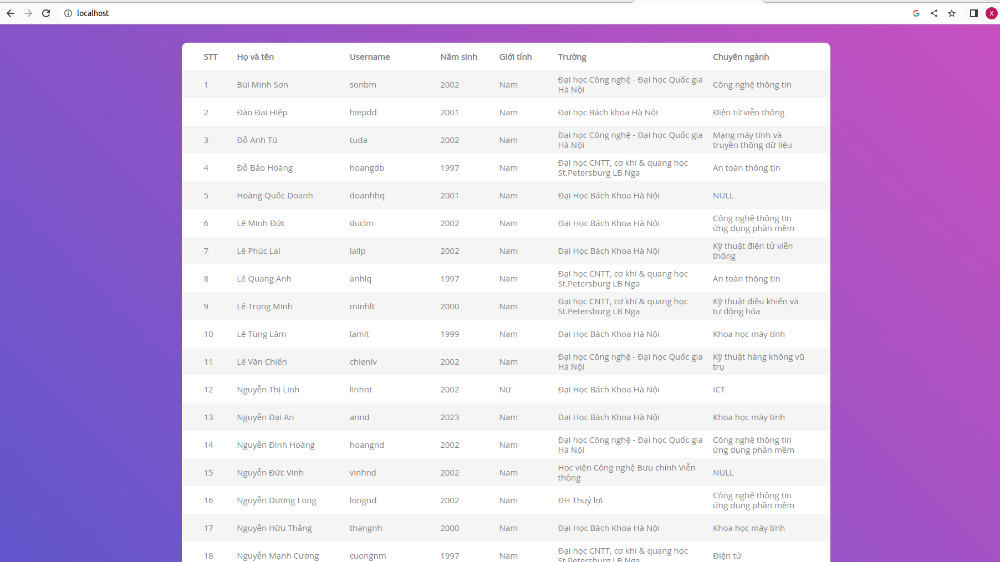

# Bài tập Ansible

## Cấu trúc file 
```
.
├── inventories
│   └── inventory.yaml
├── roles
│   ├── api
│   │   ├── files
│   │   │   ├── app.py
│   │   │   ├── Dockerfile
│   │   │   ├── requirements.txt
│   │   │   ├── static
│   │   │   ├── templates
│   │   │   │   ├── create.html
│   │   │   │   ├── get.html
│   │   │   │   ├── index.html
│   │   │   │   └── update.html
│   │   │   └── wsgi_app.py
│   │   ├── tasks
│   │   │   └── main.yaml
│   │   └── vars
│   │       └── main.yaml
│   ├── common
│   │   ├── tasks
│   │   │   └── main.yaml
│   │   └── vars
│   │       └── main.yaml
│   ├── db
│   │   ├── files
│   │   │   └── init-db.js
│   │   ├── tasks
│   │   │   └── main.yaml
│   │   └── vars
│   │       └── main.yaml
│   └── web
│       ├── files
│       │   ├── Dockerfile
│       │   └── nginx.conf
│       ├── tasks
│       │   └── main.yaml
│       └── vars
│           └── main.yaml
└── setup.yaml
```
Có tổng cộng 4 roles, gồm:
- **common**: Cài đặt docker và setup 
- **api**: Bao gồm flask app và templates
- **web**: Chạy nginx
- **db**: Khởi tạo data cho mongodb
## Chi tiết các roles
### common
Nội dung file `common/tasks/main.yaml':
```
- name: Install aptitude
  apt:
    name: aptitude
    state: latest
    update_cache: "{{ update_cache }}"

- name: Install required system packages
  apt:
    pkg:
      - apt-transport-https
      - ca-certificates
      - curl
      - software-properties-common
      - python3-pip
      - virtualenv
      - python3-setuptools
    state: latest
    update_cache: "{{ update_cache }}"

- name: Add Docker GPG apt Key
  apt_key:
    url: https://download.docker.com/linux/ubuntu/gpg
    state: present

- name: Add Docker Repository
  apt_repository:
    repo: deb https://download.docker.com/linux/ubuntu focal stable
    state: present

- name: Update apt and install docker-ce
  apt:
    name: docker-ce
    state: latest
    update_cache: "{{ update_cache }}"

- name: Install Docker Module for Python
  pip:
    name: docker

- name: Download Docker Compose binary
  get_url:
    url: https://github.com/docker/compose/releases/download/1.29.2/docker-compose-Linux-x86_64
    dest: /usr/local/bin/docker-compose
    mode: 'u+x'


- name: Create frontend network
  docker_network:
    name: frontend
    driver: bridge

- name: Create backend network
  docker_network:
    name: backend
    driver: bridge

- name: Create appdata volume
  docker_volume:
    name: appdata
    driver: local

- name: Create nginxdata volume
  docker_volume:
    name: nginxdata
    driver: local
```
Role common ban đầu sẽ cài docker, sau đó sẽ tạo 2 network (frontend, backend) và 2 volume (appdata, nginxdata).
### api
File `api/tasks/main.yaml` có nội dung như sau:
```- name: Build Python Image
  docker_image:
    name: python:3.9
    build:
      path: roles/api/files
    source: build
    state: present


- name: Start Flask container
  become: true
  docker_container:
    name: "{{ flask_container_name }}"
    image: "{{ python_image }}"
    restart_policy: unless-stopped
    env:
      APP_ENV: "prod"
      APP_DEBUG: "False"
      APP_PORT: "{{ flask_port }}"
    volumes:
      - "{{ flask_volumes }}"
    networks:
      - name: frontend
      - name: backend
```
File sẽ chạy 2 tasks, đầu tiên là build Python Image và sau đó là chạy Flask container.
### web
Nội dung file `web/tasks/main.yaml`:
```
- name: Build Nginx Image
  docker_image:
    name: nginx:1.22.0-alpine
    source: build
    build:
      path: roles/web/files__

- name: Start Nginx Container
  become: true
  docker_container:
    name: "{{ nginx_container_name }}"
    image: nginx:1.22.0-alpine
    restart_policy: unless-stopped
    env:
      APP_ENV: "prod"
      APP_NAME: "webserver"
      APP_DEBUG: "true"
      SERVICE_NAME: "webserver"
    ports:
      - "{{ port_1 }}:{{ port_1 }}"
      - "{{ port_2 }}:{{ port_2 }}"
    volumes:
      - "{{ nginx_volumes }}"
    networks:
      - name: frontend
```
Giống như role api, role web sẽ build nginx image rồi sau đó khởi chạy nginx container.
### db
Nội dung file `db/tasks/main.yaml`:
```
- name: Pull MongoDb Image
  docker_image:
    name: "{{ db_image }}"
    source: pull

- name: Start mongodb container
  become: true
  docker_container:
    name: "{{ db_container_name }}"
    image: "{{ db_image }}"
    restart_policy: unless-stopped
    hostname: "{{ db_hostname }}"
    env:
      MONGO_INITDB_DATABASE: "{{ mongo_init_db }}"
      MONGO_INITDB_ROOT_USERNAME: "{{ mongo_root_username }}"
      MONGO_INITDB_ROOT_PASSWORD: "{{ mongo_root_password }}"
    volumes:
      - "{{ db_volumes }}"
    ports:
      - "{{ db_port }}:{{ db_port }}"
    networks:
      - name: backend
```
Role db sẽ pull mongodb image về và cuối cùng tiến hành khởi chạy container.
## Playbook
File `setup.yaml` có nội dung như sau:
```
---
- name: Setup Docker and Docker Compose
  hosts: all
  become: true
  gather_facts: false
  roles:
    - common

- name: Build Image and Run db container
  hosts: all
  become: true
  gather_facts: false
  roles:
    - db

- name: Build Image and Run flask container
  hosts: all
  become: true
  gather_facts: false
  roles:
    - api

- name: Build Image and Run webserver container
  hosts: all
  become: true
  gather_facts: false
  roles:
    - web
```
Theo đó, playbook sẽ chạy lần lượt các role `common->db->flask->web` 
## Demo
Run câu lệnh sau:
```
ansible-playbook -i inventories/inventory.yaml setup.yaml
```
Chi tiết logs:
```
PLAY [Setup Docker and Docker Compose] *****************************************

TASK [common : Install aptitude] ***********************************************
ok: [localhost]

TASK [common : Install required system packages] *******************************
ok: [localhost]

TASK [common : Add Docker GPG apt Key] *****************************************
ok: [localhost]

TASK [common : Add Docker Repository] ******************************************
ok: [localhost]

TASK [common : Update apt and install docker-ce] *******************************
ok: [localhost]

TASK [common : Install Docker Module for Python] *******************************
ok: [localhost]

TASK [common : Download Docker Compose binary] *********************************
ok: [localhost]

TASK [common : Create frontend network] ****************************************
ok: [localhost]

TASK [common : Create backend network] *****************************************
ok: [localhost]

TASK [common : Create appdata volume] ******************************************
```
Sau khi chạy thành công:

