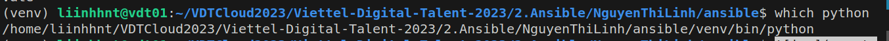
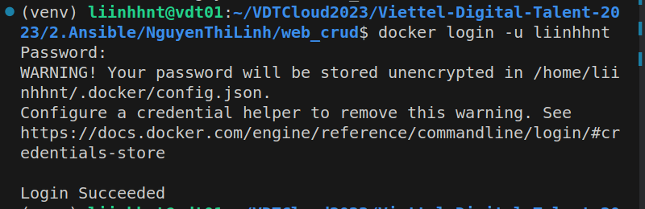
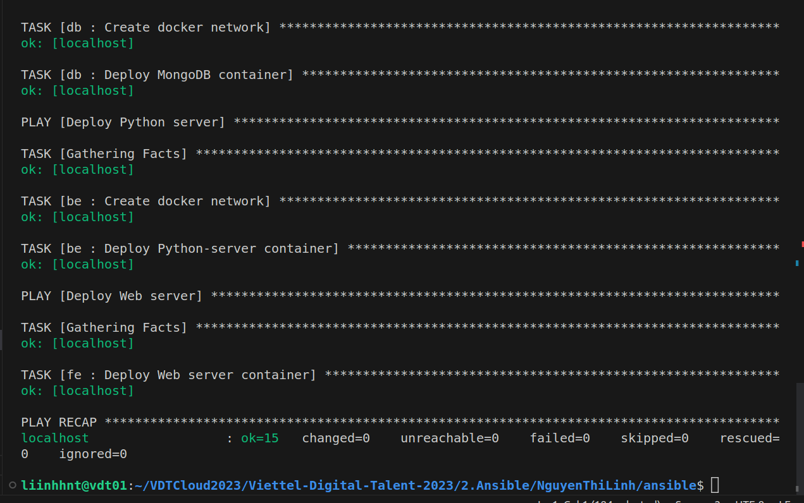
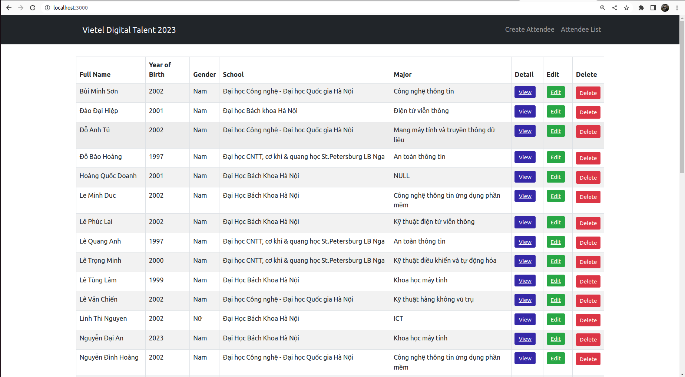

# Practice 2: Ansible <!-- omit in toc -->

Author: **Nguyen Thi Linh**

## Table of Contents <!-- omit in toc -->

- [1. Requirements](#1-requirements)
- [2. Directory layout](#2-directory-layout)
- [3. Setting up ](#3-setting-up-node)
- [4. Setting up Docker](#4-setting-up-docker)
- [5. Deploy application](#5-deploy-application)
- [. References](#6-references)

## 1. Requirements

Deploy the application in the docker-compose homework using ansible:

- Set up docker for the target environments using role "common".
- Split the application into 3 roles: "web", "api" and "db".

## 2. Directory layout
  ```bash
  .
  ├── group_vars
  │   └── all
  │       ├── vars.yml
  │       └── vault.yml
  ├── inventories
  │   └── inventory.yaml
  ├── mongodb
  │   ├── attendees.csv
  │   └── init.sh

  ├── roles
  │   ├── be
  │   │   ├── defaults
  │   │   |   └── main.yaml
  │   │   ├── tasks
  │   │   |   └── main.yaml
  │   ├── common
  │   │   └── tasks
  │   │       └── main.yaml
  │   ├── db
  │   │   ├── defaults
  │   │   |   └── main.yaml
  │   │   ├── tasks
  │   │   |   └── main.yaml
  │   └── fe
  │       ├── defaults
  │       |   └── main.yaml
  │       └── tasks
  │           └── main.yaml
  └── site.yaml

  ```

- **`group_vars`**: This directory contains all the variable files for the playbook. In this case, we have a single group called "all" and two variable files for it: `vars.yml` and `vault.yml`. 
  - `vars.yml`: contains all the common variables for the playbook
  - `vault.yml`: contains the encrypted variables that should not be seen in plain text.

- **`inventories`**: This directory contains all the inventory files for different environments. In this project, we only have one environment which is `inventory.yaml`. This file contains the list of hosts that we want to apply the playbook to.

- **`mongodb`**: This directory contains the script files that we want to run in our playbook. In this case, we have `attendees.csv` and `init.sh`. These files are related to the database setup process in our playbook.

- **`roles`**: This directory contains all the roles of the playbook. Each role includes the default variables in `defaults/main.yaml` and the tasks to be executed in `tasks/main.yaml`. 

  - **`be`**: This role stands for "backend" and contains the files related to the Python backend setup process
  
  - **`common`**: This role contains the common tasks for installing Docker that are required for all roles to be executed successfully
  
  - **`db`**: This role stands for "database" and contains the files related to the MongoDB setup process
  
  - **`fe`**: This role stands for "frontend" and contains the files related to the Web server setup process
  
- **`site.yaml`**: This is the main playbook file that contains all the tasks that we want to execute in our playbook. This file includes the tasks from all the roles and also specifies the order in which the tasks should be executed.

## 3. Setting up node

All target nodes are defined in `inventory.yaml` file:
```yml
---
all:
  hosts:
    localhost:
      ansible_connection: local
      ansible_python_intepreter: /home/liinhhnt/VDTCloud2023/Viettel-Digital-Talent-2023/2.Ansible/NguyenThiLinh/ansible/venv/bin/python
      ansible_become_user: root
      ansible_become_password: "{{ become_password }}"
      hostname: liinhhnt
```

In this project, I have only 1 node, that ís my `localhost`, which means that Ansible will execute commands on my local machine rather than over SSH or some other remote connection.

The specify path to the Python interpreter that Ansible should use when executing commands on the host can get by using cmd `which python`:


To make password securely and can not be seen from the plain text, I use `ansible-vault` to encrypt password and stored it in `group_vars/vault.yml`. Then I can enter vault authentication password using `--ask-vault-pass` option at runtime:

```shell
$ ansible-playbook -i inventory.yml site.yml --ask-vault-pass
Vault password: ...
```

## 4. Setting up Docker

Docker is required for pull image from DockerHub and run Container as well. So I need to install Docker first on target nodes. The role is defined in `roles/common` directory.

I install and set up Docker on Ubuntu by follow [this](https://www.digitalocean.com/community/tutorials/how-to-use-ansible-to-install-and-set-up-docker-on-ubuntu-22-04) tutorial

- The first task is installing aptitude, a tool for interfacing with the Linux package manager, and install the required system packages. Ansible will ensure these packages are always installed on server:
  ```yml
  - name: Install aptitude
    apt:
      name: aptitude
      state: latest
      update_cache: false

  - name: Install required system packages
    apt:
      pkg:
        - apt-transport-https
        - ca-certificates
        - curl
        - gnupg
        - software-properties-common
        - python3-pip
        - virtualenv
        - python3-setuptools
      state: latest
      update_cache: false
   ```

  The packages being installed are:
  - `apt-transport-https`: a package that allows for secure downloads of packages from HTTPS sources
  - `ca-certificates`: a package that contains the trusted certificate authorities needed to validate SSL connections
  - `curl`: a command-line tool for transferring data using various protocols, including HTTP, HTTPS, and FTP
  - `gnupg`: a package that provides encryption and digital signature capabilities for secure communication
  - `software-properties-common`: a package that provides a common set of tools and utilities for managing software repositories
  - `python3-pip`: a package that installs the pip package manager for Python 3
  - `virtualenv`: a package that creates isolated Python environments for different projects
  - `python3-setuptools`: a package that provides utilities for building and distributing Python packages

- The second step is installing the latest version of Docker from the official repository. The Docker GPG key is added to verify the download, the official repository is added as a new package source, and Docker will be installed. Additionally, the Docker module for Python will be installed as well:
  ```yml
  - name: Add Docker GPG apt Key
    apt_key:
      url: https://download.docker.com/linux/ubuntu/gpg
      state: present

  - name: Add Docker Repository
    apt_repository:
      repo: deb https://download.docker.com/linux/ubuntu jammy stable
      state: present

  - name: Update apt and install docker-ce
    apt:
      name: docker-ce
      state: latest
      update_cache: true

  - name: Install Docker Module for Python
    pip:
      name: docker   
  ```
  
## 5. Deploy application

### Build Frontend and Backend Images and push to DockerHub
1. Move to [front-end](./web_crud/front-end/) directory and build docker image:
  ```bash
    docker build -t vdt-frontend .
   ```
2. Move to [python](./web_crud/python/) directory and build docker image:
  ```bash
    docker build -t vdt-backend .
   ```
3. Login to the Docker Hub using the command `docker login -u liinhhnt` and type password:
  

4. Use the `docker tag` command to give the images a new name. 
  ```bash
    docker tag nginx_server liinhhnt/vdt-frontend
    docker tag python_server liinhhnt/vdt-backend
   ```
   Here, I did not add tag to the image name, Docker will use tag `latest` automatically
   
5. Push image to DockerHub
  ```bash
    docker push liinhhnt/vdt-frontend:latest
    docker push liinhhnt/vdt-backend:latest
   ```
### Deploy application

The playbook `site.yaml`is used to set up a complete web application stack consisting of Docker, MongoDB, a Python server, and a web server (using NGINX)
```yml
---
- name: Install docker
  hosts: all
  become: true
  gather_facts: true
  roles:
    - common

- name: Deploy MongoDB container
  hosts: all
  become: true
  gather_facts: true
  roles:
    - db

- name: Deploy Python server
  hosts: all
  become: true
  gather_facts: true
  roles:
    - be

- name: Deploy Web server
  hosts: all
  become: true
  gather_facts: true
  roles:
    - fe
```
- Each task will be executed in turn from top to bottom.

1. The first task named "Install docker" is responsible for installing Docker on all hosts specified in the inventory file. 
  
  - It utilizes a role called "common" to perform the installation. 
  - The `become: true` parameter is used to escalate the user's privileges to superuser (root) so that the installation can be performed. 
  - The `gather_facts: true` parameter is used to gather system facts before executing the role.

2. The second task is "Deploy MongoDB container". 
  
  It utilizes a role called `db` to perform the deployment. The role `db` can be found in `roles/db`. In this role, we specify `main.yaml` including tasks to deploy Mongo:
  
  ```yml
  - name: Create docker network
    docker_network:
      name: "{{ NETWORK_NAME }}"  

  - name: Deploy MongoDB container
    docker_container:
      name: mongo_db
      image: mongo:5.0
      restart_policy: unless-stopped
      volumes:
        - ./mongodb:/docker-entrypoint-initdb.d
      ports:
        - "27017:27017"
      networks:
        - name: "{{ NETWORK_NAME }}"
  ```
    
  - First, we use `docker_network` Ansible module to create network for MongoDB and Python server
   
  - Then, we run MongoDB container by `docker_container` module:
    - `name`: specifies the name of the container
    - `image`: specifies the Docker image to use (in this case, `mongo:5.0`)
    - `restart_policy`: specifies the restart policy for the container (in this case, `unless-stopped`)
    - `volumes`: mounts the `mongodb` directory on the host to the `/docker-entrypoint-initdb.d` directory in the container to initialize database
    - `ports`: maps port `27017` in the container to port `27017` on the host
    - `networks`: connects the container to the previously created Docker network using the `NETWORK_NAME` variable.

3. The third task named "Deploy Python server"
  
  It utilizes a role called `be` to perform the deployment. The role `be` can be found in `roles/be`. 
  
  First, we defined the variable in `roles/be/defaults/main.yaml'
  ```yml
  NETWORK_FE_BE: fe-be
  NETWORK_BE_DB: be-db
  IMAGE_NAME: liinhhnt/vdt-backend:latest
  ```
  
  Next, we specify `roles/be/task/main.yaml` including tasks to deploy Python server:
  ```yml
  - name: Create docker network
    docker_network:
      name: "{{ NETWORK_FE_BE }}"  

  - name: Deploy Python-server container
    docker_container:
      name: python_server
      image: "{{IMAGE_NAME}}"
      networks:
        - name: "{{ NETWORK_FE_BE }}"
        - name: "{{ NETWORK_BE_DB }}"
  ```
    
  - In this project, Python is backend, and it must in the same networks with front-end and database. So, we defined two networks "NETWORK_FE_BE" and "NETWORK_BE_DB". Because we created "be-db" in task of MongoDB, so we just need to create one more rest here.
  - The image base is `liinhhnt/vdt-backend:latest`, which I created and pushed to DockerHub
    
 4. The final task is "Deploy Web server" based on roles `fe`. This role includes tasks specified in `roles/fe/tasks/main.yaml':
 
  ```yml
  - name: Deploy Web server container
    docker_container:
      name: nginx_server
      image: "{{IMAGE_NAME}}"
      ports:
        - "3000:80"
      networks:
        - name: "{{ NETWORK_NAME }}"
   ```
     
  This play book specifies tasks similarly with tasks to deploy Python server 

### Result
  Finally, we can install Docker and deploy our Web application with just one command:
  
  ```bash
  ansible-playbook -i inventories/inventory.yaml site.yaml --ask-vault-password
  ```
  
  
  
  Type vault password, then open web at address **http://localhost:3000/** and perform funnctions *LIST/ GET/ CREATE/ UPDATE/ DELETE ATTENDEE*
  
  

## 6. References

[1] [Ansible directory layout](https://docs.ansible.com/ansible/2.8/user_guide/playbooks_best_practices.html#directory-layout)

[2] [Keep vaulted variables safely visible](https://docs.ansible.com/ansible/latest/tips_tricks/ansible_tips_tricks.html#keep-vaulted-variables-safely-visible)

[3] [Automate your Docker deployments with Ansible](https://youtu.be/CQk9AOPh5pw)

[4] [Install Docker Engine on Ubuntu](https://docs.docker.com/engine/install/ubuntu/)

[5] [How to Use Ansible to Install and Set Up Docker on Ubuntu 22.04](https://www.digitalocean.com/community/tutorials/how-to-use-ansible-to-install-and-set-up-docker-on-ubuntu-22-04)

[6] [Repo of `hoangndst`](https://github.com/hoangndst/Viettel-Digital-Talent-2023/tree/practice2/2.%20Ansible)

[7] [Share the application](https://docs.docker.com/get-started/04_sharing_app/)
