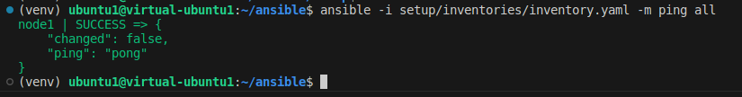
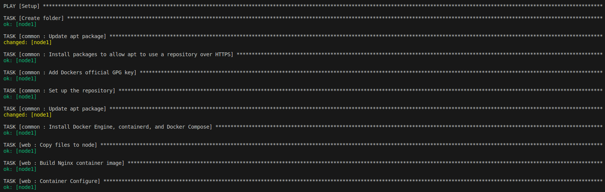
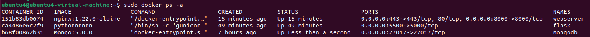

For this practice, I could have done it the easy way by copying all the needed file and folders from hostnode and then tell the managed node to execute the dockercompose.yaml file. Instead, I will use some docker module to make image and create container in order to level up my Ansible skill

# 1.Setting up Inventory:
```
all:
  hosts:
    node1:
      ansible_host: 192.168.40.134
      ansible_python_interpreter: /usr/bin/python3
      ansible_user: ubuntu4
      ansible_password: 1
      ansible_sudo_pass: 1
```

* Then, I will use the command below to try to connect to host
``` ansible -i inventories/inventory.yaml -m ping all ```

* Result:



# 2. Writing and excecute Playbook
* I use 4 role in the playbook:
    * common: to install and setup Docker
    * web, api, db: for the web application
* The playbook is placed in "setup" folder and is named "setup.yaml"
* To execute the playbook:
``` ansible-playbook -i setup/inventories/inventory.yaml setup/setup.yaml ```
* Result:


# 3. Results:





