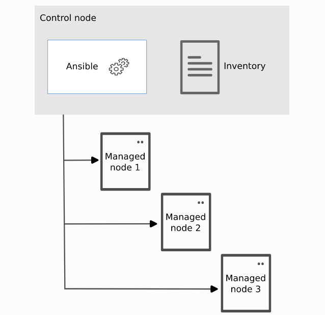
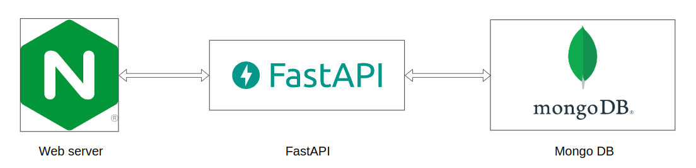
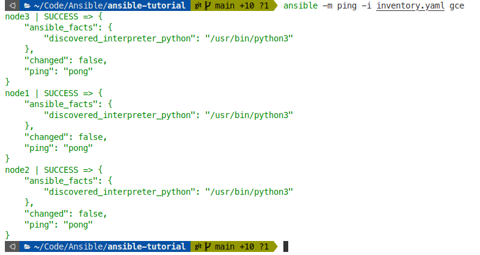

# Ansible-homework

[Table of Contents](./README.md)

[1. Introduction to Ansible](#1-introduction-to-ansible)
  - [1.1. Overview](#11-overview)
  - [1.2. Ansible Inventory](#12-ansible-inventory)
  - [1.3. Ansible Playbook](#13-ansible-playbook)
  - [1.4. Ansible Roles](#14-ansible-roles)
  - [1.5. Other Ansible Features](#15-other-ansible-features)

[2. Using Ansible to deploy a simple web application](#2-using-ansible-to-deploy-a-simple-web-application)
  - [2.1. Ansible Inventory](#21-ansible-inventory)
  - [2.2. Ansible Roles](#22-ansible-roles)
  - [2.3. Ansible Playbook](#23-ansible-playbook)
  - [2.4. Results](#24-results)

[3. References](#3-references)


---

# 1. Introduction to Ansible

## 1.1. Overview
Ansible is an open-source automation tool that helps IT professionals to automate tasks such as configuration management, application deployment, and cloud provisioning. It is a simple, powerful, and agentless tool that can be used to automate IT infrastructure across a wide range of platforms. Ansible is easy to learn and use, and it can be scaled to automate large IT environments.

Here are some of the key features of Ansible:

- **Simplicity:** Ansible is a simple tool that is easy to learn and use. It uses human-readable `playbooks` to describe automation tasks, and it does not require any agents to be installed on managed hosts.
- **Power:** Ansible is a powerful tool that can be used to automate a wide range of IT tasks. It can be used to configure systems, deploy software, and orchestrate complex workflows.
- **Agentless:** Ansible is an agentless tool, which means that it does not require any agents to be installed on managed hosts. This makes it easy to deploy and manage Ansible, and it also reduces the security risk associated with installing agents on hosts.
- **Scalability:** Ansible can be scaled to automate large IT environments. It can be used to manage thousands of hosts, and it can be used to automate complex workflows that involve multiple systems.

Ansible automates the management of remote systems and controls their desired state. A basic Ansible environment has three main components:

- Control node: 
  
  A system on which Ansible is installed. You run Ansible commands such as `ansible` or `ansible-inventory` on a control node.

- Managed node: 
  
  A remote system, or host, that Ansible controls.

- Inventory: 

  A list of managed nodes that are logically organized. You create an inventory on the control node to describe host deployments to Ansible.



To install Ansible, simply run the following command:
```bash
pip install ansible
```
note that your computer must have Python installed (prefer Python 3.6+).

## 1.2. Ansible Inventory
Ansible automates tasks on managed nodes or “hosts” in your infrastructure, using a list or group of lists known as `inventory`. You can pass host names at the command line, but most Ansible users create inventory files. Your inventory defines the managed nodes you automate, with groups so you can run automation tasks on multiple hosts at the same time.

A simple inventory file looks like this:
```yaml
gce:
  hosts:
    node1:
      ansible_host: 35.192.115.120
    node2:
      ansible_host: 35.184.206.60
    node3:
      ansible_host: 34.68.5.38
```
or like this:
```ini
mail.example.com

[webservers]
foo.example.com
bar.example.com

[dbservers]
one.example.com
two.example.com
three.example.com
```
For more details, please refer to [Ansible Inventory](https://docs.ansible.com/ansible/latest/user_guide/intro_inventory.html).

## 1.3. Ansible Playbook
An Ansible playbook is a text file that contains a list of tasks that Ansible can execute on a remote host. Playbooks are written in YAML, a human-readable data serialization language.

Each task in a playbook defines a specific action that Ansible should take, such as installing a package, creating a user, or starting a service. Playbooks can also contain conditional logic and loops, which allow you to automate complex tasks.

To run an Ansible playbook, you need to use the `ansible-playbook` command. The `ansible-playbook` command takes the name of the playbook as its argument. For example, to run the playbook playbook.yml, you would use the following command:
```bash
ansible-playbook playbook.yml
```
Ansible will then connect to the remote host and execute the tasks in the playbook. Here is an example of an Ansible playbook:

```yaml
---
- hosts: all
  tasks:
  - name: Install Apache
    apt:
      name: apache2
      state: present
  - name: Start Apache
    service:
      name: apache2
      state: started
      enabled: yes
```
This playbook will install the Apache web server on all hosts that are targeted by the playbook. It will also start the Apache service and enable it to start automatically at boot.

For more details, please refer to [Ansible Playbook](https://docs.ansible.com/ansible/latest/user_guide/playbooks.html).


## 1.4. Ansible Roles
Ansible role is a collection of Ansible modules, tasks, and other files that can be used to perform a specific task or set of tasks. Roles are a way to organize and reuse Ansible code, and they make it easier to write complex playbooks.

An Ansible role has a defined directory structure with eight main standard directories. You must include at least one of these directories in each role. You can omit any directories the role does not use. For example:

```bash
roles/
    common/               # this hierarchy represents a "role"
        tasks/            #
            main.yml      #  <-- tasks file can include smaller files if warranted
        handlers/         #
            main.yml      #  <-- handlers file
        templates/        #  <-- files for use with the template resource
            ntp.conf.j2   #  <------- templates end in .j2
        files/            #
            bar.txt       #  <-- files for use with the copy resource
            foo.sh        #  <-- script files for use with the script resource
        vars/             #
            main.yml      #  <-- variables associated with this role
        defaults/         #
            main.yml      #  <-- default lower priority variables for this role
        meta/             #
            main.yml      #  <-- role dependencies
        library/          # roles can also include custom modules
        module_utils/     # roles can also include custom module_utils
        lookup_plugins/   # or other types of plugins, like lookup in this case
```
In addition, you can quickly create `roles` with `ansible-galaxy` command:
```bash
ansible-galaxy init <role_name>
```
and the directory structure will be created automatically, this looks like:
```bash
roles
  └── webserver
      ├── defaults
      │   └── main.yml
      ├── files
      │   └── index.html
      ├── handlers
      │   └── main.yml
      ├── meta
      │   └── main.yml
      ├── README.md
      ├── tasks
      │   └── main.yml
      ├── templates
      │   └── nginx.conf.j2
      ├── tests
      │   ├── inventory
      │   └── test.yml
      └── vars
          └── main.yml
```
You can also use ansible-galaxy to share your roles with others.
For more details, please refer to [Ansible Roles](https://docs.ansible.com/ansible/latest/user_guide/playbooks_reuse_roles.html), [Ansible Galaxy](https://galaxy.ansible.com/).

## 1.5. Other Ansible Features
In addition to the above features, Ansible also has many other features such as:
- Ansible Vault: Ansible Vault is a feature of Ansible that allows you to keep sensitive data such as passwords or keys in encrypted files, rather than as plaintext in playbooks or roles.
- Ansible Tower: Ansible Tower is a web-based user interface for Ansible. It allows you to manage Ansible playbooks, inventories, and schedule jobs to run playbooks.
- Ansible Collections: Ansible Collections are a way to package and distribute Ansible content. They can contain playbooks, roles, modules, plugins, and other types of content.

For more details, please refer to [Ansible User Guide](https://docs.ansible.com/ansible/latest/user_guide/index.html).


# 2. Using Ansible to deploy a simple web application

***Note**: The source code in [roles](./roles/) directory is just runing on local (because that time I don't have any cloud account to deploy). However, I got google cloud account after that, so the [multi-nodes](./multi-nodes/) directory is the real deployment on the multiple nodes.*

Deploy a simple web application with the following architecture:


The structure of [multi-nodes](./multi-nodes/) directory is as follows:
```bash
.
├── inventory.yaml
├── playbook.yaml
└── roles
    ├── api
    │   └── tasks
    │       └── main.yml
    ├── common
    │   └── tasks
    │       └── main.yml
    ├── db
    │   └── tasks
    │       └── main.yml
    ├── deployment
    │   ├── files
    │   │   └── deployments
    │   │       ├── app
    │   │       │   ├── Dockerfile
    │   │       │   ├── main.py
    │   │       │   └── templates
    │   │       │       └── attendees.html
    │   │       ├── attendees.json
    │   │       ├── db
    │   │       │   └── mongo-init.js
    │   │       ├── docker-compose.yaml
    │   │       └── nginx
    │   │           ├── index.html
    │   │           └── nginx.conf
    │   └── tasks
    │       └── main.yml
    └── web
        └── tasks
            └── main.yml
```

## 2.1. Ansible Inventory
3 virtual machines are created on Google Cloud Platform (GCP) with the following public IP addresses:
- Node 1: 34.133.150.131
- Node 2: 35.184.206.60
- Node 3: 34.68.5.38

The [inventory](./multi-nodes/inventory.yaml) file is as follows:
```yaml
gce:
  hosts:
    node1:
      ansible_host: 34.133.150.131
    node2:
      ansible_host: 35.184.206.60
    node3:
      ansible_host: 34.68.5.38
  vars:
    ansible_user: lamle
    update_cache: no
```

Check the connection to all nodes:
```bash
cd ./multi-nodes
ansible -i inventory.yaml gce -m ping
```

here is the result:




## 2.2. Ansible Roles

### 2.2.1. Common Role
The [common](./multi-nodes/roles/common) role is used to install Docker on all nodes. The [main.yaml](./multi-nodes/roles/common/tasks/main.yaml) file is as follows:
```yaml
---
- name: Install packages to allow apt to use a repository over HTTPS
  ansible.builtin.package:
    name:
    - ca-certificates
    - curl
    - gnupg
    state: present
    update_cache: yes

- name: Add Docker GPG apt Key
  apt_key:
    url: https://download.docker.com/linux/ubuntu/gpg
    state: present

- name: Add Docker Repository
  apt_repository:
    repo: deb https://download.docker.com/linux/ubuntu jammy stable
    state: present

- name: Update apt and install docker-ce
  ansible.builtin.apt:
    pkg: 
    - docker-ce
    - docker-ce-cli
    - containerd.io
    - docker-buildx-plugin
    - docker-compose-plugin
    state: latest
    update_cache: true

- name: Create docker group
  group:
    name: docker

- name: Add user to the docker group
  user:
    name: "{{ ansible_user }}"
    group: docker
```

### 2.2.2 Web Role
The [web](./multi-nodes/roles/web) role is used to install Nginx by using docker image. The [main.yaml](./multi-nodes/roles/web/tasks/main.yml) file is as follows:
```yaml
- name: Pull Nginx image
  docker_image:
    name: nginx:1.22.0-alpine
    source: pull
    state: present
```

### 2.2.3 API Role
The [api](./multi-nodes/roles/api) role is used to install Python environment for API backend. The [main.yaml](./multi-nodes/roles/api/tasks/main.yml) file is as follows:
```yaml
- name: Pull Python image
  docker_image:
    name: python:3.9-alpine
    source: pull
    state: present
```

### 2.2.4 DB Role
The [db](./multi-nodes/roles/db) role is used to install MongoDB. The [main.yaml](./multi-nodes/roles/db/tasks/main.yml) file is as follows:
```yaml
- name: Pull Mongo image
  docker_image:
    name: mongo:5.0-focal
    source: pull
    state: present
```


### 2.2.5 Deployment Role
The [deployment](./multi-nodes/roles/deployment) role is used to deploy the application. The [main.yaml](./multi-nodes/roles/deployment/tasks/main.yml) file is as follows:
```yaml
---
# tasks file for deployment
- name: Copy deployment folder to remote hosts
  ansible.builtin.copy:
    src: "{{ deployment_folder }}"
    dest: /etc/

- name: Get a list of all running containers
  docker_host_info:
    containers: True
  register: docker_info

- name: Stop all running containers
  docker_container:
    name: '{{ item.Names[0] | regex_replace("^/", "") }}'
    state: stopped
  loop: '{{ docker_info.containers }}'

- name: Docker compose up
  ansible.builtin.shell: cd /etc/deployments/ && docker compose up -d
```


## 2.3. Ansible Playbook

The [Ansible Playbook](./multi-nodes/playbook.yaml) is as follows:
```yaml
- name: Ansible roles
  hosts: gce
  become: true
  roles:
    - common
    - web
    - db
    - api
    - deployment
```

## 2.4. Results
- Run successfully the Ansible Playbook with all roles:
  ```bash
  cd ./multi-nodes
  ansible-playbook -i inventory.yaml playbook.yaml
  ```

  

- Host the web application on the public IP address
  - Node 1: 34.133.150.131
  - Node 2: 35.184.206.60
  - Node 3: 34.68.5.38
  
  Note that the ip addresses are temporary and will be changed after the virtual machines are restarted.

  

# 3. References

[1] Ansilbe Documentation: https://docs.ansible.com/ansible/latest/index.html

[2] Ansible Galaxy: https://galaxy.ansible.com/

[3] Google cloud firewall: https://cloud.google.com/filestore/docs/configuring-firewall

[4] Nginx configuration files: https://docs.nginx.com/nginx/admin-guide/basic-functionality/managing-configuration-files/

[5] FastAPI: https://fastapi.tiangolo.com/