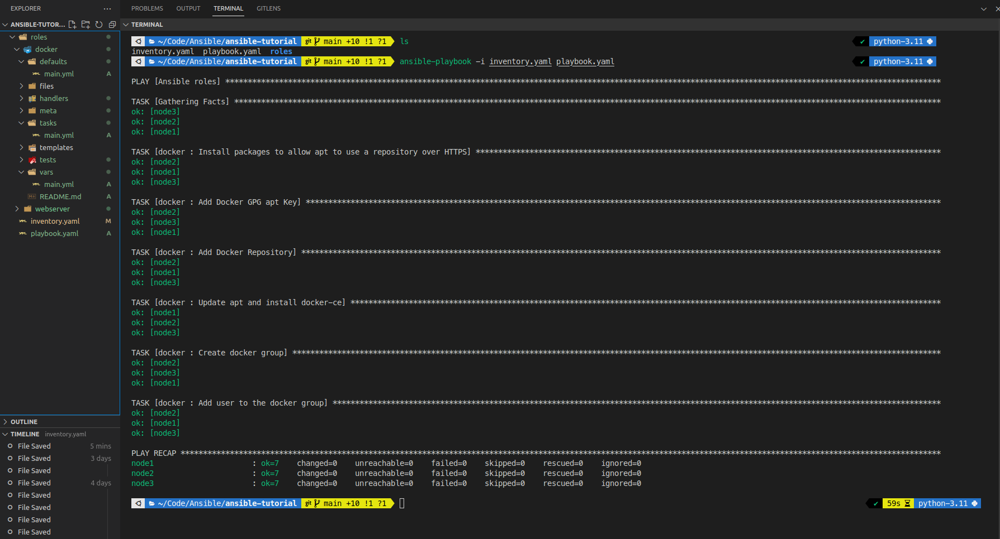
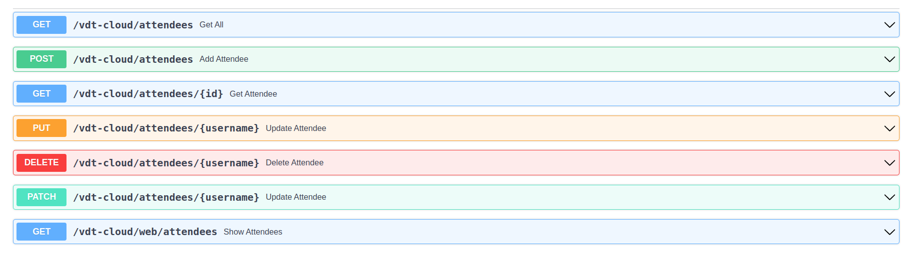
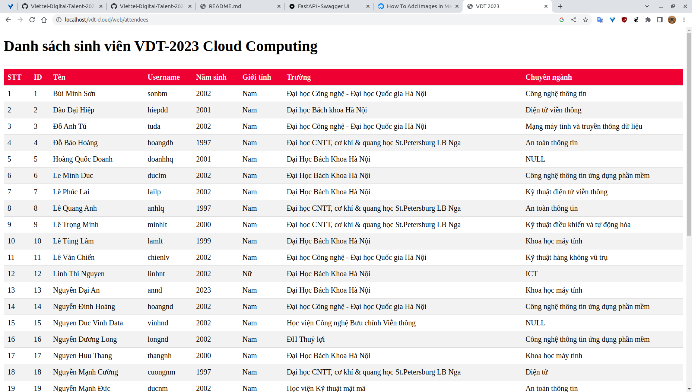

# Ansible-homework
Using Ansible to configure 4 roles: 
- common (install Docker)
- web
- api
- db

The directory structure is as follows:
```code
.
├── api
│   └── tasks
│       └── main.yaml
├── common
│   ├── tasks
│   │   └── main.yaml
│   └── vars
│       └── main.yaml
├── db
│   ├── tasks
│   │   └── main.yaml
│   └── templates
│       └── mongo-init.js
├── deployment
│   └── tasks
│       └── main.yaml
└── web
    ├── tasks
    │   └── main.yaml
    └── templates
        └── nginx.conf
```
- Role deployment is used to deploy the application. It will copy the docker-compose.yml file to the server and run it.

- Role [common](./roles/common/) is used to install Docker on the server. Here is the [main.yaml](./roles/common/tasks/main.yaml) file:
```yaml
- name: Update the apt package index
  ansible.builtin.package:
    update_cache: "{{ update_cache }}"

- name: Install packages to allow apt to use a repository over HTTPS
  ansible.builtin.package:
    name: "{{ item }}"
    state: present
  loop:
    - ca-certificates
    - curl
    - gnupg

- name: Add Docker GPG apt Key
  apt_key:
    url: https://download.docker.com/linux/ubuntu/gpg
    state: present

- name: Add Docker Repository
  apt_repository:
    repo: deb https://download.docker.com/linux/ubuntu jammy stable
    state: present

- name: Update apt and install docker-ce
  apt:
    name: docker-ce
    state: latest
    update_cache: true
```
Common role installs Docker.


The other roles(web, api, db) just pull image from Docker Hub. The deployment role will copy the docker-compose.yml file to the server and run it.

Here is the result:

