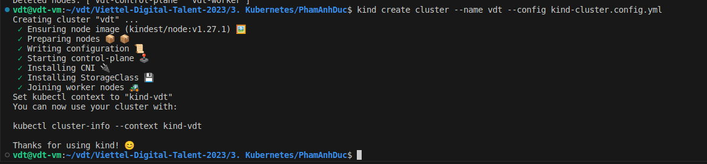
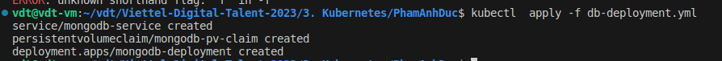
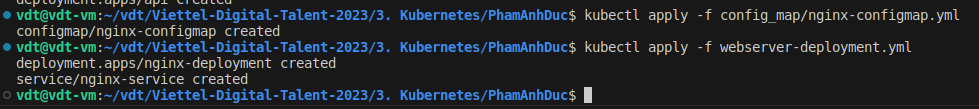
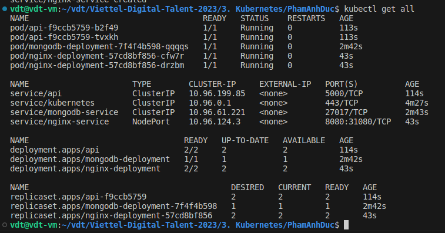

1. Create cluster with ports mapping to host machine
```sh
kind create cluster --name vdt --config kind-cluster.config.yml
```

2. Apply MongoDB deployment

```sh
kubectl apply -f db-deployment.yml 
```

3. Apply API server deployment

```sh
kubectl apply -f api-deployment.yml 
```

4. Apply Nginx WebServer Deployment

```sh
kubectl apply -f config_map/nginx-configmap.yml
kubectl apply -f webserver-deployment.yml
```



5. Truy cập front-end với đường dẫn `http://localhost:80` 

