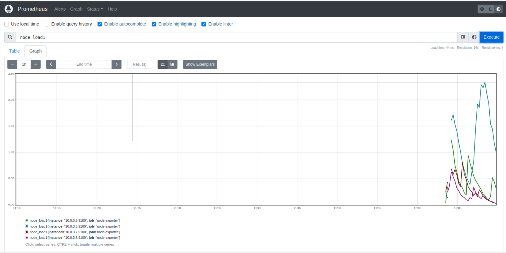

# Bài tập lớn giữa kỳ chương trình VDT 2023 lĩnh vực Cloud

## Phát triển một 3-tier web application đơn giản 
Yêu cầu:
1. Viết một CRUD web application đơn giản thực hiện các chức năng:
- Liệt kê danh sách sinh viên tham gia khóa đào tạo chương trình VDT 2023 lĩnh
vực cloud dưới dạng bảng 
- Cho phép xem chi tiết/thêm/xóa/cập nhật thông tin sinh viên
2. Thiết kế hệ thống với ba dịch vụ: 
- web: Giao diện web viết bằng HTML + CSS + Javascript được triển khai trên nền
web server nginx
- api: RESTful API viết bằng ngôn ngữ lập trình tùy chọn (prefer Python), có đầy
đủ các chức năng: list, get, create, update, delete các bản ghi thông tin sinh viên
- db: Database SQL hoặc NoSQL lưu trữ thông tin sinh viên
3. Viết unit tests cho các chức năng APIs 

Output:
[Source code](https://github.com/LeQA/Viettel-Digital-Talent-2023/tree/mid-term/3.%20Mid-term/Lequanganh)

## Triển khai web application sử dụng các DevOps tools & practices
### 1. Containerization 
#### Yêu cầu:
- Viết Dockerfile để đóng gói các dịch vụ trên thành các container image 
- Yêu cầu image đảm bảo tối ưu thời gian build và kích thước chiếm dụng, khuyến khích
sử dụng các thủ thuật build image đã được giới thiệu (layer-caching, optimized RUN
instructions, multi-stage build, etc.)
#### Output:
- [File Dockerfile cho từng dịch vụ](https://github.com/LeQA/Viettel-Digital-Talent-2023/tree/mid-term/3.%20Mid-term/Lequanganh)
- Output câu lệnh build và thông tin docker history của từng image
Docker history của image load balancer:

<div align="center">
  
</div>

<div align="center">
  <i>Pic. 1 - Web image docker history</i>
</div>

Docker history của image api:


<div align="center">
  
</div>

<div align="center">
  <i>Pic. 2 - webapp image docker history</i>
</div>

Docker history cuar image nginx:

<div align="center">
  
</div>

<div align="center">
  <i>Pic. 3 - Nginx image docker history</i>
</div>

### 2. Continuous Integration
#### Yêu cầu:
- Tự động chạy unit test khi tạo PR vào branch main 
- Tự động chạy unit test khi push commit lên một branch 
#### Output:
- [File setup công cụ CI](https://github.com/LeQA/Viettel-Digital-Talent-2023/blob/mid-term/.github/workflows/api_test.yml)
- Output log của luồng CI
  
<div align="center">
  
</div>

<div align="center">
  <i>Pic. 4 - CI workflow</i>
</div>

- Các hình ảnh demo khác
<div align="center">
  
</div>

<div align="center">
  <i>Pic. 5 - CI log</i>
</div>

### 3. Continuous Delivery
#### Yêu cầu:
- Viết luồng release dịch vụ bằng công cụ CI/CD của GitHub/GitLab, thực hiện build
docker image và push docker image lên Docker Hub khi có event một tag mới được
developer tạo ra trên GitHub
- Viết ansible playbook thực hiện các nhiệm vụ:
  -  Setup môi trường: Cài đặt docker trên các node triển khai dịch vụ 
  -  Deploy các dịch vụ theo version sử dụng docker
  -  Triển khai các dịch vụ trên nhiều hosts khác nhau
- Đảm bảo tính HA cho các dịch vụ web và api:
- Mỗi dịch vụ web và api được triển khai trên ít nhất 02 container khác nhau 
- Requests đến các endpoint web và api được cân bằng tải thông qua các công
cụ load balancer, ví dụ: nginx, haproxy và traefik
#### Output:
- Ảnh minh họa kiến trúc triển khai và bản mô tả
<div align="center">
  
</div>

<div align="center">
  <i>Pic. 6 - Cấu trúc hệ thống</i>
</div>
Người dùng sẽ sử dụng webapp qua địa chỉ 10.0.3.5, ở đấy có load balance cho 2 instant của webapp tại 10.0.3.6 và 10.0.3.7. Trên mỗi máy chủ trên, chúng ra chạy 2 container riêng biệt cho nginx (port 80) và flask (port 5000). Các instant của webapp liên kết với mongodb tại 10.0.3.8:27017. Để đảm bảo tính HA, ngix và flask ở 10.0.3.6 và 10.0.3.7 đều liên kết với nhau để đảm bảo khi flask hoặc nginx tại 1 trong hai ip gặp sự cố thì người dùng truy cập tại 10.0.3.5 không bị ảnh hưởng.
<div align="center">
  
</div>

<div align="center">
  <i>Pic. 7 - Workflow </i>
</div>

- Thư mục chứa ansible playbook dùng để triển khai dịch vụ, trong thư mục này cần có
  - [File inventory chứa danh sách các hosts triển khai](https://github.com/LeQA/Viettel-Digital-Talent-2023/tree/mid-term/3.%20Mid-term/Lequanganh/ansible/inventories)
  - [Các file playbook](https://github.com/LeQA/Viettel-Digital-Talent-2023/tree/mid-term/3.%20Mid-term/Lequanganh/ansible/playbooks)
  - [Thư mục roles chứa các role](https://github.com/LeQA/Viettel-Digital-Talent-2023/tree/mid-term/3.%20Mid-term/Lequanganh/ansible/roles):
    - common: Setup môi trường trước deploy
    - web: Triển khai dịch vụ web
    - api: Triển khai dịch vụ api
    - db: Triển khai dịch vụ db
    - lb: Triển khai dịch vụ load balancing
- [File setup CD](https://github.com/LeQA/Viettel-Digital-Talent-2023/blob/mid-term/.github/workflows/docker.yml)
- Output của luồng build và push Docker Image lên Docker Hub
<div align="center">
  
</div>

<div align="center">
  <i>Pic. 8 - CD workflow</i>
</div>
<div align="center">
  
</div>

<div align="center">
  <i>Pic. 9 - CD log</i>
</div>

- Hướng dẫn sử dụng ansible playbook để triển khai các thành phần hệ thống
- Output log triển khai hệ thống
```
ansible-playbook -i inventories/inventory.yaml playbooks/playbook.yaml 

```
<div align="center">
  
</div>

<div align="center">
  <i>Pic. 10 - ansible log</i>
</div>

### 4. Monitoring (1đ)
#### Yêu cầu:
- Viết ansible playbook roles monitor thực hiện các nhiệm vụ:
  - Cài đặt các dịch vụ node exporter và cadvisor dưới dạng container
  - Đẩy thông số giám sát lên hệ thống giám sát Prometheus tập trung

#### Output:
- [Role monitor chứa các playbook và cấu hình giám sát cho hệ thống](https://github.com/LeQA/Viettel-Digital-Talent-2023/blob/mid-term/3.%20Mid-term/Lequanganh/ansible/roles/monitor/tasks/main.yml)
- Ảnh chụp dashboard giám sát nodes & containers
<div align="center">
  
</div>

<div align="center">
  <i>Pic. 11 - Node-exporter's metric </i>
</div>

<div align="center">
  
</div>

<div align="center">
  <i>Pic. 12 - Cadadvisor's metric  </i>
</div>

### 5. Logging 
#### Yêu cầu:
- Viết ansible playbook thực hiện các nhiệm vụ:
  - Cài đặt dịch vụ logstash hoặc fluentd để collect log từ các dịch vụ web, api và db
  - Đẩy log dịch vụ lên hệ thống Elasticsearch tập trung 171.236.38.100:9200
  - Log phải đảm bảo có ít nhất các thông tin: IP truy cập, thời gian, action tác động,kết quả (thành công/không thành công/status code)
#### Output:
- [Ansible playbook triển khai các dịch vụ collect log (tách module logging)](https://github.com/LeQA/Viettel-Digital-Talent-2023/blob/mid-term/3.%20Mid-term/Lequanganh/ansible/roles/logging/tasks/main.yml)

<div align="center">
  
</div>

<div align="center">
  <i>Pic. 13 - fluentd log </i>
</div>

<div align="center">
  
</div>

<div align="center">
  <i>Pic. 14 - logging container </i>
</div>

