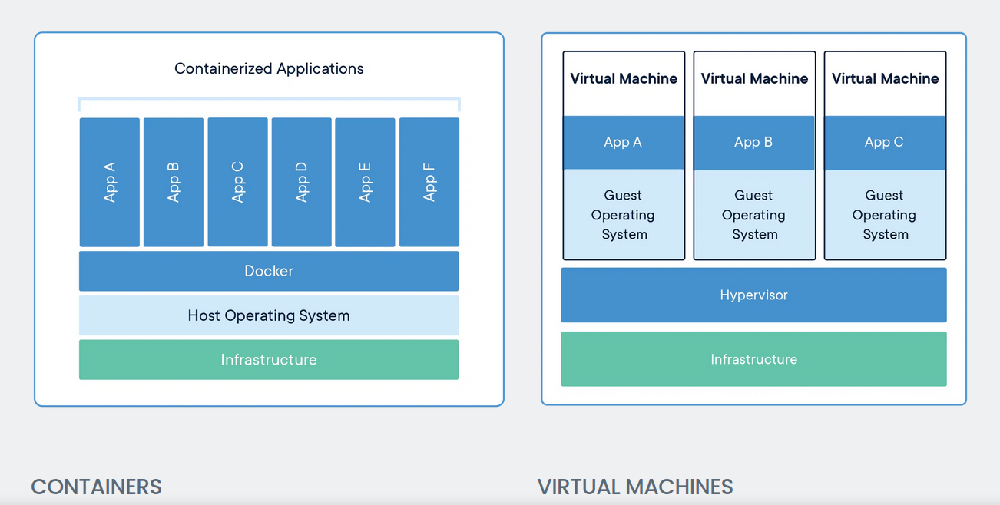
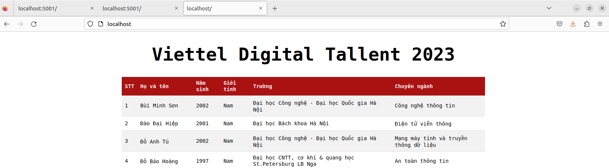

Containerization
---
- [I. Theory ](#i-theory-)
  - [1. Containerization ](#1-containerization-)
    - [a. What is Containerization?](#a-what-is-containerization)
    - [b. How does Containerization Work? ](#b-how-does-containerization-work-)
    - [c. Benefits of Containerization ](#c-benefits-of-containerization-)
    - [d. Containerization compare to Virtualization ](#d-containerization-compare-to-virtualization-)
    - [e. Linux utilization in containerization ](#e-linux-utilization-in-containerization-)
  - [2. Docker ](#2-docker-)
    - [a. What is Docker ? ](#a-what-is-docker--)
    - [b. Docker architecture ](#b-docker-architecture-)
    - [c. Dockerfile ](#c-dockerfile-)
    - [d. Docker compose ](#d-docker-compose-)
    - [e. Docker optimization](#e-docker-optimization)
- [II. Practice ](#ii-practice-)
  - [1. Requirements ](#1-requirements-)
  - [2. Implementation ](#2-implementation-)
    - [References ](#references-)
---
# I. Theory <a name='theory'></a>

## 1. Containerization <a name='containerization'></a>

### a. What is Containerization?   
<a name='what-is-containerization'></a>

Containerization is a method of packaging software applications with all the dependencies and configurations needed to run them consistently across different computing environments. In containerization, a single application is packaged into a self-contained, isolated unit known as a container, which includes all the necessary components such as libraries, runtime, and system tools.

Containers allow developers to develop, test, and deploy applications faster and more reliably, as they can be easily moved between different computing environments, such as development, testing, and production environments, without requiring any modifications. Containers also provide an efficient way to utilize computing resources, as multiple containers can run on a single machine without interfering with each other.

### b. How does Containerization Work? <a name='how-containerziration-work'></a>

Containerization is based on a technology called container engines, such as Docker and Kubernetes. These engines use a layered file system, which allows for the creation of lightweight, portable containers that can be easily shared and deployed across different computing environments.

In containerization, the application and its dependencies are packaged into an image, which is a read-only template that contains all the necessary files and configurations. An image can be thought of as a snapshot of an application at a particular point in time.Multiple containers can be created from the same image, allowing for the same application to run multiple times on the same machine or across different machines.

### c. Benefits of Containerization <a name='benefits'></a>

Containerization provides several benefits for developers and operations teams, including:

- Portability: Containers can be easily moved between different computing environments without requiring any modifications, making them highly portable.
- Consistency: Containers ensure that applications run consistently across different environments, reducing the risk of compatibility issues.
- Efficiency: Containers allow for efficient use of computing resources, as multiple containers can run on a single machine without interfering with each other.
- Scalability: Containers can be easily scaled up or down based on demand, allowing for more efficient resource utilization.
- Security: Containers provide a higher level of security by isolating applications and their dependencies from the underlying system.
### d. Containerization compare to Virtualization <a name='containerization-v-virtualization'></a>
<p align = "center">
 
<br>Picture 1. Virtualization vs Containerization
</p>

| Comparison | Containerization | Virtualization |
| --- | --- | --- |
| Resource Utilization | Shares host OS kernel and resources, allowing for efficient use of resources | Each virtual machine has its own OS and resources, leading to less efficient use of resources |
| Portability | Highly portable, as containers can be easily moved between environments without requiring modifications | Portable, but may require additional configuration changes due to differences in hardware or software |
| Overhead | Less overhead than virtual machines due to not requiring a separate OS | More overhead than containers due to each virtual machine requiring its own OS |
| Isolation | Provides a lighter level of isolation, as containers share the same kernel and OS as the host machine | Provides complete isolation, as each virtual machine has its own OS |
| Flexibility | Containers are more tightly coupled to the underlying infrastructure, limiting the flexibility to run different operating systems | Provides flexibility to run different operating systems on each virtual machine |

### e. Linux utilization in containerization <a name=' linux-role-in-containerization'></a>

Linux architecture provides several key features that make it an ideal platform for containerization. One of the main features is the use of kernel namespaces, which provide a way to isolate and control the visibility of system resources. Namespaces allow containers to have their own view of the system, including their own filesystem, network interfaces, and process tree.

Another key feature is control groups, also known as cgroups. Cgroups provide a way to limit and prioritize the use of system resources, such as CPU, memory, and disk I/O. This allows for better resource utilization and prevents one container from monopolizing system resources.

---
## 2. Docker <a name=' Docker'></a>
### a. What is Docker ? <a name= 'what-is-docker'></a>
<p align = "center">
 
<br>Picture 2. Docker
</p>
Docker is an open-source containerization platform that provides a way to package and deploy applications in a lightweight and efficient manner. It allows developers to create isolated containers that can run on any platform without requiring any modification.

Docker provides a way to automate the deployment of applications using Dockerfiles, which are files that specify the required dependencies and configurations for the application. Dockerfiles can be used to create customized images of applications, which can be shared and reused across different environments and platforms.
### b. Docker architecture <a name='docker-architecture'></a>
<p align = "center">
 
<br>Picture 3. Docker architechture  
</p>
Docker is built on a client-server architecture that consists of three main components:

1.  Docker Client: The command-line interface (CLI) used by developers to interact with the Docker daemon. The Docker client can run on a variety of platforms, including Windows, macOS, and Linux.
    
2.  Docker Daemon: The background process that manages Docker objects, such as containers, images, networks, and volumes. The Docker daemon runs on a host machine and listens for requests from the Docker client.
    
3.  Docker Registry: A public or private repository for storing Docker images. Docker Hub is the default public registry, but there are many other options available, such as Amazon ECR, Google Container Registry, and others.
    

When a developer uses the Docker client to build, run, or manage containers, the client sends commands to the Docker daemon. The daemon then performs the requested actions, such as creating a new container or downloading an image from the Docker registry.

Docker uses a layered file system, which allows images to share common layers and reduce disk space usage. Each image is composed of one or more read-only layers, and a single writeable layer that stores changes made to the container at runtime. When a container is stopped or removed, the writeable layer is discarded, and any changes made to the container are lost.

### c. Dockerfile <a name='dockerfile'></a>
<p align = "center">
 
<br>Picture 4. Dockerfile workflow
</p>
A Dockerfile is a text file that contains a set of instructions for building a Docker image. These instructions are used by the Docker engine to automate the process of creating a Docker image. A Dockerfile typically starts with a base image, which is an existing image from a registry or local cache, and then adds layers of instructions on top of it to create a new image.

Some of the main instructions that can be used in a Dockerfile include:

 -   `FROM`: Specifies the base image to use for building the new image.
```
FROM <image>[:<tag>] [AS <name>]
```
 -   `RUN`: Executes a command inside the container during the build process.
```
ARG <name>[=<default value>]
```
 -   `COPY`/`ADD`: Copies files and directories from the build context to the container.
```
ENV <key>=<value> ...
```
 -   `WORKDIR`: Sets the working directory for any subsequent instructions.
```
WORKDIR /path/to/workdir
```
 -   `EXPOSE`: Exposes a port for communication with the container.
```
EXPOSE port-number
```
 -   `CMD`: Specifies the default command to run when a container is started from the image.
```
CMD command param1 param2
```
 -   `ENTRYPOINT`: Specifies the executable that should be run when a container is started from the image.
```
ENTRYPOINT ["executable", "param1", "param2"]
```
**Q: What are the differences between these instructions?**
 - `ARG` vs `ENV`
 - `COPY` vs `ADD`
 - `CMD` vs `ENTRYPOINT`

**`ARG` vs `ENV`**

| Instruction | `ARG` | `ENV`|
| --- | --- | --- |
| Purpose | Set build-time variables | Set environment variables |
| Scope | Build process only | Final container |
| Availability | Not available in the final container | Available in the final container |
| Usage | Used in subsequent build instructions | Used by processes in the running container |
| Override at runtime | Cannot be overridden at runtime | Can be overridden at runtime using `-e` flag |

**`COPY` vs `ADD`**

| Instruction | `COPY` | `ADD` |
| --- | --- | --- |
| Purpose | Copy files or directories from the build context to the container filesystem | Copy files or directories from the build context or a URL to the container filesystem, and can also extract compressed archives |
| Behavior | Copies only local files or directories, not URLs or compressed archives. | Can copy local files or directories, URLs, and compressed archives. If the source is a compressed archive, it will be automatically extracted to the destination directory. |
| Permissions | Preserves the source file permissions and timestamps | Can modify permissions and timestamps of the copied files or directories, and can also change ownership of the copied files or directories. |
| Cache | Utilizes build cache if source file or directory is unchanged | Invalidates the build cache if the source file or directory changes, even if the rest of the Dockerfile remains unchanged. |
| Security | Safer, as it only copies files or directories and does not modify them | Can be less secure, as it can potentially download and execute arbitrary code from a URL, and can modify permissions, ownership, and timestamps of the copied files or directories. |

> Docker recommended to use `COPY` when use only want to copy file 

**`CMD` vs `ENTRYPOINT`**

| Instruction | `CMD` | `ENTRYPOINT` |
| --- | --- | --- |
| Purpose | Set the default command and/or parameters for the container | Set the main command and/or parameters for the container |
| Behavior | Specifies the command that will be run when the container starts, and can also include parameters to the command. If the Dockerfile contains multiple `CMD` instructions, only the last one will be used. | Specifies the main command that will be run when the container starts, and can also include parameters to the command. If the Dockerfile contains multiple `ENTRYPOINT` instructions, only the last one will be used. The `ENTRYPOINT` is usually used to specify a binary or script that is the primary purpose of the container, while `CMD` is used to provide default arguments for the `ENTRYPOINT`. |
| Override at runtime | Can be overridden at runtime with `docker run` arguments | Can be overridden at runtime with `docker run` arguments, but the `ENTRYPOINT` will always be run, and the `CMD` arguments will be appended to the `ENTRYPOINT` command. |
| Common Usage | Used to specify default arguments for the `ENTRYPOINT` | Used to specify the main command for the container, with optional arguments |

### d. Docker compose <a name='docker-compose'></a>
<p align = "center">
 
<br>Picture 5. Docker compose 
</p>
Docker Compose is a tool for defining and running multi-container Docker applications. It allows you to define all of the services that make up an application in a YAML file, and then start and stop them all with a single command. 

The Docker Compose file (usually named `docker-compose.yml`) contains a list of services, each of which is defined by a set of parameters, including:

-   `image`: The name of the Docker image to use for the service
-   `container_name`: The name to use for the container (optional)
-   `ports`: A list of ports to expose from the container to the host machine
-   `volumes`: A list of volumes to mount from the host machine into the container
-   `environment`: A list of environment variables to set in the container
-   `depends_on`: A list of other services that this service depends on

Docker Compose is a powerful tool that simplifies the process of managing multi-container Docker applications, and is widely used in the development and deployment of complex web applications.
 
 ### e. Docker optimization<a name='docker-optimization'></a>
 Docker optimization refers to the process of improving the performance and efficiency of Docker containers and images. It involves a variety of techniques that can help reduce the container's size, decrease startup times, and improve resource utilization.

1. Minimize the size of the container image: This can be achieved by using lightweight base images, such as Alpine Linux, and removing any unnecessary files or dependencies. This can significantly reduce the size of the container image, making it faster to download and easier to manage.

2. Use multi-stage builds: This technique allows you to build an optimized final image by using multiple stages in the Dockerfile. The first stage can be used to compile the application and the second stage can be used to create a lightweight final image.

3. Use Docker layers: Docker uses a layered filesystem for images, which allows you to reuse layers across different images. By reducing the number of layers in an image, you can significantly reduce the size of the image and improve startup times.

4. Avoid unnecessary package installations: Installing unnecessary packages in the container can increase its size and impact its performance. Make sure to only install packages that are required for the application to run.

5. Use resource constraints: Docker provides a number of resource constraints that can be used to limit the amount of CPU, memory, or I/O that a container can use. This can help improve the performance of the application and prevent it from impacting other applications running on the same host.

6. Use caching: Docker provides caching mechanisms that can be used to speed up the build process of the container image. By caching frequently used files or dependencies, you can reduce the time it takes to build the container image.

By implementing these optimization techniques, you can create Docker containers that are faster, more efficient, and easier to manage, leading to improved performance and better resource utilization.

---

# II. Practice <a name='practice'></a>

## 1. Requirements <a name='requirements'></a>
Set up a three-tier web application that displays the course attendees' information on the browser using **docker-compose**
<p align = "center">
 
<br>Picture 6. Three tier program
</p>
Base images:

- `nginx:1.22.0-alpine`

- `python:3.9`

- `mongo:5.0`

## 2. Implementation <a name='implementation'></a>
**Dockerfile for Flask webapp**
```
FROM  python:3.9-alpine3.17

WORKDIR  /app

COPY  requirements.txt  .

RUN  pip  install  --no-cache-dir  -r  requirements.txt  &&  \

rm  -f  requirements.txt

COPY  .  .

CMD  ["python3",  "app.py"]
```

We sets up a lightweight environment for running a Python application by using the Alpine-based Python 3.9 image and minimizing the size of the image by removing unnecessary files after installation of the Python dependencies.
-   `FROM python:3.9-alpine3.17`: This line specifies the base image to use for this Docker image. In this case, we're using the Alpine-based Python 3.9 
-   We address a specific version of python3.9-alphine (ver 3.17) to make this web app more consistent when deploy. Without a specific version, docker will simple pull the latest version of python3.9-alpine when we deploy this container. 
-   `WORKDIR /app`: This line sets the working directory of the image to `/app`. This is where our application code will be stored.
-   `COPY requirements.txt .`: This line copies the `requirements.txt` file from the local directory into the image's `/app` directory.
-   `RUN pip install --no-cache-dir -r requirements.txt && \ rm -f requirements.txt`: This line installs the Python dependencies listed in `requirements.txt` using pip. The `--no-cache-dir` flag tells pip to not store the downloaded packages in cache. The `rm -f requirements.txt` command removes the `requirements.txt` file from the image to save space.
-   `COPY . .`: This line copies the rest of the application code from the local directory into the image's `/app` directory.
-   `CMD ["python3", "app.py"]`: This line specifies the default command to run when the container is started. In this case, it runs the `app.py` Python file using the Python 3 interpreter.

**Optimization**
-   `FROM python:3.9-alpine3.17`: The use of the Alpine-based Python image is an optimization in itself, as Alpine is a lightweight Linux distribution that is optimized for containerization.

-   `requirement.txt` rarely changed so we put it further top to take advantage of caching
    
-   `RUN pip install --no-cache-dir -r requirements.txt && \ rm -f requirements.txt`: The use of `--no-cache-dir` flag with pip install ensures that pip doesn't store downloaded packages in cache, which saves space in the resulting Docker image. The `rm -f requirements.txt` command removes the `requirements.txt` file from the image, which further reduces the image size. This line also run both commands in one layer instead of two to reduce the layer needed when running and cache 
    

**Nginx configuration**
```
upstream loadbalancer {
    server web_app:5000;
    server web_app_2:5000;
}

server {
    listen 80;
    server_name localhost;

    location / {
        proxy_pass http://loadbalancer;
    }   
}
```
This configuration file sets up a load balancer to distribute traffic across two instances of a Flask web application (`web_app` and `web_app_2`). The load balancer is defined using an `upstream` block, which specifies the servers to balance the traffic between.

```
upstream loadbalancer {
    server web_app:5000;
    server web_app_2:5000;
}
```
In this block we set nginx to connect directly to the application port of the containers which are on port 5000.

The `server` block listens on port `80` and sets the `server_name` to `localhost`. The `location` block defines how requests should be routed. In this case, any request to the root URL (`/`) is proxied to the `loadbalancer` upstream.


**Docker compose instruction to setup the  three-tier web application that displays the course attendees' information**

```
version: '3.9'

services:
  web_app:
    build: flask
    container_name: flask_test
    restart: unless-stopped
    environment:
      - COLOR=black
    ports:
      - "5000:5000"
    depends_on:
      - database
  
  web_app_2:
    build: flask
    container_name: flask_test_2
    restart: unless-stopped
    environment:
      - COLOR=cyan
    ports:
      - "5001:5000"
    depends_on:
      - database

  database:
    image: mongo:5.0.17
    container_name: mongo_test
    restart: unless-stopped
    ports:
      - "27017:27017"

  nginx:
    image: nginx:stable-alpine3.17-slim
    container_name: nginx_test
    ports:
      - "80:80"
    volumes:
      - ./nginx/nginx.conf:/etc/nginx/conf.d/default.conf
    depends_on:
      - web_app
```

-   `web_app`: A Flask-based web application that listens on port `5000`. It is built using the Dockerfile located in the `flask` directory. The environment variable `COLOR` is set to `black` for this container. It depends on the `database` service.
    
-   `web_app_2`: Another instance of the Flask-based web application that listens on port `5001`. It is also built using the Dockerfile located in the `flask` directory. The environment variable `COLOR` is set to `cyan` for this container. It depends on the `database` service.
    
-   `database`: A MongoDB database server that listens on port `27017`. It is based on the `mongo:5.0.17` image.
    
-   `nginx`: An Nginx reverse proxy that listens on port `80`. It is based on the `nginx:stable-alpine3.17-slim` image. It forwards requests to the `web_app` service based on the configuration specified in the `nginx.conf` file located in the `nginx` directory. It depends on the `web_app` service.

- We configure the load balance to split the traffic betwwen two web apps 50-50, and we set different `COLOR` variable value in each web app to show the work of the load balancer.    

<p align = "center">
 
<br>Picture 7. directly access web app 1
</p>

<p align = "center">
 
<br>Picture 8. directly access web app 2
</p>

<p align = "center">
 
<br>Picture 9. load balancer at work showing web app 1
</p>

<p align = "center">
 
<br>Picture 10. load balancer at work showing web app 2
</p>

### References <a name='references'></a>

 - [What is Containerization? - Containerization Explained - AWS (amazon.com)](https://aws.amazon.com/what-is/containerization/)
 - [What is a Container? | Docker](https://www.docker.com/resources/what-container/)
 - [Docker Docs: How to build, share, and run applications | Docker Documentation](https://docs.docker.com/)
 - [MongoDB Documentation](https://www.mongodb.com/docs/)
 - [nginx documentation](http://nginx.org/en/docs/)

