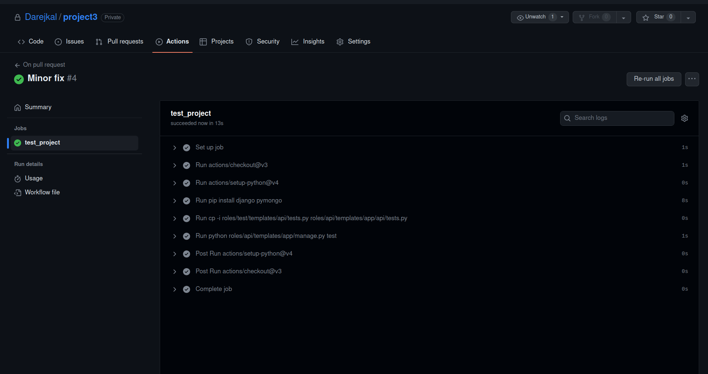
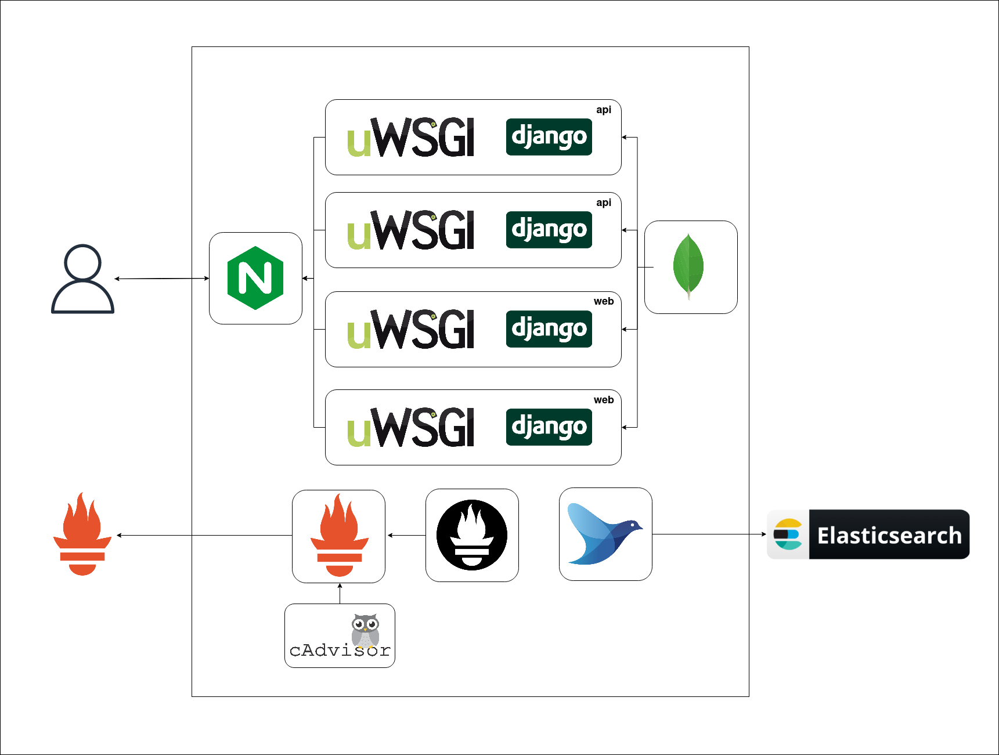
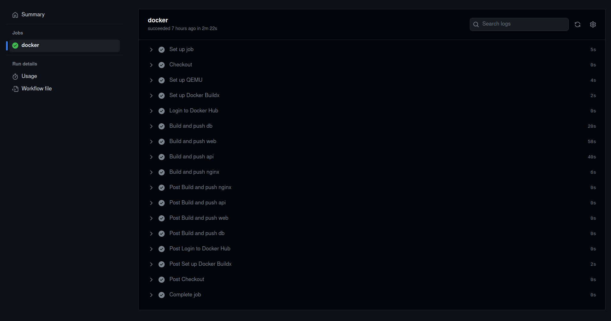
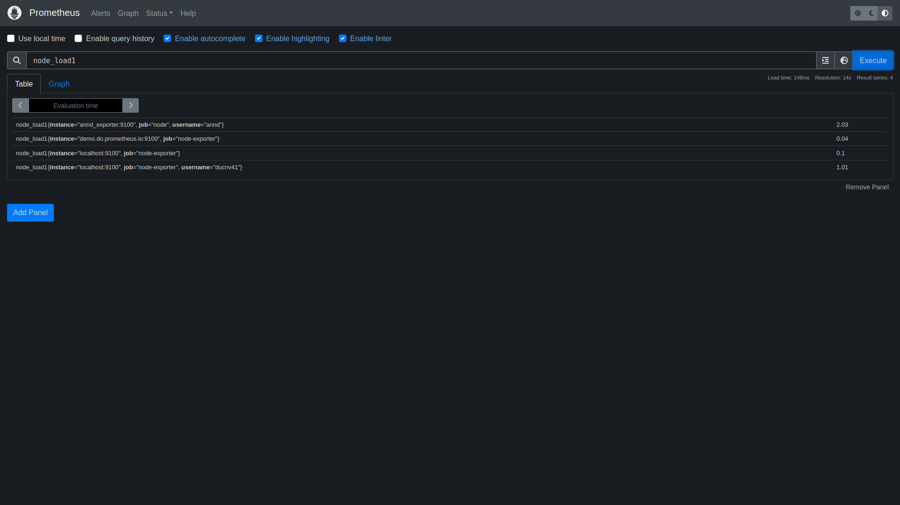
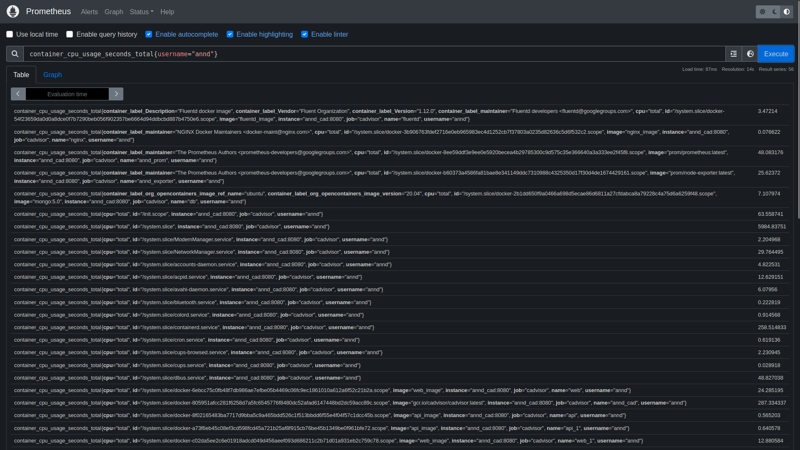
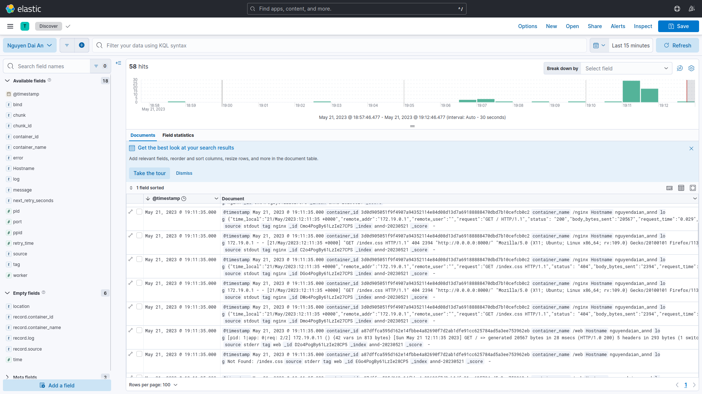
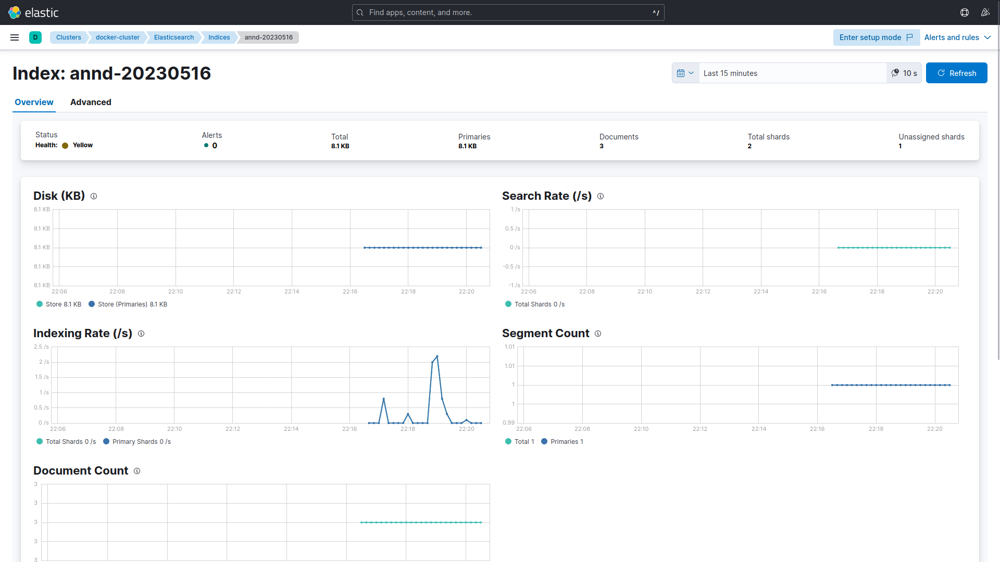
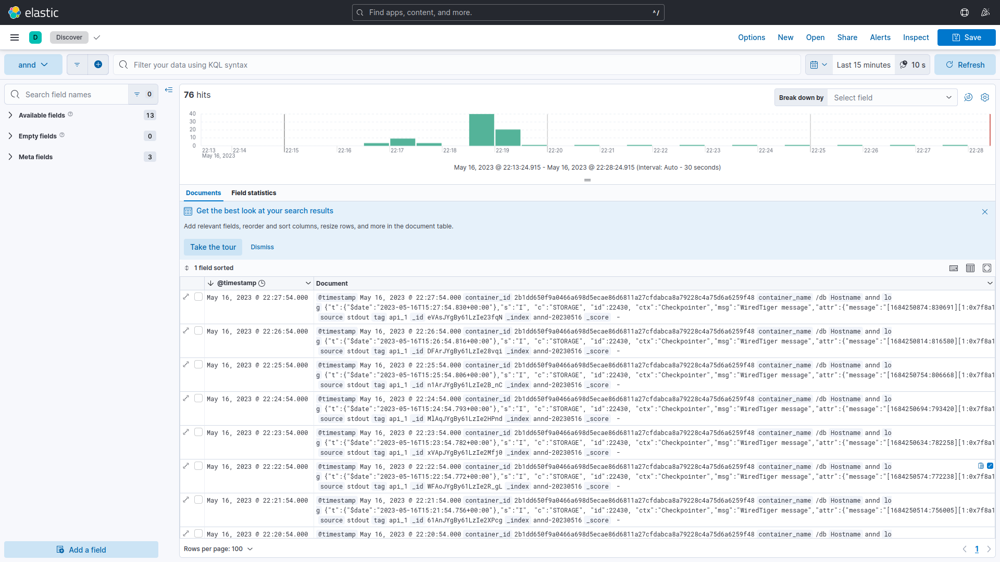

# Bài tập lớn giữa kỳ chương trình VDT 2023 lĩnh vực Cloud
## Phát triển một 3-tier web application đơn giản (2đ)
### Viết một CRUD web application đơn giản thực hiện các chức năng:
1. Liệt kê danh sách sinh viên tham gia khóa đào tạo chương trình VDT 2023 lĩnh vực cloud dưới dạng bảng (0.5đ) ✅
2. Cho phép xem chi tiết/thêm/xóa/cập nhật thông tin sinh viên (0.5đ) ✅

Yêu cầu: Mã nguồn của từng dịch vụ

Giải pháp:

Ngôn ngữ lựa chọn để viết web là Python (Django).

Tạo project app với 1 app là `users`. Vì các thao tác khá đơn giản nên em đã gộp add+list+delete vào 1 page. Django-application `users` có các cài đặt sau:

`roles/web/templates/app/users/views.py`

    from django.shortcuts import render,redirect
    from django.http import JsonResponse
    from django import forms
    import pymongo
    import json
    import requests
    from bson.objectid import ObjectId
    def _getUserTable():
        client = pymongo.MongoClient("mongodb://db:27017/",serverSelectionTimeoutMS=10)
        client.server_info()
        return client["data"]["users"]
    class AddForm(forms.Form):
        Name=forms.CharField()
        Username=forms.CharField()
        Birthyear=forms.CharField()
        Gender=forms.CharField()
        University=forms.CharField()
        Major=forms.CharField()
    def index(request):
        client = pymongo.MongoClient("mongodb://db:27017/",serverSelectionTimeoutMS=10)
        client.server_info()
        if request!=None and request.method=='POST':
            form=AddForm(request.POST)
            if(form.is_valid()):
                client['data']['users'].insert_one({'Name':form.cleaned_data['Name'],'Username':form.cleaned_data['Username'],'Birthyear':form.cleaned_data['Birthyear'],'Gender':form.cleaned_data['Gender'],'University':form.cleaned_data['University'],'Major':form.cleaned_data['Major']})
        cursor=list(client["data"]["users"].find())
        for i in cursor:
            i['id']=i['_id']
        return render(request,'index.html',{"userData":cursor,"addForm":AddForm()})
    def deleteUser(req,id):
        client = pymongo.MongoClient("mongodb://db:27017/",serverSelectionTimeoutMS=10)
        client.server_info()
        client["data"]["users"].delete_one({'_id':ObjectId(id)})
        return redirect("index")
    class UserForm(forms.Form):
        Name=forms.CharField(required=False)
        Username=forms.CharField(required=False)
        Birthyear=forms.CharField( required=False)
        Gender=forms.CharField(required=False)
        University=forms.CharField(required=False)
        Major=forms.CharField( required=False)
    def updateUser(req,id):
        _filter={'_id':ObjectId(id)}
        error=True
        if(req.method=='POST'):
            form=UserForm(req.POST)
            if form.is_valid():
                user=dict()
                for k,v in form.cleaned_data.items():
                    if v:
                        user[k]=v
                updated=_getUserTable().update_one(_filter,{"$set":user}).modified_count
                if updated==1:
                    return redirect("index")
        else:
            error=False
        old_user= _getUserTable().find_one(_filter)
        del old_user['_id']
        return render(req,'update_user.html',{"updateForm":UserForm(),"error":error,"id":id,"userData":[old_user]})

Người dùng sẽ thấy 2 view chính, thông qua các templates `index.html` và `update_user.html`

`roles/web/templates/app/users/templates/index.html`
    <!DOCTYPE html>
    <html>

    <head>
    <link rel="stylesheet" href="index.css">
    </head>

    <body>
        <div class
            style="height:auto;width: auto;display: flex;align-items: center;justify-content: center;flex-direction: column;">
            <div style="height:auto;width: auto;display: flex;align-items: center;justify-content: center;flex-direction: column;"> 
                <h1>Current Students</h1>
                <table id="userTable" style="border: 1px solid;">
                <tr>
                    <th scope="col">Name</th>
                    <th scope="col">Username</th>
                    <th scope="col">Birthyear</th>
                    <th scope="col">Gender</th>
                    <th scope="col">University</th>
                    <th scope="col">Major</th>
                    <th scope="col">Actions</th>
                </tr>
        
        <tr>
            <th> {{ r.Name }}</th>
            <th> {{ r.Username }}</th>
            <th> {{ r.Birthyear | floatformat }}</th>
            <th> {{ r.Gender }}</th>
            <th> {{ r.University }}</th>
            <th> {{ r.Major }}</th>
            <th styles="display: flex; flex-direction: column;"> 
                <button type="submit" value="Delete" onclick="location.href=''">Delete</button>
                <button type="submit" value="Update" onclick="location.href=''">Update</button>
            </th>
        </tr> 
        
            </table>
            </div>
            <div style="height:auto;width: auto;display: flex;align-items: center;justify-content: center;flex-direction: column;"> 
                <h1>Add New Students</h1>
            <form method="post">
                
            {{addForm}}
            <button class="button is-success"  type="submit">Add </button>
            </form>
        </div>
        </div>
    </body>

        <script>
        const deleteUser=()=>{
            
        }
        </script>
    </html>

`roles/web/templates/app/users/templates/update_user.html`

    <!DOCTYPE html>
    <html>

    <head>
    <link rel="stylesheet" href="index.css">
    </head>

    <body>
        <div class
            style="height:auto;width: auto;display: flex;align-items: center;justify-content: center;flex-direction: column;">
        <div style="height:auto;width: auto;display: flex;align-items: center;justify-content: center;flex-direction: column;"> 
                <h1>Update Student</h1>
            <div style="height:auto;width: auto;display: flex;align-items: center;justify-content: center;flex-direction: column;"> 
                <table id="userTable" style="border: 1px solid;">
                <tr>
                    <th scope="col">Name</th>
                    <th scope="col">Username</th>
                    <th scope="col">Birthyear</th>
                    <th scope="col">Gender</th>
                    <th scope="col">University</th>
                    <th scope="col">Major</th>
                </tr>
        
        <tr>
            <th> {{ r.Name }}</th>
            <th> {{ r.Username }}</th>
            <th> {{ r.Birthyear | floatformat }}</th>
            <th> {{ r.Gender }}</th>
            <th> {{ r.University }}</th>
            <th> {{ r.Major }}</th>
        </tr> 
        
            </table>
            </div>
            <h2> An error occured when updating specified student id {{ id|default_if_none:""}} ,  please try again.  </h2>
            <form method="post">
                
            {{updateForm}}
            {{updateForm.id.hidden}}
            <button class="button is-success"  type="submit" onclick="location.href=''">Update </button>
            </form>
        </div>
        </div>
    </body>

        <script>
        </script>
    </html>

### Thiết kế hệ thống với ba dịch vụ: (0.5đ)
1. web: Giao diện web viết bằng HTML + CSS + Javascript được triển khai trên nền web server nginx ✅
2. api: RESTful API viết bằng ngôn ngữ lập trình tùy chọn (prefer Python), có đầy đủ các chức năng: list, get, create, update, delete các bản ghi thông tin sinh viên ✅
3. db: Database SQL hoặc NoSQL lưu trữ thông tin sinh viên (dữ liệu khởi tạo của DB này được cho bởi bảng trong Phụ lục I.) ✅
4. Viết unit tests cho các chức năng APIs (0.5đ) ✅
5. (Optional) Viết unit tests cho các chức năng giao diện, viết integration tests ❌

Yêu cầu: Mã nguồn của từng dịch vụ

Giải pháp:

Tạo 1 djang-app là `api`. Trong `api` có:

`roles/api/templates/app/api/views.py`

    from django.shortcuts import render,redirect
    from django.http import JsonResponse
    import pymongo
    import json
    from bson.objectid import ObjectId
    from django.views.decorators.csrf import csrf_exempt

    def _getUserTable():
        client = pymongo.MongoClient("mongodb://db:27017/",serverSelectionTimeoutMS=10)
        client.server_info()
        return client["data"]["users"]
    def listUsers(req):
        tb=_getUserTable()
        users=[]
        cursor= tb.find()
        for i in cursor:
            users.append({'Name':i['Name'],'id':str(i['_id'])});
        return JsonResponse({'users':users})
    def getUser(req,id):
        error=True
        user=None
        try:
        if(id):
            user=_getUserTable().find_one({'_id':ObjectId(id)})
            if(user):
                error=False
                user['id']=id
                del user['_id']
        finally:
            return JsonResponse({'user':user,'error':error})
    @csrf_exempt
    def createUser(req):
        error=True
        user=None
        body=None
        try:
            if(req.method=='POST'):
                body_unicode = req.body.decode('utf-8')
                body = json.loads(body_unicode)
                _getUserTable().insert_one(body)
                error=False
                user=body
                if(user):
                    error=False
                    user['id']=str(user['_id'])
                    del user['_id']

        finally:
            return JsonResponse({'user':user,'error':error})
    @csrf_exempt
    def updateUser(req):
        error=True
        updated=0
        body=None
        try:
            if(req.method=='POST'):
                body_unicode = req.body.decode('utf-8')
                body = json.loads(body_unicode)
                updated=_getUserTable().update_one(body["user"],{"$set":body["update"]}).modified_count
                error=False
        finally:
            return JsonResponse({'updated':updated,'error':error})
    @csrf_exempt
    def deleteUser(req):
        error=True
        updated=0
        body=None
        try:
            if(req.method=='POST'):
                body_unicode = req.body.decode('utf-8')
                body = json.loads(body_unicode)
                updated=_getUserTable().delete_one(body).deleted_count
                error=False
        finally:
            return JsonResponse({'updated':updated,'error':error})

Database được lựa chọn là MongoDB.

Việc triển khai test API sử dụng hàm TestCase có sẵn của Django.

`roles/test/templates/api/test.py`


Triển khai `test.py` bằng `ansible-playbook -i inventories/inventory.yaml test.yaml` ở trong thư mục chính của `project3`.

## Triển khai web application sử dụng các DevOps tools & practices (8đ)
### Containerization (1đ)
#### 1. Viết Dockerfile để đóng gói các dịch vụ trên thành các container image (0.5đ) ✅

    Yêu cầu image đảm bảo tối ưu thời gian build và kích thước chiếm dụng, khuyến khích
    sử dụng các thủ thuật build image đã được giới thiệu (layer-caching, optimized RUN
    instructions, multi-stage build, etc.) (0.5đ)

Yêu cầu: File Dockerfile cho từng dịch vụ + Câu lệnh build và thông tin docker history của từng image

Giải pháp:

File Dockerfile của từng dịch vụ:

`db`

Note: 
-   Hiện tại em đang build container db bằng ansible và không tạo image mới (dùng bind mount thay cho `COPY`)
-   mongo-init.js chỉ tạo dữ liệu mới khi database trống

Dockerfile:

    FROM mongo:5.0
    ENV MONGO_INITDB_DATABASE=data
    COPY mongo-init.js /docker-entrypoint-initdb.d/

Lệnh build: 

sudo docker build . -t db_image 

`web`

    FROM python:3.11
    RUN  pip install django==3.0.3 && pip install djongo==1.3.1 && pip install  pymongo==3.10.1 && pip install uwsgi && pip install requests
    COPY app /app
    WORKDIR /app
    ENTRYPOINT ["uwsgi"] 
    CMD ["--http", "0.0.0.0:8000","--module","app.wsgi"]
    EXPOSE 8000

Lệnh build:

sudo docker build . -t web_image

`api`
    
    FROM python:3.11
    RUN  pip install django==3.0.3 && pip install djongo==1.3.1 && pip install  pymongo==3.10.1 && pip install uwsgi
    COPY app /app
    WORKDIR /app
    ENTRYPOINT ["uwsgi"] 
    CMD ["--http", "0.0.0.0:8000","--module","app.wsgi"]
    EXPOSE 8000

Lệnh build:
sudo docker build . -t api_image

`nginx`

Note: Hiện tại em đang build container db bằng ansible và không tạo image mới (dùng volume thay cho `COPY`)

    FROM nginx:1.22.0-alpine
    COPY nginx.conf  /etc/nginx/conf.d/default.conf
    EXPOSE 8000 8001

Lệnh build:
sudo docker build . -t nginx_image

#### 2. Continuous Integration (1đ)

Yêu cầu:
   - Tự động chạy unit test khi tạo PR vào branch main (0.5đ) ✅
   - Tự động chạy unit test khi push commit lên một branch (0.5đ) ✅

Output:
   - File setup công cụ CI
   - log của luồng CI
   - Các hình ảnh demo khác

Giải pháp:

`.github/workflows/on_pull_request.yaml`

    name: On pull request
    on:
    pull_request:
        branches:
        - main
        tags:
        - '*'
    push:
    jobs:
    test_project:
        runs-on: ubuntu-latest
        
        
        steps:
        - uses: actions/checkout@v3
        - uses: actions/setup-python@v4
        - run: pip install django pymongo
        - run: cp -i roles/test/templates/api/tests.py roles/api/templates/app/api/tests.py
        - run: python roles/api/templates/app/manage.py test

Log của 1 lần push:



File logs ở thư mục `log_out`.

#### 3. Continuous Delivery (4đ)

Yêu cầu:
-   Viết luồng release dịch vụ bằng công cụ CI/CD của GitHub/GitLab, thực hiện build docker image và push docker image lên Docker Hub khi có event một tag mới được developer tạo ra trên GitHub (1đ) ✅
- Viết ansible playbook thực hiện các nhiệm vụ:
    - Setup môi trường: Cài đặt docker trên các node triển khai dịch vụ (1đ) ✅
    - Deploy các dịch vụ theo version sử dụng docker (1đ) ✅
    - (Optional) Triển khai các dịch vụ trên nhiều hosts khác nhau ✅
- Đảm bảo tính HA cho các dịch vụ web và api:
    - Mỗi dịch vụ web và api được triển khai trên ít nhất 02 container khác nhau (0.5đ) ✅
    - Requests đến các endpoint web và api được cân bằng tải thông qua các công ✅
cụ load balancer, ví dụ: nginx, haproxy và traefik (0.5đ)
    - (Optional) Các công cụ load balancer cũng được triển khai theo mô hình cluster ❌
    - (Optional) Triển khai db dưới dạng cluster ❌

Output:
- Ảnh minh họa kiến trúc triển khai và bản mô tả
-  Thư mục chứa ansible playbook dùng để triển khai dịch vụ, trong thư mục này cần có
- File inventory chứa danh sách các hosts triển khai
- Các file playbook
- Thư mục roles chứa các role:
  -   common: Setup môi trường trước deploy
  -   web: Triển khai dịch vụ web
  -   api: Triển khai dịch vụ api
  -   db: Triển khai dịch vụ db
  -   lb: Triển khai dịch vụ load balancing
- File setup CD
- Output của luồng build và push Docker Image lên Docker Hub
- Hướng dẫn sử dụng ansible playbook để triển khai các thành phần hệ thống
- Output log triển khai hệ thống
Giải pháp

Sử dụng branch protection rule để ngăn push đến branch `main`. Cho phép push đến branch `release`.

Kiến trúc triển khai:



Build và push image on tab sử dụng Github Action:

`.github/workflows/on_tag_pushed.yaml`

```
name: On tag pushed
on:
  push:
    tags:
      - '*'
      - '**'
env:
  CURRENT_DIR: ./roles
jobs:
  docker:
    runs-on: ubuntu-latest
    steps:
    - name: Checkout
      uses: actions/checkout@v2
    - name: Set up QEMU
      uses: docker/setup-qemu-action@v2
    - name: Set up Docker Buildx
      uses: docker/setup-buildx-action@v2
    - name: Login to Docker Hub
      uses: docker/login-action@v2
      with:
        username: ${{ secrets.DOCKERHUB_USERNAME }}
        password: ${{ secrets.DOCKERHUB_TOKEN }}
          #    - name: Build and push db
          #      uses: docker/build-push-action@v4
          #      with: 
          #        push: true
          #        tags: ${{ secrets.DOCKERHUB_USERNAME }}/db:latest
          #        context: ${{ env.CURRENT_DIR }}/db/templates/
    - name: Build and push fluentd
      uses: docker/build-push-action@v4
      with: 
        push: true
        tags: ${{ secrets.DOCKERHUB_USERNAME }}/fluentd:${{ github.ref_name }}
        context: ${{ env.CURRENT_DIR }}/web/templates/
    - name: Build and push web
      uses: docker/build-push-action@v4
      with: 
        push: true
        tags: ${{ secrets.DOCKERHUB_USERNAME }}/web:${{ github.ref_name }}
        context: ${{ env.CURRENT_DIR }}/web/templates/
    - name: Build and push api
      uses: docker/build-push-action@v4
      with: 
        push: true
        tags: ${{ secrets.DOCKERHUB_USERNAME }}/api:${{ github.ref_name }}
        context: ${{ env.CURRENT_DIR }}/api/templates/
          #    - name: Build and push nginx
          #      uses: docker/build-push-action@v4
          #      with: 
          #        push: true
          #        tags: ${{ secrets.DOCKERHUB_USERNAME }}/nginx:latest
          #        context: ${{ env.CURRENT_DIR }}/nginx/templates/

```
            
Có thể sử dụng biến ${{ github.ref_name }} để thay latest bằng tên tag.

Output của luồng build&push:



Thư mục chứa các host triển khai là thư mục `project3` đi kèm với submission này.

Việc thiết lập ansible sử dụng collection `community.docker` tạo thuận lợi cho việc deploy trên nhiều hệ điều hành bằng 1 file playbook. File playbook `site.yaml` và các roles đươợ thêm vào trong thư mục `project3`, trong đó role `lb` được đặt tên là `nginx` để tránh nhầm lẫn.

Các container `api` và `web`  lần lượt được triển khai trên 2 container và được load-balanced bới kết nối với 1 container thứ 5 chứa `nginx`.

Huớng dẫn sử dụng ansible-playbook để triển khai hệ thống:
1.  cd đến thư mục `project3`
2.  Tạo venv thông qua `python3 -m venv venv` (Cài đặt python3 nếu chưa có sẵn).
3.  Khởi động venv qua `source venv/bin/activate`
4.  Cài đặt ansible và 1 collection `community.docker` qua `pip install ansible && ansible-collection install community.docker`
5.  Chỉnh sửa địa chỉ python trong `inventories/inventory.yaml` thành địa chỉ của python đang dùng (tức là output của lệnh `which python`).
6.  Chạy `ansible-playbook -i inventories/inventory.yaml site.yaml`

Triển khai db dưới dạng cluster:

Có thể triển khai db dưới dạng cluster với role:
    ---
    - name: Build db image
    community.docker.docker_image:
        name: db_image
        build:
        path: ./roles/db/templates
        source: "build"
        force_source: true
        
    - name: Create a volume for db
    community.docker.docker_volume: 
        volume_name: "{{ item }}"
    loop:
        - db_volume
        - db_volume_1
        - db_volume_2

    - name: Create db_1 container
    community.docker.docker_container:
        name: db_1
        image: mongo:5.0
        restart_policy: "unless-stopped"
        networks:
        - name: project
        volumes:
        - db_volume_1:/data/db
        command: "mongod --replSet dbRep --bind_ip localhost,db_1"

    - name: Create db_2 container
    community.docker.docker_container:
        name: db_2
        image: mongo:5.0
        restart_policy: "unless-stopped"
        networks:
        - name: project
        volumes:
        - db_volume_2:/data/db
        command: "mongod --replSet dbRep --bind_ip localhost,db_2"
    - name: Create db container
    community.docker.docker_container:
        name: db
        image: mongo:5.0
        restart_policy: "unless-stopped"
        networks:
        - name: project
        env:
        MONGO_INITDB_DATABASE: data
        volumes:
            - db_volume:/data/db
        command: "mongod --replSet dbRep --bind_ip localhost,db"

Trong đó cần thêm 1 task dùng docker_container_exec để khởi tạo Replica Set cho mongodb vào roles này. Tuy nhiên có nhược điểm:
- Không khởi tạo được database ngay thông qua thư mục `docker-entrypoint-initdb.d` hỗ trợ sẵn của image `mongo` .
- Thêm thao tác trong việc detect primary vs secondary database (và xử lý lỗi khi database đang kết nối không phải là primary)

### Monitoring (1đ)
Yêu cầu:
#### 1. Viết ansible playbook roles monitor thực hiện các nhiệm vụ: ✅
- Cài đặt các dịch vụ node exporter và cadvisor dưới dạng container
- Đẩy thông số giám sát lên hệ thống giám sát Prometheus tập trung

Chú ý: Tên các container có tiền tố là `<username>` để phân biệt thông số giám
sát dịch vụ của các sinh viên trên hệ thống giám sát tập trung. Thông tin
`<username>` của từng sinh viên cho bởi bảng trong Phụ lục I.

Yêu cầu:
- Role monitor chứa các playbook và cấu hình giám sát cho hệ thống
- Ảnh chụp dashboard giám sát nodes & containers, có thể sử dụng hệ thống prometheus
tập trung ở 171.236.38.100:9090

Giải pháp:

`roles/monitor/tasks/main.yaml`
```
- name: Build a cadvisor container
community.docker.docker_container:
    image: gcr.io/cadvisor/cadvisor:latest
    name: annd_cad
    networks: 
    - name: project
    ports:
    - 8080:8080
    volumes:
    - /:/rootfs:ro
    - /var/run:/var/run:rw
    - /sys:/sys:ro
    - /var/lib/docker/:/var/lib/docker:ro
- name: Build a prometheus container
community.docker.docker_container:
    image: prom/prometheus:latest
    name: annd_prom
    networks: 
    - name: project
    ports:
    - 9090:9090
    restart_policy: "unless-stopped"
    command:
    - --config.file=/etc/prometheus/prometheus.yaml
    volumes:
    - "{{ role_path }}/templates/prometheus.yaml:/etc/prometheus/prometheus.yaml:ro"

- name: Build a node exporter container
community.docker.docker_container:
    image: prom/node-exporter:latest
    name: annd_exporter
    networks: 
    - name: project
    ports:
    - 9100:9100
    restart_policy: "unless-stopped"
    pid_mode: "host"
    volumes:
    - /proc:/host/proc:ro
    - /sys:/host/sys:ro
    - /:/rootfs:ro
    command:
    - '--path.procfs=/host/proc'
    - '--path.rootfs=/rootfs'
    - '--path.sysfs=/host/sys'
    - '--collector.filesystem.mount-points-exclude=^/(sys|proc|dev|host|etc)($$|/)'
```

`roles/monitor/templates/prometheus.yaml`

```
global:
  external_labels:
    username: annd
scrape_configs:
- job_name: cadvisor
  scrape_interval: 5s
  static_configs:
    - targets:
      - annd_cad:8080
- job_name: node
  scrape_interval: 5s
  static_configs:
    - targets: 
      - annd_exporter:9100
- job_name: 'prometheus'
  scrape_interval: 1m
  static_configs:
    - targets: 
      - localhost:9090
        #remote_write:
        #- url: 'http://171.236.38.100:9090/api/v1/write'
remote_write:
  - url: 'http://27.66.108.93:9090/api/v1/write'

```
Ảnh chụp Dashboard: (trước khi thay username thành họ&tên)




#### 2. Logging (1đ) ✅

Yêu cầu:
Viết ansible playbook thực hiện các nhiệm vụ:
- Cài đặt dịch vụ logstash hoặc fluentd để collect log từ các dịch vụ web, api và db
- Đẩy log dịch vụ lên hệ thống Elasticsearch tập trung 171.236.38.100:9200
- Log phải đảm bảo có ít nhất các thông tin: IP truy cập, thời gian, action tác động,
kết quả (thành công/không thành công/status code)
- Log được index với tiền tố `<username>`_ để phân biệt log dịch vụ của các sinh viên khác nhau. Thông tin `<username>` của từng sinh viên cho bởi bảng trong Phụ lục I.
 
Output:
- Ansible playbook triển khai các dịch vụ collect log (tách module logging)
- Ảnh chụp sample log từ Kibana 171.236.38.100:5601

Giải pháp: Sử dụng fluentd.

`roles/log/tasks/main.yaml`

```
---
- name: Build a fluentd image
  community.docker.docker_image:
    name: fluentd_image
    build:
       path: "{{ role_path }}/templates"
    source: "build"
    force_source: true
- name: Build a fluentd container
  community.docker.docker_container:
    name: fluentd
    image: fluentd_image
    volumes: "{{ role_path }}/templates/fluentd.conf:/fluentd/etc/fluent.conf"
    ports:
      - 24224:24224
      - 24224:24224/udp
    restart_policy: unless-stopped

```

`roles/log/templates/Dockerfile`

    FROM fluent/fluentd:v1.12.0-debian-1.0
    USER root
    RUN ["gem", "install", "elasticsearch", "--no-document", "--version", "< 8"]
    RUN ["gem", "install", "fluent-plugin-elasticsearch","--no-document","--version", "5.2.2"]
    USER fluent


`roles/log/templates/fluentd.conf`
```
<source>
	@type forward
	port 24224
	bind 0.0.0.0
</source>
<filter nginx>
    @type record_transformer
    enable_ruby
    <parse>
        @type regexp
        expression ^(?<somenginxstuff>.*)$
        time_key logtime
        time_format %d/%b/%Y:%H:%M:%S.%z
    </parse>
</filter>
<filter *.>
    @type record_transformer
    <record>
        Hostname nguyendaian_annd
    </record>
</filter>
<match **>
	 @type copy
	 <store>
        	@type elasticsearch
        	host 171.236.38.100
	        port 9200
	        logstash_format true
	        logstash_prefix annd
	        logstash_dateformat %Y%m%d
	        include_tag_key true
	        flush_interval 1s
	</store>
	<store>
		@type stdout
	</store>
</match>

```

Kibana log: 






