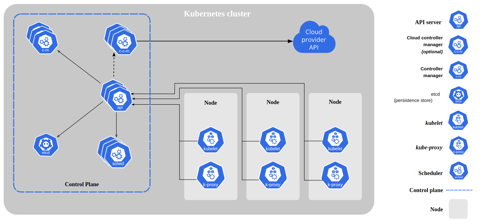
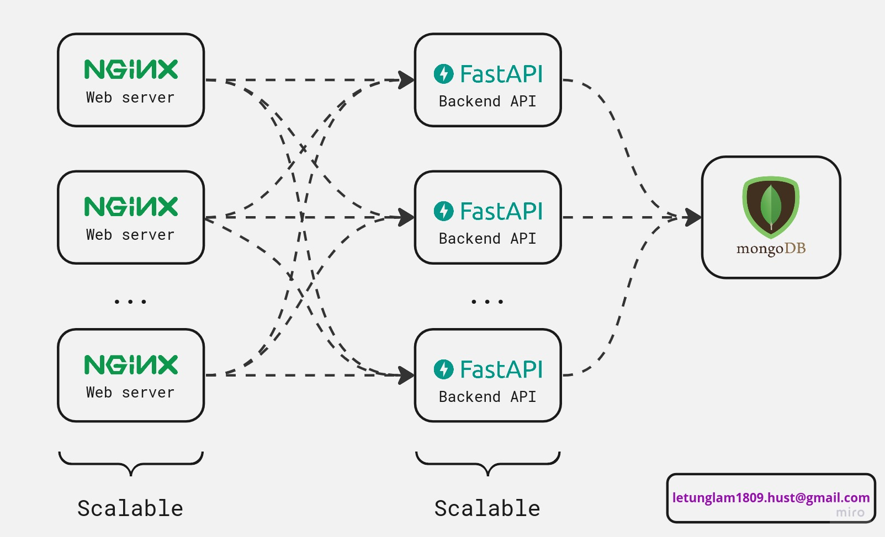

# Kubernetes homework
  
*Objective: Deploy a Multi-tier Application on Kubernetes*

[Table of Contents](./README.md)

[1. Introduction to Kubernetes](#1-introduction-to-kubernetes)
  - [1.1. Overview](#11-overview)
  - [1.2. Kubernetes components](#12-ansible-inventory)

[2. Set up a Kubernetes cluster by using Kubekey](#2-set-up-a-kubernetes-cluster-by-using-kubekey)
  - [2.1. Kubekey](#21-kubekey)
  - [2.2. Presequisites](#22-presequisites)
  - [2.3. Set up a Kubernetes cluster](#23-set-up-a-kubernetes-cluster)

[3. Deploy a Multi-tier application on Kubernetes](#3-deploy-a-multi-tier-application-on-kubernetes)
  - [3.1. Architecture](#31-architecture)
  - [3.2. Preparing images](#32-preparing-images)
  - [3.3. Deployment YAML files](#33-deployment-yaml-files)
    - [3.3.1. Database](#331-database)
    - [3.3.2. Backend](#332-backend)
    - [3.3.3. Frontend](#333-frontend)
  - [3.4. Results](#34-results)

[4. References](#3-references)

---

# 1. Introduction to Kubernetes

## 1.1. Overview
Kubernetes is a portable, extensible, open source platform for managing containerized workloads and services, that facilitates both declarative configuration and automation. It has a large, rapidly growing ecosystem. Kubernetes services, support, and tools are widely available.

The name Kubernetes originates from Greek, meaning helmsman or pilot. K8s as an abbreviation results from counting the eight letters between the "K" and the "s". Google open-sourced the Kubernetes project in 2014. Kubernetes combines over 15 years of Google's experience running production workloads at scale with best-of-breed ideas and practices from the community.


**Why you need Kubernetes and what it can do?**

  Containers are a good way to bundle and run your applications. In a production environment, you need to manage the containers that run the applications and ensure that there is no downtime. For example, if a container goes down, another container needs to start. Wouldn't it be easier if this behavior was handled by a system?

  That's how Kubernetes comes to the rescue! Kubernetes provides you with a framework to run distributed systems resiliently. It takes care of scaling and failover for your application, provides deployment patterns, and more. For example: Kubernetes can easily manage a canary deployment for your system.

Kubernetes provides you with:

- Service discovery and load balancing Kubernetes can expose a container using the DNS name or using their own IP address. If traffic to a container is high, Kubernetes is able to load balance and distribute the network traffic so that the deployment is stable.
- Storage orchestration Kubernetes allows you to automatically mount a storage system of your choice, such as local storages, public cloud providers, and more.
- Automated rollouts and rollbacks You can describe the desired state for your deployed containers using Kubernetes, and it can change the actual state to the desired state at a controlled rate. For example, you can automate Kubernetes to create new containers for your deployment, remove existing containers and adopt all their resources to the new container.
- Automatic bin packing You provide Kubernetes with a cluster of nodes that it can use to run containerized tasks. You tell Kubernetes how much CPU and memory (RAM) each container needs. Kubernetes can fit containers onto your nodes to make the best use of your resources.
- Self-healing Kubernetes restarts containers that fail, replaces containers, kills containers that don't respond to your user-defined health check, and doesn't advertise them to clients until they are ready to serve.
- Secret and configuration management Kubernetes lets you store and manage sensitive information, such as passwords, OAuth tokens, and SSH keys. You can deploy and update secrets and application configuration without rebuilding your container images, and without exposing secrets in your stack configuration.


## 1.2. Kubernetes components


A Kubernetes cluster consists of a set of worker machines, called nodes, that run containerized applications. Every cluster has at least one worker node. The worker node(s) host the Pods that are the components of the application workload. The control plane manages the worker nodes and the Pods in the cluster.

- Control plane components
  - kube-apiserver: exposes the Kubernetes API. It is the front-end for the Kubernetes control plane.
  - etcd: is a key-value store that stores the cluster's state data.
  - kube-scheduler: watches for newly created Pods with no assigned node, and selects a node for them to run on.
  - kube-controller-manager: runs controller processes.
  - cloud-controller-manager: runs controllers that interact with the underlying cloud providers.

- Node components
  - kubelet: is the primary node agent. It watches for Pods that have been assigned to its node (either by apiserver or via local configuration file) and runs them, reporting their status to the apiserver.
  - kube-proxy: enables the Kubernetes service abstraction by maintaining network rules on the host and performing connection forwarding.
  - Container runtime: is the software that is responsible for running containers. Kubernetes supports several container runtimes: Docker, containerd, CRI-O, and any implementation of the Kubernetes CRI (Container Runtime Interface).


Here is just a brief introduction to Kubernetes. For more information, please visit this [link](https://kubernetes.io/docs/concepts/overview/components/).


# 2. Set up a Kubernetes cluster by using Kubekey

## 2.1. Kubekey
Developed in Go, [KubeKey](https://github.com/kubesphere/kubekey) represents a brand-new installation tool as a replacement for the ansible-based installer used before. KubeKey provides you with flexible installation choices, as you can install Kubernetes only or install both Kubernetes and KubeSphere.

There are several scenarios to use KubeKey:
- Install Kubernetes only;
- Install Kubernetes and KubeSphere together in one command;
- Scale a cluster;
- Upgrade a cluster;
- Install Kubernetes-related add-ons (Chart or YAML).

For more information, please visit this [link](https://www.kubesphere.io/docs/v3.3/installing-on-linux/introduction/kubekey/).

## 2.2. Presequisites

Prepare 4 VMs, one for master node, and the rest for worker nodes. Each VM should have at least 2 CPUs and 4GB of RAM. The OS is Ubuntu 20.04. In this project, I use Google Cloud Platform to create VMs with the following configuration:

| VM name | vCPU | RAM (GB) | Disk (GB) | Public IP addresses |
|---------|------|----------|-----------|-----------------    |
| master  | 2    | 4        | 50        | 34.29.9.130         |
| node1   | 2    | 4        | 50        | 35.188.67.246       |
| node2   | 2    | 4        | 50        | 34.132.105.121      |
| node3   | 2    | 4        | 50        | 104.155.179.148     |


## 2.3. Set up a Kubernetes cluster
For more details about the installation process, please consult the following tutorial https://www.kubesphere.io/docs/v3.3/installing-on-linux/introduction/multioverview/.


# 3. Deploy a Multi-tier application on Kubernetes

## 3.1. Architecture



## 3.2. Preparing images
All images are built and hosted on Docker Hub. If you want to see the Dockerfiles, please visit this [link](https://github.com/lam-lt/Viettel-Digital-Talent-2023/tree/midterm/10.GK/letunglam/Containerization).
- [Frontend - yellow09/vdt-nginx](https://hub.docker.com/repository/docker/yellow09/vdt-nginx)
- [Backend - yellow09/vdt-fastapi](https://hub.docker.com/repository/docker/yellow09/vdt-fastapi)
- [Database - yellow09/vdt-mongodb](https://hub.docker.com/repository/docker/yellow09/vdt-mongodb)


## 3.3. Deployment YAML files
### 3.3.1. Database
[DB directory](./db/) structure:
```
db
├── deployment.yaml
├── mongodb-pvc.yaml
├── mongodb-secrets.yaml
└── service.yaml
```

- [mongodb-pvc.yaml](./db/mongodb-pvc.yaml):
  ```yaml
  apiVersion: v1
  kind: PersistentVolumeClaim
  metadata:
    name: pvc
    namespace: vdt
  spec:
    storageClassName: ""
    accessModes:
      - ReadWriteOnce 
    volumeName: pv
    resources:
      requests:
        storage: 1Gi
  ```

- [mongodb-secrets.yaml](./db/mongodb-secrets.yaml):
  ```yaml
  apiVersion: v1
  data:
    password: root
    username: root
  kind: Secret
  metadata:
    creationTimestamp: null
    name: mongo-creds
  ```


- [deployment.yaml](./db/deployment.yaml):
  ```yaml
  apiVersion: apps/v1
  kind: Deployment
  metadata:
    labels:
      app: mongodb
    name: mongodb
    namespace: vdt
  spec:
    replicas: 1
    selector:
      matchLabels:
        app: mongodb
    template:
      metadata:
        labels:
          app: mongodb
      spec:
        containers:
        - image: yellow09/vdt-mongodb:latest
          name: mongodb
          ports:
          - containerPort: 27017
          volumeMounts:
          - name: "mongo-data-dir"
            mountPath: "/data/db"
        volumes:
        - name: "mongo-data-dir"
          persistentVolumeClaim:
            claimName: "pvc"
  ```


- [service.yaml](./db/service.yaml):
  ```yaml
  ---
  apiVersion: v1
  kind: Service
  metadata:
    labels:
      app: mongodb
    name: mongodb
    namespace: vdt
  spec:
    selector:
      app: mongodb
    ports:
    - name: http
      port: 27017
      targetPort: 27017
  ```

Run the following command to deploy the database:
```bash
$ kubectl apply -f db/mongodb-pvc.yaml
$ kubectl apply -f db/mongodb-secrets.yaml
$ kubectl apply -f db/deployment.yaml
$ kubectl apply -f db/service.yaml
```

### 3.3.2. Backend
[Backend directory](./backend/) structure:
```
backend
├── deployment.yaml
└── service.yaml
```

- [deployment.yaml](./backend/deployment.yaml) (you can change the number of replicas to scale the application):
  ```yaml
  apiVersion: apps/v1
  kind: Deployment
  metadata:
    name: fastapi
    labels:
      app: fastapi
    namespace: vdt
    annotations:
      monitoring: "true"
  spec:
    replicas: 3
    selector:
      matchLabels:
        app: fastapi
    template:
      metadata:
        labels:
          app: fastapi
      spec:
        containers:
        - image: yellow09/vdt-fastapi
          name: fastapi
          ports:
          - containerPort: 8000
  ```

- [service.yaml](./backend/service.yaml):
  ```yaml
  ---
  apiVersion: v1
  kind: Service
  metadata:
    labels:
      app: fastapi
    name: fastapi
    namespace: vdt
  spec:  
    ports:
    - nodePort: 30800
      port: 8000
      protocol: TCP
      targetPort: 8000
    selector:
      app: fastapi
    type: NodePort
  ```

Run the following command to deploy the backend:
```bash
$ kubectl apply -f backend/deployment.yaml
$ kubectl apply -f backend/service.yaml
```

### 3.3.3. Frontend
[Fronend directory](./frontend/) structure:
```
frontend
├── deployment.yaml
└── service.yaml
```

- [deployment.yaml](./frontend/deployment.yaml) (you can change the number of replicas to scale the application):
  ```yaml
  ---
  apiVersion: apps/v1
  kind: Deployment
  metadata:
    name: nginx
    labels:
      app: nginx
    namespace: vdt
  spec:
    replicas: 3
    selector:
      matchLabels:
        app: nginx
    template:
      metadata:
        labels:
          app: nginx
      spec:
        containers:
        - name: nginx
          image: yellow09/vdt-nginx:fe
          ports:
          - containerPort: 80
  ```

- [service.yaml](./frontend/service.yaml):
  ```yaml
  ---
  apiVersion: v1
  kind: Service
  metadata:
    labels:
      app: nginx
    name: nginx
    namespace: vdt
  spec:
    ports:
    - nodePort: 30500
      port: 80
      protocol: TCP
      targetPort: 80
    selector:
      app: nginx
    type: NodePort
  ```

Run the following command to deploy the frontend:
```bash
$ kubectl apply -f frontend/deployment.yaml
$ kubectl apply -f frontend/service.yaml
```

## 3.4. Results

- Set up a Kubernetes cluster with 3 worker nodes and 1 master node. You can access Kubersphere dashboard via: 
  - [`http://34.29.9.130:30880`](http://34.29.9.130:30880)
  - Username: `admin`
  - Password: `LeTungLam1809`


  


- Deploy successfully a multi-tier application on Kubernetes.
  
  Here I have 3 public frontend services. Each frontend service will call the backend service, and the backend service will continue to call the database service to get data.
  - [35.188.67.246:30500](http://35.188.67.246:30500)
  - [34.132.105.121:30500](http://34.132.105.121:30500)
  - [104.155.179.148:30500](http://104.155.179.148:30500)
  
  if you want to access the backend api service, you can use the following link:
  - [35.188.67.246:30800/docs](http://35.188.67.246:30800/docs)
  - [34.132.105.121:30800/docs](http://34.132.105.121:30800/docs)
  - [104.155.179.148:30800/docs](http://104.155.179.148:30800/docs)
  
  

***Note that all the ip addresses are temporary and will be deleted after this course.***


# 4. References
- [Kubernetes](https://kubernetes.io/)
- [Kubersphere](https://kubesphere.io/)
- [Install a Multi-node Kubernetes and KubeSphere Cluster](https://www.kubesphere.io/docs/v3.3/installing-on-linux/introduction/multioverview/)
- [Kubekey](https://github.com/kubesphere/kubekey)
- [Google Cloud Platform](https://cloud.google.com/)
- [Devopscube - Deploy Mongodb on Kubernetes](https://devopscube.com/deploy-mongodb-kubernetes/)


---
P.S.

I just have started to learn about Kubernetes, so many things are still new to me. Maybe there are something I don't understand or misunderstand, please let me know. I really appreciate your help. But, anyway, thank you for reading my report.

Le Tung Lam.