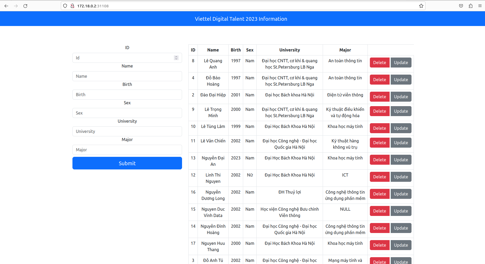
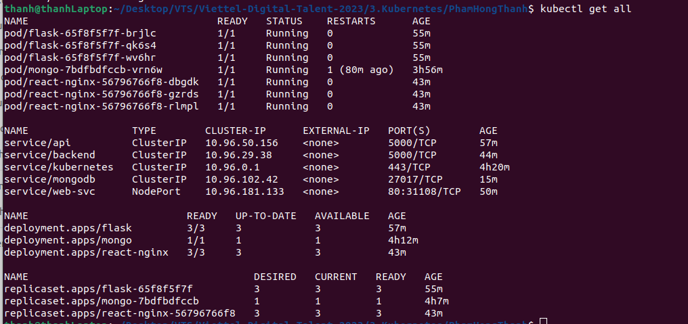

# TABLE OF CONTENT

- [TABLE OF CONTENT](#table-of-content)
- [1. Create cluster with kind](#1-create-cluster-with-kind)
- [2. Apply each tier of the web](#2-apply-each-tier-of-the-web)
  - [Database](#database)
  - [Backend](#backend)
  - [Frontend](#frontend)
- [3. Access Web-UI](#3-access-web-ui)
# 1. Create cluster with kind
```sh
kind create cluster --name vdt --config kind-cluster.config.yml
```
# 2. Apply each tier of the web

## Database
```sh
kubectl apply -f db/
```  
## Backend

```sh
kubectl apply -f backend/ 
```  

## Frontend
```sh
kubectl apply -f frontend/
```  

# 3. Access Web-UI  

via `http://172.18.0.2:31108/` 

  

Get all information 
