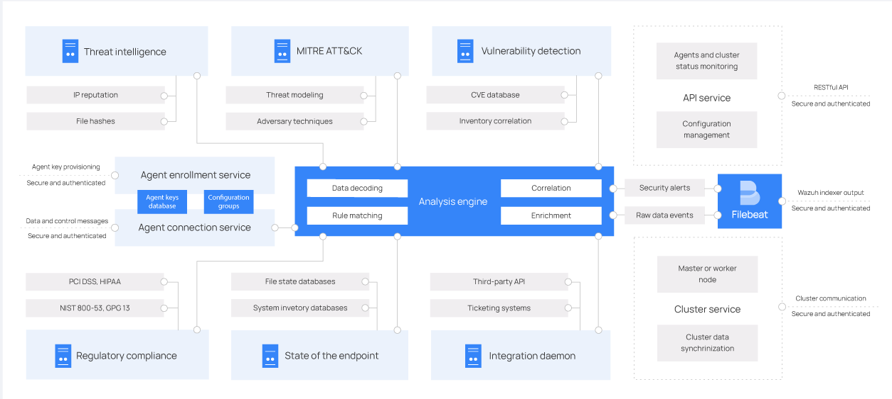

# Security homework

# Table of contents
## [I. Basic Security Course](#1-basic-security-course)
## [II. Sandbox and Phishing Mail](#2-sandbox-and-phishing-mail)
## [III.  Architecture and Features of a cybersecurity tool (Wazuh)](#3-architecture-and-features-of-a-cybersecurity-tool-wazuh)
## [References](#4-references)

# 1. Basic Security Course

I have successfully finished a fundamental security course called "Intro to Information Security".

 
 
 
 
 
 Picture 1. "Intro to Information Security" Course

# 2. Sandbox and Phishing Mail

Complete an online practical exercise on an information security system: Sandbox/Phishing Mail

[VirusTotal](https://www.virustotal.com/gui/home/upload)

VirusTotal is a free online service that analyzes suspicious files and URLs to detect malware and other security threats. It operates as a collaborative platform, utilizing multiple antivirus engines and various detection techniques to scan and provide information about potentially malicious files or URLs.

Here are some key points about VirusTotal and its sandbox feature:

1. File and URL Analysis: VirusTotal allows users to submit files or URLs for analysis. It scans the submitted items using a wide range of antivirus engines and other security tools to identify potential threats.

2. Multiple Antivirus Engines: VirusTotal leverages a large number of antivirus engines from different vendors to increase the chances of detecting malware. This multi-engine approach helps improve the accuracy of the analysis.

3. Hash-based Detection: VirusTotal utilizes hash-based detection to identify known malicious files. By comparing the hash value of a submitted file against a database of known malicious files, it can quickly determine if the file has been previously identified as malware.

4. Behavior-based Analysis (Sandboxing): VirusTotal's sandboxing feature allows for dynamic analysis of suspicious files. It executes the file in a controlled environment, monitoring its behavior and interactions with the system. This behavior-based analysis helps identify previously unseen or zero-day malware that may not be detected by traditional signature-based antivirus engines.

5. Malware Reports: Once a file or URL analysis is complete, VirusTotal provides a detailed report summarizing the results. The report includes information about the number of antivirus engines that flagged the file as malicious, behavioral indicators, file metadata, and additional contextual details.

6. Community Participation: VirusTotal encourages community participation by allowing users to comment on and discuss analysis results. This collaborative approach fosters knowledge sharing and enables security researchers to provide additional insights or context about specific files or URLs.

7. Public and Private API: VirusTotal offers a public API that allows developers and researchers to programmatically interact with the service. It also provides a private API for organizations that require higher usage limits and additional features.

 
  
 Picture 2. Using Virustotal for analyzing file.

[Checkphish](https://checkphish.ai/)

Checkphish is an online service provided by BOLSTER that is designed to help individuals and organizations detect and analyze phishing attacks. Phishing attacks are malicious attempts to deceive individuals into revealing sensitive information such as passwords, credit card details, or other personal data. 

Checkphish utilizes advanced algorithms and machine learning techniques to analyze and identify potential phishing emails and websites. It helps users determine whether an email or website is legitimate or if it poses a phishing threat. The service checks various elements such as the email headers, content, links, and domain reputation to assess the likelihood of a phishing attempt.

Users can submit suspicious emails or URLs to Checkphish, which then performs an analysis and provides a detailed report on the potential risks associated with the submission. The report includes information about the legitimacy of the email or website, the presence of known phishing indicators, and additional details that can help users make informed decisions about the credibility of the communication.

By using Checkphish, individuals and organizations can enhance their security measures and reduce the risk of falling victim to phishing attacks. It serves as a valuable tool to identify and mitigate potential threats, ultimately helping to protect sensitive information and maintain online security.

 
 
 
 Picture 3. Using Checkphish for analyzing URLs.

# 3. Architecture and Features of a cybersecurity tool (Wazuh)

Wazuh is an open-source cybersecurity platform designed for threat detection, visibility, and compliance. Here's an overview of its architecture and key features:

**Architecture:**

  
 Picture 4. Wazuh architecture

The Wazuh architecture is agent-based, with agents installed on monitored endpoints that send security data to a central server. Agentless devices like firewalls, switches, routers, and access points can also submit log data via Syslog, SSH, or their API. The central server analyzes the data and sends it to the Wazuh indexer for indexing and storage.

For scalability, the Wazuh indexer can be configured as a cluster with multiple nodes that communicate for read and write operations on indices. A single-node cluster is suitable for small deployments, while multi-node clusters are recommended for larger environments with many endpoints or high data volumes.

In production, it's advised to deploy the Wazuh server and Wazuh indexer on separate hosts. Filebeat is used to securely forward Wazuh alerts and archived events to the Wazuh indexer cluster, ensuring TLS encryption for data transmission.

Wazuh follows a distributed architecture that consists of multiple components working together to provide comprehensive security capabilities. The key components include:
- **Wazuh agent** runs on various operating systems and can be deployed on a wide range of devices, including laptops, desktops, servers, cloud instances, containers, and virtual machines. It offers threat prevention, detection, and response capabilities, safeguarding your system. The agent collects system and application data, securely forwarding it to the Wazuh server through encryption and authentication. With a modular architecture, each component handles specific tasks like file system monitoring, log message reading, inventory data collection, system configuration scanning, and malware detection. Users can manage agent modules through configuration settings, tailoring the solution to their specific needs.

  
 Picture 5. Wazuh Agent Architecture

-  **Wazuh server** analyzes agent data, triggering alerts for detected threats or anomalies. It remotely manages agent configurations and monitors their status. It utilizes threat intelligence sources to enhance detection capabilities and enriches alert data with the MITRE ATT&CK framework and compliance requirements like PCI DSS, GDPR, HIPAA, CIS, and NIST 800-53. The server encompasses multiple components including the analysis engine, Wazuh RESTful API, agent enrollment service, agent connection service, Wazuh cluster daemon, and Filebeat. It is typically installed on Linux and can run on various environments such as physical machines, virtual machines, containers, or cloud instances.

  
 Picture 6. Wazuh Server Architecture

-  **Wazuh indexer** is a scalable search and analytics engine that stores and indexes alerts generated by the Wazuh server. It offers near real-time data search and analytics capabilities. The indexer can be configured as a single-node or multi-node cluster for scalability and high availability. It stores data as JSON documents and distributes them across shards for redundancy. Adding nodes to the cluster increases query capacity and safeguards against hardware failures.
-  **Wazuh dashboard** is a flexible and intuitive web user interface for mining, analyzing, and visualizing security events and alerts data. It is also used for the management and monitoring of the Wazuh platform. Additionally, it provides features for role-based access control (RBAC) and single sign-on (SSO).

Wazuh offers a comprehensive set of features for threat detection, compliance monitoring, log analysis, and real-time alerts. Its flexible architecture and integration capabilities make it suitable for various security use cases and environments.

- **Threat Detection**: Wazuh employs a rules-based engine to detect security threats and anomalies. It analyzes collected data from agents and compares it against predefined rules and patterns to identify signs of malicious activities or policy violations.
- **Compliance Monitoring**: Wazuh includes predefined rules and policies to assess and monitor system configurations for compliance with industry standards and best practices. It helps organizations meet regulatory requirements, maintain a secure configuration baseline, and identify potential compliance gaps.
- **Log Analysis and Visualization**: With the integration of the Elastic Stack, Wazuh offers powerful log analysis and visualization capabilities. Administrators can use Kibana's customizable dashboards and visualizations to gain insights into security events, perform historical analysis, and identify trends or patterns.
- **Real-time Alerts and Notifications**: Wazuh provides real-time alerting capabilities for detected security incidents. Administrators can configure rules and thresholds to trigger alerts based on specific events or patterns. Notifications can be sent via email, SMS, or integrated with popular communication tools like Slack.
- **Threat Intelligence Integration**: Wazuh integrates with threat intelligence feeds, such as Open Threat Exchange (OTX), to enhance its detection capabilities. By leveraging external threat intelligence, Wazuh can identify known malicious IP addresses, domains, or file hashes and alert administrators accordingly.
- **Extensibility and Integration**: Wazuh provides APIs and supports integration with other security tools and SIEM (Security Information and Event Management) systems. This allows organizations to combine Wazuh's capabilities with their existing security infrastructure and streamline their security operations.
- **Scalability and High Availability**: Wazuh is designed to scale horizontally, allowing the deployment of multiple managers and Elasticsearch nodes to handle large environments or distributed networks. High availability options ensure continuous monitoring and fault tolerance.

**Examples of some of the most common use cases of the Wazuh platform.**
- Log data analysis
- File integrity monitoring
- Rootkits detection
- Active response
- Configuration assessment
- System inventory
- Vulnerability detection
- Cloud security
- Container security
- Regulatory compliance

# **References**

[1] [Course: Intro to Information Security](https://www.udacity.com/course/intro-to-information-security--ud459)

[2] [VirusTotal](https://www.virustotal.com/gui/home/upload)

[3] [Checkphish](https://checkphish.ai/)

[4] [Wazuh Architecture](https://documentation.wazuh.com/current/getting-started/architecture.html)