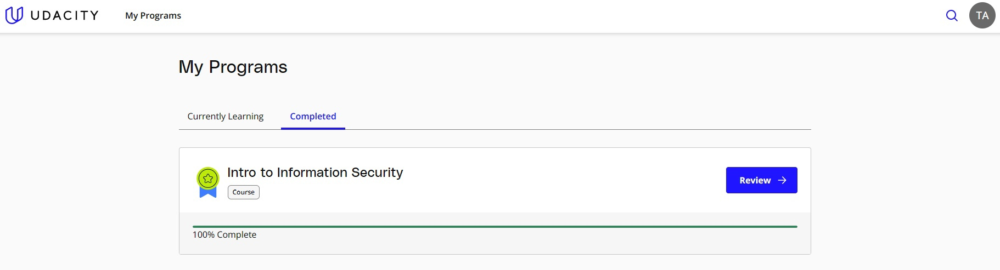
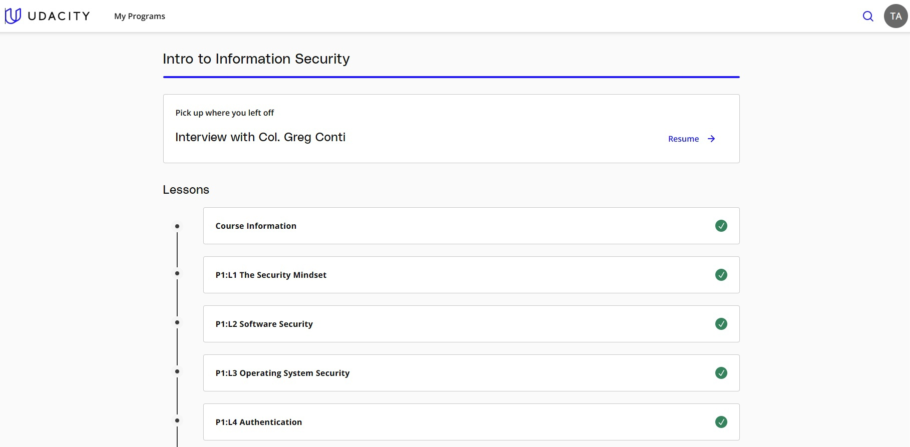
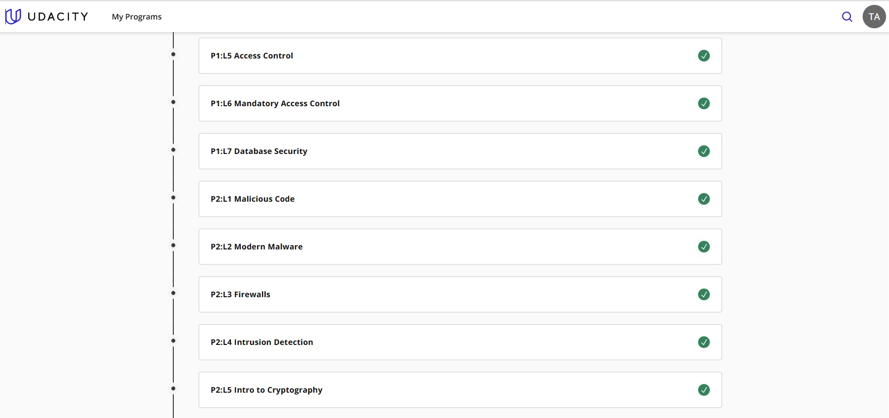
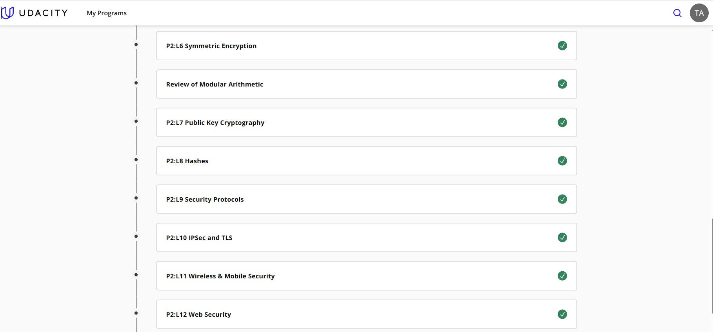
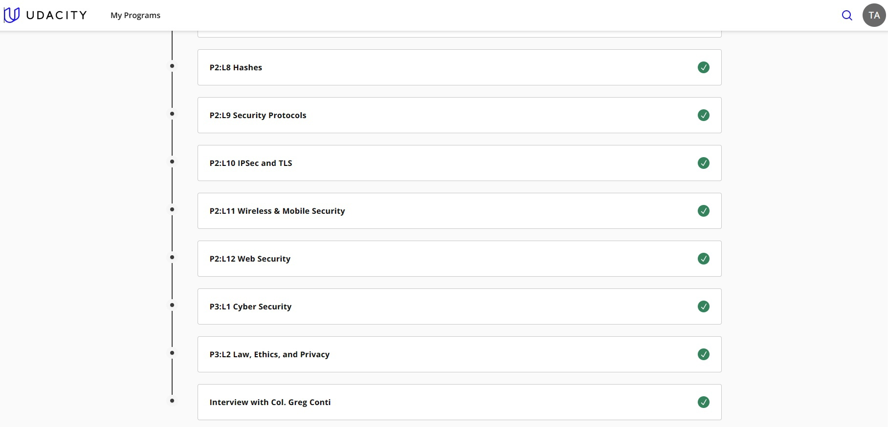
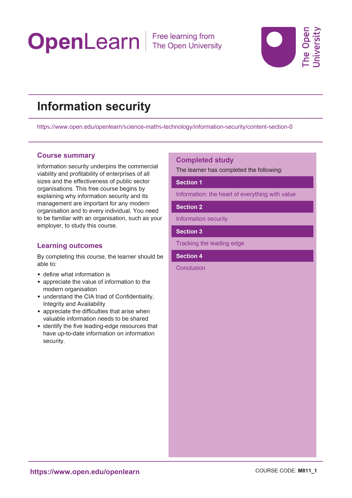

# Security Homework
## Basic Security Courses
## 1. Udacity: Intro to Information Security
### Quick Note: 
**https://tuananhnjr.notion.site/Intro-to-Information-Security-1d492bc3eca848669bbdec48d83acd0d**

**Photos of completing the course:**

       

       

       

       

       

## 2. OpenLearn: Information Security
**Certificate of completing the course:**

       

       

