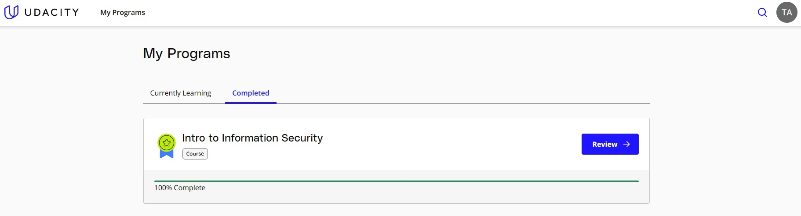
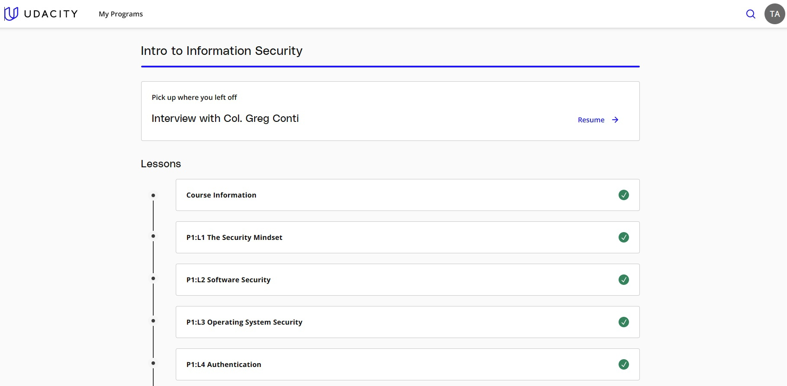
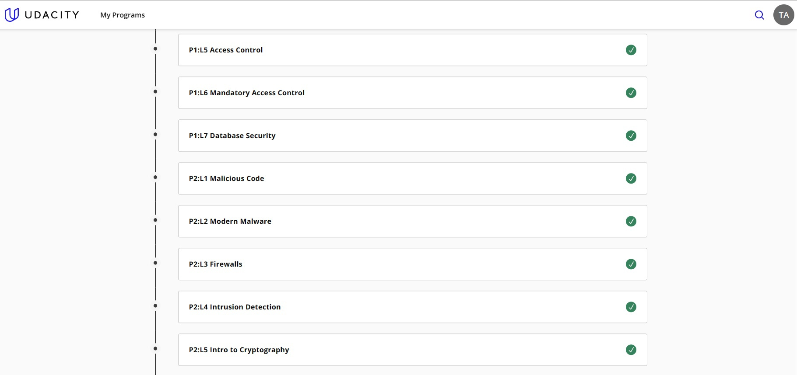
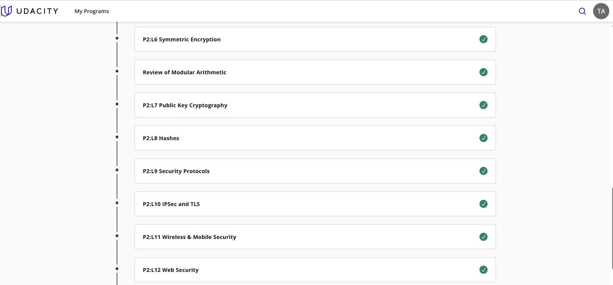
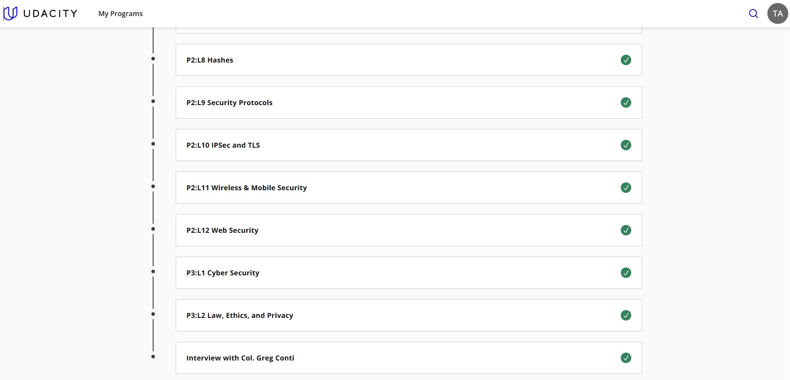
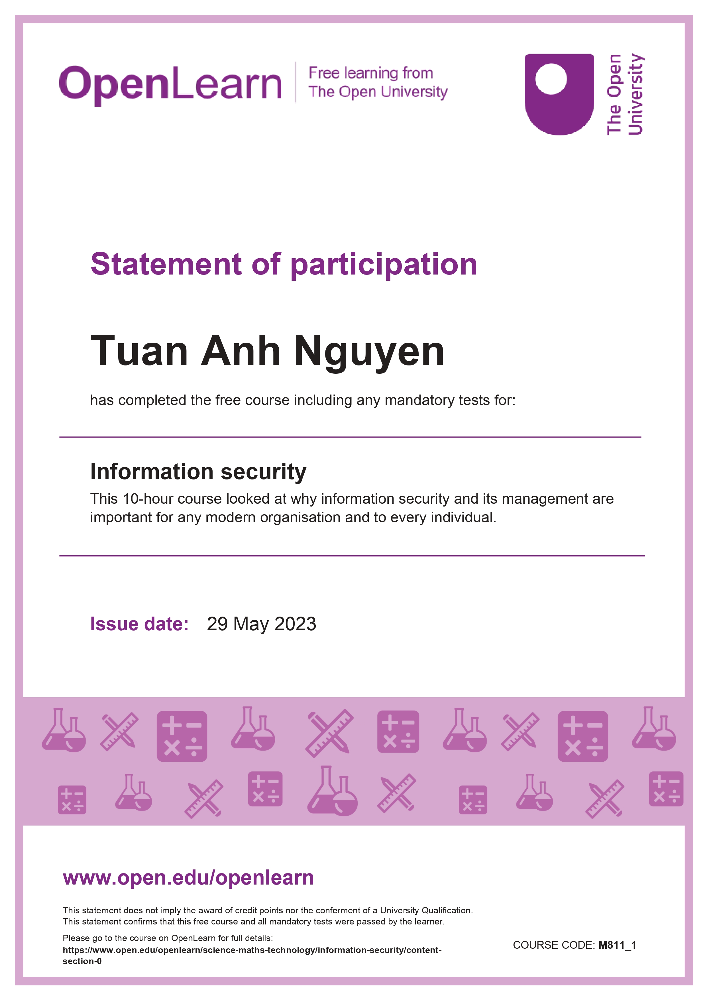
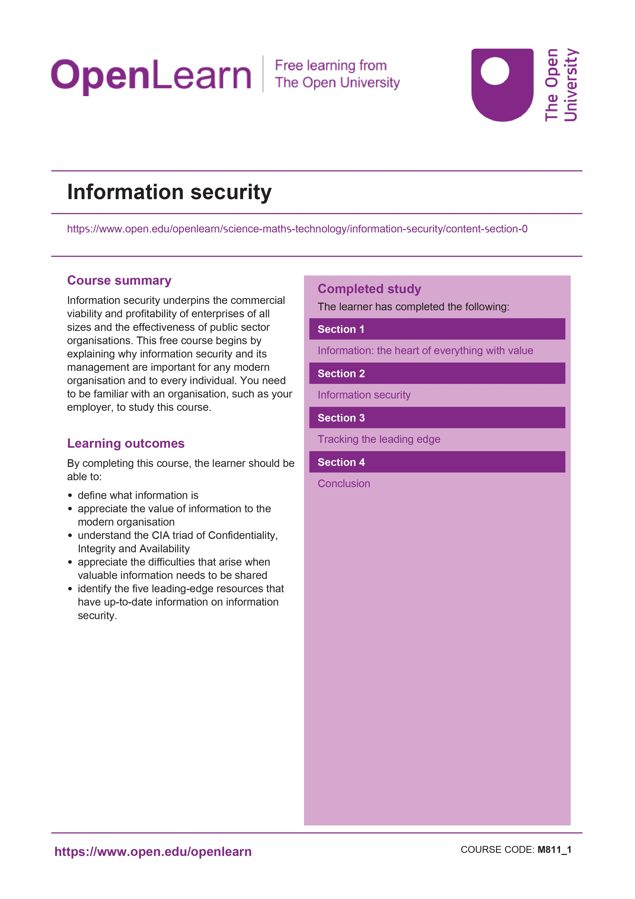

# Security Homework
## Basic Security Courses
## 1. Udacity: Intro to Information Security

       

       

       

       

       

## 2. OpenLearn: Information Security

       

       

