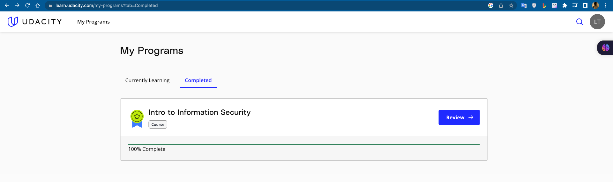
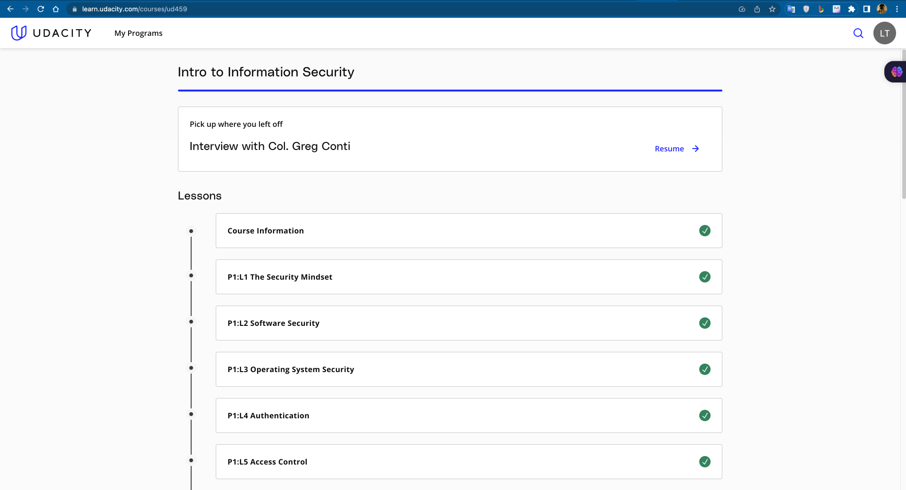
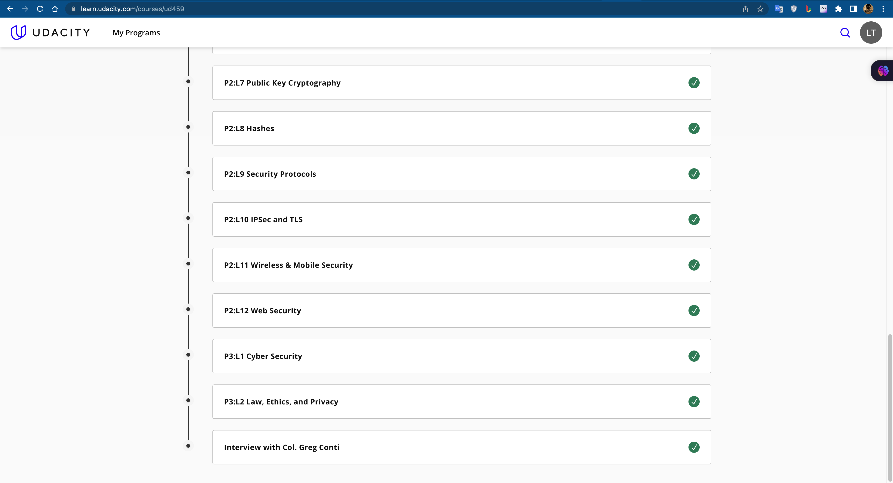
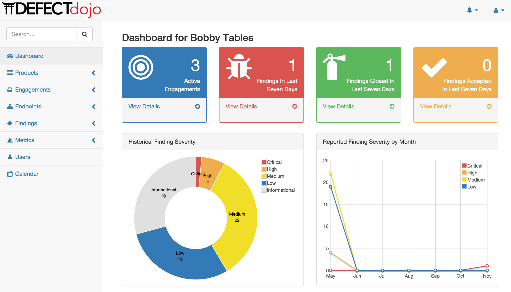
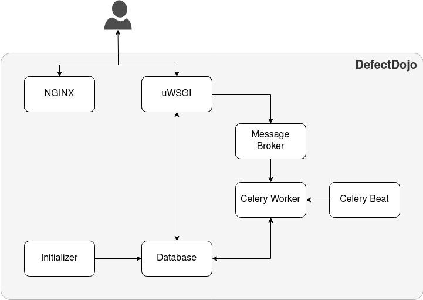

# 1. Complete a Basic Security Course - Introduction to Information Security
## Overall

## Progress

# 2. Learn the architecture and features of an Information Security tool - DefectDojo

# [DefectDojo - Please read my report here](https://github.com/letrongminh/Viettel-Digital-Talent-2023/blob/sec-hw/4.%20Security/Le-Trong-Minh/Le_Trong_Minh_DefectDojo_.pdf)

## Progress

