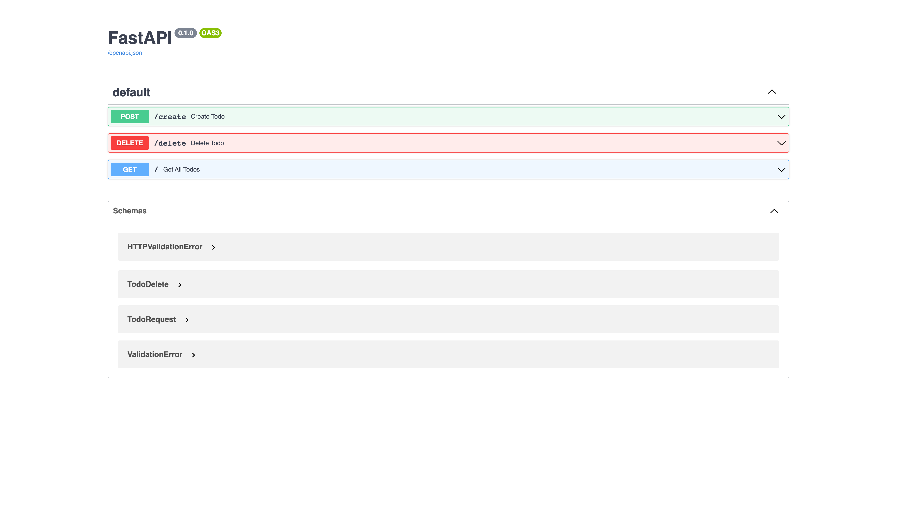
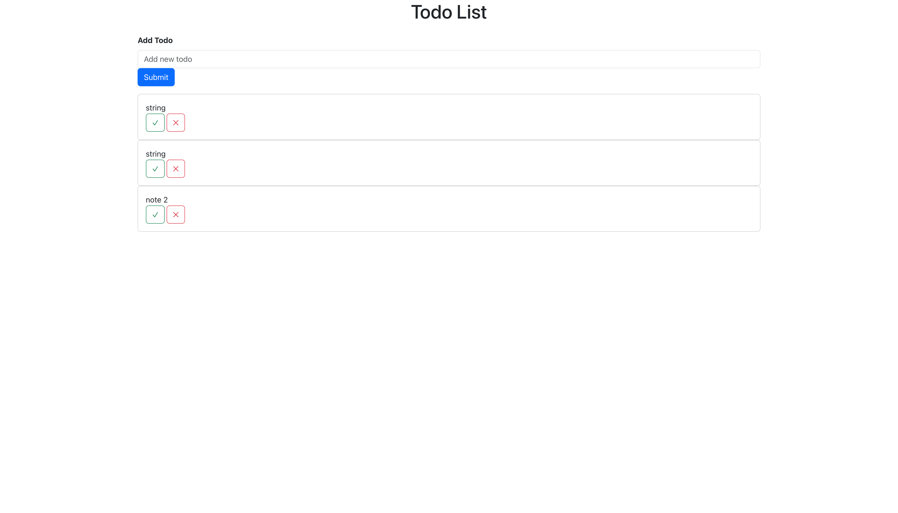

# K8S Deployment 3-tier Application

## Requirements
Minikube: 
```
    brew install minikube
```
Start the minikube and tunnel:
```
minikube start
minikube tunnel
```
## Upload the image to Dockerhub
Upload Backend Image to Docker:
```
docker login

docker tag k8s-rest_api manhlab/k8s-rest_api
docker push manhlab/k8s-rest_api
```
Upload Frontend Image to Docker:
```
docker tag k8s-frontend manhlab/k8s-frontend 
docker push manhlab/k8s-frontend
```
## Deploy application in K8s minikube
Create the secret key for the application
```
kubectl apply -f secret.yml
kubectl get secret mysecret -o yaml 
```
Then replace `secret.yml` with new generated YAML file, Now you can access the above secret data from the container easily. See the modified deployment YAML file which uses secret data as the values of the environment variables.
```
env:
    - name: POSTGRES_USER
        valueFrom:
            secretKeyRef:
                name: mysecret
                key: POSTGRES_USER
```
Node selector with tags:
```
nodeSelector:
    kubernetes.io/os: linux
```
Deploy all services and pod:
```
kubectl apply -f .
```
Logs the pod
```
kubectl logs -f restful-deployment-86485599b-mjrtq
```
Port forwarding to localhost
```
kubectl port-forward svc/restapi-pod-service 4000:4000 --address 0.0.0.0
kubectl port-forward svc/react-pod-service 3000:3000 --address 0.0.0.0
```
After that we successfully access the web service and FASTAPI backend in `http://localhost:3000` and `http://localhost:4000`:




