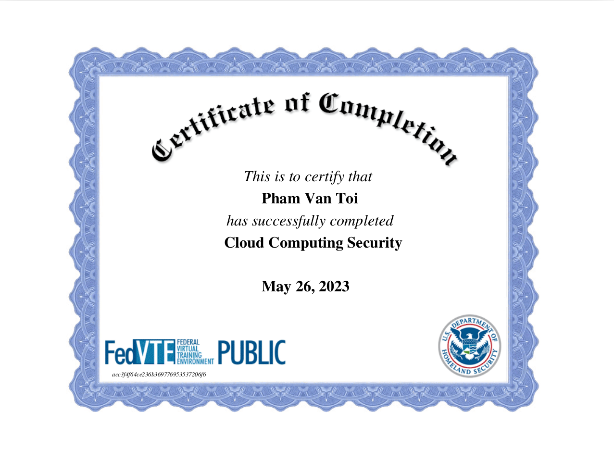
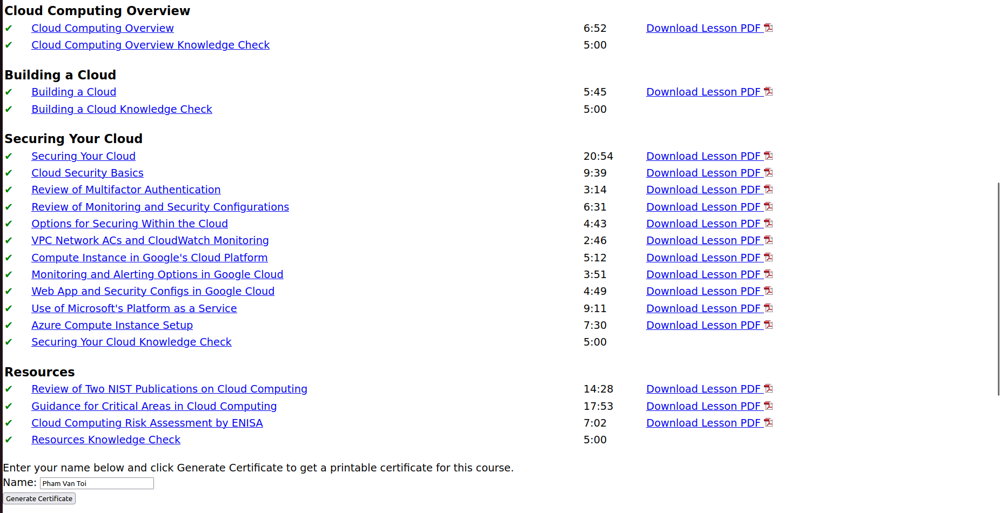
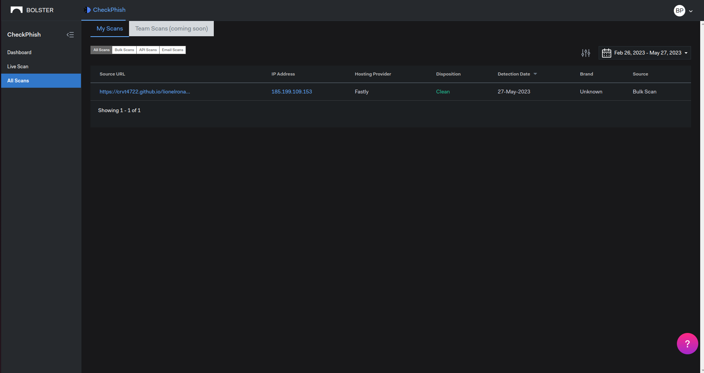
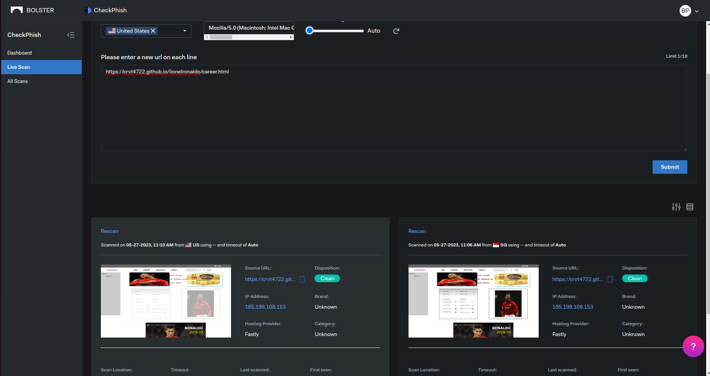
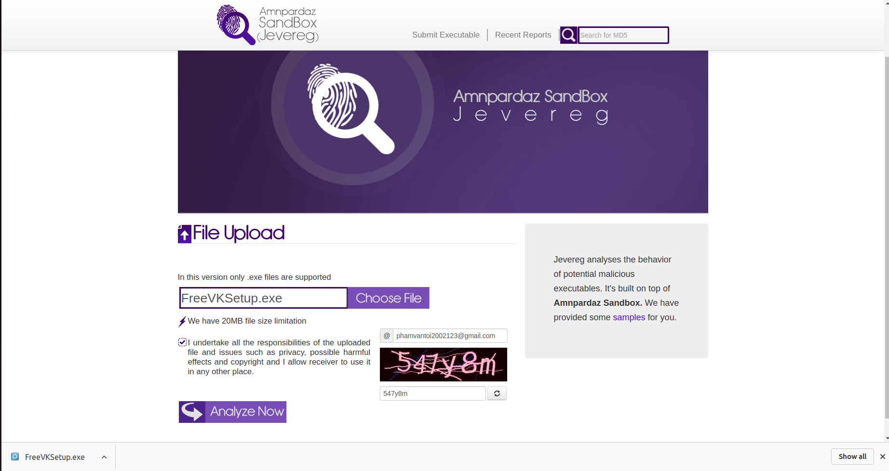
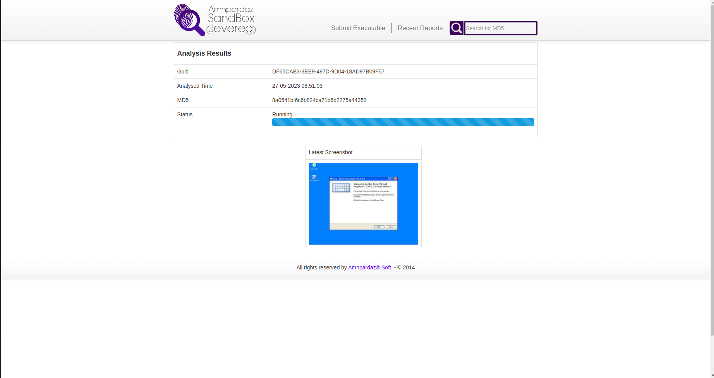
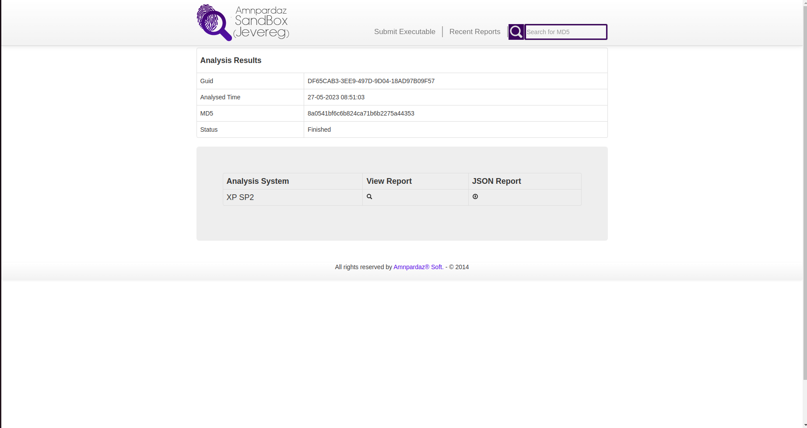
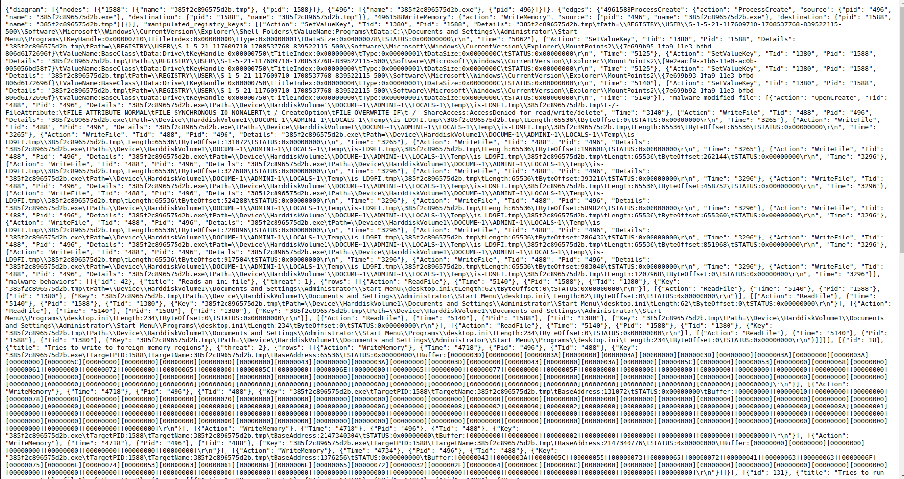
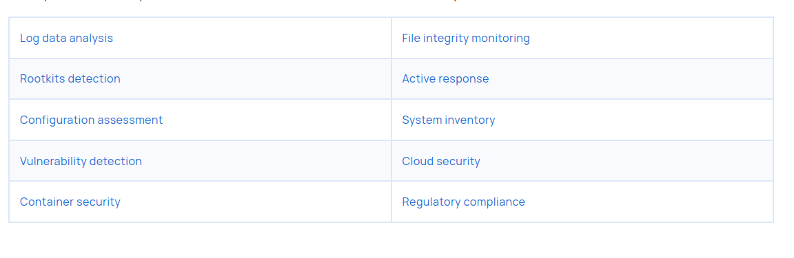

# 1. Hoàn thành 1 khóa học về ATTT cơ bản (Cloud Computing Security)
## Certificate

## Progress

# 2. Thực hành 1 hệ thống ATTT online viết báo cáo: Sandbox/Phishing Mail 
### CheckPhish
Use Checkphish to check the information of a URL. From there, we can know if that website is fake or not.

#### Demo

### Jevereg
Jevereg is used analyzed the behavior of potential malicious executables.

#### Demo

# 3. Tìm hiểu kiến trúc và tính năng của 1 công cụ ATTT (Wazuh)

## Architecture
The Wazuh architecture is based on Wazuh agents, running on the monitored endpoints, that forward security data to a central server. Agentless devices such as firewalls, switches, routers, and access points are supported and can actively submit log data via Syslog, SSH, or using their API. The central server decodes and analyzes the incoming information and passes the results along to the Wazuh indexer for indexing and storage.

The Wazuh indexer cluster is a collection of one or more nodes that communicate with each other to perform read and write operations on indices. Small Wazuh deployments, which do not require processing large amounts of data, can easily be handled by a single-node cluster. Multi-node clusters are recommended when there are many monitored endpoints, when a large volume of data is anticipated, or when high availability is required.

For production environments, it is recommended to deploy the Wazuh server and Wazuh indexer to different hosts. In this scenario, Filebeat is used to securely forward Wazuh alerts and archived events to the Wazuh indexer cluster (single-node or multi-node) using TLS encryption.

## Features

The Wazuh platform helps organizations and individuals protect their data assets through threat prevention, detection, and response. Besides, Wazuh is also employed to meet regulatory compliance requirements, such as PCI DSS or HIPAA, and configuration standards like CIS hardening guides.

Moreover, Wazuh is also a solution for users of IaaS (Amazon AWS, Azure, or Google Cloud) to monitor virtual machines and cloud instances. This is done at a system level utilizing the Wazuh security agent and at an infrastructure level pulling data directly from the cloud provider API.

Additionally, Wazuh is employed to protect containerized environments by providing cloud-native runtime security. This feature is based on an integration with the Docker engine API and the Kubernetes API. The Wazuh security agent can run on the Docker host providing a complete set of threat detection and response capabilities.

Here are some features of the Wazuh.

