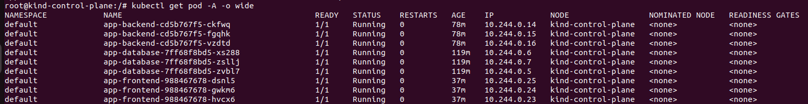
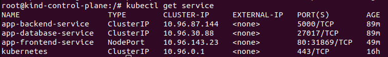
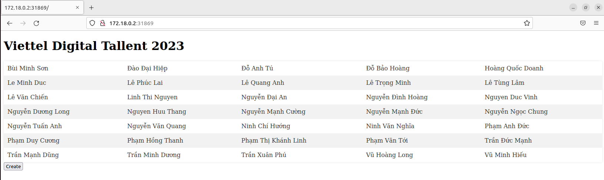
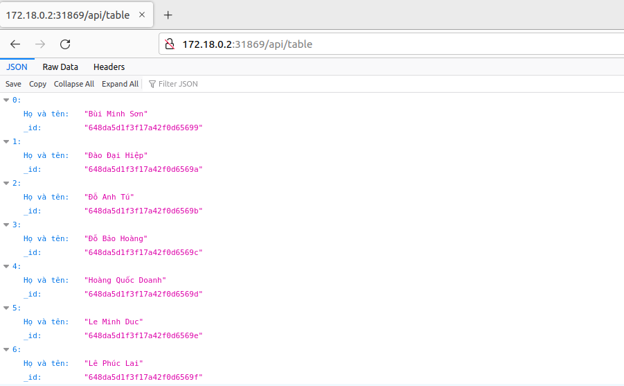

Assignment: Deploy a Multi-tier Application on Kubernetes

Objective:
The objective of this assignment is to apply the concepts learned in the hands-on labs and deploy a multi-tier application on Kubernetes. The application consists of a frontend web server, a backend API server, and a database.

Instructions:
1. Design and create the necessary YAML files to deploy the following components:
   - Frontend Deployment and Service: Deploy a frontend web server (e.g., Nginx) with multiple replicas. Expose the frontend service to access it from outside the cluster.
   - Backend Deployment and Service: Deploy a backend API server (e.g., Node.js, Flask, or any other framework) with multiple replicas. Expose the backend service within the cluster.
   - Database Deployment and Service: Deploy a database (e.g., MySQL or PostgreSQL) with persistent storage for data persistence. Expose the database service within the cluster.

2. Configure the appropriate networking between the frontend, backend, and database components.
   - The frontend should be able to communicate with the backend API server.
   - The backend API server should be able to access the database for data storage and retrieval.

3. Test the application by accessing the frontend web server from outside the cluster and verifying that it communicates with the backend API server and retrieves data from the database.

4. Document the steps followed to deploy the application, including the YAML files created and any necessary configuration details.

5. Submit the documentation and the YAML files as the assignment deliverables.

Result

We use the docker images from the midterm tasks to complete this task:
    
    - Backend: Flask
    - Frontend: Nginx
    - Database: Mongodb

- Backend
```
apiVersion: apps/v1
kind: Deployment
metadata:
  name: app-backend
spec:
  replicas: 3
  selector:
    matchLabels:
      app: backend
  template:
    metadata:
      labels:
        app: backend
    spec:
      containers:
      - name: backend
        image: flask_app:1.3
        env:
          - name: COLOR
            value: "black"
        ports:
        - containerPort: 5000

---

apiVersion: v1
kind: Service
metadata:
  name: app-backend-service
spec:
  selector:
    app: backend
  ports:
    - protocol: TCP
      port: 5000
      targetPort: 5000
  type: ClusterIP

``` 

- Frontend 
```
apiVersion: apps/v1
kind: Deployment
metadata:
  name: app-frontend
spec:
  replicas: 3
  selector:
    matchLabels:
      app: nginx
  template:
    metadata:
      labels:
        app: nginx
    spec:
      containers:
      - name: nginx
        image: app_nginx:1.2
        ports:
        - containerPort: 80
---
apiVersion: v1
kind: Service
metadata:
  name: app-frontend-service
spec:
  selector:
    app: nginx
  ports:
    - protocol: TCP
      port: 80
      targetPort: 80
  type: NodePort
```
- Database
```
apiVersion: apps/v1
kind: Deployment
metadata:
  name: app-database
spec:
  replicas: 3
  selector:
    matchLabels:
      app: database
  template:
    metadata:
      labels:
        app: database
    spec:
      containers:
      - name: database
        image: mongo:5.0.17
        ports:
        - containerPort: 27017

---

apiVersion: v1
kind: Service
metadata:
  name: app-database-service
spec:
  selector:
    app: database
  ports:
    - protocol: TCP
      port: 27017
      targetPort: 27017
  type: ClusterIP
```

Each of the service setup with 3 replica set to ensure HA. `Backend` and `Database` setup with `ClusterIP` service to ensure internal communication between pods. `Frontend` setup with `NodePort` to allow access from outside the cluster.

<div align="center">
  
</div>

<div align="center">
  <i>Pic. 1 - running pods</i>
</div>

<div align="center">
  
</div>

<div align="center">
  <i>Pic. 2 - running services</i>
</div>

<div align="center">
  
</div>

<div align="center">
  <i>Pic. 3 - outside access</i>
</div>

<div align="center">
  
</div>

<div align="center">
  <i>Pic. 4 - outside access api</i>
</div>
