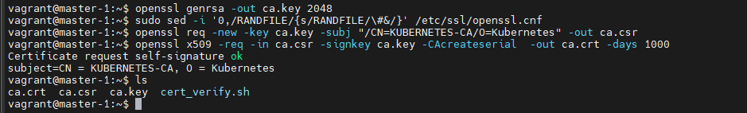
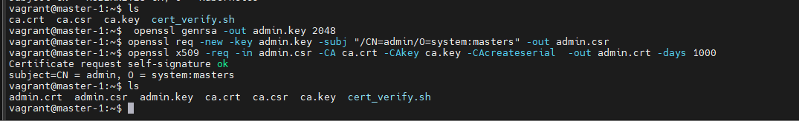
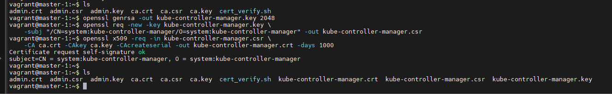

> This tutorial is a modified version of the original developed by [Kelsey Hightower](https://github.com/kelseyhightower/kubernetes-the-hard-way).

# Table of contents:
# [1. Prerequisites](#1-prerequisites-1)
# [2. Provisioning Resources](#2-provisioning-resources-1)
# [3. Installing the Client Tools](#3-installing-the-client-tools-1)
# [4. Provisioning a CA and Generating TLS Certificates](#4-provisioning-a-ca-and-generating-tls-certificates-1)
# [5. Generating Kubernetes Configuration Files for Authentication](#5-generating-kubernetes-configuration-files-for-authentication-1)
# [6. Generating the Data Encryption Config and Key](#6-generating-the-data-encryption-config-and-key-1)
# [7. Bootstrapping the etcd Cluster](#7-bootstrapping-the-etcd-cluster-1)
# [8. Bootstrapping the Kubernetes Control Plane](#8-bootstrapping-the-kubernetes-control-plane-1)
# [9. Installing CRI on the Kubernetes Worker Nodes](#9-installing-cri-on-the-kubernetes-worker-nodes-1)
# [10. Bootstrapping the Kubernetes Worker Nodes](#10-bootstrapping-the-kubernetes-worker-nodes-1)
# [11. TLS Bootstrapping Worker Nodes](#11-tls-bootstrapping-worker-nodes-1)
# [12. Configuring kubectl for Remote Access](#12-configuring-kubectl-for-remote-access-1)
# [13.Provisioning Pod Network](#13provisioning-pod-network-1)
# [14. RBAC for Kubelet Authorization](#14-rbac-for-kubelet-authorization-1)
# [15. Deploying the DNS Cluster Add-on](#15-deploying-the-dns-cluster-add-on-1)
# [16. Smoke Test](#16-smoke-test-1)


# Kubernetes The Hard Way On VirtualBox

This project walks us through setting up Kubernetes-the-hard-way on a local machine using VirtualBox.


Please note that with this particular challenge, it is all about the minute detail. If you miss one tiny step anywhere along the way, it's going to break!

Always run the `cert_verify` script at the places it suggests, and always ensure you are on the correct node when you do stuff. If `cert_verify` shows anything in red, then you have made an error in a previous step. For the master node checks, run the check on `master-1` and on `master-2`


## Cluster Details

Kubernetes The Hard Way guides you through bootstrapping a highly available Kubernetes cluster with end-to-end encryption between components and RBAC authentication.

* [Kubernetes](https://github.com/kubernetes/kubernetes) 1.24.3
* [Container Runtime](https://github.com/containerd/containerd) 1.5.9
* [CNI Container Networking](https://github.com/containernetworking/cni) 0.8.6
* [Weave Networking](https://www.weave.works/docs/net/latest/kubernetes/kube-addon/)
* [etcd](https://github.com/coreos/etcd) v3.5.3
* [CoreDNS](https://github.com/coredns/coredns) v1.9.4

### Node configuration

We will be building the following:

* Two control plane nodes (`master-1` and `master-2`) running the control plane components as operating system services.
* Two worker nodes (`worker-1` and `worker-2`)
* One loadbalancer VM running HAProxy to balance requests between the two API servers.

# 1. Prerequisites

## VM hardware Requirements
6 GB of RAM (Preferably 16 GB)
50 GB Disk space
## VirtualBox

Download and Install [VirtualBox](https://www.virtualbox.org/wiki/Downloads).

## Vagrant

Vagrant provides an easier way to deploy multiple virtual machines on VirtualBox more consistently.

Download and Install [Vagrant](https://www.vagrantup.com/) on our platform.

## The project defaults

The project have been configured with the following networking defaults.

```bash
# stop and terminate use off all resources
vagrant destroy -f 

# create and configure guest machine according to vagrant file
vagrant up
```

### VM network

The networks used by the VirtualBox VM is `192.168.56.0/24`.

### Pod Network

The network used to assign IP addresses to pods is `10.244.0.0/16` - this is default in K8s.

### Service Network

The network used to assign IP addresses to Cluster IP is `10.96.0.0/16`.


# 2. Provisioning Resources

CD into vagrant directory

```bash
cd Viettel-Digital-Talent-2023/5. Kubernetes-the-hard-way/Le-Trong-Minh/vagrant

vagrant up
```


- Deploys 5 VMs - 2 Master, 2 Worker and 1 Loadbalancer with the name 'kubernetes-ha-* '

- Set's IP addresses in the range 192.168.56

    | VM            |  VM Name               | Purpose       | IP            | Forwarded Port   | RAM  |
    | ------------  | ---------------------- |:-------------:| -------------:| ----------------:|-----:|
    | master-1      | kubernetes-ha-master-1 | Master        | 192.168.56.11 |     2711         | 2048 |
    | master-2      | kubernetes-ha-master-2 | Master        | 192.168.56.12 |     2712         | 1024 |
    | worker-1      | kubernetes-ha-worker-1 | Worker        | 192.168.56.21 |     2721         | 512  |
    | worker-2      | kubernetes-ha-worker-2 | Worker        | 192.168.56.22 |     2722         | 1024 |
    | loadbalancer  | kubernetes-ha-lb       | LoadBalancer  | 192.168.56.30 |     2730         | 1024 |

- Add's a DNS entry to each of the nodes to access internet
    > DNS: 8.8.8.8

# 3. Installing the Client Tools

## Access all VMs

Here we create an SSH key pair for the `vagrant` user who we are logged in as. We will copy the public key of this pair to the other master and both workers to permit us to use password-less SSH (and SCP) go get from `master-1` to these other nodes in the context of the `vagrant` user which exists on all nodes.

Generate Key Pair on `master-1` node

```bash
ssh-keygen
```

Leave all settings to default.

View the generated public key ID at:

```bash
cat ~/.ssh/id_rsa.pub
```
Add this key to the local authorized_keys (`master-1`) as in some commands we scp to ourself

```bash
cat ~/.ssh/id_rsa.pub >> ~/.ssh/authorized_keys
```

Copy the output and form it into the following command:

```bash
cat >> ~/.ssh/authorized_keys <<EOF
<public-key>
EOF
```


Now ssh to each of the other nodes and paste the above at each command prompt.


## Install kubectl

```bash
wget https://storage.googleapis.com/kubernetes-release/release/v1.24.3/bin/linux/amd64/kubectl
chmod +x kubectl
sudo mv kubectl /usr/local/bin/
```

### Verification

Verify `kubectl` version 1.24.3 or higher is installed:

```
kubectl version -o yaml
```


# 4. Provisioning a CA and Generating TLS Certificates


In this lab you will provision a [PKI Infrastructure](https://en.wikipedia.org/wiki/Public_key_infrastructure) using the popular openssl tool, then use it to bootstrap a Certificate Authority, and generate TLS certificates for the following components: etcd, kube-apiserver, kube-controller-manager, kube-scheduler, kubelet, and kube-proxy.


On `master-1`

## Certificate Authority

Set up environment variables.

```bash
MASTER_1=$(dig +short master-1)
MASTER_2=$(dig +short master-2)
LOADBALANCER=$(dig +short loadbalancer)
```

Compute cluster internal API server service address, which is always .1 in the service CIDR range. This is also required as a SAN in the API server certificate:

```bash
SERVICE_CIDR=10.96.0.0/24
API_SERVICE=$(echo $SERVICE_CIDR | awk 'BEGIN {FS="."} ; { printf("%s.%s.%s.1", $1, $2, $3) }')
```

Check that the environment variables are set:

```bash
echo $MASTER_1
echo $MASTER_2
echo $LOADBALANCER
echo $SERVICE_CIDR
echo $API_SERVICE
```


Create a CA certificate, then generate a Certificate Signing Request and use it to create a private key:


```bash
{
  # Create private key for CA
  openssl genrsa -out ca.key 2048

  # Comment line starting with RANDFILE in /etc/ssl/openssl.cnf definition to avoid permission issues
  sudo sed -i '0,/RANDFILE/{s/RANDFILE/\#&/}' /etc/ssl/openssl.cnf

  # Create CSR using the private key
  openssl req -new -key ca.key -subj "/CN=KUBERNETES-CA/O=Kubernetes" -out ca.csr

  # Self sign the csr using its own private key
  openssl x509 -req -in ca.csr -signkey ca.key -CAcreateserial  -out ca.crt -days 1000
}
```



## Client and Server Certificates
### The Admin Client Certificate

Generate the `admin` client certificate and private key:

```bash
{
  # Generate private key for admin user
  openssl genrsa -out admin.key 2048

  # Generate CSR for admin user. Note the OU.
  openssl req -new -key admin.key -subj "/CN=admin/O=system:masters" -out admin.csr

  # Sign certificate for admin user using CA servers private key
  openssl x509 -req -in admin.csr -CA ca.crt -CAkey ca.key -CAcreateserial  -out admin.crt -days 1000
}
```




### The Kubelet Client Certificates
### The Controller Manager Client Certificate

Generate the `kube-controller-manager` client certificate and private key:

```bash
{
  openssl genrsa -out kube-controller-manager.key 2048

  openssl req -new -key kube-controller-manager.key \
    -subj "/CN=system:kube-controller-manager/O=system:kube-controller-manager" -out kube-controller-manager.csr

  openssl x509 -req -in kube-controller-manager.csr \
    -CA ca.crt -CAkey ca.key -CAcreateserial -out kube-controller-manager.crt -days 1000
}
```


### The Kube Proxy Client Certificate

Generate the `kube-proxy` client certificate and private key:


```bash
{
  openssl genrsa -out kube-proxy.key 2048

  openssl req -new -key kube-proxy.key \
    -subj "/CN=system:kube-proxy/O=system:node-proxier" -out kube-proxy.csr

  openssl x509 -req -in kube-proxy.csr \
    -CA ca.crt -CAkey ca.key -CAcreateserial  -out kube-proxy.crt -days 1000
}
```


### The Scheduler Client Certificate

Generate the `kube-scheduler` client certificate and private key:


```bash
{
  openssl genrsa -out kube-scheduler.key 2048

  openssl req -new -key kube-scheduler.key \
    -subj "/CN=system:kube-scheduler/O=system:kube-scheduler" -out kube-scheduler.csr

  openssl x509 -req -in kube-scheduler.csr -CA ca.crt -CAkey ca.key -CAcreateserial  -out kube-scheduler.crt -days 1000
}
```


### The Kubernetes API Server Certificate
```bash
cat > openssl.cnf <<EOF
[req]
req_extensions = v3_req
distinguished_name = req_distinguished_name
[req_distinguished_name]
[v3_req]
basicConstraints = critical, CA:FALSE
keyUsage = critical, nonRepudiation, digitalSignature, keyEncipherment
extendedKeyUsage = serverAuth
subjectAltName = @alt_names
[alt_names]
DNS.1 = kubernetes
DNS.2 = kubernetes.default
DNS.3 = kubernetes.default.svc
DNS.4 = kubernetes.default.svc.cluster
DNS.5 = kubernetes.default.svc.cluster.local
IP.1 = ${API_SERVICE}
IP.2 = ${MASTER_1}
IP.3 = ${MASTER_2}
IP.4 = ${LOADBALANCER}
IP.5 = 127.0.0.1
EOF
```

Generate certs for kube-apiserver

```bash
{
  openssl genrsa -out kube-apiserver.key 2048

  openssl req -new -key kube-apiserver.key \
    -subj "/CN=kube-apiserver/O=Kubernetes" -out kube-apiserver.csr -config openssl.cnf

  openssl x509 -req -in kube-apiserver.csr \
  -CA ca.crt -CAkey ca.key -CAcreateserial  -out kube-apiserver.crt -extensions v3_req -extfile openssl.cnf -days 1000
}
```


# The Kubelet Client Certificate

This certificate is for the api server to authenticate with the kubelets when it requests information from them

```bash
cat > openssl-kubelet.cnf <<EOF
[req]
req_extensions = v3_req
distinguished_name = req_distinguished_name
[req_distinguished_name]
[v3_req]
basicConstraints = critical, CA:FALSE
keyUsage = critical, nonRepudiation, digitalSignature, keyEncipherment
extendedKeyUsage = clientAuth
EOF
```

Generate certs for kubelet authentication

```bash
{
  openssl genrsa -out apiserver-kubelet-client.key 2048

  openssl req -new -key apiserver-kubelet-client.key \
    -subj "/CN=kube-apiserver-kubelet-client/O=system:masters" -out apiserver-kubelet-client.csr -config openssl-kubelet.cnf

  openssl x509 -req -in apiserver-kubelet-client.csr \
  -CA ca.crt -CAkey ca.key -CAcreateserial  -out apiserver-kubelet-client.crt -extensions v3_req -extfile openssl-kubelet.cnf -days 1000
}
```


### The ETCD Server Certificate

Similarly ETCD server certificate must have addresses of all the servers part of the ETCD cluster

The `openssl` command cannot take alternate names as command line parameter. So we must create a `conf` file for it:

```bash
cat > openssl-etcd.cnf <<EOF
[req]
req_extensions = v3_req
distinguished_name = req_distinguished_name
[req_distinguished_name]
[ v3_req ]
basicConstraints = CA:FALSE
keyUsage = nonRepudiation, digitalSignature, keyEncipherment
subjectAltName = @alt_names
[alt_names]
IP.1 = ${MASTER_1}
IP.2 = ${MASTER_2}
IP.3 = 127.0.0.1
EOF
```

Generates certs for ETCD

```bash
{
  openssl genrsa -out etcd-server.key 2048

  openssl req -new -key etcd-server.key \
    -subj "/CN=etcd-server/O=Kubernetes" -out etcd-server.csr -config openssl-etcd.cnf

  openssl x509 -req -in etcd-server.csr \
    -CA ca.crt -CAkey ca.key -CAcreateserial  -out etcd-server.crt -extensions v3_req -extfile openssl-etcd.cnf -days 1000
}
```


## The Service Account Key Pair

The Kubernetes Controller Manager leverages a key pair to generate and sign service account tokens as describe in the [managing service accounts](https://kubernetes.io/docs/admin/service-accounts-admin/) documentation.

Generate the `service-account` certificate and private key:

```bash
{
  openssl genrsa -out service-account.key 2048

  openssl req -new -key service-account.key \
    -subj "/CN=service-accounts/O=Kubernetes" -out service-account.csr

  openssl x509 -req -in service-account.csr \
    -CA ca.crt -CAkey ca.key -CAcreateserial  -out service-account.crt -days 1000
}
```


## Verify the PKI


## Distribute the Certificates

Copy the appropriate certificates and private keys to each instance:

```bash
{
for instance in master-1 master-2; do
  scp ca.crt ca.key kube-apiserver.key kube-apiserver.crt \
    apiserver-kubelet-client.crt apiserver-kubelet-client.key \
    service-account.key service-account.crt \
    etcd-server.key etcd-server.crt \
    kube-controller-manager.key kube-controller-manager.crt \
    kube-scheduler.key kube-scheduler.crt \
    ${instance}:~/
done

for instance in worker-1 worker-2 ; do
  scp ca.crt kube-proxy.crt kube-proxy.key ${instance}:~/
done
}
```


# 5. Generating Kubernetes Configuration Files for Authentication

In this lab you will generate [Kubernetes configuration files](https://kubernetes.io/docs/concepts/configuration/organize-cluster-access-kubeconfig/), also known as "kubeconfigs", which enable Kubernetes clients to locate and authenticate to the Kubernetes API Servers.

## Client Authentication Configs

In this section you will generate kubeconfig files for the `controller manager`, `kube-proxy`, `scheduler` clients and the `admin` user.

On `master-1`

### Kubernetes Public IP Address

```bash
LOADBALANCER=$(dig +short loadbalancer)
```

### The kube-proxy Kubernetes Configuration File

Generate a kubeconfig file for the `kube-proxy` service:

```bash
{
  kubectl config set-cluster kubernetes-the-hard-way \
    --certificate-authority=/var/lib/kubernetes/pki/ca.crt \
    --server=https://${LOADBALANCER}:6443 \
    --kubeconfig=kube-proxy.kubeconfig

  kubectl config set-credentials system:kube-proxy \
    --client-certificate=/var/lib/kubernetes/pki/kube-proxy.crt \
    --client-key=/var/lib/kubernetes/pki/kube-proxy.key \
    --kubeconfig=kube-proxy.kubeconfig

  kubectl config set-context default \
    --cluster=kubernetes-the-hard-way \
    --user=system:kube-proxy \
    --kubeconfig=kube-proxy.kubeconfig

  kubectl config use-context default --kubeconfig=kube-proxy.kubeconfig
}
```


### The kube-controller-manager Kubernetes Configuration File

Generate a kubeconfig file for the `kube-controller-manager` service:

```bash
{
  kubectl config set-cluster kubernetes-the-hard-way \
    --certificate-authority=/var/lib/kubernetes/pki/ca.crt \
    --server=https://127.0.0.1:6443 \
    --kubeconfig=kube-controller-manager.kubeconfig

  kubectl config set-credentials system:kube-controller-manager \
    --client-certificate=/var/lib/kubernetes/pki/kube-controller-manager.crt \
    --client-key=/var/lib/kubernetes/pki/kube-controller-manager.key \
    --kubeconfig=kube-controller-manager.kubeconfig

  kubectl config set-context default \
    --cluster=kubernetes-the-hard-way \
    --user=system:kube-controller-manager \
    --kubeconfig=kube-controller-manager.kubeconfig

  kubectl config use-context default --kubeconfig=kube-controller-manager.kubeconfig
}
```


### The kube-scheduler Kubernetes Configuration File

Generate a kubeconfig file for the `kube-scheduler` service:

```bash
{
  kubectl config set-cluster kubernetes-the-hard-way \
    --certificate-authority=/var/lib/kubernetes/pki/ca.crt \
    --server=https://127.0.0.1:6443 \
    --kubeconfig=kube-scheduler.kubeconfig

  kubectl config set-credentials system:kube-scheduler \
    --client-certificate=/var/lib/kubernetes/pki/kube-scheduler.crt \
    --client-key=/var/lib/kubernetes/pki/kube-scheduler.key \
    --kubeconfig=kube-scheduler.kubeconfig

  kubectl config set-context default \
    --cluster=kubernetes-the-hard-way \
    --user=system:kube-scheduler \
    --kubeconfig=kube-scheduler.kubeconfig

  kubectl config use-context default --kubeconfig=kube-scheduler.kubeconfig
}
```


### The admin Kubernetes Configuration File

Generate a kubeconfig file for the `admin` user:

```bash
{
  kubectl config set-cluster kubernetes-the-hard-way \
    --certificate-authority=ca.crt \
    --embed-certs=true \
    --server=https://127.0.0.1:6443 \
    --kubeconfig=admin.kubeconfig

  kubectl config set-credentials admin \
    --client-certificate=admin.crt \
    --client-key=admin.key \
    --embed-certs=true \
    --kubeconfig=admin.kubeconfig

  kubectl config set-context default \
    --cluster=kubernetes-the-hard-way \
    --user=admin \
    --kubeconfig=admin.kubeconfig

  kubectl config use-context default --kubeconfig=admin.kubeconfig
}
```


## Distribute the Kubernetes Configuration Files

Copy the appropriate `kube-proxy` kubeconfig files to each worker instance:

```bash
for instance in worker-1 worker-2; do
  scp kube-proxy.kubeconfig ${instance}:~/
done
```

Copy the appropriate `admin.kubeconfig`, `kube-controller-manager` and `kube-scheduler` kubeconfig files to each controller instance:

```bash
for instance in master-1 master-2; do
  scp admin.kubeconfig kube-controller-manager.kubeconfig kube-scheduler.kubeconfig ${instance}:~/
done
```


# 6. Generating the Data Encryption Config and Key

Kubernetes stores a variety of data including cluster state, application configurations, and secrets. Kubernetes supports the ability to [encrypt](https://kubernetes.io/docs/tasks/administer-cluster/encrypt-data) cluster data at rest, that is, the data stored within `etcd`.

On `master-1`

## The Encryption Key


Generate an encryption key:

```bash
ENCRYPTION_KEY=$(head -c 32 /dev/urandom | base64)
```

## The Encryption Config File

Create the `encryption-config.yaml` encryption config file:

```bash
cat > encryption-config.yaml <<EOF
kind: EncryptionConfig
apiVersion: v1
resources:
  - resources:
      - secrets
    providers:
      - aescbc:
          keys:
            - name: key1
              secret: ${ENCRYPTION_KEY}
      - identity: {}
EOF
```

Copy the `encryption-config.yaml` encryption config file to each controller instance:

```bash
for instance in master-1 master-2; do
  scp encryption-config.yaml ${instance}:~/
done
```

Move `encryption-config.yaml` encryption config file to appropriate directory.

```bash
for instance in master-1 master-2; do
  ssh ${instance} sudo mkdir -p /var/lib/kubernetes/
  ssh ${instance} sudo mv encryption-config.yaml /var/lib/kubernetes/
done
```


# 7. Bootstrapping the etcd Cluster

Kubernetes components are stateless and store cluster state in [etcd](https://etcd.io/). In this lab you will bootstrap a two node etcd cluster and configure it for high availability and secure remote access.

### Running commands in parallel `master-1` and `master-2`

## Bootstrapping an etcd Cluster Member

### Download and Install the etcd Binaries

Download the official etcd release binaries from the [etcd](https://github.com/etcd-io/etcd) GitHub project:

[//]: # (host:master-1-master2)


```bash
wget -q --show-progress --https-only --timestamping \
  "https://github.com/coreos/etcd/releases/download/v3.5.3/etcd-v3.5.3-linux-amd64.tar.gz"
```

Extract and install the `etcd` server and the `etcdctl` command line utility:

```bash
{
  tar -xvf etcd-v3.5.3-linux-amd64.tar.gz
  sudo mv etcd-v3.5.3-linux-amd64/etcd* /usr/local/bin/
}
```

### Configure the etcd Server

Copy and secure certificates. Note that we place `ca.crt` in our main PKI directory and link it from etcd to not have multiple copies of the cert lying around.

```bash
{
  sudo mkdir -p /etc/etcd /var/lib/etcd /var/lib/kubernetes/pki
  sudo cp etcd-server.key etcd-server.crt /etc/etcd/
  sudo cp ca.crt /var/lib/kubernetes/pki/
  sudo chown root:root /etc/etcd/*
  sudo chmod 600 /etc/etcd/*
  sudo chown root:root /var/lib/kubernetes/pki/*
  sudo chmod 600 /var/lib/kubernetes/pki/*
  sudo ln -s /var/lib/kubernetes/pki/ca.crt /etc/etcd/ca.crt
}
```

The instance internal IP address will be used to serve client requests and communicate with etcd cluster peers.<br>
Retrieve the internal IP address of the master(etcd) nodes, and also that of master-1 and master-2 for the etcd cluster member list

```bash
INTERNAL_IP=$(ip addr show enp0s8 | grep "inet " | awk '{print $2}' | cut -d / -f 1)
MASTER_1=$(dig +short master-1)
MASTER_2=$(dig +short master-2)
```

Each etcd member must have a unique name within an etcd cluster. Set the etcd name to match the hostname of the current compute instance:

```bash
ETCD_NAME=$(hostname -s)
```

Create the `etcd.service` systemd unit file:

```bash
cat <<EOF | sudo tee /etc/systemd/system/etcd.service
[Unit]
Description=etcd
Documentation=https://github.com/coreos

[Service]
ExecStart=/usr/local/bin/etcd \\
  --name ${ETCD_NAME} \\
  --cert-file=/etc/etcd/etcd-server.crt \\
  --key-file=/etc/etcd/etcd-server.key \\
  --peer-cert-file=/etc/etcd/etcd-server.crt \\
  --peer-key-file=/etc/etcd/etcd-server.key \\
  --trusted-ca-file=/etc/etcd/ca.crt \\
  --peer-trusted-ca-file=/etc/etcd/ca.crt \\
  --peer-client-cert-auth \\
  --client-cert-auth \\
  --initial-advertise-peer-urls https://${INTERNAL_IP}:2380 \\
  --listen-peer-urls https://${INTERNAL_IP}:2380 \\
  --listen-client-urls https://${INTERNAL_IP}:2379,https://127.0.0.1:2379 \\
  --advertise-client-urls https://${INTERNAL_IP}:2379 \\
  --initial-cluster-token etcd-cluster-0 \\
  --initial-cluster master-1=https://${MASTER_1}:2380,master-2=https://${MASTER_2}:2380 \\
  --initial-cluster-state new \\
  --data-dir=/var/lib/etcd
Restart=on-failure
RestartSec=5

[Install]
WantedBy=multi-user.target
EOF
```

### Start the etcd Server

```bash
{
  sudo systemctl daemon-reload
  sudo systemctl enable etcd
  sudo systemctl start etcd
}
```
## Verification

List the etcd cluster members:

```bash
sudo ETCDCTL_API=3 etcdctl member list \
  --endpoints=https://127.0.0.1:2379 \
  --cacert=/etc/etcd/ca.crt \
  --cert=/etc/etcd/etcd-server.crt \
  --key=/etc/etcd/etcd-server.key
```


# 8. Bootstrapping the Kubernetes Control Plane

### Running commands in parallel `master-1` and `master-2`

### Download and Install the Kubernetes Controller Binaries

Download the official Kubernetes release binaries:

```bash
wget -q --show-progress --https-only --timestamping \
  "https://storage.googleapis.com/kubernetes-release/release/v1.24.3/bin/linux/amd64/kube-apiserver" \
  "https://storage.googleapis.com/kubernetes-release/release/v1.24.3/bin/linux/amd64/kube-controller-manager" \
  "https://storage.googleapis.com/kubernetes-release/release/v1.24.3/bin/linux/amd64/kube-scheduler" \
  "https://storage.googleapis.com/kubernetes-release/release/v1.24.3/bin/linux/amd64/kubectl"
```

Reference: https://kubernetes.io/releases/download/#binaries

Install the Kubernetes binaries:

```bash
{
  chmod +x kube-apiserver kube-controller-manager kube-scheduler kubectl
  sudo mv kube-apiserver kube-controller-manager kube-scheduler kubectl /usr/local/bin/
}
```

### Configure the Kubernetes API Server

Place the key pairs into the kubernetes data directory and secure

```bash
{
  sudo mkdir -p /var/lib/kubernetes/pki

  # Only copy CA keys as we'll need them again for workers.
  sudo cp ca.crt ca.key /var/lib/kubernetes/pki
  for c in kube-apiserver service-account apiserver-kubelet-client etcd-server kube-scheduler kube-controller-manager
  do
    sudo mv "$c.crt" "$c.key" /var/lib/kubernetes/pki/
  done
  sudo chown root:root /var/lib/kubernetes/pki/*
  sudo chmod 600 /var/lib/kubernetes/pki/*
}
```

The instance internal IP address will be used to advertise the API Server to members of the cluster. The load balancer IP address will be used as the external endpoint to the API servers.<br>
Retrieve these internal IP addresses:

```bash
INTERNAL_IP=$(ip addr show enp0s8 | grep "inet " | awk '{print $2}' | cut -d / -f 1)
LOADBALANCER=$(dig +short loadbalancer)
```

IP addresses of the two master nodes, where the etcd servers are.

```bash
MASTER_1=$(dig +short master-1)
MASTER_2=$(dig +short master-2)
```

CIDR ranges used *within* the cluster

```bash
POD_CIDR=10.244.0.0/16
SERVICE_CIDR=10.96.0.0/16
```

Create the `kube-apiserver.service` systemd unit file:

```bash
cat <<EOF | sudo tee /etc/systemd/system/kube-apiserver.service
[Unit]
Description=Kubernetes API Server
Documentation=https://github.com/kubernetes/kubernetes

[Service]
ExecStart=/usr/local/bin/kube-apiserver \\
  --advertise-address=${INTERNAL_IP} \\
  --allow-privileged=true \\
  --apiserver-count=2 \\
  --audit-log-maxage=30 \\
  --audit-log-maxbackup=3 \\
  --audit-log-maxsize=100 \\
  --audit-log-path=/var/log/audit.log \\
  --authorization-mode=Node,RBAC \\
  --bind-address=0.0.0.0 \\
  --client-ca-file=/var/lib/kubernetes/pki/ca.crt \\
  --enable-admission-plugins=NodeRestriction,ServiceAccount \\
  --enable-bootstrap-token-auth=true \\
  --etcd-cafile=/var/lib/kubernetes/pki/ca.crt \\
  --etcd-certfile=/var/lib/kubernetes/pki/etcd-server.crt \\
  --etcd-keyfile=/var/lib/kubernetes/pki/etcd-server.key \\
  --etcd-servers=https://${MASTER_1}:2379,https://${MASTER_2}:2379 \\
  --event-ttl=1h \\
  --encryption-provider-config=/var/lib/kubernetes/encryption-config.yaml \\
  --kubelet-certificate-authority=/var/lib/kubernetes/pki/ca.crt \\
  --kubelet-client-certificate=/var/lib/kubernetes/pki/apiserver-kubelet-client.crt \\
  --kubelet-client-key=/var/lib/kubernetes/pki/apiserver-kubelet-client.key \\
  --runtime-config=api/all=true \\
  --service-account-key-file=/var/lib/kubernetes/pki/service-account.crt \\
  --service-account-signing-key-file=/var/lib/kubernetes/pki/service-account.key \\
  --service-account-issuer=https://${LOADBALANCER}:6443 \\
  --service-cluster-ip-range=${SERVICE_CIDR} \\
  --service-node-port-range=30000-32767 \\
  --tls-cert-file=/var/lib/kubernetes/pki/kube-apiserver.crt \\
  --tls-private-key-file=/var/lib/kubernetes/pki/kube-apiserver.key \\
  --v=2
Restart=on-failure
RestartSec=5

[Install]
WantedBy=multi-user.target
EOF
```

### Configure the Kubernetes Controller Manager

Move the `kube-controller-manager` kubeconfig into place:

```bash
sudo mv kube-controller-manager.kubeconfig /var/lib/kubernetes/
```

Create the `kube-controller-manager.service` systemd unit file:

```bash
cat <<EOF | sudo tee /etc/systemd/system/kube-controller-manager.service
[Unit]
Description=Kubernetes Controller Manager
Documentation=https://github.com/kubernetes/kubernetes

[Service]
ExecStart=/usr/local/bin/kube-controller-manager \\
  --allocate-node-cidrs=true \\
  --authentication-kubeconfig=/var/lib/kubernetes/kube-controller-manager.kubeconfig \\
  --authorization-kubeconfig=/var/lib/kubernetes/kube-controller-manager.kubeconfig \\
  --bind-address=127.0.0.1 \\
  --client-ca-file=/var/lib/kubernetes/pki/ca.crt \\
  --cluster-cidr=${POD_CIDR} \\
  --cluster-name=kubernetes \\
  --cluster-signing-cert-file=/var/lib/kubernetes/pki/ca.crt \\
  --cluster-signing-key-file=/var/lib/kubernetes/pki/ca.key \\
  --controllers=*,bootstrapsigner,tokencleaner \\
  --kubeconfig=/var/lib/kubernetes/kube-controller-manager.kubeconfig \\
  --leader-elect=true \\
  --node-cidr-mask-size=24 \\
  --requestheader-client-ca-file=/var/lib/kubernetes/pki/ca.crt \\
  --root-ca-file=/var/lib/kubernetes/pki/ca.crt \\
  --service-account-private-key-file=/var/lib/kubernetes/pki/service-account.key \\
  --service-cluster-ip-range=${SERVICE_CIDR} \\
  --use-service-account-credentials=true \\
  --v=2
Restart=on-failure
RestartSec=5

[Install]
WantedBy=multi-user.target
EOF
```

### Configure the Kubernetes Scheduler

Move the `kube-scheduler` kubeconfig into place:

```bash
sudo mv kube-scheduler.kubeconfig /var/lib/kubernetes/
```

Create the `kube-scheduler.service` systemd unit file:

```bash
cat <<EOF | sudo tee /etc/systemd/system/kube-scheduler.service
[Unit]
Description=Kubernetes Scheduler
Documentation=https://github.com/kubernetes/kubernetes

[Service]
ExecStart=/usr/local/bin/kube-scheduler \\
  --kubeconfig=/var/lib/kubernetes/kube-scheduler.kubeconfig \\
  --leader-elect=true \\
  --v=2
Restart=on-failure
RestartSec=5

[Install]
WantedBy=multi-user.target
EOF
```

## Secure kubeconfigs

```bash
sudo chmod 600 /var/lib/kubernetes/*.kubeconfig
```

## Check Certificates and kubeconfigs

At `master-1` and `master-2` nodes, run the following, selecting option 3

```bash
./cert_verify.sh
```


### Start the Controller Services

```bash
{
  sudo systemctl daemon-reload
  sudo systemctl enable kube-apiserver kube-controller-manager kube-scheduler
  sudo systemctl start kube-apiserver kube-controller-manager kube-scheduler
}
```

> Allow up to 10 seconds for the Kubernetes API Server to fully initialize.


### Verification


```bash
kubectl get componentstatuses --kubeconfig admin.kubeconfig
```


## The Kubernetes Frontend Load Balancer

On `loadbalancer`
### Provision a Network Load Balancer

```bash
sudo apt-get update && sudo apt-get install -y haproxy
```

Read IP addresses of master nodes and this host to shell variables

```bash
MASTER_1=$(dig +short master-1)
MASTER_2=$(dig +short master-2)
LOADBALANCER=$(dig +short loadbalancer)
```

Create HAProxy configuration to listen on API server port on this host and distribute requests evently to the two master nodes.

```bash
cat <<EOF | sudo tee /etc/haproxy/haproxy.cfg
frontend kubernetes
    bind ${LOADBALANCER}:6443
    option tcplog
    mode tcp
    default_backend kubernetes-master-nodes

backend kubernetes-master-nodes
    mode tcp
    balance roundrobin
    option tcp-check
    server master-1 ${MASTER_1}:6443 check fall 3 rise 2
    server master-2 ${MASTER_2}:6443 check fall 3 rise 2
EOF
```

```bash
sudo systemctl restart haproxy
```

### Verification


Make a HTTP request for the Kubernetes version info:

```bash
curl  https://${LOADBALANCER}:6443/version -k
```


# 9. Installing CRI on the Kubernetes Worker Nodes

Install the Container Runtime Interface (CRI) on both worker nodes. CRI is a standard interface for the management of containers. Since v1.24 the use of dockershim has been fully deprecated and removed from the code base. [containerd replaces docker](https://kodekloud.com/blog/kubernetes-removed-docker-what-happens-now/) as the container runtime for Kubernetes, and it requires support from [CNI Plugins](https://github.com/containernetworking/plugins) to configure container networks, and [runc](https://github.com/opencontainers/runc) to actually do the job of running containers.

Reference: https://github.com/containerd/containerd/blob/main/docs/getting-started.md


### Download and Install Container Networking

The commands in this lab must be run on each worker instance: `worker-1`, and `worker-2`. Login to each controller instance using SSH Terminal.

The versions chosen here align with those that are installed by the current `kubernetes-cni` package for a v1.24 cluster.

```bash
{
  CONTAINERD_VERSION=1.5.9
  CNI_VERSION=0.8.6
  RUNC_VERSION=1.1.1

  wget -q --show-progress --https-only --timestamping \
    https://github.com/containerd/containerd/releases/download/v${CONTAINERD_VERSION}/containerd-${CONTAINERD_VERSION}-linux-amd64.tar.gz \
    https://github.com/containernetworking/plugins/releases/download/v${CNI_VERSION}/cni-plugins-linux-amd64-v${CNI_VERSION}.tgz \
    https://github.com/opencontainers/runc/releases/download/v${RUNC_VERSION}/runc.amd64

  sudo mkdir -p /opt/cni/bin

  sudo chmod +x runc.amd64
  sudo mv runc.amd64 /usr/local/bin/runc

  sudo tar -xzvf containerd-${CONTAINERD_VERSION}-linux-amd64.tar.gz -C /usr/local
  sudo tar -xzvf cni-plugins-linux-amd64-v${CNI_VERSION}.tgz -C /opt/cni/bin
}
```

Next create the `containerd` service unit.

```bash
cat <<EOF | sudo tee /etc/systemd/system/containerd.service
[Unit]
Description=containerd container runtime
Documentation=https://containerd.io
After=network.target local-fs.target

[Service]
ExecStartPre=-/sbin/modprobe overlay
ExecStart=/usr/local/bin/containerd

Type=notify
Delegate=yes
KillMode=process
Restart=always
RestartSec=5
# Having non-zero Limit*s causes performance problems due to accounting overhead
# in the kernel. We recommend using cgroups to do container-local accounting.
LimitNPROC=infinity
LimitCORE=infinity
LimitNOFILE=infinity
# Comment TasksMax if your systemd version does not supports it.
# Only systemd 226 and above support this version.
TasksMax=infinity
OOMScoreAdjust=-999

[Install]
WantedBy=multi-user.target
EOF
```

Now start it

```bash
{
  sudo systemctl enable containerd
  sudo systemctl start containerd
}
```


# 10. Bootstrapping the Kubernetes Worker Nodes

The Certificates and Configuration are created on `master-1` node and then copied over to workers using `scp`.
Once this is done, the commands are to be run on first worker instance: `worker-1`. Login to first worker instance using SSH Terminal.

### Provisioning Kubelet Client Certificates

On `master-1`:

```bash
WORKER_1=$(dig +short worker-1)
```

```bash
cat > openssl-worker-1.cnf <<EOF
[req]
req_extensions = v3_req
distinguished_name = req_distinguished_name
[req_distinguished_name]
[ v3_req ]
basicConstraints = CA:FALSE
keyUsage = nonRepudiation, digitalSignature, keyEncipherment
subjectAltName = @alt_names
[alt_names]
DNS.1 = worker-1
IP.1 = ${WORKER_1}
EOF

openssl genrsa -out worker-1.key 2048
openssl req -new -key worker-1.key -subj "/CN=system:node:worker-1/O=system:nodes" -out worker-1.csr -config openssl-worker-1.cnf
openssl x509 -req -in worker-1.csr -CA ca.crt -CAkey ca.key -CAcreateserial  -out worker-1.crt -extensions v3_req -extfile openssl-worker-1.cnf -days 1000
```


### The kubelet Kubernetes Configuration File

Get the kub-api server load-balancer IP.

```bash
LOADBALANCER=$(dig +short loadbalancer)
```

Generate a kubeconfig file for the first worker node.

On `master-1`:
```bash
{
  kubectl config set-cluster kubernetes-the-hard-way \
    --certificate-authority=/var/lib/kubernetes/pki/ca.crt \
    --server=https://${LOADBALANCER}:6443 \
    --kubeconfig=worker-1.kubeconfig

  kubectl config set-credentials system:node:worker-1 \
    --client-certificate=/var/lib/kubernetes/pki/worker-1.crt \
    --client-key=/var/lib/kubernetes/pki/worker-1.key \
    --kubeconfig=worker-1.kubeconfig

  kubectl config set-context default \
    --cluster=kubernetes-the-hard-way \
    --user=system:node:worker-1 \
    --kubeconfig=worker-1.kubeconfig

  kubectl config use-context default --kubeconfig=worker-1.kubeconfig
}
```


### Copy certificates, private keys and kubeconfig files to the worker node:
On `master-1`:

```bash
scp ca.crt worker-1.crt worker-1.key worker-1.kubeconfig worker-1:~/
```


### Download and Install Worker Binaries

All the following commands from here until the [verification](#verification) step must be run on `worker-1`

[//]: # (host:worker-1)


```bash
wget -q --show-progress --https-only --timestamping \
  https://storage.googleapis.com/kubernetes-release/release/v1.24.3/bin/linux/amd64/kubectl \
  https://storage.googleapis.com/kubernetes-release/release/v1.24.3/bin/linux/amd64/kube-proxy \
  https://storage.googleapis.com/kubernetes-release/release/v1.24.3/bin/linux/amd64/kubelet 
```

Reference: https://kubernetes.io/releases/download/#binaries

Create the installation directories:

```bash
sudo mkdir -p \
  /var/lib/kubelet \
  /var/lib/kube-proxy \
  /var/lib/kubernetes/pki \
  /var/run/kubernetes
```

Install the worker binaries:

```bash
{
  chmod +x kubectl kube-proxy kubelet
  sudo mv kubectl kube-proxy kubelet /usr/local/bin/
}
```

### Configure the Kubelet
On worker-1:

Copy keys and config to correct directories and secure

```bash
{
  sudo mv ${HOSTNAME}.key ${HOSTNAME}.crt /var/lib/kubernetes/pki/
  sudo mv ${HOSTNAME}.kubeconfig /var/lib/kubelet/kubelet.kubeconfig
  sudo mv ca.crt /var/lib/kubernetes/pki/
  sudo mv kube-proxy.crt kube-proxy.key /var/lib/kubernetes/pki/
  sudo chown root:root /var/lib/kubernetes/pki/*
  sudo chmod 600 /var/lib/kubernetes/pki/*
  sudo chown root:root /var/lib/kubelet/*
  sudo chmod 600 /var/lib/kubelet/*
}
```

CIDR ranges used *within* the cluster

```bash
POD_CIDR=10.244.0.0/16
SERVICE_CIDR=10.96.0.0/16
```

Compute cluster DNS addess, which is conventionally .10 in the service CIDR range

```bash
CLUSTER_DNS=$(echo $SERVICE_CIDR | awk 'BEGIN {FS="."} ; { printf("%s.%s.%s.10", $1, $2, $3) }')
```

Create the `kubelet-config.yaml` configuration file:

```bash
cat <<EOF | sudo tee /var/lib/kubelet/kubelet-config.yaml
kind: KubeletConfiguration
apiVersion: kubelet.config.k8s.io/v1beta1
authentication:
  anonymous:
    enabled: false
  webhook:
    enabled: true
  x509:
    clientCAFile: /var/lib/kubernetes/pki/ca.crt
authorization:
  mode: Webhook
clusterDomain: cluster.local
clusterDNS:
  - ${CLUSTER_DNS}
resolvConf: /run/systemd/resolve/resolv.conf
runtimeRequestTimeout: "15m"
tlsCertFile: /var/lib/kubernetes/pki/${HOSTNAME}.crt
tlsPrivateKeyFile: /var/lib/kubernetes/pki/${HOSTNAME}.key
registerNode: true
EOF
```

> The `resolvConf` configuration is used to avoid loops when using CoreDNS for service discovery on systems running `systemd-resolved`.

Create the `kubelet.service` systemd unit file:

```bash
cat <<EOF | sudo tee /etc/systemd/system/kubelet.service
[Unit]
Description=Kubernetes Kubelet
Documentation=https://github.com/kubernetes/kubernetes
After=containerd.service
Requires=containerd.service

[Service]
ExecStart=/usr/local/bin/kubelet \\
  --config=/var/lib/kubelet/kubelet-config.yaml \\
  --container-runtime-endpoint=unix:///var/run/containerd/containerd.sock \\
  --kubeconfig=/var/lib/kubelet/kubelet.kubeconfig \\
  --v=2
Restart=on-failure
RestartSec=5

[Install]
WantedBy=multi-user.target
EOF
```

### Configure the Kubernetes Proxy
On worker-1:

```bash
sudo mv kube-proxy.kubeconfig /var/lib/kube-proxy/
```

Create the `kube-proxy-config.yaml` configuration file:

```bash
cat <<EOF | sudo tee /var/lib/kube-proxy/kube-proxy-config.yaml
kind: KubeProxyConfiguration
apiVersion: kubeproxy.config.k8s.io/v1alpha1
clientConnection:
  kubeconfig: "/var/lib/kube-proxy/kube-proxy.kubeconfig"
mode: "iptables"
clusterCIDR: ${POD_CIDR}
EOF
```

Create the `kube-proxy.service` systemd unit file:

```bash
cat <<EOF | sudo tee /etc/systemd/system/kube-proxy.service
[Unit]
Description=Kubernetes Kube Proxy
Documentation=https://github.com/kubernetes/kubernetes

[Service]
ExecStart=/usr/local/bin/kube-proxy \\
  --config=/var/lib/kube-proxy/kube-proxy-config.yaml
Restart=on-failure
RestartSec=5

[Install]
WantedBy=multi-user.target
EOF
```

## Check Certificates and kubeconfigs

At `worker-1` node, run the following, selecting option 4

```bash
./cert_verify.sh
```


### Start the Worker Services
On worker-1:
```bash
{
  sudo systemctl daemon-reload
  sudo systemctl enable kubelet kube-proxy
  sudo systemctl start kubelet kube-proxy
}
```

> Remember to run the above commands on worker node: `worker-1`

## Verification

Now return to the `master-1` node.

List the registered Kubernetes nodes from the master node:

```bash
kubectl get nodes --kubeconfig admin.kubeconfig
```


# 11. TLS Bootstrapping Worker Nodes

## Step 1 Create the Boostrap Token to be used by Nodes(Kubelets) to invoke Certificate API
Run the following steps on `master-1`

Set an expiration date for the bootstrap token of 7 days from now (you can adjust this)

```bash
EXPIRATION=$(date -u --date "+7 days" +"%Y-%m-%dT%H:%M:%SZ")
```

```bash
cat > bootstrap-token-07401b.yaml <<EOF
apiVersion: v1
kind: Secret
metadata:
  # Name MUST be of form "bootstrap-token-<token id>"
  name: bootstrap-token-07401b
  namespace: kube-system

# Type MUST be 'bootstrap.kubernetes.io/token'
type: bootstrap.kubernetes.io/token
stringData:
  # Human readable description. Optional.
  description: "The default bootstrap token generated by 'kubeadm init'."

  # Token ID and secret. Required.
  token-id: 07401b
  token-secret: f395accd246ae52d

  # Expiration. Optional.
  expiration: ${EXPIRATION}

  # Allowed usages.
  usage-bootstrap-authentication: "true"
  usage-bootstrap-signing: "true"

  # Extra groups to authenticate the token as. Must start with "system:bootstrappers:"
  auth-extra-groups: system:bootstrappers:worker
EOF


kubectl create -f bootstrap-token-07401b.yaml --kubeconfig admin.kubeconfig

```

## Step 2 Authorize workers(kubelets) to create CSR

Next we associate the group we created before to the system:node-bootstrapper ClusterRole. This ClusterRole gives the group enough permissions to bootstrap the kubelet

```bash
kubectl create clusterrolebinding create-csrs-for-bootstrapping \
  --clusterrole=system:node-bootstrapper \
  --group=system:bootstrappers \
  --kubeconfig admin.kubeconfig
```
## Step 3 Authorize workers(kubelets) to approve CSRs

```bash
kubectl create clusterrolebinding auto-approve-csrs-for-group \
  --clusterrole=system:certificates.k8s.io:certificatesigningrequests:nodeclient \
  --group=system:bootstrappers \
  --kubeconfig admin.kubeconfig
```

## Step 4 Authorize workers(kubelets) to Auto Renew Certificates on expiration


We now create the Cluster Role Binding required for the nodes to automatically renew the certificates on expiry. Note that we are NOT using the **system:bootstrappers** group here any more. Since by the renewal period, we believe the node would be bootstrapped and part of the cluster already. All nodes are part of the **system:nodes** group.

```bash
kubectl create clusterrolebinding auto-approve-renewals-for-nodes \
  --clusterrole=system:certificates.k8s.io:certificatesigningrequests:selfnodeclient \
  --group=system:nodes \
  --kubeconfig admin.kubeconfig
```


## Step 5 Configure the Binaries on the Worker node

Going forward all activities are to be done on the `worker-2` node until `step 11`

### Download and Install Worker Binaries

```bash
wget -q --show-progress --https-only --timestamping \
  https://storage.googleapis.com/kubernetes-release/release/v1.24.3/bin/linux/amd64/kubectl \
  https://storage.googleapis.com/kubernetes-release/release/v1.24.3/bin/linux/amd64/kube-proxy \
  https://storage.googleapis.com/kubernetes-release/release/v1.24.3/bin/linux/amd64/kubelet
```

Reference: https://kubernetes.io/releases/download/#binaries

Create the installation directories:

```bash
sudo mkdir -p \
  /var/lib/kubelet/pki \
  /var/lib/kube-proxy \
  /var/lib/kubernetes/pki \
  /var/run/kubernetes
```

Install the worker binaries:

```bash
{
  chmod +x kubectl kube-proxy kubelet
  sudo mv kubectl kube-proxy kubelet /usr/local/bin/
}
```
Move the certificates and secure them.

```bash
{
  sudo mv ca.crt kube-proxy.crt kube-proxy.key /var/lib/kubernetes/pki
  sudo chown root:root /var/lib/kubernetes/pki/*
  sudo chmod 600 /var/lib/kubernetes/pki/*
}
```

## Step 6 Configure Kubelet to TLS Bootstrap

It is now time to configure the second worker to TLS bootstrap using the token we generated

For worker-1 we started by creating a kubeconfig file with the TLS certificates that we manually generated.
Here, we don't have the certificates yet. So we cannot create a kubeconfig file. Instead we create a bootstrap-kubeconfig file with information about the token we created.

This is to be done on the `worker-2` node. Note that now we have set up the load balancer to provide high availibilty across the API servers, we point kubelet to the load balancer.

Set up some shell variables for nodes and services we will require in the following configurations:

```bash
LOADBALANCER=$(dig +short loadbalancer)
POD_CIDR=10.244.0.0/16
SERVICE_CIDR=10.96.0.0/16
CLUSTER_DNS=$(echo $SERVICE_CIDR | awk 'BEGIN {FS="."} ; { printf("%s.%s.%s.10", $1, $2, $3) }')
```

Set up the bootstrap kubeconfig.

```bash
{
  sudo kubectl config --kubeconfig=/var/lib/kubelet/bootstrap-kubeconfig \
    set-cluster bootstrap --server="https://${LOADBALANCER}:6443" --certificate-authority=/var/lib/kubernetes/pki/ca.crt

  sudo kubectl config --kubeconfig=/var/lib/kubelet/bootstrap-kubeconfig \
    set-credentials kubelet-bootstrap --token=07401b.f395accd246ae52d

  sudo kubectl config --kubeconfig=/var/lib/kubelet/bootstrap-kubeconfig \
    set-context bootstrap --user=kubelet-bootstrap --cluster=bootstrap

  sudo kubectl config --kubeconfig=/var/lib/kubelet/bootstrap-kubeconfig \
    use-context bootstrap
}
```

## Step 7 Create Kubelet Config File

Create the `kubelet-config.yaml` configuration file:

```bash
cat <<EOF | sudo tee /var/lib/kubelet/kubelet-config.yaml
kind: KubeletConfiguration
apiVersion: kubelet.config.k8s.io/v1beta1
authentication:
  anonymous:
    enabled: false
  webhook:
    enabled: true
  x509:
    clientCAFile: /var/lib/kubernetes/pki/ca.crt
authorization:
  mode: Webhook
clusterDomain: "cluster.local"
clusterDNS:
  - ${CLUSTER_DNS}
registerNode: true
resolvConf: /run/systemd/resolve/resolv.conf
rotateCertificates: true
runtimeRequestTimeout: "15m"
serverTLSBootstrap: true
EOF
```

## Step 8 Configure Kubelet Service

Create the `kubelet.service` systemd unit file:

```bash
cat <<EOF | sudo tee /etc/systemd/system/kubelet.service
[Unit]
Description=Kubernetes Kubelet
Documentation=https://github.com/kubernetes/kubernetes
After=containerd.service
Requires=containerd.service

[Service]
ExecStart=/usr/local/bin/kubelet \\
  --bootstrap-kubeconfig="/var/lib/kubelet/bootstrap-kubeconfig" \\
  --config=/var/lib/kubelet/kubelet-config.yaml \\
  --kubeconfig=/var/lib/kubelet/kubeconfig \\
  --cert-dir=/var/lib/kubelet/pki/ \\
  --container-runtime-endpoint=unix:///var/run/containerd/containerd.sock \\
  --v=2
Restart=on-failure
RestartSec=5

[Install]
WantedBy=multi-user.target
EOF
```

Things to note here:
- **bootstrap-kubeconfig**: Location of the bootstrap-kubeconfig file.
- **cert-dir**: The directory where the generated certificates are stored.
- **kubeconfig**: We specify a location for this *but we have not yet created it*. Kubelet will create one itself upon successful bootstrap.

## Step 9 Configure the Kubernetes Proxy

In one of the previous steps we created the kube-proxy.kubeconfig file. Check [here](https://github.com/mmumshad/kubernetes-the-hard-way/blob/master/docs/05-kubernetes-configuration-files.md) if you missed it.

```bash
{
  sudo mv kube-proxy.kubeconfig /var/lib/kube-proxy/
  sudo chown root:root /var/lib/kube-proxy/kube-proxy.kubeconfig
  sudo chmod 600 /var/lib/kube-proxy/kube-proxy.kubeconfig
}
```

Create the `kube-proxy-config.yaml` configuration file:

```bash
cat <<EOF | sudo tee /var/lib/kube-proxy/kube-proxy-config.yaml
kind: KubeProxyConfiguration
apiVersion: kubeproxy.config.k8s.io/v1alpha1
clientConnection:
  kubeconfig: /var/lib/kube-proxy/kube-proxy.kubeconfig
mode: iptables
clusterCIDR: ${POD_CIDR}
EOF
```

Create the `kube-proxy.service` systemd unit file:

```bash
cat <<EOF | sudo tee /etc/systemd/system/kube-proxy.service
[Unit]
Description=Kubernetes Kube Proxy
Documentation=https://github.com/kubernetes/kubernetes

[Service]
ExecStart=/usr/local/bin/kube-proxy \\
  --config=/var/lib/kube-proxy/kube-proxy-config.yaml
Restart=on-failure
RestartSec=5

[Install]
WantedBy=multi-user.target
EOF
```


## Step 10 Start the Worker Services

On worker-2:

```bash
{
  sudo systemctl daemon-reload
  sudo systemctl enable kubelet kube-proxy
  sudo systemctl start kubelet kube-proxy
}
```
> Remember to run the above commands on worker node: `worker-2`

### Check Certificates and kubeconfigs

At `worker-2` node, run the following, selecting option 5

```bash
./cert_verify.sh
```


## Step 11 Approve Server CSR

Go back to `master-1` and approve the pending kubelet-serving certificate

```bash
kubectl get csr --kubeconfig admin.kubeconfig
```


```
kubectl certificate approve csr-4czjs --kubeconfig admin.kubeconfig
```

## Verification

List the registered Kubernetes nodes from the master node:

```bash
kubectl get nodes --kubeconfig admin.kubeconfig
```


# 12. Configuring kubectl for Remote Access
## The Admin Kubernetes Configuration File

Each kubeconfig requires a Kubernetes API Server to connect to. To support high availability the IP address assigned to the external load balancer fronting the Kubernetes API Servers will be used.

On `master-1`

Get the kube-api server load-balancer IP.

```bash
LOADBALANCER=$(dig +short loadbalancer)
```

Generate a kubeconfig file suitable for authenticating as the `admin` user:

```bash
{

  kubectl config set-cluster kubernetes-the-hard-way \
    --certificate-authority=ca.crt \
    --embed-certs=true \
    --server=https://${LOADBALANCER}:6443

  kubectl config set-credentials admin \
    --client-certificate=admin.crt \
    --client-key=admin.key

  kubectl config set-context kubernetes-the-hard-way \
    --cluster=kubernetes-the-hard-way \
    --user=admin

  kubectl config use-context kubernetes-the-hard-way
}
```

Reference doc for kubectl config [here](https://kubernetes.io/docs/tasks/access-application-cluster/configure-access-multiple-clusters/)

## Verification

Check the health of the remote Kubernetes cluster:

```
kubectl get componentstatuses
```

List the nodes in the remote Kubernetes cluster:

```bash
kubectl get nodes
```


# 13.Provisioning Pod Network

Use CNI - [weave](https://www.weave.works/docs/net/latest/kubernetes/kube-addon/) as our networking option.

### Deploy Weave Network

Deploy weave network. Run only once on the `master-1` node. 

On `master-1`

```bash
kubectl apply -f "https://github.com/weaveworks/weave/releases/download/v2.8.1/weave-daemonset-k8s-1.11.yaml"
```

Weave uses POD CIDR of `10.32.0.0/12` by default.

## Verification

List the registered Kubernetes nodes from the master node:

```bash
kubectl get pods -n kube-system
```
Once the Weave pods are fully running which might take up to 60 seconds, the nodes should be ready

```bash
kubectl get nodes
```


# 14. RBAC for Kubelet Authorization

Configure RBAC permissions to allow the Kubernetes API Server to access the Kubelet API on each worker node. Access to the Kubelet API is required for retrieving metrics, logs, and executing commands in pods.

Create the `system:kube-apiserver-to-kubelet` [ClusterRole](https://kubernetes.io/docs/admin/authorization/rbac/#role-and-clusterrole) with permissions to access the Kubelet API and perform most common tasks associated with managing pods:

```bash
cat <<EOF | kubectl apply --kubeconfig admin.kubeconfig -f -
apiVersion: rbac.authorization.k8s.io/v1
kind: ClusterRole
metadata:
  annotations:
    rbac.authorization.kubernetes.io/autoupdate: "true"
  labels:
    kubernetes.io/bootstrapping: rbac-defaults
  name: system:kube-apiserver-to-kubelet
rules:
  - apiGroups:
      - ""
    resources:
      - nodes/proxy
      - nodes/stats
      - nodes/log
      - nodes/spec
      - nodes/metrics
    verbs:
      - "*"
EOF
```

Bind the `system:kube-apiserver-to-kubelet` ClusterRole to the `system:kube-apiserver` user:

```bash
cat <<EOF | kubectl apply --kubeconfig admin.kubeconfig -f -
apiVersion: rbac.authorization.k8s.io/v1
kind: ClusterRoleBinding
metadata:
  name: system:kube-apiserver
  namespace: ""
roleRef:
  apiGroup: rbac.authorization.k8s.io
  kind: ClusterRole
  name: system:kube-apiserver-to-kubelet
subjects:
  - apiGroup: rbac.authorization.k8s.io
    kind: User
    name: kube-apiserver
EOF
```


# 15. Deploying the DNS Cluster Add-on

Deploy the [DNS add-on](https://kubernetes.io/docs/concepts/services-networking/dns-pod-service/) which provides DNS based service discovery, backed by [CoreDNS](https://coredns.io/), to applications running inside the Kubernetes cluster.

## The DNS Cluster Add-on

Deploy the `coredns` cluster add-on:


```bash
kubectl apply -f https://raw.githubusercontent.com/letrongminh/Viettel-Digital-Talent-2023/k8s-the-hard-way/5.%20Kubernetes-the-hard-way/Le-Trong-Minh/deployments/coredns.yaml
```


List the pods created by the `kube-dns` deployment:


```bash
kubectl get pods -l k8s-app=kube-dns -n kube-system
```


## Verification

Create a `busybox` pod:

```bash
kubectl run busybox --image=busybox:1.28 --command -- sleep 3600
```


List the pod created by the `busybox` pod:

```bash
kubectl get pods -l run=busybox
```


Execute a DNS lookup for the `kubernetes` service inside the `busybox` pod:

```bash
kubectl exec -ti busybox -- nslookup kubernetes
```


# 16. Smoke Test

Complete a series of tasks to ensure your Kubernetes cluster is functioning correctly.

## Data Encryption

On `master-1`

Verify the ability to [encrypt secret data at rest](https://kubernetes.io/docs/tasks/administer-cluster/encrypt-data/#verifying-that-data-is-encrypted).

Create a generic secret:

```bash
kubectl create secret generic kubernetes-the-hard-way \
  --from-literal="mykey=mydata"
```

Print a hexdump of the `kubernetes-the-hard-way` secret stored in etcd:

```bash
sudo ETCDCTL_API=3 etcdctl get \
  --endpoints=https://127.0.0.1:2379 \
  --cacert=/etc/etcd/ca.crt \
  --cert=/etc/etcd/etcd-server.crt \
  --key=/etc/etcd/etcd-server.key\
  /registry/secrets/default/kubernetes-the-hard-way | hexdump -C
```


Cleanup:
```bash
kubectl delete secret kubernetes-the-hard-way
```

## Deployments

Verify the ability to create and manage [Deployments](https://kubernetes.io/docs/concepts/workloads/controllers/deployment/).

Create a deployment for the [nginx](https://nginx.org/en/) web server:

```bash
kubectl create deployment nginx --image=nginx:1.23.1
```

List the pod created by the `nginx` deployment:

```bash
kubectl get pods -l app=nginx
```

### Services

Verify the ability to access applications remotely using [port forwarding](https://kubernetes.io/docs/tasks/access-application-cluster/port-forward-access-application-cluster/).

Create a service to expose deployment nginx on node ports.

```bash
kubectl expose deploy nginx --type=NodePort --port 80
```


```bash
PORT_NUMBER=$(kubectl get svc -l app=nginx -o jsonpath="{.items[0].spec.ports[0].nodePort}")
```

Test to view NGINX page

```bash
curl http://worker-1:$PORT_NUMBER
curl http://worker-2:$PORT_NUMBER
```


### Logs

In this section you will verify the ability to [retrieve container logs](https://kubernetes.io/docs/concepts/cluster-administration/logging/).

Retrieve the full name of the `nginx` pod:

```bash
POD_NAME=$(kubectl get pods -l app=nginx -o jsonpath="{.items[0].metadata.name}")
```

Print the `nginx` pod logs:

```bash
kubectl logs $POD_NAME
```

### Exec

In this section you will verify the ability to [execute commands in a container](https://kubernetes.io/docs/tasks/debug-application-cluster/get-shell-running-container/#running-individual-commands-in-a-container).

Print the nginx version by executing the `nginx -v` command in the `nginx` container:

```bash
kubectl exec -ti $POD_NAME -- nginx -v
```


# Referrences:

https://github.com/kelseyhightower/kubernetes-the-hard-way

https://medium.com/@DrewViles/kubernetes-the-hard-way-on-bare-metal-vms-v1-23-2168f5fe70af

https://acloudguru.com/course/kubernetes-the-hard-way?utm_source=google&utm_medium=paid-search&utm_campaign=cloud-transformation&utm_term=ssi-global-acg-core-dsa&utm_content=free-trial&gclid=EAIaIQobChMImZfOmp-d_wIV3hMGAB068guyEAAYASAAEgLiDfD_BwE


https://kubernetes.io/docs/home/


