# Kubernetres
## Bùi Minh Sơn
### 1. Tổng quan về Kubernetes
- Tổng quan về kiến trúc,các khái niêm được tổng hợp trong Repositori sau https://github.com/bmson7112/TTS-VTNet/issues

### 2. Triển khai 3-tier app trên Kubernetes

#### 2.1. Tạo cụm Kubernetes 

- Thực hiện các câu lệnh sau để cài đặt Kind ( ở đây ta sử dụng Kind để tạo các cluster)
```sh
[ $(uname -m) = x86_64 ] && curl -Lo ./kind https://kind.sigs.k8s.io/dl/v0.19.0/kind-linux-amd64
[ $(uname -m) = aarch64 ] && curl -Lo ./kind https://kind.sigs.k8s.io/dl/v0.19.0/kind-linux-arm64
chmod +x ./kind
sudo mv ./kind /usr/local/bin/kind
```
- Vì muốn triển khai cụm có nhiều Node nên em sẽ tạo  file cấu hình để dựng cụm là `workerNodes.yaml` có nội dung như sau:

```yaml
kind: Cluster
apiVersion: kind.x-k8s.io/v1alpha4
nodes:
- role: control-plane
- role: worker
```
- Sau khi chạy lệnh tạo cluster, ta có kết quả như hình 

  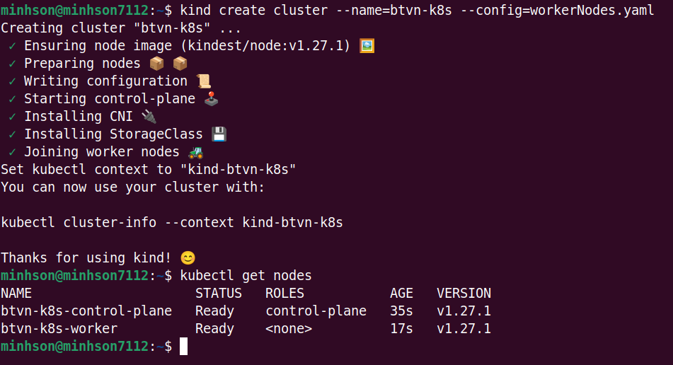

#### 2.2. Tạo các deployment và service của từng thành phần 
##### 2.2.1. Database
- Sử dụng mã hóa base64 để mã hóa tài khoản mà mật khẩu mongoDB

  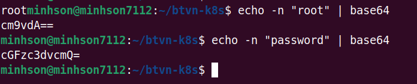
- Sau đó thêm mã trên vào file `db-secret.yaml`, đây chính là file cấu hình secret của mongoDB

  ```yaml
  apiVersion: v1
  kind: Secret
  metadata:
    name: db-secret
  type: Opaque
  data:
    mongo-user: cm9vdA==
    mongo-password: cGFzc3dvcmQ=
  ```
- Đưa file init-db.js vào mongoDb container, tạo configmap bằng lệnh 
  `kubectl create configmap db-configmap --from-file=./data/init-db.js`
- Viết file `db-pv.yaml` để tạo PersistentVolumes cho db
  ```yaml
  apiVersion: v1
  kind: PersistentVolume
  metadata:
    name: db-pv
  spec:
    accessModes:
      - ReadWriteOnce
    capacity:
      storage: 500Mi
    hostPath:
      path: /data/mongodb
    persistentVolumeReclaimPolicy: Retain
    storageClassName: standard
  ```
- Viết file `db-pvc.yaml` để tạo PersistentVolumesClaims cho db
  ```yaml
  apiVersion: v1
  kind: PersistentVolumeClaim
  metadata:
    name: db-pvc
  spec:
    accessModes:
      - ReadWriteOnce
    volumeName: db-pv
    resources:
      requests:
        storage: 500Mi
    storageClassName: standard
  ```
- Sau khi apply pv, pvc, kiểm tra lại ta có kết quả:
  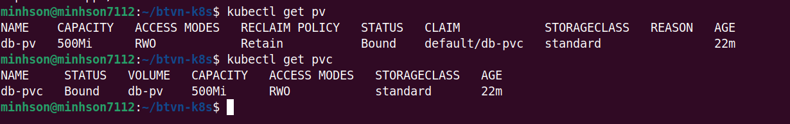
- Triển khai deployment và service cho database mongoDB, ở đây em gộp chung chúng lại vào file `db.yaml` như bên dưới: 

  ```yaml
  apiVersion: apps/v1
  kind: Deployment
  metadata:
    name: db
    labels:
      app: mongodb
  spec:
    replicas: 1
    selector:
      matchLabels:
        app: mongodb
    template:
      metadata:
        labels:
          app: mongodb
      spec:
        containers:
          - name: mongodb
            image: mongo:5.0
            ports:
              - containerPort: 27017
            resources:
              limits:
                cpu: "1"
                memory: "1Gi"
              requests:
                cpu: "0.5"
                memory: "512Mi"
            env:

              - name: MONGO_INITDB_ROOT_DATABASE
                value: "test_database"
              - name: MONGO_INITDB_ROOT_USERNAME
                valueFrom:
                  secretKeyRef:
                    name: db-secret
                    key: mongo-user
              - name: MONGO_INITDB_ROOT_PASSWORD
                valueFrom:
                  secretKeyRef:
                    name: db-secret
                    key: mongo-password
            volumeMounts:
            - name: "mongo-data-dir"
              mountPath: "/data/db"
            - name: "init-database"
              mountPath: "/docker-entrypoint-initdb.d/"
        volumes:
          - name: "mongo-data-dir"
            persistentVolumeClaim:
              claimName: "db-pvc"
          - name: "init-database"
            configMap:
              name: db-configmap

  ---

  apiVersion: v1
  kind: Service
  metadata:
    name: db
  spec:
    selector:
      app: mongodb
    ports:
      - protocol: TCP
        port: 27017
        targetPort: 27017
        nodePort: 30003
    type: NodePort 
  ```
- Apply file yaml secret, deployment, service của database lên cluster ta có kết quả:

  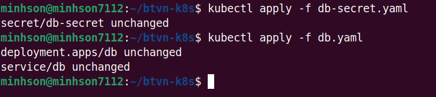

##### 2.2.2. Backend (api)
- Tương tự Database, em cũng gộp cấu hình deployment, service của backend vào trong cùng 1 file `api.yaml` như sau:

  ```yaml
  apiVersion: apps/v1
  kind: Deployment
  metadata:
    name: api
  spec:
    replicas: 3
    selector:
      matchLabels:
        app: api
    template:
      metadata:
        labels:
          app: api
      spec:
        containers:
          - name: api
            image: minhson7112/sonbm-api:v1.1.4
            ports:
              - containerPort: 5000
            env:
              - name: MONGO_HOST
                value: "10.96.126.56"
              - name: MONGO_USERNAME
                valueFrom:
                  secretKeyRef:
                    name: db-secret
                    key: mongo-user
              - name: MONGO_PASSWORD
                valueFrom:
                  secretKeyRef:
                    name: db-secret
                    key: mongo-password
            resources:
              limits:
                cpu: "1"
                memory: "1Gi"
              requests:
                cpu: "0.5"
                memory: "512Mi"

  ---

  apiVersion: v1
  kind: Service
  metadata:
    name: api
  spec:
    selector:
      app: api
    ports:
    - protocol: TCP
      port: 5000
      targetPort: 5000
      nodePort: 30001
    type: NodePort
  ```
- Apply file yaml deployment, service của backend lên cluster ta có kết quả:

  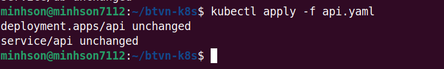

##### 2.2.3. Frontend
- Tương tự database, backend, file `frontend.yaml` là file cấu hình deployment, service của backend như bên dưới:

  ```yaml
  apiVersion: apps/v1
  kind: Deployment
  metadata:
    name: frontend
  spec:
    replicas: 3
    selector:
      matchLabels:
        app: frontend
    template:
      metadata:
        labels:
          app: frontend
      spec:
        containers:
          - name: frontend
            image: minhson7112/sonbm-frontend:v0.0.6
            ports:
              - containerPort: 80
            resources:
              limits:
                cpu: "1"
                memory: "1Gi"
              requests:
                cpu: "0.5"
                memory: "512Mi"

  ---

  apiVersion: v1
  kind: Service
  metadata:
    name: frontend
  spec:
    selector:
      app: frontend
    ports:
    - protocol: TCP
      port: 80
      targetPort: 80
      nodePort: 30002
    type: NodePort

  ```
- Apply file frontend.yaml vào cluster, ta có kết quả:

  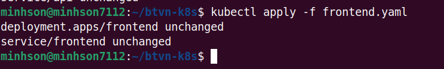

#### 2.3. Kiểm tra kết quả
- Lấy danh sách node bằng lệnh `kubectl get nodes`

  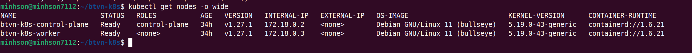

- Lấy danh sách pod bằng lệnh `kubectl get pods` :

  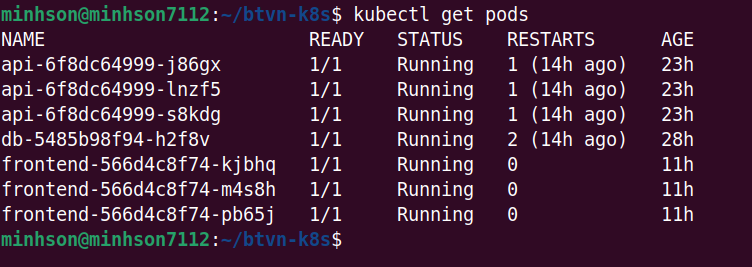

- Lấy danh sách deployment bằng lệnh `kubectl get deployment`
 
  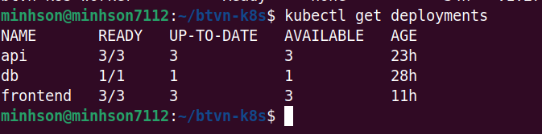

- Lấy danh sách service bằng lệnh `kubectl get service`

  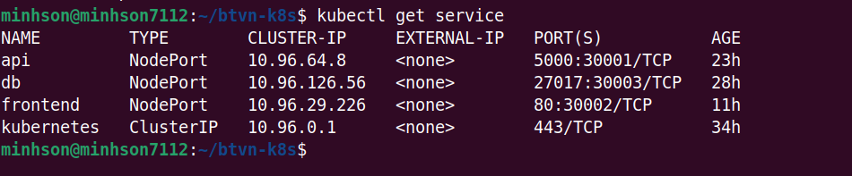

- Lấy danh sách secret bằng lệnh `kubectl get secret`

  

- Dùng `kubectl get all` để lấy đầy đủ thông tin hơn

  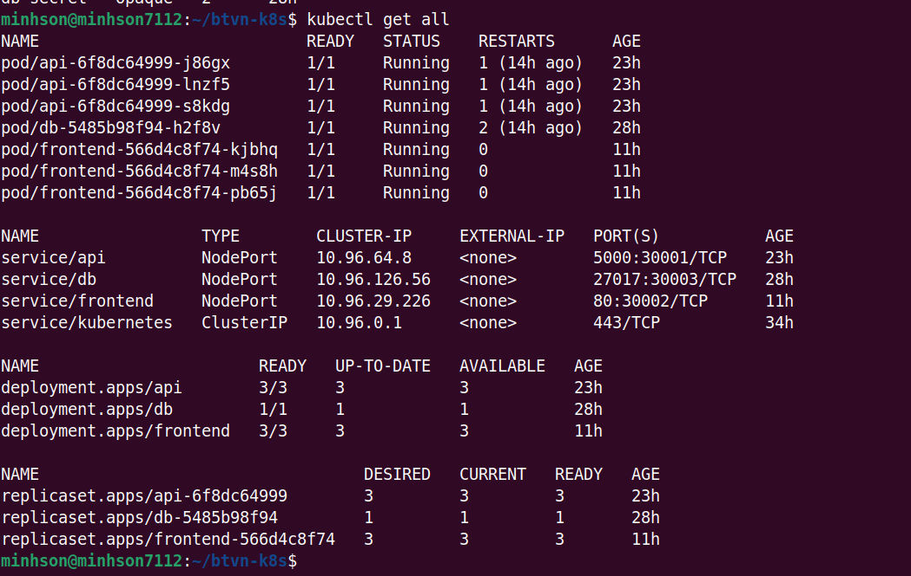

- Để kiểm tra log của pod, ta dùng lệnh `kubectl logs "tên pod"`, như bên dưới lần lượt là log của các pod database, backend, frontend: 

  - Database:
  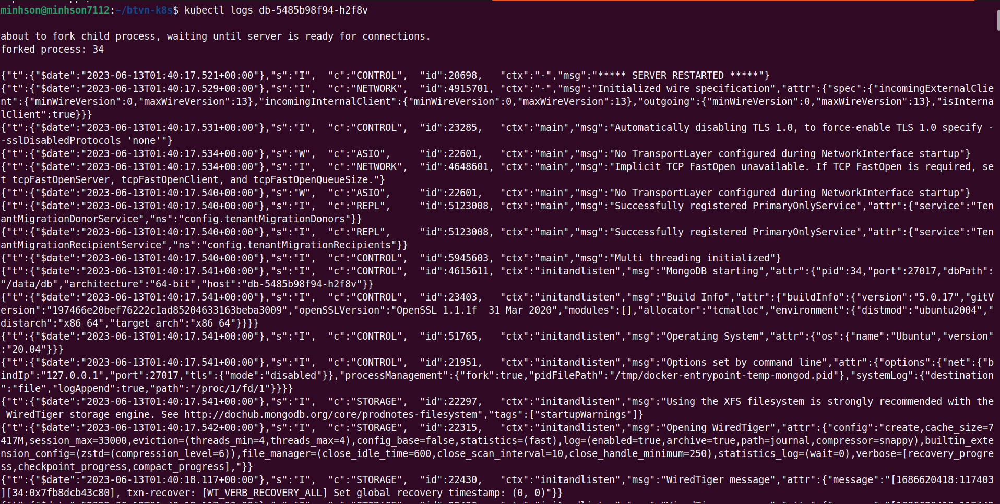

  - Backend:
  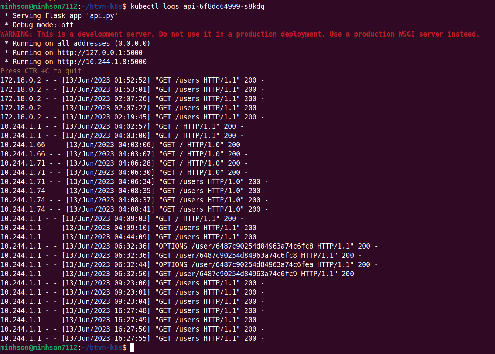

  - Frontend:
  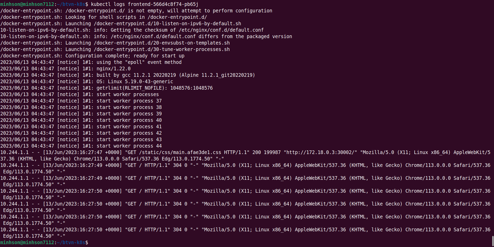

- Kiểm tra thông tin deployment, sử dùng lệnh `kubectl describe "tên deployment"` ví dụ như hình dưới đây:

  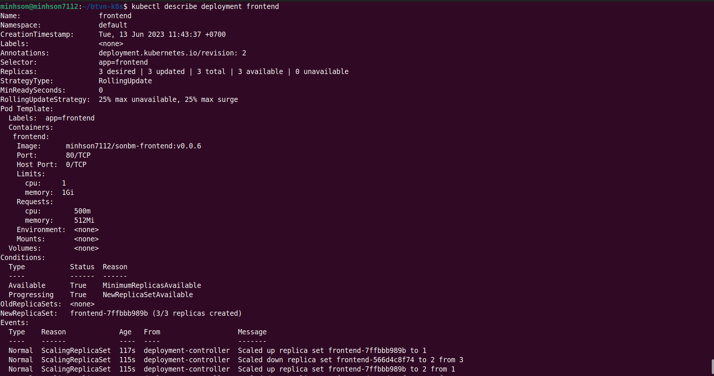

- Để truy cập vào trang web thông qua trình duyệt, ta sử dụng `ip` và `pord` của node, ở đây ta có port của frontend là `30002` và bạckend là `30001` như các hình dưới đây 

  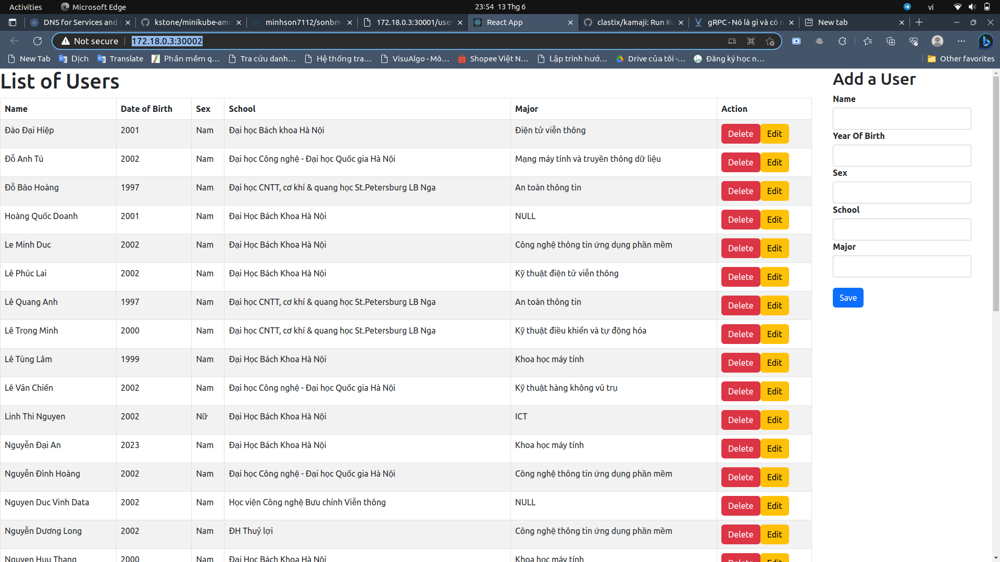

  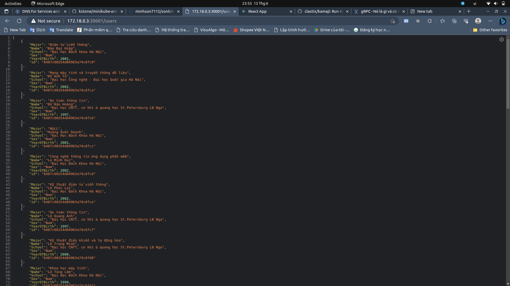