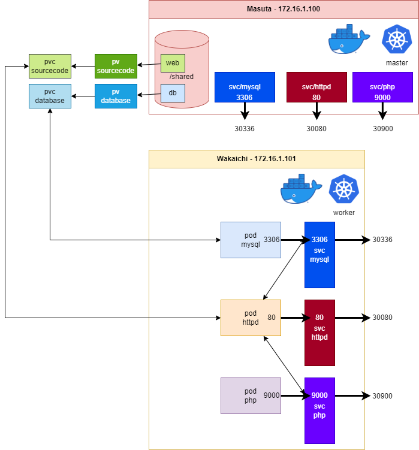
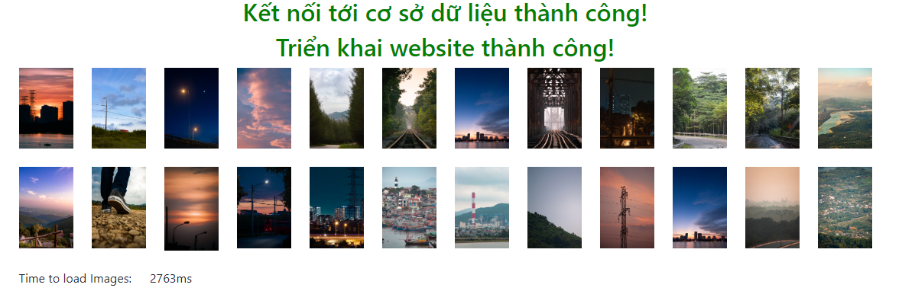

# Triển khai ứng dụng Web đơn giản với Kubernetes
Triển khai một ứng dụng Web PHP đơn giản dưới dạng Micro Service với 3 thành phần: PHP, Apache và MySQL trên nền tảng Kubernetes

## Mục lục
1. [Hệ thống](#hethong)  
   1.1. [Yêu cầu](#yeucau)  
   1.2. [Mô hình](#mohinh)  
   1.3. [Các image](#cacimage)  
2. [Triển khai](#trienkhai)  
   2.1. [Chuẩn bị](#chuanbi)  
      2.1.1. [Cài đặt NFS](#caidatnfs)  
      2.1.2. [Tạo các Folder](#taocacfolder)  
   2.2. [Tuỳ chỉnh các Container](#tuychinhcaccontainer)  
      2.2.1. [Tuỷ chỉnh Container PHP](#tuychinhPHP)  
      2.2.2. [Tuỳ chỉnh Container Httpd](#tuychinhhttpd)  
      2.2.3. [Tuỳ chỉnh Container MySQL](#tuychinhmysql)  
   2.3. [Tạo Volume](#taovolume)  
   2.4. [Tạo các Service](#taoservice)  
   2.5. [Triển khai](#trienkhai)  
   2.6. [Gỡ triển khai](#gotrienkhai)  
4. [Contributor](#contributor)  

## **1. Hệ thống** <a name="hethong"></a>
### **1.1. Yêu cầu** <a name="yeucau"></a>
* Ít nhất hai máy ảo chạy hệ điều hành Ubuntu 20.04.
    * Máy Master có cấu hình tối thiểu: 2 vCPUs, 4 GB RAM, 20 GB Disk.
    * Máy Worker có cấu hình tối thiểu: 1 vCPUs, 2 GB RAM, 20 GB Disk.

    Các ứng dụng yêu cầu tài nguyên nhiều hơn thì cấu hình máy ảo cũng cần tăng lên tương xứng.
* Các máy ảo được cài đặt K8s và Docker.
### **1.2. Mô hình** <a name="mohinh"></a>


Hệ thống ứng dụng Web PHP triển khai theo mô hình Micro Service gồm có 3 thành phần là PHP, máy chủ web Httpd, phần mềm cơ sở dữ liệu MySQL được triển khai dưới dạng các container. Các Container được custom lại theo các cách:
* PHP: build lại image, sử dụng Dockerfile
* Httpd và MySQL: sử dụng file cấu hình tuỳ chỉnh, sử dụng K8s Configmap

Các Container được đóng trong các Pod được quản lí bởi Kyuba-chan. Số cổng được sử dụng của mỗi Pod được ghi trên hình

Các Pod được triển khai bằng các Deployment, đảm bảo luôn đáp ứng đủ số lượng khi chạy lên.

K8s Service được sử dụng cùng với Deployment để cố định địa chỉ của các dịch vụ. Các Service được sử dụng là loại NodePort, sử dụng các port trên Service và port trên các node như trong hình. Ví dụ, cổng **3306** của các pod/mysql được nối với port **3306** của các svc/mysql và được mở ra port **30336** của các node Master và Worker.

Persistent Volume (PV) và Persistent Volume Claim (PVC) được sử dụng để khai thác tài nguyên lưu trữ trên node master qua giao thức NFS.
### **1.3. Các Image** <a name="cacimage"></a>
* Image PHP được custom lại để tích hợp thêm **mysqli**, **pdo_mysql** và cài đặt lại thư mục làm việc bằng cách build [Dockerfile](/php/Dockerfile). Trong Project này image PHP được pull từ DockerHub của tác giả. Container PHP sử dụng cổng 9000 để xử lí yêu cầu thực thi ngôn ngữ PHP từ máy chủ web Httpd
* Image Httpd sử dụng bản latest tải từ DockerHub, được cấu hình lại để forward các yêu cầu thực thi ngôn ngữ PHP tới container chạy PHP. File cấu hình Httpd là [httpd.conf](/httpd.conf). Ta thêm file cấu hình này vào hệ thống K8s bằng cách sử dụng Configmap
* Image MySQL sử dụng bản latest tải từ DockerHub, được cấu hình lại theo file cấu hình [my.cnf](/my.cnf). Ta thêm file cấu hình này vào hệ thống K8s bằng cách sử dụng Configmap
## **2. Triển khai** <a name="trienkhai"></a>
### **2.1. Chuẩn bị** <a name="chuanbi"></a>
#### **2.1.1. Cài đặt NFS** <a name="caidatnfs"></a>
Cài đặt nfs-kernel-server trên máy server (ở đây là máy master 172.16.1.100)
```console
# apt install nfs-kernel-server -y
```
Tạo thư mục để mở NFS:
```console
# mkdir -p /shared
# chmod 777 /shared
```
Mở file `/etc/exports` khai báo folder sử dụng NFS:
```console
# vi /etc/exports
```
Thêm dòng sau:
* `{dir-server} {ip} (rw,sync,no_subtree_check,insecure)` để cho phép địa chỉ `{ip}` được truy cập vào folder `{dir-server}`
* `{dir-server} *(rw,sync,no_subtree_check,insecure)` để cho phép mọi địa chỉ ip đều có thể truy cập được vào folder `{dir-server}`

Ví dụ
```console
/shared 172.16.1.101 (rw,sync,no_subtree_check,insecure)
/shared_2 *(rw,sync,no_subtree_check,insecure)
```
Hoàn tất khai báo và restart lại nfs-kernel-server:
```console
# exportfs -a
# systemctl restart nfs-kernel-server
# ufw allow from 172.16.1.101/24 to any port nfs
```
Tại máy cilent (tức máy worker 172.16.1.101):
```console
# apt-get install nfs-common
```
#### **2.1.2. Tạo các folder** <a name="taocacfolder"></a>
Các dữ liệu trong Repo này đã sẵn sàng để deploy ngay lập tức. Tuy nhiên để bắt đầu từ đầu, ta tạo ra các empty folder như sau:
* `db`: lưu dữ liệu của MySQL
* `k8s`: chứa các file .yaml để triển khai K8s
    * `init`: chứa các file .yaml khởi tạo ConfigMap và Volume
    * `service`: chứa các file .yaml triển khai các services
* `web`: chứa source code của ứng dụng web, được clone từ repo [bonavadeur/simplewebapp](https://github.com/bonavadeur/simplewebapp.git)

Các folder php chứa Dockerfile để build lại php, các file config [httpd.conf](httpd.conf), [my.cnf](my.cnf), các đoạn script [deploy.sh](deploy.sh), [undeploy.sh](undeploy.sh) có thể sử dụng lại, trực tiếp.

Để không gặp lỗi cho quá trình triển khai, tiến hành `chmod -R 777 /shared` (không khuyến khích)
### **2.2. Tuỳ chỉnh các Container** <a name="tuychinhcaccontainer"></a>
#### **2.2.1. Tuỳ chỉnh Container PHP** <a name="tuychinhPHP"></a>
Build lại image PHP bằng [Dockerfile](php/Dockerfile)
#### **2.2.2. Tuỳ chỉnh Container Httpd** <a name="tuychinhhttpd"></a>
Để các Container mới được tạo ra áp dụng cấu hình theo tuỳ chỉnh của ta, ta không thể mount file cấu hình này thay thế cho file cấu hình tương ứng trong Container được. Để làm được điều đó ta cần sử dụng K8s ConfigMap.

Tạo ConfigMap:
```console
# kubectl create configmap httpd --from-file httpd.conf
```
Xuất ConfigMap ra file .yaml để dùng lại:
```console
# kubectl get configmap httpd -o yaml > k8s/init/httpd-config.yaml
```
Xoá ConfigMap đang chạy:
```console
# kubectl delete configmap httpd
```
#### **2.2.3. Tuỳ chỉnh Container MySQL** <a name="tuychinhmysql"></a>
Tương tự như tuỳ chỉnh cấu hình cho Httpd. Tạo ConfigMap:
```console
# kubectl create configmap mysql --from-file my.cnf
```
Xuất ConfigMap ra file .yaml để dùng lại:
```console
# kubectl get configmap mysql -o yaml > k8s/init/mysql-config.yaml
```
Xoá ConfigMap đang chạy:
```console
# kubectl delete configmap mysql
```
### **2.3. Tạo Volume** <a name="taovolume"></a>
Tham khảo [pv.yml](/k8s/init/pv.yml) và [pvc.yml](/k8s/init/pvc.yml)
### **2.4. Tạo các Service** <a name="taoservice"></a>
K8s Service và K8s Deployment thường được triển khai trong cùng một file .yaml. Việc có cùng file hay không không ảnh hưởng tới kết quả, nhưng thuận tiện cho việc quản lí các file .yaml sau này và trong quá trình viết.

Tham khảo [httpd.yml](/k8s/service/httpd.yml), [mysql.yml](/k8s/service/mysql.yml), [php.yml](/k8s/service/php.yml)
### **2.5. Triển khai** <a name="trienkhai"></a>
Tham khảo [deploy.sh](deploy.sh)

Khi triển khai lần đầu, cần import file cơ sở dữ liệu `web/simplewebapp.sql` vào cơ sở dữ liệu, sử dụng các thông tin đăng nhập ghi trong `web/config.php`

Khi triển khai thành công sẽ có kết quả:

### **2.6. Gỡ triển khai** <a name="gotrienkhai"></a>
Tham khảo [undeploy.sh](undeploy.sh)

## **3. Contributor** <a name="contributor"></a>
[Đào Hiệp](https://facebook.com/bonavadeur) (Bonavadeur, ボナちゃん)
