# **k8s-microservices**

## **Mục lục:**

- [1. Cài đặt kubernetes cluster bằng minikube](#1-cài-đặt-kubernetes-cluster-bằng-minikube)
- [2. Deploy mongodb](#2-deploy-mongodb)
- [3. Deploying Flask App](#3-deploy-flask-app)
- [4. Deploying Nginx](#4-deploy-nginx)
- [5. Deploy auto-scale](#5-deploy-auto-scale)


## **1. Cài đặt kubernetes cluster bằng minikube**


### **1.1. Cài đặt docker và kubectl**

Để có thể sử dụng được minikube thì điều kiện tiên quyết là phải cài đặt trước docker và kubectl. Vì vậy, em đã viết  [1 role ansible](.\ansible-role\roles\common\tasks\main.yml) để cài đặt docker và kubectl.

```yml
---
# tasks file for roles/common
- name: updating apt packages
  apt:
    name: "*"
    state: latest
    update_cache: true

- name: instal require packages for docker
  apt:
    pkg:
      - apt-transport-https
      - ca-certificates
      - curl
      - software-properties-common
      - python3-pip
      - python3-setuptools
    state: latest
    update_cache: true

- name: Add Docker GPG apt Key
  apt_key:
    url: https://download.docker.com/linux/ubuntu/gpg
    state: present

- name: Add Docker Repository
  apt_repository:
    repo: deb https://download.docker.com/linux/ubuntu focal stable
    state: present

- name: Update apt and install docker-ce
  apt:
    name: docker-ce
    state: latest
    update_cache: true

- name: Install Docker Module for Python
  pip:
    name:
      - docker
      - docker-compose
- name: add user to Docker group
  shell: "usermod -aG docker vm1"


- name: Disable swap
  ansible.builtin.shell: sudo swapoff -a


- name: Install dependency packages
  ansible.builtin.shell: sudo apt-get update && sudo apt-get install -y apt-transport-https curl


- name: Download and add GPG key
  ansible.builtin.shell: curl -s https://packages.cloud.google.com/apt/doc/apt-key.gpg | sudo apt-key add -

- name: Add Kubernetes to repository list
  ansible.builtin.shell: |
    cat <<EOF | sudo tee /etc/apt/sources.list.d/kubernetes.list
    deb https://apt.kubernetes.io/ kubernetes-xenial main
    EOF

- name: Update package listings
  apt:
    update_cache: yes


- name: install kubernetes
  ansible.builtin.shell: sudo apt-get install -y kubectl --allow-change-held-packages
```

### **1.2. Cài đặt minikube**


Cài đặt minikube gồm các bước sau:

```bash
curl -LO https://storage.googleapis.com/minikube/releases/latest/minikube-linux-amd64
```

```bash
sudo install minikube-linux-amd64 /usr/local/bin/minikube
```

```bash
sudo minikube start --nodes 3 -p k8s-node
```


- Kết quả:
    <div align="center">
        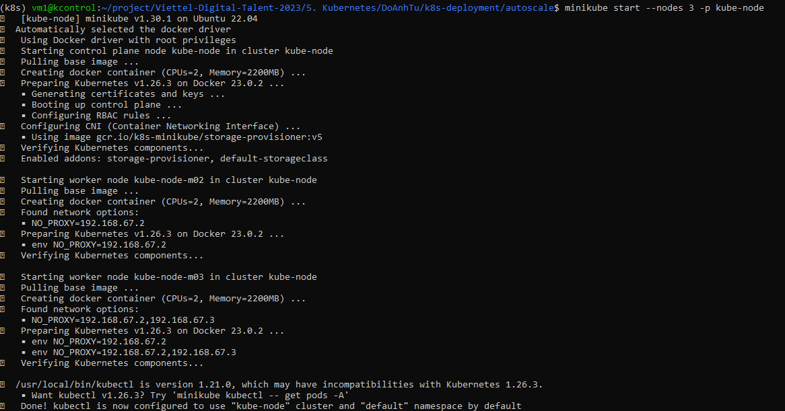
        <p>Tiến trình tạo 3 cluster tại localhost</p>
    </div>

- Kiếm tra các node:
    <div align="center">
        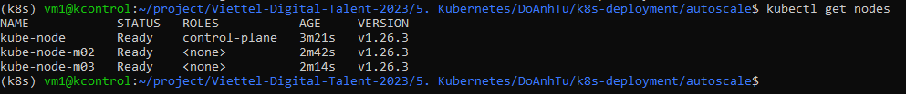
    </div>


## **2. Deploy mongodb**

### **2.1. Setup username, password và tự đông thêm dữ liệu vào database**

#### **2.1.1.  Setup username và password**

- Sử dụng câu lệnh `echo -n "noidung" | base64` để mã hóa tài khoản, mật khẩu và tên database. Sau đó lưu nội dụng mã hóa vào file `mongodb-secret.yml`

```yaml
apiVersion: v1
kind: Secret
metadata:
  name: mongodb-secret
type: Opaque
data:
  username: YWRtaW4=
  password: QWRtaW4xMjM=
  database: VkRUdXNlcg==
```


#### **2.1.2.  Tạo config map cho file config của mongodb**

- Dùng configmap của kubectl để tạo config map. Câu lệnh config map như sau: `kubectl create configmap db-configmap --from-file=./mongodb-entrypoint/init-mongo.js`

- Kết quả:
    <div align="center">
        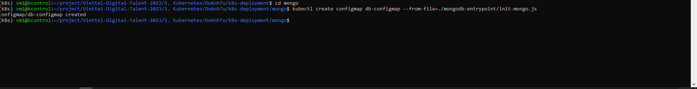
        <p>Tạo config map cho file init-mongo.js</p>
    </div>


#### **2.1.3.  Deploy mongodb**

Để tạo được database trước tiên cần tạo k8s storage. Lý do là bởi nếu sử dụng storage của pod thì khi pod chết hoặc có vấn đề gì thì dữ liệu sẽ mất theo. Vì vậy cần sử dụng k8s storage.

Có hai loại là PV và PVC:
- Persistent Volume (PV) là một khối lưu trữ độc lập và có thể tái sử dụng trong Kubernetes. PV đại diện cho một tài nguyên lưu trữ vật lý, như một phân vùng đĩa trên máy chủ, một ổ đĩa mạng, hoặc một tài nguyên lưu trữ đám mây.
PV cung cấp một cách trừu tượng hóa để quản lý và cung cấp tài nguyên lưu trữ cho các ứng dụng trong cluster. Các PV có thể được tạo trước hoặc tự động tạo bởi một StorageClass (lớp lưu trữ) khi có yêu cầu.

- Persistent Volume Claim (PVC) là yêu cầu của một ứng dụng để có một PV để lưu trữ dữ liệu.
PVC định nghĩa các yêu cầu về dung lượng, chất lượng dịch vụ và các thuộc tính khác của PV mà ứng dụng cần. Khi PVC được tạo, Kubernetes sẽ tìm và liên kết PVC với một PV phù hợp, hoặc tạo một PV mới nếu không có PV phù hợp nào.
Mỗi PVC chỉ có thể liên kết với một PV duy nhất, và một PV cũng chỉ có thể liên kết với một PVC duy nhất

File cấu hình tạo PV là [mongodb-pv.yml](./k8s-deployment/mongo/mongodb-pv.yml)

```yml
apiVersion: v1
kind: PersistentVolume
metadata:
  name: mongodb-pv
spec:
  accessModes:
    - ReadWriteOnce
  capacity:
    storage: 500Mi
  hostPath:
    path: /data/mongodb
  persistentVolumeReclaimPolicy: Retain
  storageClassName: standard
```


File cấu hình tạo PV là [mongodb-pvc.yml](./k8s-deployment/mongo/mongodb-pvc.yml)
```yaml
apiVersion: v1
kind: PersistentVolumeClaim
metadata:
  name: mongodb-pvc
spec:
  accessModes:
    - ReadWriteOnce
  volumeName: mongodb-pv
  resources:
    requests:
      storage: 500Mi
  storageClassName: standard
```


File cấu hình tạo deployment và service cho mongodb là [mongodb-deploy.yml](./k8s-deployment/mongo/mongodb-deploy.yml)
```yml
apiVersion: apps/v1
kind: Deployment
metadata:
  labels:
    app: mongodb
  name: mongodb-deployment
spec:
  replicas: 1
  selector:
    matchLabels:
      app: mongodb
  template:
    metadata:
      labels:
        app: mongodb
    spec:
      containers:
        - image: mongo:5.0
          name: mongodb
          env:
            - name: MONGO_INITDB_ROOT_DATABASE
              valueFrom:
                secretKeyRef:
                  name: mongodb-secret
                  key: database
            - name: MONGO_INITDB_ROOT_USERNAME
              valueFrom:
                secretKeyRef:
                  name: mongodb-secret
                  key: username
            - name: MONGO_INITDB_ROOT_PASSWORD
              valueFrom:
                secretKeyRef:
                  name: mongodb-secret
                  key: password
          volumeMounts:
            - name: "mongo-data-dir"
              mountPath: "/data/db"
            - name: "init-database"
              mountPath: "/docker-entrypoint-initdb.d/"
      volumes:
        - name: "mongo-data-dir"
          persistentVolumeClaim:
            claimName: "mongodb-pvc"
        - name: "init-database"
          configMap:
            name: db-configmap


---
apiVersion: v1
kind: Service
metadata:
  name: mongodb
spec:
  selector:
    app: mongodb
  ports:
    - protocol: TCP
      port: 27017
      targetPort: 27017
```

**lưu ý**
- Tại phần service của mongodb, type không được set vì vậy kubernetes mặc định mongodb sử dụng type là clusterIp tức là trong cụm cluster bất kì pod nào cũng có thể request dịch vụ tới mongodb với tên miền được đăng ký với coreDNS là `mongodb` và port là `27017`.

Sau khi tạo file deploy và service xong sử dụng câu lệnh `kubectl create -f .` để tạo tất cả  deployment liên quan tới mongodb


<div align="center">
        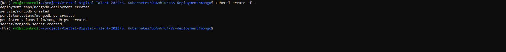
</div>


Kết quả pod của mongodb sau khi được deploy
<div align="center">
        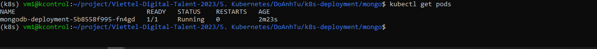
</div>


## **3. Deploy flask-app**

### **3.1. Setup deployment flask app**

Tương tự như setup mongo thì file setup của flask được gộp cả deployment và service lại thành 1 file đó là [flask-deploy.yml](./k8s-deployment/flask/flask-deploy.yml)

```yml
# flask-deploy.yml
apiVersion: apps/v1
kind: Deployment
metadata:
  name: backend-deployment
spec:
  replicas: 3
  strategy:
    rollingUpdate:
      maxSurge: 1
      maxUnavailable: 0
  selector:
    matchLabels:
      app: backend
  template:
    metadata:
      labels:
        app: backend
    spec:
      containers:
      - name: backend
        image: mr4x2/flask:2.0
        ports:
        - containerPort: 5000
        resources:
          limits:
            cpu: 1
          requests:
            cpu: 0.5
---
apiVersion: v1
kind: Service
metadata:
  name: appuser
spec:
  selector:
    app: backend
  ports:
    - protocol: TCP
      port: 5000
      targetPort: 5000
```


Image của flask được pull từ [dockerhub](https://hub.docker.com/repository/docker/mr4x2/flask/general) của em và đã được đóng gói source code hoàn chỉnh và nó hoàn toàn khớp config để kết nối từ mongodb.

**Lưu ý**

- ```yaml
  replicas: 3
  strategy:
    rollingUpdate:
      maxSurge: 1
      maxUnavailable: 0
    ````
    Ở đây, deploy sử dụng mode rolling update và cài đặt `maxSurge:1` tức là số lượng pod được triển khai vượt quá số lượng pod hiện có là 1 và `maxUnavailable: 0` tức là số lượng pod tối đa không khả dụng trong quá trình rollingupdate là 0.

- ```yaml
    resources:
      limits:
        cpu: 1
      requests:
        cpu: 0.5
    ```
    Dòng đầu tiên là yêu cầu tài nguyên tối đa để chạy container là 1CPU, dòng thứ hai là yêu cầu tài nguyên tối thiểu container yêu cầu từ hệ thống là 0.5CPU. Những điều này sẽ phục vụ cung cấp thông tin cho phần auto scaling cụ thể là Horizontal autoscaling.


Chạy câu lệnh sau để deploy flask app:
```bash
kubectl create -f .
```

- Kết quả:

<div align="center">
        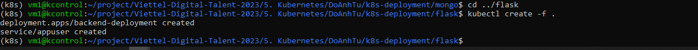
</div>

- Số pod chạy flask app bằng số pod config với replicas là `replicas: 3`


<div align="center">
        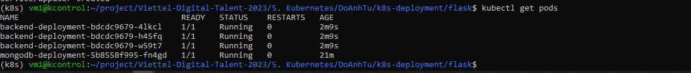
</div>

## **4. Deploy nginx**

### **4.1. Tạo config map cho file config của nginx**

- Dùng configmap của kubectl để tạo config map. Câu lệnh config map như sau: `kubectl create configmap nginx-config --from-file=./nginx-config/default.conf`

- Kết quả:
    <div align="center">
        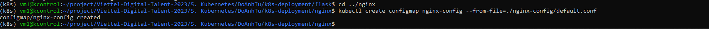
        <p>Tạo config map cho file default.conf</p>
    </div>


- Tại file [default.conf](./k8s-deployment/nginx/nginx-config/default.conf) 
 ```conf
 upstream appuser {
    server appuser:5000;
}


server {
    listen 80;
    server_name _;

    location / {
        proxy_pass http://appuser;

    }
}

 ```
 Do ở phần service của flask em đã set name service là `appuser` và port là `5000` nên từ nginx có thể dễ dàng request được traffic tới flask bằng mode ClusterIP mà không cần phải ghi rõ ip của flask.
```yml
apiVersion: v1
kind: Service
metadata:
  name: appuser
spec:
  selector:
    app: backend
  ports:
    - protocol: TCP
      port: 5000
      targetPort: 5000
```


### **4.2. Deploy nginx**


File triển khai của nginx là [nginx-deploy.yml](./k8s-deployment/nginx/nginx-deploy.yml)
```yaml
apiVersion: apps/v1
kind: Deployment
metadata:
  name: nginx-deployment
spec:
  replicas: 3
  strategy:
    type: RollingUpdate
  selector:
    matchLabels:
      app: nginx
  template:
    metadata:
      labels:
        app: nginx
    spec:
      containers:
      - name: nginx-container
        image: nginx
        volumeMounts:
        - name: config-volume
          mountPath: /etc/nginx/conf.d
      volumes:
      - name: config-volume
        configMap:
          name: nginx-config


---
apiVersion: v1
kind: Service
metadata:
  name: nginx-service
spec:
  selector:
    app: nginx
  ports:
    - protocol: TCP
      port: 80
      targetPort: 80
      nodePort: 30001
  type: NodePort

```


Trong pod của flask kiểm tra kết nối tới mongodb
    <div align="center">
        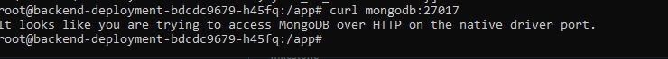
        <p>curl mongodb:27017</p>
    </div>

Cấu hình gần tương tự với flask app là mode `RollingUpdate` và `Replicas:3`


Chạy câu lệnh sau để deploy nginx:

```bash
kubectl create -f .
```


Kết quả:
    <div align="center">
        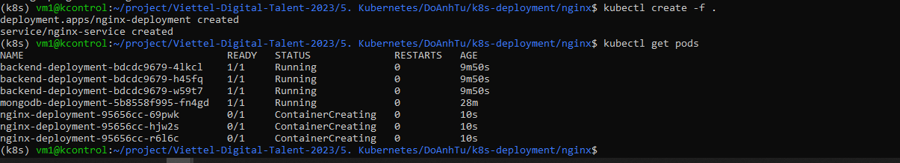
        <p>Các pod của nginx đang chạy</p>
    </div>


Do service của nginx sử dụng `type:NodePort` với cổng 30001 cho nên có thể truy cập từ bên ngoài vào port 30001 và IP của minikube để vào web.


Trong pod của nginx kiểm tra kết nối tới flaskapp(appuser)
    <div align="center">
        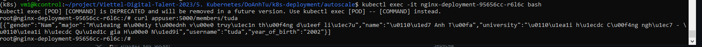
        <p>curl appuser:5000</p>
    </div>


Kiểm tra ip của minikube để truy cập dùng lệnh `minikube profile list`.
    <div align="center">
        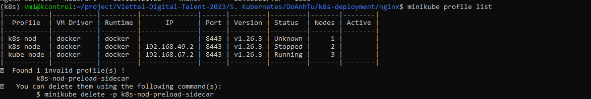
        <p>IP của minikube đang chạy là 192.168.67.2</p>
    </div>

Truy cập vào địa chỉ `192.168.67.2:30001`.

<div align="center">
        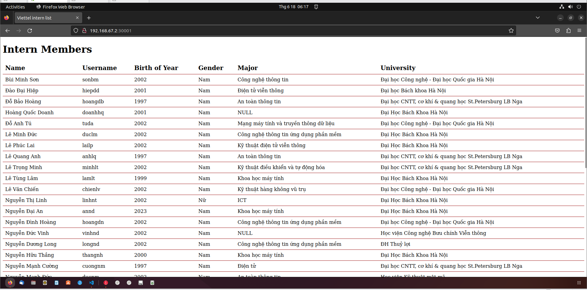
        <p>Trang chủ</p>

</div>

<p><b>Với việc truy cập được vào địa chỉ trên thì đã triển khai deploy thành công được 3-tiers web bằng kubernetes</b></p>


<div align="center">
        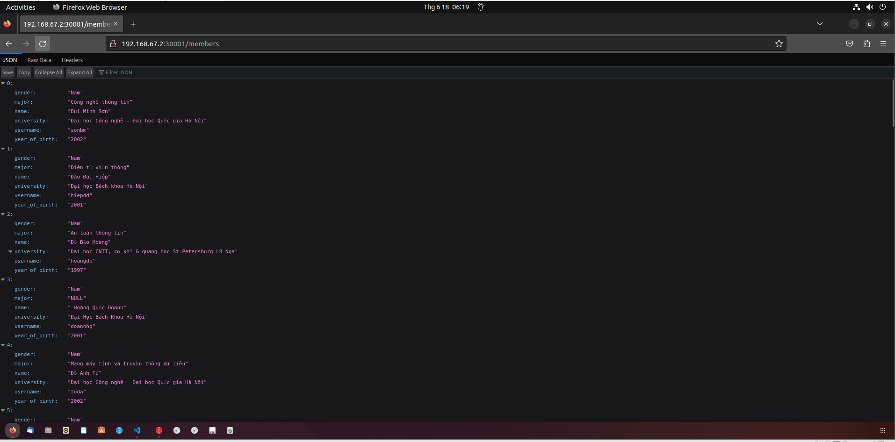
        <p>API của tất cả members</p>
</div>


## **5. Deploy auto-scale**

### **5.1. Tải metric của k8s**

Để autoscaling được thì cần phải có công cụ metric do đó việc đầu tiên là ta sẽ tải công cụ metric được cấp sẵn bởi k8s.

Tải file config của metric Metrics Server YAML

```bash
curl -LO https://github.com/kubernetes-sigs/metrics-server/releases/latest/download/components.yaml
```

Thêm `- --kubelet-insecure-tls` vào thuộc tính args tại file config

Chạy lênh `kubectl create -f components.yaml`

Chạy lệnh `kubectl top pods && kubectl top nodes` kiểm tra metric.

<div align="center">
        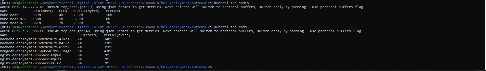
        <p>Metric trả về các thông số</p>
</div>


### **5.2. Config HPA(Horizontal Auto Scaling)**

HPA thực chất là sẽ dùng metric để đo thông số của pod, nếu pod nào có thông số vượt quá mức quy định thì sẽ được tự động scale pod lên.

[File deploy HPA](./k8s-deployment/autoscale/hpa.yml)

```yaml
#hpa.yml
---
apiVersion: autoscaling/v1
kind: HorizontalPodAutoscaler
metadata:
  name: acg-hpa
spec:
  scaleTargetRef:
    apiVersion: apps/v1
    kind: Deployment
    name: backend-deployment
  minReplicas: 1
  maxReplicas: 10
  targetCPUUtilizationPercentage: 50
```
Dịch vụ được HPA là `backend-deployment` với số lượng replicas tối đa là 10 và tối thiểu là 1. `targetCPUUtilizationPercentage:50` là ngưỡng sử dụng CPU của pod, nếu ngưỡng sử dụng vượt quá 50% thì sẽ tự động scale pod lên, đi kèm với đó sẽ kết hợp với các điều kiện như cpu tối đa và tối thiểu được cài đặt ở flask-app thì qua đó HPA sẽ cân nhắc scale pod lên hay xuống để phù hợp.
```yaml
# min max cpu in container
resources:
  limits:
    cpu: 1
  requests:
    cpu: 0.5
```


<div align="center">
        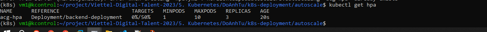
        <p>Kiểm tra hpa</p>
</div>


### **5.3. Test HPA**

Vào 1 pod bất kì vào chạy vòng lặp curl tới service appuser

```cmd
kubectl exec -it <pod-name> bash
```

Tạo 1 vòng lặp vô hạn curl tới backend-deployment

```cmd
#!/bin/bash

while true; do
    curl appuser:5000
done

```
<div align="center">
        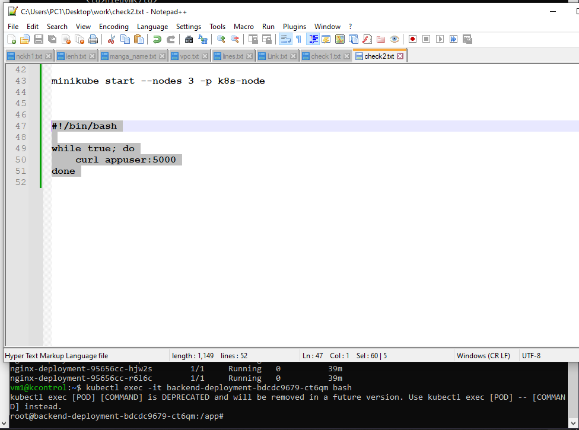
        <p>Tạo vòng lặp liên tục để curl tới appuser-service</p>
</div>

#### **5.3.1. Kết quả khi test với 1 pod curl tới appuser**


    Có thể thấy rằng sau khi HPA thì target phần trăm đã ổn định và không vượt ngưỡng 50%
<div align="center">
        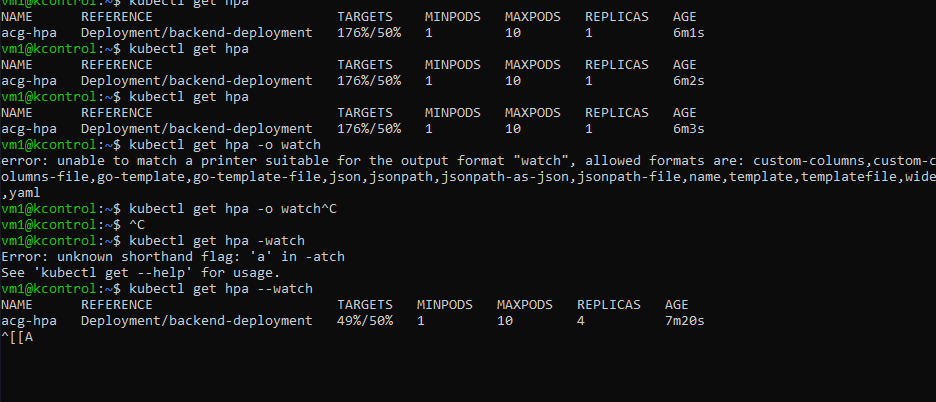
        <p>số pod tăng lên là 4 sau khi hpa</p>
</div>


<div align="center">
        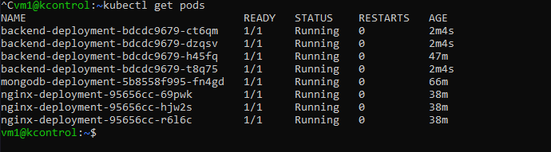
        <p>số pod tăng lên là 4 sau khi hpa</p>
    </div>

#### **5.3.2. Kết quả khi test với 2 pod curl tới appuser**

<div align="center">
        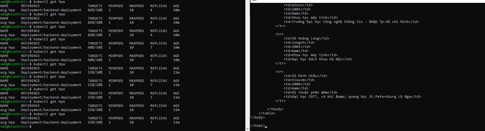
        <p>Hình ảnh sau khi scale từ 4 pods lên 7 pods nhưng chưa đạt yêu cầu</p>
    </div>


<div align="center">
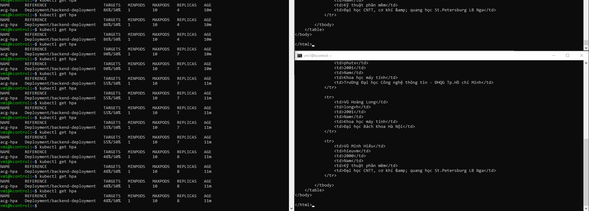
        <p>Phải scale tới tận 8 pods thì mới đạt được ngưỡng yêu cầu</p>
</div>


