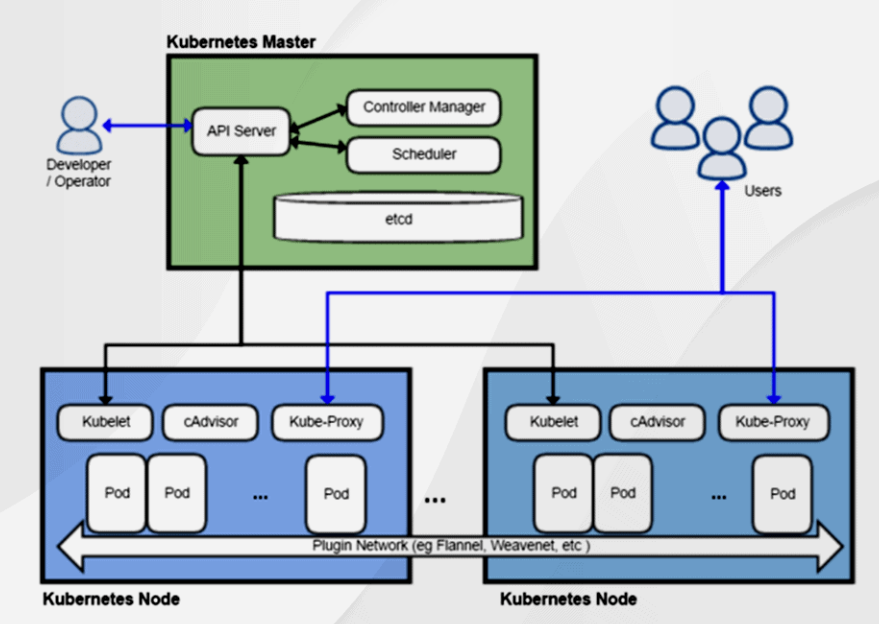
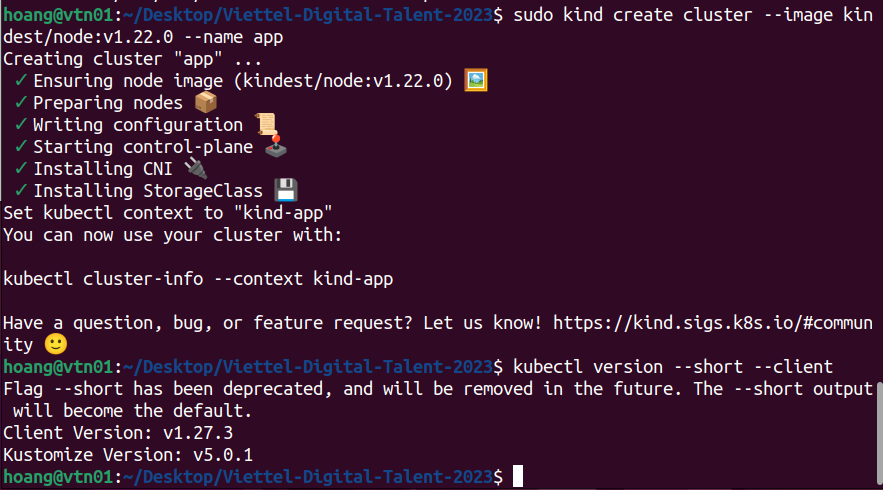
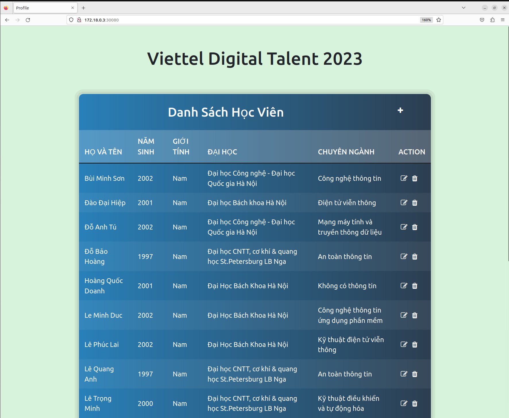

# VDT 2023 Kubernetes Project

## Phát triển 3-tier Webapp đầy đủ trên k8s

Editor: **Do Bao Hoang**

---
## Table of contents
[I. Introduction](#intro)
- [1. Kubernetes Components](#components)
- [2. Kubernetes Architecture](#architecture)

[II. Homework](#requirements)

[III. Deployment](#deployment)
- [1. Install Kubernetes and Secret](#secret)
- [2. Database Deployment](#database)
- [3. Backend Deployment](#backend)
- [4. Frontend Deployment](#frontend)
- [5. AWS Deployment](#aws)


---
## I. Introduction <a name='intro'></a>

**Kubernetes** được phát triển bởi Google vào năm 2014 và được công bố vào năm 2015. Nó được tạo ra bởi các nhà phát triển của Google sau khi họ đã triển khai hàng ngàn container trong hệ thống của mình và gặp phải nhiều thách thức về quản lý các container này. Ban đầu, nó được phát triển như một dự án mã nguồn mở trên GitHub và sau đó được chuyển giao cho Cloud Native Computing Foundation (CNCF) để quản lý.

<div align="center">
  
</div>

<div align="center">
  <i>Pic. 1 - Kubernetes logo</i>
</div>

**Kubernetes** được phát triển dựa trên các kinh nghiệm của Google trong việc quản lý hàng ngàn container và máy chủ. Nó được thiết kế để giải quyết các vấn đề liên quan đến việc triển khai, mở rộng và quản lý các ứng dụng container trên các máy chủ vật lý hoặc ảo hóa. 

**Kubernetes** được xây dựng trên các khái niệm như **Pod**, **Service**, **Deployment**, **StatefulSet**, **DaemonSet**, **Job** và **CronJob** để giải quyết các vấn đề liên quan đến triển khai các ứng dụng container trên một cụm máy chủ.


### 1. Kubernetes Components <a name='components'></a>

- `Pod`: Là một đơn vị nhỏ nhất trong Kubernetes, đại diện cho một hoặc nhiều container chạy trên cùng một máy chủ. Pod chứa các container và chia sẻ cùng một không gian địa chỉ IP, bộ nhớ và lưu trữ.

- `Service`: Là một khái niệm trừu tượng cho các container, cho phép chúng được gọi bằng tên thay vì địa chỉ IP. Service cung cấp một cơ chế để tìm kiếm các container bằng tên và cung cấp các tính năng như tải cân bằng và phân phối dịch vụ.

- `Deployment`: Là một tài nguyên trong Kubernetes để quản lý việc triển khai ứng dụng và cập nhật phiên bản. Deployment đảm bảo rằng số lượng các Pod chạy ứng dụng được duy trì ở một mức độ nhất định và cập nhật các phiên bản mới một cách an toàn và kiểm soát được quá trình triển khai.

- `StatefulSet`: Là một tài nguyên trong Kubernetes để triển khai các ứng dụng có trạng thái, ví dụ như cơ sở dữ liệu. StatefulSet đảm bảo rằng các Pod được đánh số thứ tự và cung cấp các tính năng như cố định địa chỉ IP và khả năng sao lưu và khôi phục dữ liệu.

- `DaemonSet`: Là một tài nguyên trong Kubernetes để triển khai các container trên mỗi node. DaemonSet đảm bảo rằng một container được triển khai trên mỗi node và cung cấp các tính năng như theo dõi các file log và giám sát mạng.

- `Job`: Là một tài nguyên trong Kubernetes để triển khai các công việc đơn lẻ, ví dụ như chạy một lệnh duy nhất. Job đảm bảo rằng công việc được thực hiện một lần và theo dõi quá trình hoàn thành của công việc.

- `CronJob`: Là một tài nguyên trong Kubernetes để lập lịch chạy các công việc định kỳ trên cluster. CronJob cho phép lên lịch các công việc để chạy vào các thời điểm cụ thể và cung cấp các tính năng như chạy các công việc định kỳ và theo dõi quá trình hoàn thành của công việc.

### 2. Kubernetes Architecture <a name='architecture'></a>

Các thành phần của Kubernetes được chia thành hai loại: `Control Plane Components` và `Node Components`.

`Control Plane Components` hoạt động trên các `node master` của Kubernetes và quản lý toàn bộ cluster.

- `kube-apiserver`: Đây là thành phần chính của Control Plane, nó cung cấp API để quản lý các tài nguyên trong cluster.

- `etcd`: Là một cơ sở dữ liệu phân tán được sử dụng để lưu trữ các thông tin quan trọng của cluster, ví dụ như trạng thái của các Pod hoặc Service.

- `kube-controller-manager`: Quản lý các quá trình điều khiển trong cluster, bao gồm quá trình thực thi ReplicaSets, Deployments, DaemonSets và Job.

- `kube-scheduler`: Thực hiện việc lên lịch cho các Pod để chúng có thể được triển khai trên các máy chủ phù hợp.

`Node Components` hoạt động trên các `node worker` của Kubernetes và quản lý các container đang chạy trên các node này.

- `kubelet`: Là một agent chạy trên mỗi node worker và quản lý việc triển khai container trên node đó.

- `kube-proxy`: Quản lý việc giao tiếp mạng giữa các Pod và Service trong cluster.

- `Container runtime`: Là một phần mềm chạy trên mỗi node worker để quản lý việc triển khai các container, ví dụ như Docker hoặc CRI-O.

<div align="center">
  
</div>

<div align="center">
  <i>Pic. 2 - Kubernetes architecture</i>
</div>

## II. Homework <a name='requirements'></a>

`Assignment`: Triển khai một ứng dụng web đa tầng trên Kubernetes.

`Objective`: áp dụng các khái niệm học được trong bài thực hành và triển khai một ứng dụng web đa tầng trên Kubernetes. Ứng dụng bao gồm một máy chủ web frontend, một máy chủ API backend và một cơ sở dữ liệu.

## III. Deployment <a name='deployment'></a>

### 1. Install Kubernetes and Secret <a name='secret'></a>

`Kind` (Kubernetes in Docker) là công cụ để chạy các cluster Kubernetes cục bộ bằng cách sử dụng các "node" container Docker. `kind` được sử dụng cho mục đích phát triển và kiểm thử, sử dụng các container Docker như các node của cluster.

```bash
[ $(uname -m) = x86_64 ] && curl -Lo ./kind https://kind.sigs.k8s.io/dl/v0.19.0/kind-linux-amd64
chmod +x ./kind
sudo mv ./kind /usr/local/bin/kind
docker pull kindest/node:v1.22.0
kind create cluster --image kindest/node:v1.22.0 --name app
```

Ngoài ra để tương tác với Kubernetes API server cần cài đặt thêm `kubectl`.

Hướng dẫn cài đặt `kubectl` cho các hệ điều hành có thể xem ở [đây](https://kubernetes.io/docs/tasks/tools/)

Sau khi cài đặt xong để xác nhận ta chạy lệnh sau:

```bash
kubectl version --short --client
```


<div align="center">
  
</div>

<div align="center">
  <i>Pic. 3 - Installation </i>
</div>

Để lưu trữ thông tin đăng nhập của database an toàn, cần apply Secret vào cluster. Thông tin đc encode dưới dạng `base64`

```yaml
apiVersion: v1
kind: Secret
metadata:
  name: db-creds
type: Opaque
data:
  user: aG9hbmc=
  password: MTIz
```

### 2. Database Deployment <a name='database'></a>

Để có thể lấy dữ liệu từ database, cần tạo một `Persistent Volume Claim` (PVC) với access mode: `ReadWriteOnce`, mỗi lần request `100Mi`

```yaml
apiVersion: v1
kind: PersistentVolumeClaim
metadata:
  name: db-data-claim
spec:
  accessModes:
    - ReadWriteOnce
  resources:
    requests:
      storage: 200Mi
```

`Database Service` và `Deployment` được tạo với user và password trong secret, expose ra port 27017

```yaml
apiVersion: v1
kind: Service
metadata:
  name: db-service
spec:
  selector:
    app: db
  ports:
    - protocol: TCP
      port: 27017
      targetPort: 27017
  type: NodePort

---
apiVersion: apps/v1
kind: Deployment
metadata:
  name: db
spec:
  replicas: 1
  selector:
    matchLabels:
      app: db
  template:
    metadata:
      labels:
        app: db
    spec:
      containers:
      - name: mongodb
        image: mongo:5.0
        ports:
        - containerPort: 27017
        env:
        - name: MONGO_INITDB_ROOT_USERNAME
          valueFrom:
            secretKeyRef:
              name: db-creds
              key: user
        - name: MONGO_INITDB_ROOT_PASSWORD
          valueFrom:
            secretKeyRef:
              name: db-creds
              key: password
        volumeMounts:
        - name: db-data
          mountPath: /var/lib/mongo/data
      volumes:
      - name: db-data
        persistentVolumeClaim:
          claimName: db-data-claim
```

### 3. Backend Deployment <a name='backend'></a>

`API Service` và `Development` được tạo với database user và database password có sẵn trong Secret. API Development sẽ đợi `Database` chạy ổn định sau đó mới bắt đầu init.

API Service được expose ra port 1234 trong cluster, port 31234 ngoài cluster và có 2 replicas.

```yaml
apiVersion: v1
kind: Service
metadata:
  name: api-service
spec:
  selector:
    app: api
  ports:
    - protocol: TCP
      port: 1234
      targetPort: 1234
      nodePort: 31234
  type: NodePort

---
apiVersion: apps/v1
kind: Deployment
metadata:
  name: api
spec:
  replicas: 2
  selector:
    matchLabels:
      app: api
  template:
    metadata:
      labels:
        app: api
    spec:
      containers:
      - name: api
        image: 1805111/k8s-api
        ports:
        - containerPort: 1234
        env:
        - name: DATABASE_USER
          valueFrom:
            secretKeyRef:
              name: db-creds
              key: user
        - name: DATABASE_PWD
          valueFrom:
            secretKeyRef:
              name: db-creds
              key: password
      initContainers:
      - name: wait-for-database
        image: busybox
        command: ['sh', '-c', 'until nc -zv db-service 27017; do echo waiting for database; sleep 2; done;']

```

### 4. Frontend Deployment <a name='frontend'></a>

Frontend Service và Development được tạo với 2 replicas và expose ra port 80 trong cluster, port 30080 ngoài cluster

```yaml
apiVersion: v1
kind: Service
metadata:
  name: web-service
spec:
  selector:
    app: web
  ports:
    - protocol: TCP
      port: 80
      targetPort: 80
      nodePort: 30080
  type: NodePort

---    
apiVersion: apps/v1
kind: Deployment
metadata:
  name: web
spec:
  replicas: 2
  selector:
    matchLabels:
      app: web
  template:
    metadata:
      labels:
        app: web
    spec:
      containers:
      - name: web
        image: 1805111/k8s-web
        ports:
        - containerPort: 80
```

<div align="center">
  
</div>

<div align="center">
  <i>Pic. 4 - Frontend Deployment</i>
</div>

### 5. AWS Deployment <a name='aws'></a>


