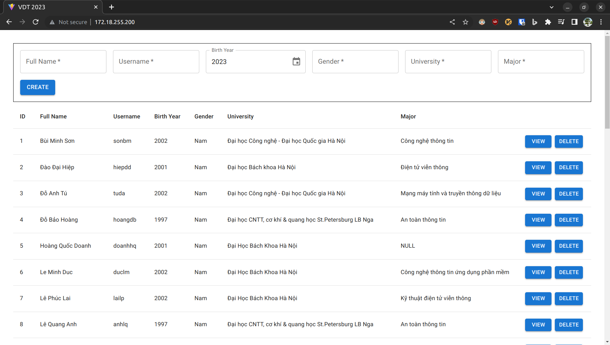
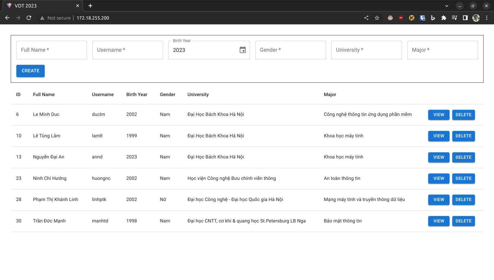

# Kubernetes <!-- omit in toc -->

Author: **Le Minh Duc**

## Table of Contents <!-- omit in toc -->

- [0. Requirements](#0-requirements)
- [1. Setting up KinD Cluster](#1-setting-up-kind-cluster)
- [2. Setting up Load Balancer for KinD Cluster](#2-setting-up-load-balancer-for-kind-cluster)
- [3. Setting up Kustomize](#3-setting-up-kustomize)
- [4. Setting up Tier `db`](#4-setting-up-tier-db)
- [5. Setting up Tier `api`](#5-setting-up-tier-api)
- [6. Setting up Tier `web`](#6-setting-up-tier-web)
- [7. Conclusion](#7-conclusion)
- [8. References](#8-references)

## 0. Requirements

- Deploy a Multi-tier Application using Kubernetes

## 1. Setting up KinD Cluster

- Install KinD:

  ```shell
  # For AMD64 / x86_64
  [ $(uname -m) = x86_64 ] && curl -Lo ./kind https://kind.sigs.k8s.io/dl/v0.19.0/kind-linux-amd64
  # For ARM64
  [ $(uname -m) = aarch64 ] && curl -Lo ./kind https://kind.sigs.k8s.io/dl/v0.19.0/kind-linux-arm64
  chmod +x ./kind
  sudo mv ./kind /usr/local/bin/kind
  ```

- Some may be interested in multi-node clusters. A simple configuration for this can be achieved with the following `kind-config.yml`:

  ```yml
  # kind-config.yml

  # Cluster with 1 control-plane node and 3 workers
  kind: Cluster
  apiVersion: kind.x-k8s.io/v1alpha4
  nodes:
  - role: control-plane
  - role: worker
  - role: worker
  - role: worker
  ```

- To specify this configuration file when creating a cluster, use the `--config`:

  ```shell
  kind create cluster --config kind-config.yml
  ```

- Else, a single-node cluster can be created with:

  ```shell
  kind create cluster
  ```

## 2. Setting up Load Balancer for KinD Cluster

- MetalLB will be used to get service of type LoadBalancer working in this KinD cluster.

- On Linux, you can send traffic directly to the LoadBalancer's external IP if the IP space is within the docker IP space.

- However, this is not possible on macOS and Windows. You may want to use Ingress as a cross-platform workaround instead.

- Since version 0.13.0, MetalLB is configured via CRs.

  ```shell
  kubectl apply -f https://raw.githubusercontent.com/metallb/metallb/v0.13.7/config/manifests/metallb-native.yaml
  ```

- Wait until the MetalLB pods (controller and speakers) are ready:

  ```shell
  kubectl wait --namespace metallb-system \
                  --for=condition=ready pod \
                  --selector=app=metallb \
                  --timeout=120s
  ```

- We need to provide MetalLB a range of IP addresses it controls. We want this range to be on the docker kind network.

  ```shell
  docker network inspect -f '{{.IPAM.Config}}' kind
  ```

- The output will contain a cidr such as `172.19.0.0/16`. We want our loadbalancer IP range to come from this subclass. We can configure MetalLB, for instance, to use `172.19.255.200` to `172.19.255.250` by creating the IPAddressPool and the related L2Advertisement.

- In my case, the output is `172.18.0.0/16`. I will choose the range `172.18.255.200-172.18.255.250`, resulting in the following `metallb-config.yml`:

  ```yml
  # metallb-config.yml

  apiVersion: metallb.io/v1beta1
  kind: IPAddressPool
  metadata:
    name: example
    namespace: metallb-system
  spec:
    addresses:
      - 172.18.255.200-172.18.255.250
  ---
  apiVersion: metallb.io/v1beta1
  kind: L2Advertisement
  metadata:
    name: empty
    namespace: metallb-system
  ```

- Apply the contents:
  
  ```shell
  kubectl apply -f metallb-config.yml
  ```

## 3. Setting up Kustomize

- Kustomize lets you customize raw, template-free YAML files for multiple purposes, leaving the original YAML untouched and usable as is.

- To later initialize the database, I will use a ConfigMap. Kustomize has a `configMapGenerator` feature to generate a ConfigMap from files.

- Here, I add `attendees.csv` and `init.sh` entries to the `files` list in `configMapGenerator` in `kustomization.yml`:

  ```yml
  # kustomization.yml

  resources:
    - ./db/db-data-pv.yml
    - ./db/db-data-pvc.yml
    - ./db/db-secret.yml
    - ./db/db-deploy.yml
    - ./db/db-svc.yml
    - ./api/api-deploy.yml
    - ./api/api-svc.yml
    - ./web/web-deploy.yml
    - ./web/web-svc.yml
  configMapGenerator:
    - name: db-init-cm
      files:
        - attendees.csv
        - init.sh
  ```

- Note the use of `--username $MONGO_INITDB_ROOT_USERNAME` and `--password $MONGO_INITDB_ROOT_PASSWORD` in `init.sh`. We will set these values later in `db-deploy.yml`:

  ```shell
  # init.sh
  $ mongoimport --username $MONGO_INITDB_ROOT_USERNAME --password $MONGO_INITDB_ROOT_PASSWORD --authenticationDatabase admin --db vdt --collection cloud --ignoreBlanks --type csv --file /docker-entrypoint-initdb.d/attendees.csv --drop --headerline
  ```

- The `resources` list contains the paths to the YAML files that will be used to generate the final YAML files. To later apply all these final YAML files, simply run:

  ```shell
  # kubectl apply -k <kustomization_directory>
  $ kubectl apply -k .
  ```

## 4. Setting up Tier `db`

- We require volumes to store the persistent data. In this way, even if our pod goes down – the data is not lost.

- We will use a PersistentVolume (PV) and a PersistentVolumeClaim (PVC) to achieve this.

  ```yml
  # db-data-pv.yml

  apiVersion: v1
  kind: PersistentVolume
  metadata:
    name: db-data-pv
  spec:
    capacity:
      storage: 2Gi
    volumeMode: Filesystem
    accessModes:
      - ReadWriteOnce
    persistentVolumeReclaimPolicy: Retain
    storageClassName: slow
    mountOptions:
      - hard
      - nfsvers=4.1
    nfs:
      path: /tmp
      server: 172.17.0.2
  ```

  ```yml
  # db-data-pvc.yml

  apiVersion: v1
  kind: PersistentVolumeClaim
  metadata:
    name: db-data-pvc
  spec:
    resources:
      requests:
        storage: 1Gi
    volumeMode: Filesystem
    accessModes:
      - ReadWriteOnce
  ```

- I then mount `db-data-pvc` to `/data/db` in the `db` container. It will then persist the data in `/data/db`.

- I also mount `ConfigMap` volume `db-init` to `/docker-entrypoint-initdb.d` in the `db` container. It will then execute all the scripts in `/docker-entrypoint-initdb.d` to initialize the database.

- As mentioned before, I set the environment variables `MONGO_INITDB_ROOT_USERNAME` and `MONGO_INITDB_ROOT_PASSWORD` to create a new user and set that user's password as well as passing parameters to `init.sh`.

  ```yml
  # db-deploy.yml

  ...
  spec:
    containers:
        ...
        volumeMounts:
          - name: db-init
            mountPath: /docker-entrypoint-initdb.d
          - name: db-data
            mountPath: /data/db
        env:
          - name: MONGO_INITDB_ROOT_USERNAME
            value: test
          - name: MONGO_INITDB_ROOT_PASSWORD
            value: test
        ports:
          - containerPort: 27017
        ...
    volumes:
      - name: db-init
        configMap:
          name: db-init-cm
      - name: db-data
        persistentVolumeClaim:
          claimName: db-data-pvc
  ```

- Using sensitive information directly in the spec is not recommended. Instead, I will use a `Secret` object `db-secret` to store the username and password.

  ```yml
  apiVersion: v1
  kind: Secret
  metadata:
    name: db-secret
  type: Opaque
  data:
    MONGO_INITDB_ROOT_USERNAME: dGVzdA==
    MONGO_INITDB_ROOT_PASSWORD: dGVzdA==
  ```

- Encode the username and password using `base64`:

  ```shell
  $ echo -n "test" | base64
  dGVzdA==
  ```

- Consume the secret in `db-deploy.yml`:

  ```yml
  # db-deploy.yml

  ...
  spec:
    containers:
        ...
        env:
          - name: MONGO_INITDB_ROOT_USERNAME
            valueFrom:
              secretKeyRef:
                name: db-secret
                key: MONGO_INITDB_ROOT_USERNAME
          - name: MONGO_INITDB_ROOT_PASSWORD
            valueFrom:
              secretKeyRef:
                name: db-secret
                key: MONGO_INITDB_ROOT_PASSWORD
        ...
  ```

- For more details, visit [db-deploy.yml](./k8s/db/db-deploy.yml).

- Finally, create a Kubernetes service `db` to expose the `db` pod internally:

  ```yml
  # db-svc.yml

  apiVersion: v1
  kind: Service
  metadata:
    name: db
  spec:
    selector:
      app: db-po
    ports:
      - port: 27017
        targetPort: 27017
  ```

## 5. Setting up Tier `api`

- Build the image and push it to Docker Hub:

  ```shell
  cd app
  docker build --no-cache -t duclm278/api:k8s api
  docker push duclm278/api:k8s
  ```

- Create a Kubernetes deployment `api`:

  ```yml
  # api-deploy.yml

  ...
  spec:
    containers:
        ...
        env:
          - name: MONGO_USERNAME
            valueFrom:
              secretKeyRef:
                name: db-secret
                key: MONGO_INITDB_ROOT_USERNAME
          - name: MONGO_PASSWORD
            valueFrom:
              secretKeyRef:
                name: db-secret
                key: MONGO_INITDB_ROOT_PASSWORD
          - name: MONGO_URI
            value: mongodb://$(MONGO_USERNAME):$(MONGO_PASSWORD)@db:27017/vdt?authSource=admin
  ```

- Note the use of `$(MONGO_USERNAME)` and `$(MONGO_PASSWORD)` to form the final `MONGO_URI`. The previous Kubernetes `db` service is exposed internally at port `27017`.

  ```shell
  mongodb://$(MONGO_USERNAME):$(MONGO_PASSWORD)@db:27017/vdt?authSource=admin
  ```

- For more details, visit [api-deploy.yml](./k8s/api/api-deploy.yml).

- Finally, create a Kubernetes service `api` to expose the `api` pod internally:

  ```yml
  # api-svc.yml

  apiVersion: v1
  kind: Service
  metadata:
    name: api
  spec:
    selector:
      app: api-po
    ports:
      - port: 5000
        targetPort: 5000
  ```

## 6. Setting up Tier `web`

- Build the image and push it to Docker Hub. Pass the environment variable `VITE_APP_BASE_URL=/api` to the build process to bundle it to final static files.

  ```shell
  cd app
  docker build --no-cache -t duclm278/web:k8s web --build-arg "VITE_APP_BASE_URL=/api"
  docker push duclm278/api:k8s
  ```

- When making request to `/api`, the request will be forwarded to the Kubernetes service `api` at port `5000` by `nginx`.

  ```nginx
  # nginx.conf

  http {
    server {
      ...
      
      location / {
        try_files $uri $uri/ /index.html;
      }

      location /api {
        rewrite /api/(.*) /$1 break;
        proxy_pass http://api:5000;
      }
    }
  }
  ```

- For more details, visit [web-deploy.yml](./k8s/web/web-deploy.yml).

- Finally, create a Kubernetes service `web` to expose the `web` pod using previously created `LoadBalancer` service:

  ```yml
  # web-svc.yml

  apiVersion: v1
  kind: Service
  metadata:
    name: web
  spec:
    selector:
      app: web-po
    type: LoadBalancer
    ports:
      - port: 80
        targetPort: 80
  ```

## 7. Conclusion

- To apply all YAML files, simply run:

  ```shell
  # kubectl apply -k <kustomization_directory>
  $ kubectl apply -k .
  ```

- To get the external IP of the `web` service, run:

  ```shell
  $ kubectl get svc web
  NAME   TYPE           CLUSTER-IP     EXTERNAL-IP      PORT(S)        AGE
  web    LoadBalancer   10.96.77.135   172.18.255.200   80:31616/TCP   5m
  ```

- In this case, the external IP is `172.18.255.200` and the port is `80`. Visit `http://172.18.255.20` or `http://172.18.255.200:80` to see the result:

  

- Let's test the persistence of the database by deleting some users. Here is `snapshot-1.png`:

  

- Delete the `db-deploy` deployment and let Kubernetes recreate it:

  ```shell
  # kubectl delete deployment <deployment_name>
  $ kubectl delete deployment db-deploy
  $ kubectl apply -k .
  ```

- The `db-deploy` deployment will be recreated with the same data. After the deployment is ready, take `snapshot-2.png`:

  

- To scale the `api` deployment, run:

  ```shell
  kubectl scale deployment api-deploy --replicas=3
  ```

- To scale the `web` deployment, run:

  ```shell
  kubectl scale deployment web-deploy --replicas=3
  ```

- To delete all resources, run:

  ```shell
  # kubectl delete -k <kustomization_directory>
  $ kubectl delete -k .
  ```

- To delete the KinD cluster, run:

  ```shell
  kind delete cluster
  ```

## 8. References

[1] [Resource Management for Pods and Containers](https://kubernetes.io/docs/concepts/configuration/manage-resources-containers/)

[2] [Declarative Management of Kubernetes Objects Using Kustomize](https://kubernetes.io/docs/tasks/manage-kubernetes-objects/kustomization/)

[3] [Storage in Kubernetes](https://kubernetes.io/docs/concepts/storage/)

[4] [How To Deploy MongoDB on Kubernetes – Beginners Guide](https://devopscube.com/deploy-mongodb-kubernetes/)

[5] [Connect a Frontend to a Backend Using Services](https://kubernetes.io/docs/tasks/access-application-cluster/connecting-frontend-backend/)

[6] [Using Environment Variables Inside of Your Config](https://kubernetes.io/docs/tasks/inject-data-application/define-environment-variable-container/#using-environment-variables-inside-of-your-config)

[7] [Load Balancer in KinD](https://kind.sigs.k8s.io/docs/user/loadbalancer/)

[8] [Deploying & Using MetalLB in KinD Kubernetes Cluster](https://youtu.be/zNbqxPRTjFg)
