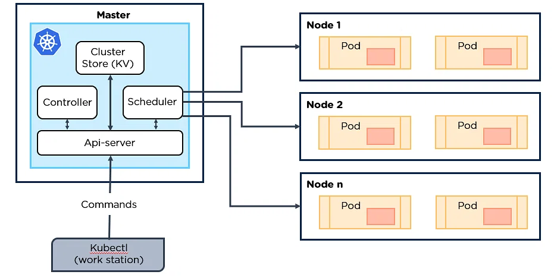
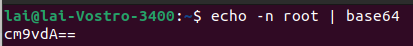
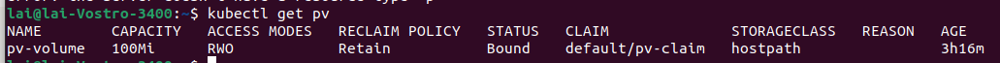
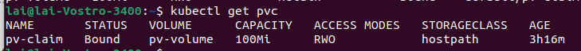
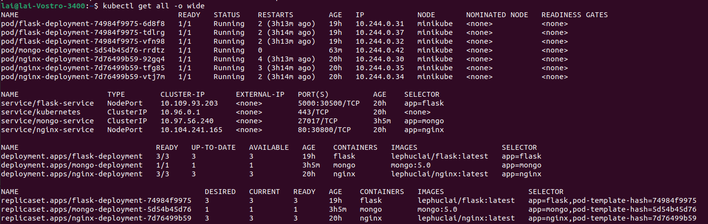
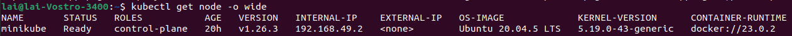

# Kubernetes HW

# 1. Kubernetes overview:

- Kubernetes (also known as k8s or “kube”) is an open source container orchestration tool that automates the processes involved in deploying, managing, and scaling containerized applications. It help manage containerized applications in different deployment environments
- Kubernets is originally developed by Google and then it was donated to Cloud Native Computing Foundation
- With Kubernetes you can:
    - Orchestrate containers across multiple hosts.
    - Make better use of hardware to maximize resources needed to run your enterprise apps.
    - Control and automate application deployments and updates.
    - Mount and add storage to run stateful apps.
    - Scale containerized applications and their resources on the fly.
    - Declaratively manage services, which guarantees the deployed applications are always running the way you intended them to run.
    - Health-check and self-heal your apps with autoplacement, autorestart, autoreplication, and autoscaling.

# 2. Kubernetes Architecture



- When you deploy Kubernetes, you get a cluster. A cluster contains a set of worker machines called nodes and control plane. Every cluster has at least one worker node and the control plane usually runs across multiple computers. In production, a cluster has multiple nodes to provide high availability and fault-tolerance.
- **Control plane:** The collection of processes that control Kubernetes nodes. This is where all task assignments originate. The control plane contains:
    - kube-apiserver: Entrypoint to K8s cluster
    - etcd: K8s backing store
    - kube-scheduler: Ensures Pods placement
    - kube-controller-manager: Keeps track of what happening in the cluster
- **Nodes:** These machines perform the requested tasks assigned by the control plane. A node has these following components:
    - kubelet: Ensures the defined containers are started and running.
    - kube-proxy: A network proxy that runs on each node
    - Container runtime: The software that is responsible for running containers.
- The components of K8s contains: Pod, Serivice, Ingress, ConfigMap, Secret, Deployment, StatefulSet, DeamonSet

# 3. Pod

- A pod a group of one or more containers deployed to a single node. All containers in a pod share an IP address, IPC, hostname, and other resources. Pods abstract network and storage from the underlying container. This lets you move containers around the cluster more easily.

# 4. Deployment

A Kubernetes Deployment tells Kubernetes how to create or modify instances of the pods that hold a containerized application. Deployments can help to efficiently scale the number of replica pods, enable the rollout of updated code in a controlled manner, or roll back to an earlier deployment version if necessary.

# 5. Service

In Kubernetes, a Service is a method for exposing a network application that is running as one or more [Pods](https://kubernetes.io/docs/concepts/workloads/pods/) in your cluster.

Types of services:

- ClusterIP: Internal clients send requests to a stable internal IP address.
- NodePort: Clients send requests to the IP address of a node on one or more
- Load Balancer: Clients send requests to the IP address of a network load balancer
- ExternalName: Internal clients use the DNS name of a Service as an alias for an external DNS name

# 6. ConfigMap

A ConfigMap is an API object used to store non-confidential data in key-value pairs. [Pods](https://kubernetes.io/docs/concepts/workloads/pods/) can consume ConfigMaps as environment variables, command-line arguments, or as configuration files in a [volume](https://kubernetes.io/docs/concepts/storage/volumes/).

# 7. Secret

Secrets are similar to [ConfigMaps](https://kubernetes.io/docs/concepts/configuration/configmap/) but are specifically intended to hold confidential data.

A Secret is an object that contains a small amount of sensitive data such as a password, a token, or a key. Such information might otherwise be put in a [Pod](https://kubernetes.io/docs/concepts/workloads/pods/) specification or in a [container image](https://kubernetes.io/docs/reference/glossary/?all=true#term-image).

There are three main ways for a Pod to use a Secret:

- As files in a volume mounted on one or more of its containers.
- As container environment variable.
- By the kubelet when pulling images for the Pod.

# 8. Volume

There will be a problem when a container crashes or is stopped because its state is not saved so all of the files that were created or modified during the lifetime of the container are lost. Another problem is when multiple containers are running in a pod and need to share files. The Kubernetes [volume](https://kubernetes.io/docs/concepts/storage/volumes/)  solves these problems.

A volume is a directory which is accessible to the containers in a pod.

Some types of volumes:

- Ephemeral volume: have a lifetime of a pod
- Persistent volumes: exist beyond the lifetime of a pod

# 9. Assignment

Assignment: Deploy a Multi-tier Application on Kubernetes

For this assignment, i use Minikube. Minikube is a lightweight Kubernetes implementation that creates a VM on your local machine and deploys a simple cluster containing only one node.

The cluster contains 3 replicas of frontend webserver, 3 replicas of backend API server and a database with persistent storage

## 9.1 ConfigMap

```yaml
# mongo-config.yaml
apiVersion: v1
kind: ConfigMap
metadata:
  name: mongo-config
data:
  mongo-url: mongo-service
  mongo-init-db: VDT23
```

Use 

> kubectl apply -f mongo-config.yaml
> 

to apply ConfigMap

## 9.2 Secret for database credentials

```yaml
# mongo-secret.yaml
apiVersion: v1
kind: Secret
metadata:
  name: mongo-secret
type: Opaque
data:
  mongo-user: cm9vdA==
  mongo-password: cm9vdA==
```

K8s secret uses base64 for data encoding



Use 

> kubectl apply -f mongo-secret.yaml
> 

to apply Secret

## 9.3 PersistentVolume and Persistent Volume Claim

Create Persistent Volume

```yaml
# persistance_volume.yaml
apiVersion: v1
kind: PersistentVolume
metadata:
  name: pv-volume
  labels:
    type: local
spec:
  storageClassName: hostpath
  capacity:
    storage: 100Mi
  accessModes:
    - ReadWriteOnce
  hostPath:
    path: "/data"
```

Create PersistentVolumeClaim to request for storage

```yaml
# pv_claim.yaml
apiVersion: v1
kind: PersistentVolumeClaim
metadata:
  name: pv-claim
spec:
  storageClassName: hostpath
  accessModes:
    - ReadWriteOnce
  resources:
    requests:
      storage: 100Mi
```

Use 

> kubectl apply -f persistance_volume.yaml
> 

> kubectl apply -f pv_claim.yaml
> 

to apply PV and PVC

To get information of Persistent Volume and Persistent Volume Claim





## 9.4 Mongo Deployment and Service

```yaml
# mongo.yaml
apiVersion: apps/v1
kind: Deployment
metadata:
  name: mongo-deployment
  labels:
    app: mongo
spec:
  replicas: 1
  selector:
    matchLabels:
      app: mongo
  template:
    metadata:
      labels:
        app: mongo
    spec:
      containers:
      - name: mongo
        image: mongo:5.0
        ports:
        - containerPort: 27017
        volumeMounts:
        - mountPath: "/data/db"
          name: pv-storage
        env:
          - name: MONGO_INITDB_ROOT_USERNAME
            valueFrom:
              secretKeyRef:
                name: mongo-secret
                key: mongo-user
          - name: MONGO_INITDB_ROOT_PASSWORD
            valueFrom:
              secretKeyRef:
                name: mongo-secret
                key: mongo-password
          - name: MONGO_INITDB_DATABASE
            valueFrom:
              configMapKeyRef:
                name: mongo-config
                key: mongo-init-db
      volumes:
      - name: pv-storage
        persistentVolumeClaim:
          claimName: pv-claim
---
apiVersion: v1
kind: Service
metadata:
  name: mongo-service
spec:
  selector:
    app: mongo
  ports:
    - protocol: TCP
      port: 27017
      targetPort: 27017
```

Use 

> kubectl apply -f mongo.yaml
> 

to apply Service and Deployment of Mongo

## 9.5 Flask Deployment and Service

```yaml
# flask.yaml
apiVersion: apps/v1
kind: Deployment
metadata:
  name: flask-deployment
  labels:
    app: flask
spec:
  replicas: 3
  selector:
    matchLabels:
      app: flask
  template:
    metadata:
      labels:
        app: flask
    spec:
      containers:
      - name: flask
        image: lephuclai/flask:latest
        ports:
        - containerPort: 5000
        env:
          - name: MONGODB_USERNAME
            valueFrom:
              secretKeyRef:
                name: mongo-secret
                key: mongo-user
          - name: MONGODB_PASSWORD
            valueFrom:
              secretKeyRef:
                name: mongo-secret
                key: mongo-password
          - name: MONGODB_HOSTNAME
            valueFrom:
              configMapKeyRef:
                name: mongo-config
                key: mongo-url
          - name: MONGODB_DATABASE
            valueFrom:
              configMapKeyRef:
                name: mongo-config
                key: mongo-init-db        
---
apiVersion: v1
kind: Service
metadata:
  name: flask-service
spec:
  type: NodePort
  selector:
    app: flask
  ports:
    - protocol: TCP
      port: 5000
      targetPort: 5000
      nodePort: 30500
```

Use 

> kubectl apply -f flask.yaml
> 

to apply Service and Deployment of Flask

## 9.6 Nginx Deployment and Service

```yaml
# nginx.yaml
apiVersion: apps/v1
kind: Deployment
metadata:
  name: nginx-deployment
  labels:
    app: nginx
spec:
  replicas: 3
  selector:
    matchLabels:
      app: nginx
  template:
    metadata:
      labels:
        app: nginx
    spec:
      containers:
      - name: nginx
        image: lephuclai/nginx:latest
        ports:
        - containerPort: 80      
---
apiVersion: v1
kind: Service
metadata:
  name: nginx-service
spec:
  type: NodePort
  selector:
    app: nginx
  ports:
    - protocol: TCP
      port: 80
      targetPort: 80
      nodePort: 30800
```

Use 

> kubectl apply -f nginx.yaml
> 

to apply Service and Deployment of Nginx

## 9.7 Results:



Check the ip of the node

> kubectl get node -o wide
> 



Go to 192.168.49.2:30800

[Screencast from 14-06-2023 16:27:28.webm](img/results1.gif)

To test whether the persistance volumes works or not, i will delete the mongo pod and then refresh the page

[Screencast from 14-06-2023 16:29:34.webm](img/results2.gif)

# 10. Refferences:

[RedHat - What is Kubernetes](https://www.redhat.com/en/topics/containers/what-is-kubernetes)

[Minikube Documentation](https://minikube.sigs.k8s.io/docs/)

[Kubernetes Documentation](https://kubernetes.io/docs/home/)

[VMWare - Kubernetes Deployment](https://www.vmware.com/topics/glossary/content/kubernetes-deployment.html)

[Google Cloud - Kubernetes Service](https://cloud.google.com/kubernetes-engine/docs/concepts/service)