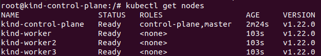
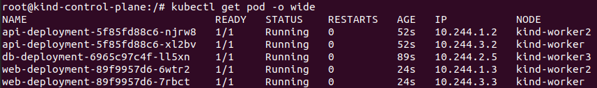
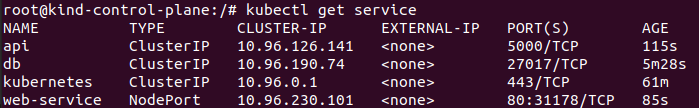
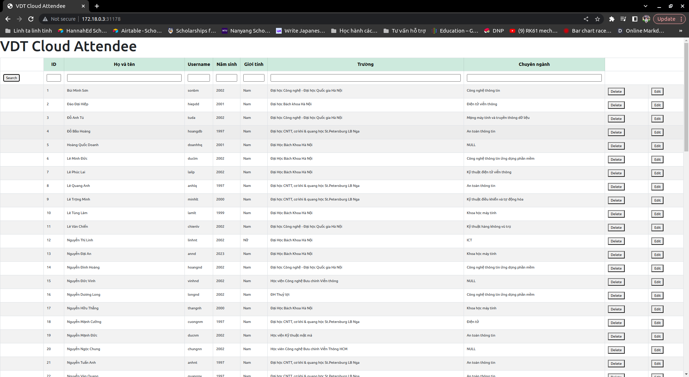
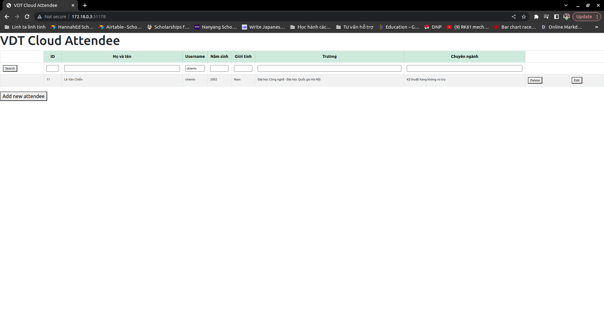

# Kubernetes lab
## 0. Install KinD
```bash
[ $(uname -m) = x86_64 ] && curl -Lo ./kind https://kind.sigs.k8s.io/dl/v0.19.0/kind-linux-amd64
[ $(uname -m) = aarch64 ] && curl -Lo ./kind https://kind.sigs.k8s.io/dl/v0.19.0/kind-linux-arm64
chmod +x ./kind
sudo mv ./kind /usr/local/bin/kind
```
## 1. Create cluster
- File config to create cluster with 1 control-plane and 3 workers
```yaml
#kind-config.yaml
kind: Cluster
apiVersion: kind.x-k8s.io/v1alpha4
nodes:
- role: control-plane
- role: worker
- role: worker
- role: worker
```
- Command to create cluster
```bash
kind create cluster --config kind-config.yaml
```
- Get bash shell in kind control-plane container
```bash
docker exec -it kind-control-plane bash
```
Cluster now have 4 nodes:


- Labeling nodes
```bash
kubectl label nodes kind-worker node-type=server
kubectl label nodes kind-worker2 node-type=server
kubectl label nodes kind-worker3 node-type=db
```
## 2. Create PersistentVolume and PersistentVolumeClaims
`PersistentVolume` with `persistentVolumeReclaimPolicy` = `retain` allows me to retain the data stored in PersistentVolume after the associated service is deleted.

```yaml
#create pv
apiVersion: v1
kind: PersistentVolume
metadata:
  name: pv
spec:
  capacity:
    storage: 5Mi
  volumeMode: Filesystem
  persistentVolumeReclaimPolicy: Retain
  storageClassName: standard
  accessModes:
    - ReadWriteOnce
  hostPath:
    path: /data
```
PersistentVolumeClaims requests and uses a specific amount of storage resources from a Kubernetes cluster.
```yaml
# create persistent volume claim
apiVersion: v1
kind: PersistentVolumeClaim
metadata:
  name: pvc
spec:
  accessModes:
    - ReadWriteOnce
  resources:
    requests:
      storage: 5Mi
  volumeName: pv
```
## 3. Create database deployment
- Database container will be deployed at a node whose node-type=db by using `nodeSelector`.
```yaml
# create db deployment
apiVersion: apps/v1
kind: Deployment
metadata:
  name: db-deployment
spec:
  replicas: 1
  selector:
    matchLabels:
      app: db
  template:
    metadata:
      labels:
        app: db
    spec:
      nodeSelector: 
        node-type: db
      containers:
      - name: db
        image: mongo:5.0
        ports:
        - containerPort: 27017
        volumeMounts:
            - name: mongodb-data-volume
              mountPath: /data/db
      volumes:
      - name: mongodb-data-volume
        persistentVolumeClaim:
            claimName: pvc
```
- Create db Service, expose within the cluster.
```yaml
apiVersion: v1
kind: Service
metadata:
  name: db
spec:
  selector:
    app: db
  ports:
    - protocol: TCP
      port: 27017
      targetPort: 27017
```
## 4. Create API deployment
- Deploy api server with multiple replicas (2) on 2 nodes with node-type=server by using `nodeSelector` and setting `replicas: 2`.
```yaml
# create api deployment
apiVersion: apps/v1
kind: Deployment
metadata:
  name: api-deployment
spec:
  replicas: 2
  selector:
    matchLabels:
      app: api
  template:
    metadata:
      labels:
        app: api
    spec:
      nodeSelector: 
        node-type: server
      containers:
      - name: api
        image: lechiennn/app:v.k8s.1
        ports:
        - containerPort: 5000
```
- Create api Service, expose within the cluster.
```yaml
apiVersion: v1
kind: Service
metadata:
  name: api
spec:
  selector:
    app: api
  ports:
    - protocol: TCP
      port: 5000
      targetPort: 5000 
```
## 5. Create web service
- Deploy web server with multiple replicas (2) on 2 nodes with node-type=server by using `nodeSelector` and setting `replicas: 2`.

```yaml
# create web deployment
apiVersion: apps/v1
kind: Deployment
metadata:
  name: web-deployment
spec:
  replicas: 2
  selector:
    matchLabels:
      app: web
  template:
    metadata:
      labels:
        app: web
    spec:
      nodeSelector: 
        node-type: server
      containers:
      - name: web
        image: lechiennn/web:v.k8s.1
        ports:
        - containerPort: 80
```
- Create api Service, expose to outside the cluster (with `type=NodePort`).

```yaml
apiVersion: v1
kind: Service
metadata:
  name: web-service
spec:
  selector:
    app: web
  ports:
    - protocol: TCP
      port: 80
      targetPort: 80
  type: NodePort    
```
## 6. Testing
Both `web` and `api` are running on each server node (node-type=server) (i.e. 1 web and 1 API on Node 1, and 1 web and 1 API on Node 2) to provide redundancy and fault tolerance.
`database` is connected with PVC and running on db node (node-type=db).



Service `web` can be access from outside the cluster via port `31178`.


Visit http://172.18.0.3:31178/


Try searching sth to make sure the web server can communicate with api server and retrieve data from database.
