# Kubernetes exercise

## Table of contents

<!-- TOC -->

- [Kubernetes exercise](#kubernetes-exercise)
    - [Table of contents](#table-of-contents)
- [Kubernetes Overview](#kubernetes-overview)
    - [Kubernetes at a glance](#kubernetes-at-a-glance)
        - [Master and Work components](#master-and-work-components)
- [Assigment](#assigment)
    - [I. Detailed step-by-step instructions to deploy the application by Kubenetes on local](#i-detailed-step-by-step-instructions-to-deploy-the-application-by-kubenetes-on-local)
        - [Install Kind and create Cluster](#install-kind-and-create-cluster)
        - [Install kubectl for ubuntu](#install-kubectl-for-ubuntu)
        - [Create db-pvc.yaml to storage persistent volume](#create-db-pvcyaml-to-storage-persistent-volume)
        - [Create db-deploment.yamlMongodb](#create-db-deplomentyamlmongodb)
        - [Create api deployment and service files](#create-api-deployment-and-service-files)
        - [Create web deployment and service files](#create-web-deployment-and-service-files)
    - [Logs and test the application](#logs-and-test-the-application)
    - [II. Try to deploy web application on AWS EKS](#ii-try-to-deploy-web-application-on-aws-eks)
        - [What is Amazon EKS?](#what-is-amazon-eks)
        - [Amazon EKS control plane architecture](#amazon-eks-control-plane-architecture)
        - [How does Amazon EKS work?](#how-does-amazon-eks-work)
        - [Getting started with Amazon EKS](#getting-started-with-amazon-eks)
            - [Prerequisites](#prerequisites)
            - [Amazon EBS CSI driver<a name="ebs-csi"></a>](#amazon-ebs-csi-drivera-nameebs-csia)
    - [Summary](#summary)

<!-- /TOC -->

# Kubernetes Overview

<p align="center">
  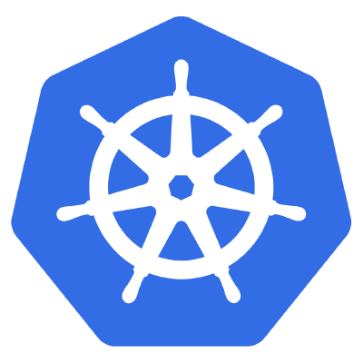<br>
</p>

*"Kubernetes is a portable, extensible open-source platform for managing containerized workloads and services, that facilitates both declarative configuration and automation. It has a large, rapidly growing ecosystem. Kubernetes services, support, and tools are widely available."*

*"Google open-sourced the Kubernetes project in 2014. Kubernetes builds upon a decade and a half of experience that Google has with running production workloads at scale, combined with best-of-breed ideas and practices from the community."*

> Reference: https://kubernetes.io/docs/concepts/overview/what-is-kubernetes/

**Kubernetes** advantages includes:

* **Agile application development and deployment**: Increased ease and efficiency of container image creation compared to VM image use.
* **Continuous development, integration, and deployment**: Provides for reliable and frequent container image build and deployment with quick and easy rollbacks (due to image immutability).
* **Dev and Ops separation of concerns**: Create application container images at build/release time rather than deployment time, thereby decoupling applications from infrastructure.
* **Observability**: Not only surfacing OS-level information and metrics but also application health and other signals.
* **Environmental consistency across development, testing, and production**: Runs the same on a laptop as it does in the cloud.
* **Cloud and OS distribution portability**: Runs on Debian, Ubuntu, CoreOS, on-prem, Google Kubernetes Engine, Amazon Elastic Container Service and anywhere else.
* **Application-centric management**: Raises the level of abstraction from running an OS on virtual hardware to running an application on an OS using logical resources.
* **Loosely coupled, distributed, elastic, liberated micro-services**: Applications are broken into smaller, independent pieces and can be deployed and managed dynamically — not a monolithic stack running on a big single-purpose machine.
* **Resource isolation**: Predictable application performance.
* **Resource utilization**: High efficiency and density.

> Reference: https://kubernetes.io/docs/concepts/overview/what-is-kubernetes/

In order for **Kubernetes** to reach its full capacity, it depends on and makes use of other open source tools. Among them we can include:

* **Registry**, such as the [**Docker Registry**](https://docs.docker.com/registry/).
* **Network**, such as [**Flannel**](https://github.com/coreos/flannel), [**Calico**](https://docs.projectcalico.org/v3.7/getting-started/kubernetes/), [**MetalLB**](https://metallb.universe.tf/), [**CoreDNS**](https://github.com/coredns/coredns), etc.
* **Telemetry**, such as [**Prometheus**](https://prometheus.io/), [**Sysdig**](https://sysdig.com/products/monitor/) and [**Istio**](https://istio.io/docs/concepts/policies-and-telemetry/).
* **Security**, such as [**LDAP**](https://en.wikipedia.org/wiki/Lightweight_Directory_Access_Protocol), [**SELinux**](https://en.wikipedia.org/wiki/Security-Enhanced_Linux), [**RBAC**](https://kubernetes.io/docs/reference/glossary/?security=true#term-rbac) and [**OAuth**](https://oauth.net/) with multi-tier layers.
* **Services**, offered in a varied catalog of previously created content from popular application patterns.

## Kubernetes at a glance

<p align="center">
  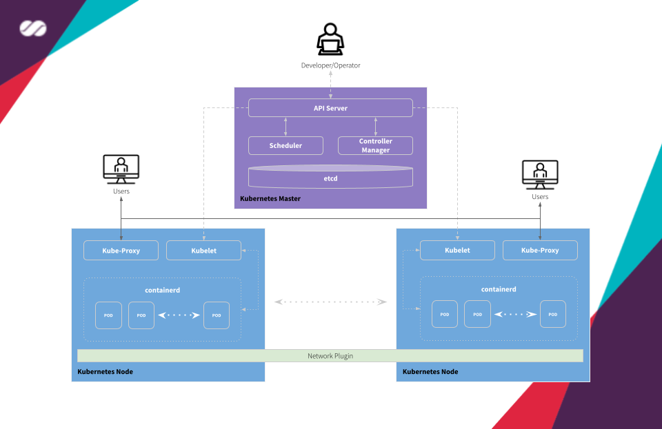<br>
  Kubernetes Architecture Diagram
</p>

A cluster managed by **Kubernetes** basically has two large operational units: **Master node(s)** and **Worker nodes**.

* **Master**: is the element responsible for orchestrating all activities related to the containers that run on the worker nodes. It is responsible for scheduling and deploying a clustered application and obtaining information about worker nodes and Pods, among many other activities.
* **Worker**: are the machines (nodes, which can be physical or VMs) where the containers managed by **Kubernetes** effectively run. In order for worker nodes to be managed by **Kubernetes**, they must have **Kubelet** agents from **Kubernetes** installed on them. It is through this agent that all communication with the master is performed and, as a consequence, the cluster operations are performed.

**Kubernetes master** receives the commands from the Developer/Operator (DevOps) and passes the instructions to the worker nodes. These instructions are processed and retransmitted by a set of services that automatically decide which worker node is most suitable to process the requested the task. The resources are then allocated and assigned to the selected worker node to satisfy the requested statement.

Container management takes place at a higher and more refined level, without someone needs to actively micromanage containers and worker nodes individually.

### Master and Work components

* **Container network interface (CNI)**: This plugin is a type of Network plugin that adheres to the appc/CNI specification. This is what enables connecting Pods running on different nodes and flexibility to integrate different kind of network solutions (overlays, pure L3, etc).
* **etcd**: Consistent and highly-available key-value store used as **Kubernetes’** backing store for all cluster data. If your **Kubernetes** cluster uses **etcd** as its backing store, make sure you have a back up plan for those data.
* **API server**: Component on the master that exposes the Kubernetes API. It is the front-end for the Kubernetes control plane. It is designed to scale horizontally — that is, it scales by deploying more instances.
* **Control Plane**: The container orchestration layer that exposes the API and interfaces to define, deploy, and manage the lifecycle of containers.
* **Scheduler**: Component on the master that watches newly created Pods that have no worker node assigned, and selects a worker node for them to run into. Factors taken into account for scheduling decisions include individual and collective resource requirements, hardware/software/policy constraints, affinity and anti-affinity specifications, data locality, inter-workload interference and deadlines.
* **Controller manager**: Component on the master that runs controllers. Logically, each controller is a separate process but, to reduce complexity, they are all compiled into a single binary and run in a single process.
* **kubelet**: A service ran on the worker nodes that reads Pod manifests and ensures that its defined containers have been started and are running.
* **containerd**: A container runtime with an emphasis on simplicity, robustness and portability **containerd** is a container runtime that runs as a daemon on Linux or Windows. **containerd** takes care of fetching and storing container images, executing containers, providing network access, and more. (in our solution we’ll use **Docker** for this purpose)
* **Kube Proxy**: It is a network proxy that runs on each worker node in the cluster. **kube-proxy** is responsible for request forwarding. **kube-proxy** allows TCP and UDP stream forwarding or round-robin TCP and UDP forwarding across a set of backend functions.

# Assigment
Assignment: Deploy a Multi-tier Application on Kubernetes.

Objective: The objective of this assignment is to apply the concepts learned in the hands-on labs and deploy a multi-tier application on Kubernetes. The application consists of a frontend web server, a backend API server, and a database.

## I. Detailed step-by-step instructions to deploy the application by Kubenetes on local

### 1. Install Kind and create Cluster

```
[ $(uname -m) = x86_64 ] && curl -Lo ./kind https://kind.sigs.k8s.io/dl/v0.19.0/kind-linux-amd64
[ $(uname -m) = aarch64 ] && curl -Lo ./kind https://kind.sigs.k8s.io/dl/v0.19.0/kind-linux-arm64
chmod +x ./kind
sudo mv ./kind /usr/local/bin/kind
docker pull kindest/node:v1.22.0
kind create cluster --image kindest/node:v1.22.0 --name app
```
`kind` stands for Kubernetes in Docker and it is a tool for running local Kubernetes clusters using Docker container "nodes". `kind` is used  for development and testing purposes, using Docker containers as the cluster nodes.
### Install kubectl for ubuntu
<p align="center">
  
</p>
`kubectl`  is a command line tool for communicating with a Kubernetes API server. You can use kubectl to create, inspect, update, and delete Kubernetes objects.
```
curl -O https://s3.us-west-2.amazonaws.com/amazon-eks/1.25.9/2023-05-11/bin/linux/amd64/kubectl
```
After you install kubectl, you can verify its version.
```
kubectl version --short --client
```
### 2. Create `db-secrets.yaml` the database credentials

```yaml
apiVersion: v1
kind: Secret
metadata:
  name: db-credentials
type: Opaque
data:
  user: dmR0MjM=
  password: MTIzNDU2
  url: bW9uZ29kYjovL3ZkdDIzOjEyMzQ1NkBtb25nb2RiLXNlcnZpY2U6MjcwMTcv
```
Apply the Secret to the cluster:
```
kubectl apply -f db-secrets.yaml
```
The first yaml creates a Kubernetes Secret named db-credentials of type `Opaque` with three data fields: `user`, `password`, and `url`. The values of these fields are **Base64-encoded** strings, which can be decoded to obtain the actual values. 
- `user` and `password` fields in the Secret object are used by the `database` pod to initialize the initial username and password.
- The `url` field is used by the `api` pod to connect to the database pod via `pymongo`.
This Secret is used to store **database credentials**.

### 3. Create `db-pvc.yaml` to storage persistent volume
```yaml
apiVersion: v1
kind: PersistentVolumeClaim
metadata:
  name: db-data-pvc
spec:
  accessModes:
    - ReadWriteOnce
  resources:
    requests:
      storage: 100Mi
```
The second YAML file creates a Kubernetes `Persistent Volume Claim` named db-data-pvc with a request for 100Mi of storage and `ReadWriteOnce` access mode. command to create the PVC in the Kubernetes cluster :
```
kubectl apply -f db-pvc.yaml
```

### 4. Create `db-deploment.yaml`(Mongodb)
Deloy database pod and database service
Multiple resources can be created the same way as a **single** resource.
The resources will be created in the **order** they appear in the file. Therefore, it's best to specify the **service** first, since that will ensure the **scheduler** can spread the pods associated with the `service` as they are created by the controller(s), such as `Deployment`.

```yaml
apiVersion: v1
kind: Service
metadata:
  name: mongodb-service
spec:
  selector:
    app: db
  ports:
    - protocol: TCP
      port: 27017
      targetPort: 27017
  type: NodePort

---
apiVersion: apps/v1
kind: Deployment
metadata:
  name: db
spec:
  replicas: 1
  selector:
    matchLabels:
      app: db
  template:
    metadata:
      labels:
        app: db
    spec:
      containers:
      - name: mongodb
        image: mongo:5.0
        ports:
        - containerPort: 27017
        env:
        - name: MONGO_INITDB_ROOT_USERNAME
          valueFrom:
            secretKeyRef:
              name: db-credentials
              key: user
        - name: MONGO_INITDB_ROOT_PASSWORD
          valueFrom:
            secretKeyRef:
              name: db-credentials
              key: password
        volumeMounts:
        - name: db-data
          mountPath: /var/lib/mongo/data
      volumes:
      - name: db-data
        persistentVolumeClaim:
          claimName: db-data-pvc
```
The Deployment also specifies two environment variables, `MONGO_INITDB_ROOT_USERNAME` and `MONGO_INITDB_ROOT_PASSWORD`, which are set using a Kubernetes Secret named db-credentials. These environment variables are used to set the username and password for the MongoDB database. The Deployment also specifies a volume mount named `db-data` at the path `/var/lib/mongo/data`, which is used to store the MongoDB data.
The volumes section of the Deployment specifies a persistent volume claim named `db-data-pvc`. The Service exposes port 27017 for the MongoDB database and is of type `NodePort`, which means that the Service is externally accessible on a randomly assigned port on each node in the cluster.
```
kubectl apply -f db-deployment.yaml
```

### 5. Create api deployment and service files
```yaml
apiVersion: v1
kind: Service
metadata:
  name: api
spec:
  selector:
    app: api
  ports:
    - protocol: TCP
      port: 5000
      targetPort: 5000
      nodePort: 30005
  type: NodePort

---
apiVersion: apps/v1
kind: Deployment
metadata:
  name: api
spec:
  replicas: 2
  selector:
    matchLabels:
      app: api
  template:
    metadata:
      labels:
        app: api
    spec:
      containers:
      - name: api
        image: pdc1997/api
        ports:
        - containerPort: 5000
        env:
        - name: DATABASE_URL
          valueFrom:
            secretKeyRef:
              name: db-credentials
              key: url
      initContainers:
      - name: wait-for-database
        image: busybox
        command: ['sh', '-c', 'until nc -zv mongodb-service 27017; do echo waiting for database; sleep 2; done;']
```
```
kubectl apply -f api-deployment.yaml
```
This manifest creates a `Service object` that exposes the `Deployment` in the cluster. The Deployment creates two replicas of a pod that runs a containerized application, with the DATABASE_URL environment variable set to the value of the url key in a `Secret` object named `db-credentials`. The `initContainers` section also includes an init container that waits for the mongodb-service to become available before the main container starts running.
Once the `initContainer` completes successfully (i.e., the nc command connects to the database service), the main container `api` in the pod  will start.
**Note** that the `initContainer` runs to completion before the main container starts, so if the initContainer fails, the main container will not start. This ensures that your application does not start until `mongodb-service` are available.

### 6. Create web deployment and service files
```yaml
apiVersion: v1
kind: Service
metadata:
  name: web-service
spec:
  selector:
    app: web
  ports:
    - protocol: TCP
      port: 80
      targetPort: 80
      nodePort: 30001
  type: NodePort

---    
apiVersion: apps/v1
kind: Deployment
metadata:
  name: web
spec:
  replicas: 2
  selector:
    matchLabels:
      app: web
  template:
    metadata:
      labels:
        app: web
    spec:
      containers:
      - name: web
        image: pdc1997/web
        ports:
        - containerPort: 80
```
```
kubectl apply -f web-deployment.yaml
```
This manifest creates a `Service` object that exposes the Deployment on `30001` port on each node in the cluster. The Deployment creates two replicas of a pod `web` that runs a containerized application of images `pdc1997/web`. 


**Trick:** we can use short command to run all yaml files. 
```
kubectl apply -f ./
```
This command apply all the Kubernetes YAML manifests in the current directory in alphabetical order by filename.

## Logs and test the application
- List of pods and logs from api and web pods
<div align="center">
  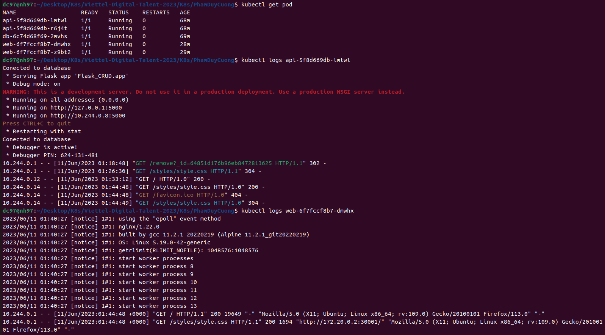
</div>

- Interface the application

<div align="center">
  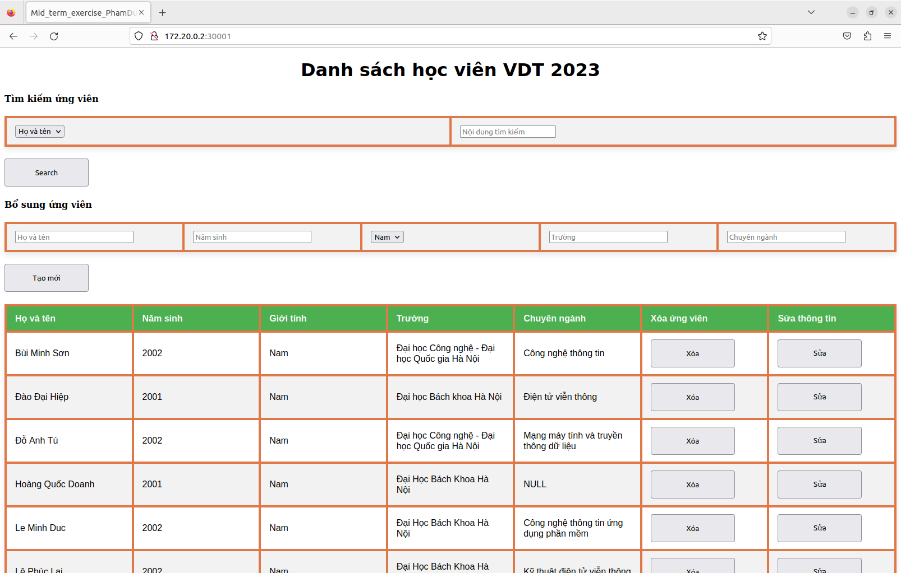
</div>

- Test search API with attendees's YoB = 2002

<div align="center">
  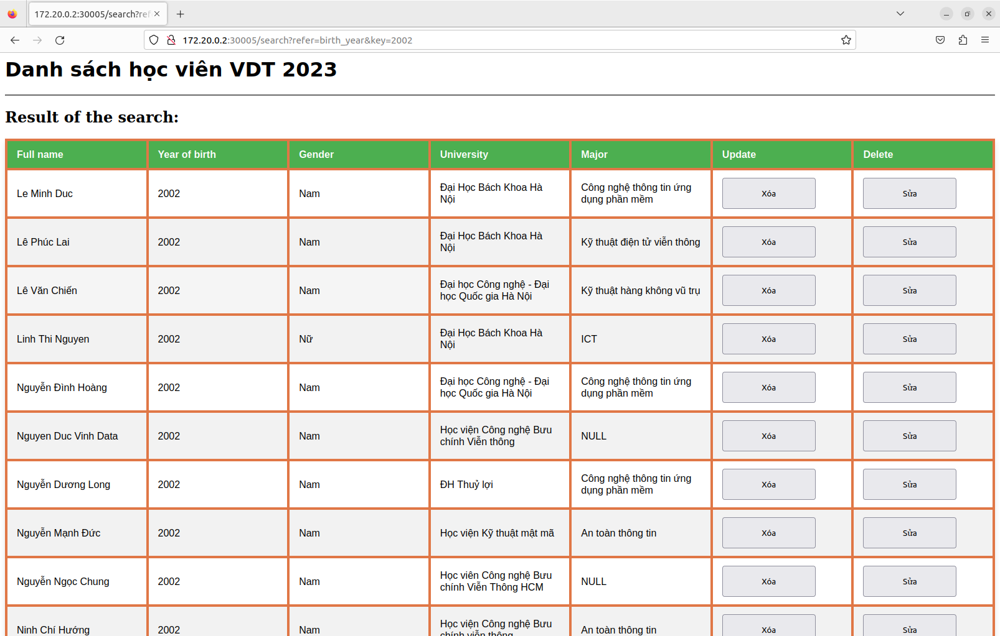
</div>

## II. Try to deploy web application on AWS EKS 
### What is Amazon EKS?
Amazon Elastic Kubernetes Service (Amazon EKS) is a managed service that you can use to run Kubernetes on AWS without needing to install, operate, and maintain your own Kubernetes control plane or nodes. Kubernetes is an open-source system for automating the deployment, scaling, and management of containerized applications.
For a list of other features, see Amazon EKS features.
### Amazon EKS control plane architecture
Amazon EKS runs a single tenant Kubernetes control plane for each cluster. The control plane infrastructure isn't shared across clusters or AWS accounts. The control plane consists of at least two API server instances and three etcd instances that run across three Availability Zones within an AWS Region
- Amazon EKS runs a single tenant Kubernetes control plane for each cluster. 
- The control plane infrastructure isn't shared across clusters or AWS accounts. 
- The control plane consists of at least two API server instances and three etcd instances that run across three Availability Zones within an AWS Region
### How does Amazon EKS work?

Getting started with Amazon EKS:

- Create an Amazon EKS cluster in the with the `AWS CLI` or one of the AWS SDKs.

- Launch managed or self-managed Amazon EC2 nodes, or deploy your workloads to AWS Fargate.

- When your cluster is ready, you can configure your favorite Kubernetes tools, such as `kubectl`, to communicate with your cluster.

- Deploy and manage workloads on your Amazon EKS cluster the same way that you would with any other Kubernetes environment.

### Getting started with Amazon EKS
 
#### Prerequisites
Many procedures of this user guide use the following command line tools:
+ **`kubectl`** – A command line tool for working with Kubernetes clusters\. For more information, see [Installing or updating `kubectl`](install-kubectl.md)\.

+ **`eksctl`** – A command line tool for working with EKS clusters that automates many individual tasks\. For more information, see [Installing or updating `eksctl`](eksctl.md)\.
<div align="center">
  
</div>


I will also need [AWS IAM Authenticator for Kubernetes](https://github.com/kubernetes-sigs/aws-iam-authenticator) command (either `aws-iam-authenticator`).

The IAM account used for EKS cluster creation should have these minimal access levels.

    | AWS Service      | Access Level                                           |
    |------------------|--------------------------------------------------------|
    | CloudFormation   | Full Access                                            |
    | EC2              | **Full:** Tagging **Limited:** List, Read, Write       |
    | EC2 Auto Scaling | **Limited:** List, Write                               |
    | EKS              | Full Access                                            |
    | IAM              | **Limited:** List, Read, Write, Permissions Management |
    | Systems Manager  | **Limited:** List, Read                                |

+ **`AWS CLI`** – A command line tool for working with AWS services, including Amazon EKS\. For more information, see [Installing, updating, and uninstalling the AWS CLI](https://docs.aws.amazon.com/cli/latest/userguide/cli-chap-install.html) in the AWS Command Line Interface User Guide\. After installing the AWS CLI, I had configured it. 
Run the aws configure command in the terminal or command prompt. 
`aws configure`
This command will prompt you to enter your AWS `access key ID`, `secret access` key, `default region name`, and `default output format`. 
<div align="center">
  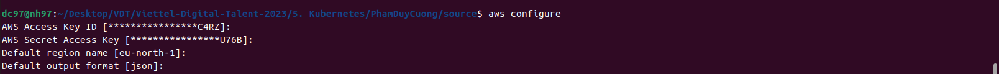
</div>
After this check authenfication
`aws sts get-caller-identity`
<div align="center">
  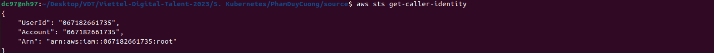
</div>

**Step 1**: Create your Amazon EKS cluster and nodes: 
```
eksctl create cluster --name VDT23 --region eu-north-1 --nodegroup app nodes 3 node-type t3.smalll
```

<div align="center">
  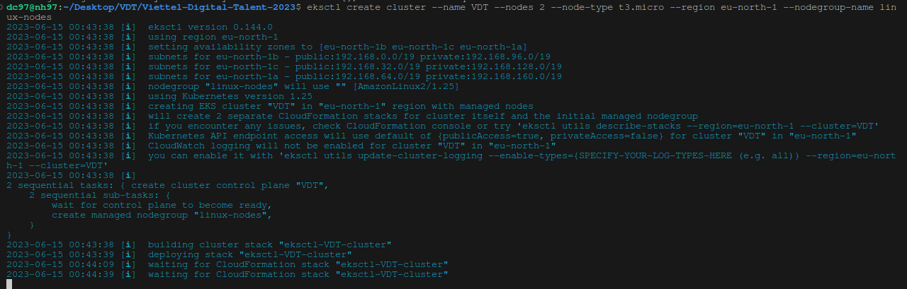
</div>

**Step 2**: check Kubernetes resources
```
kubectl get nodes -o wide
```
<div align="center">
  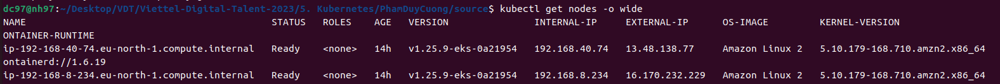
</div>

**Step 3**: Configure your computer to communicate with your cluster
Create or update a kubeconfig file for your cluster. Replace region-code with the AWS Region that you created your cluster in. Replace my-cluster with the name of your cluster: 
```
aws eks update-kubeconfig --name VDT23 --region eu-north-1
```

**Step 4**: Deploy all manifests file as on local but... 

I cant creat `persistent volumes` on cluster. And I need to install `Amazon EBS CSI driver` to storage this.
#### Amazon EBS CSI driver<a name="ebs-csi"></a>

The Amazon Elastic Block Store \(Amazon EBS\) Container Storage Interface \(CSI\) driver allows Amazon Elastic Kubernetes Service \(Amazon EKS\) clusters to manage the lifecycle of Amazon EBS volumes for persistent volumes\.

Here are some things to consider about using the Amazon EBS CSI driver\.
+ The Amazon EBS CSI plugin requires IAM permissions to make calls to AWS APIs on your behalf\. For more information, see [Creating the Amazon EBS CSI driver IAM role](csi-iam-role.md)\.
+ Alpha features of the Amazon EBS CSI driver aren't supported on Amazon EKS clusters\.

**Important**  
 If I don't install this driver before updating your cluster to `1.27`, I might experience workload interruption\.

The Amazon EBS CSI driver isn't installed when I first create a cluster\. To use the driver, I must add it as an Amazon EKS add\-on or as a self\-managed add\-on\.
+ For instructions on how to add it as a self\-managed add\-on, see the [Amazon EBS Container Storage Interface \(CSI\) driver](https://github.com/kubernetes-sigs/aws-ebs-csi-driver) project on GitHub\.

After I installed the CSI driver, I can test the functionality with application. In this picture PVC have bound to node.
<div align="center">
  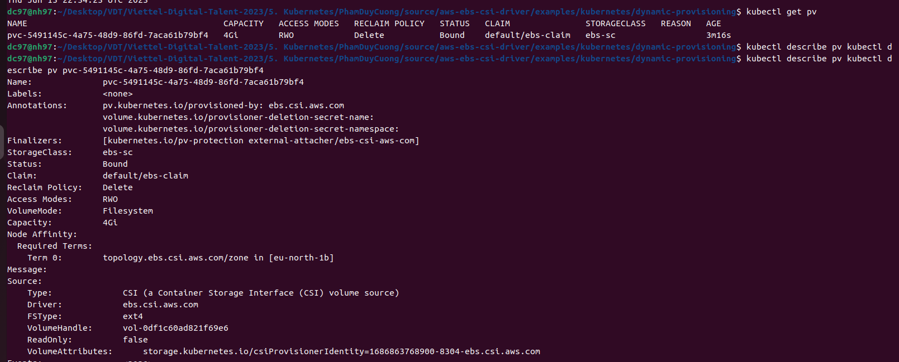
</div>


**Step 5**: Check through result :
- Created volumes
<div align="center">
  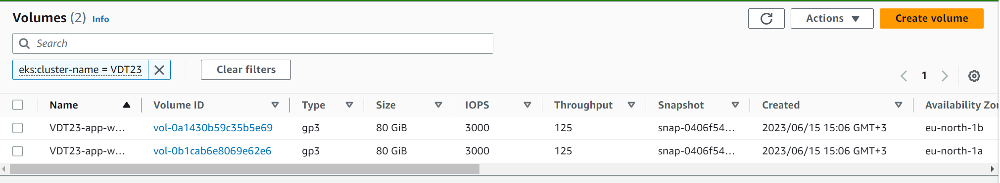
</div>

- Worker nodes 
<div align="center">
  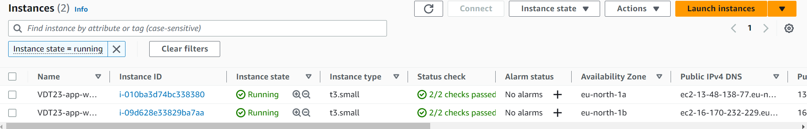
</div>

- Interface of app, which can accessed from any where
<div align="center">
  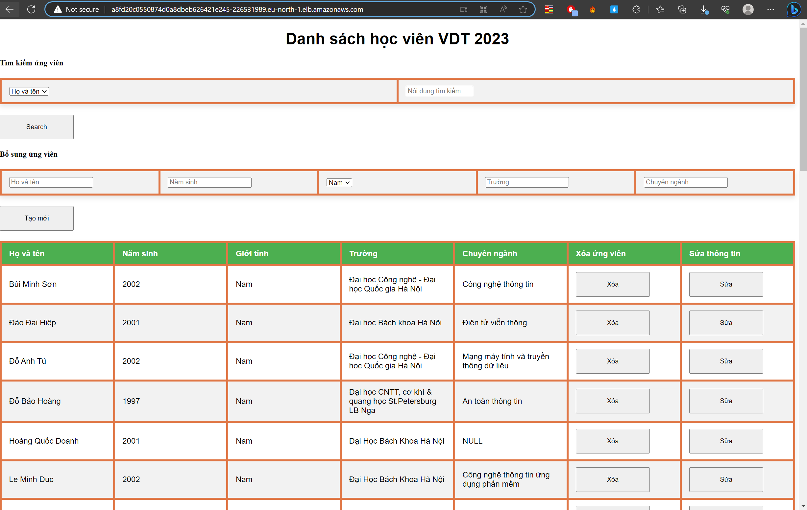
</div>

## 5. Summary

- Successfully created a 3-tier web using Kubernetes.
- Approached and got acquainted with Kubernetes.
- Used `initContainer` ensures that pods `api`does not start until `database` pods are available.
- Used `Secrets` to store sensitive information such as database credentials.
- Approached and got acquainted with AWS cloud, IAM authentication(for me, it is very hard).
- Deloyed web app on AWS EKS.