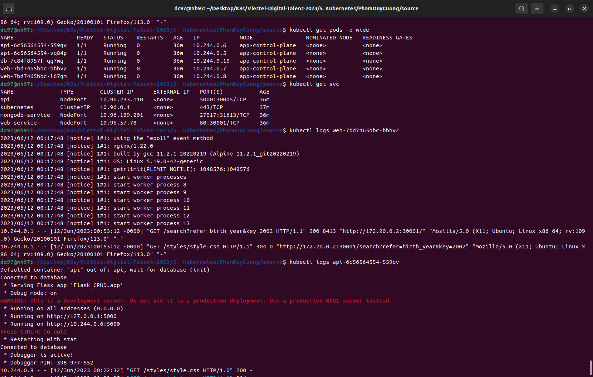

# Deploy a Multi-tier Application on Kubernetes

<!-- TOC -->

- [Deploy a Multi-tier Application on Kubernetes](#deploy-a-multi-tier-application-on-kubernetes)
    - [Assigment](#assigment)
    - [Detailed step-by-step instructions to deploy the application by Kubenetes](#detailed-step-by-step-instructions-to-deploy-the-application-by-kubenetes)
        - [Install Kind and create Cluster](#install-kind-and-create-cluster)
        - [Create db-secrets.yaml the database credentials](#create-db-secretsyaml-the-database-credentials)
        - [Create db-pvc.yaml to storage persistent volume](#create-db-pvcyaml-to-storage-persistent-volume)
        - [Create db-deploment.yamlMongodb](#create-db-deplomentyamlmongodb)
        - [Create api deployment and service files](#create-api-deployment-and-service-files)
        - [Create web deployment and service files](#create-web-deployment-and-service-files)
    - [Logs and test the application](#logs-and-test-the-application)
    - [Summary](#summary)

<!-- /TOC -->
## 1.Assigment
Assignment: Deploy a Multi-tier Application on Kubernetes.

Objective: The objective of this assignment is to apply the concepts learned in the hands-on labs and deploy a multi-tier application on Kubernetes. The application consists of a frontend web server, a backend API server, and a database.

## 2. Detailed step-by-step instructions to deploy the application by Kubenetes

### 2.1. Install Kind and create Cluster

```
[ $(uname -m) = x86_64 ] && curl -Lo ./kind https://kind.sigs.k8s.io/dl/v0.19.0/kind-linux-amd64
[ $(uname -m) = aarch64 ] && curl -Lo ./kind https://kind.sigs.k8s.io/dl/v0.19.0/kind-linux-arm64
chmod +x ./kind
sudo mv ./kind /usr/local/bin/kind
docker pull kindest/node:v1.22.0
kind create cluster --image kindest/node:v1.22.0 --name app
```
`kind` stands for Kubernetes in Docker and it is a tool for running local Kubernetes clusters using Docker container "nodes". `kind` is used  for development and testing purposes, using Docker containers as the cluster nodes.

### 2.2. Create `db-secrets.yaml` the database credentials

```yaml
apiVersion: v1
kind: Secret
metadata:
  name: db-credentials
type: Opaque
data:
  user: dmR0MjM=
  password: MTIzNDU2
  url: bW9uZ29kYjovL3ZkdDIzOjEyMzQ1NkBtb25nb2RiLXNlcnZpY2U6MjcwMTcv
```

```
kubectl apply -f db-secrets.yaml
```
The first yaml creates a Kubernetes Secret named db-credentials of type `Opaque` with three data fields: `user`, `password`, and `url`. The values of these fields are **Base64-encoded** strings, which can be decoded to obtain the actual values. 
- `user` and `password` fields in the Secret object are used by the `database` pod to initialize the initial username and password.
- The `url` field is used by the `api` pod to connect to the database pod via `pymongo`.
This Secret is used to store **database credentials**.

### 2.3. Create `db-pvc.yaml` to storage persistent volume
```yaml
apiVersion: v1
kind: PersistentVolumeClaim
metadata:
  name: db-data-pvc
spec:
  accessModes:
    - ReadWriteOnce
  resources:
    requests:
      storage: 100Mi
```
The second YAML file creates a Kubernetes `Persistent Volume Claim` named db-data-pvc with a request for 100Mi of storage and `ReadWriteOnce` access mode. command to create the PVC in the Kubernetes cluster :
```
kubectl apply -f db-pvc.yaml
```

### 2.4. Create `db-deploment.yaml`(Mongodb)
Deloy database pods and database service
Multiple resources can be created the same way as a single resource.
The resources will be created in the **order** they appear in the file. Therefore, it's best to specify the service first, since that will ensure the scheduler can spread the pods associated with the `service` as they are created by the controller(s), such as `Deployment`.

```yaml
apiVersion: v1
kind: Service
metadata:
  name: mongodb-service
spec:
  selector:
    app: db
  ports:
    - protocol: TCP
      port: 27017
      targetPort: 27017
  type: NodePort

---
apiVersion: apps/v1
kind: Deployment
metadata:
  name: db
spec:
  replicas: 1
  selector:
    matchLabels:
      app: db
  template:
    metadata:
      labels:
        app: db
    spec:
      containers:
      - name: mongodb
        image: mongo:5.0
        ports:
        - containerPort: 27017
        env:
        - name: MONGO_INITDB_ROOT_USERNAME
          valueFrom:
            secretKeyRef:
              name: db-credentials
              key: user
        - name: MONGO_INITDB_ROOT_PASSWORD
          valueFrom:
            secretKeyRef:
              name: db-credentials
              key: password
        volumeMounts:
        - name: db-data
          mountPath: /var/lib/mongo/data
      volumes:
      - name: db-data
        persistentVolumeClaim:
          claimName: db-data-pvc
```
The Deployment also specifies two environment variables, `MONGO_INITDB_ROOT_USERNAME` and `MONGO_INITDB_ROOT_PASSWORD`, which are set using a Kubernetes Secret named db-credentials. These environment variables are used to set the username and password for the MongoDB database. The Deployment also specifies a volume mount named `db-data` at the path `/var/lib/mongo/data`, which is used to store the MongoDB data.
The volumes section of the Deployment specifies a persistent volume claim named `db-data-pvc`. The Service exposes port 27017 for the MongoDB database and is of type `NodePort`, which means that the Service is externally accessible on a randomly assigned port on each node in the cluster.
```
kubectl apply -f db-deployment.yaml
```

### 2.5. Create api deployment and service files
```yaml
apiVersion: v1
kind: Service
metadata:
  name: api
spec:
  selector:
    app: api
  ports:
    - protocol: TCP
      port: 5000
      targetPort: 5000
      nodePort: 30005
  type: NodePort

---
apiVersion: apps/v1
kind: Deployment
metadata:
  name: api
spec:
  replicas: 2
  selector:
    matchLabels:
      app: api
  template:
    metadata:
      labels:
        app: api
    spec:
      containers:
      - name: api
        image: pdc1997/api
        ports:
        - containerPort: 5000
        env:
        - name: DATABASE_URL
          valueFrom:
            secretKeyRef:
              name: db-credentials
              key: url
      initContainers:
      - name: wait-for-database
        image: busybox
        command: ['sh', '-c', 'until nc -zv mongodb-service 27017; do echo waiting for database; sleep 2; done;']
```
```
kubectl apply -f api-deployment.yaml
```
This manifest creates a `Service object` that exposes the `Deployment` in the cluster. The Deployment creates two replicas of a pod that runs a containerized application, with the DATABASE_URL environment variable set to the value of the url key in a `Secret` object named `db-credentials`. The `initContainers` section also includes an init container that waits for the mongodb-service to become available before the main container starts running.
Once the `initContainer` completes successfully (i.e., the nc command connects to the database service), the main container `api` in the pod  will start.
**Note** that the `initContainer` runs to completion before the main container starts, so if the initContainer fails, the main container will not start. This ensures that your application does not start until `mongodb-service` are available.

### 2.6. Create web deployment and service files
```yaml
apiVersion: v1
kind: Service
metadata:
  name: web-service
spec:
  selector:
    app: web
  ports:
    - protocol: TCP
      port: 80
      targetPort: 80
      nodePort: 30001
  type: NodePort

---    
apiVersion: apps/v1
kind: Deployment
metadata:
  name: web
spec:
  replicas: 2
  selector:
    matchLabels:
      app: web
  template:
    metadata:
      labels:
        app: web
    spec:
      containers:
      - name: web
        image: pdc1997/web
        ports:
        - containerPort: 80
```
```
kubectl apply -f web-deployment.yaml
```
This manifest creates a `Service` object that exposes the Deployment on `30001` port on each node in the cluster. The Deployment creates two replicas of a pod `web` that runs a containerized application of images `pdc1997/web`. 


**Trick:** we can use short command to run all yaml files. 
```
kubectl apply -f ./
```
This command apply all the Kubernetes YAML manifests in the current directory in alphabetical order by filename.

## 3. Logs and test the application
- List of pods and logs from api and web pods
<div align="center">
  
</div>

- Interface the application

<div align="center">
  
</div>

- Test search API with attendees's YoB = 2002

<div align="center">
  
</div>

## 4. Summary

- Successfully created a 3-tier web using Kubernetes.
- Approached and got acquainted with Kubernetes.
- Used `initContainer` ensures that pods `api`does not start until `database` pods are available.
- Used `Secrets` to store sensitive information such as database credentials.