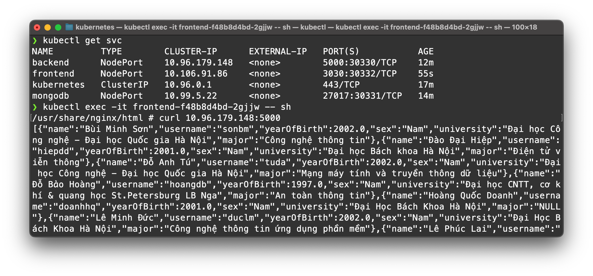
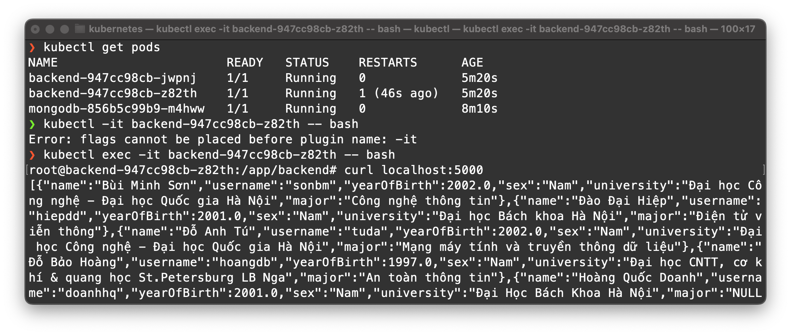
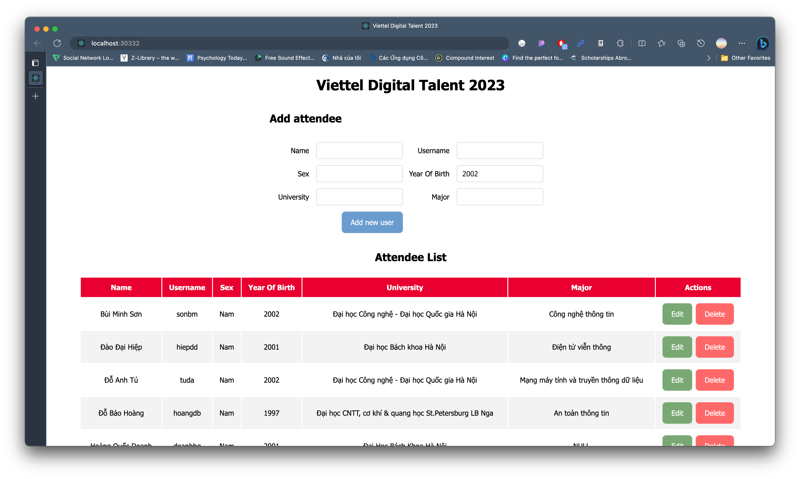

# Kubernetes Assignment

## Deploy a Multi-tier Application on Kubernetes using Docker Desktop

The application consists of a frontend web server, a backend API server, and a database.

### **Design and create the necessary YAML files to deploy the following components**

#### **1. Database Deployment and Service: Deploy a database (e.g., MySQL or PostgreSQL) with persistent storage for data persistence. Expose the database service within the cluster.**

Firstly, I create `secret` for some significant environment variables associated with MongoDB.

```
kubectl create secret generic mongo-creds --from-literal="database=<DATABASE_NAME>" --from-literal="username=<USERNAME" --from-literal="password=<PASSWORD>"
```

```yaml
apiVersion: v1
kind: Secret
metadata:
  name: mongo-creds
type: Opaque
data:
  username: a2lsaW5o
  password: TGluaDI4MTI=
  database: dmR0LTIwMjM=
```

I use `configmap` and mount the creation script to initialize the collection in MongoDB.

```
kubectl create configmap mongo-configmap --from-file=./data
```

**Deployment:** [`deployment.yaml`](https://github.com/khanhlinhh/Viettel-Digital-Talent-2023/blob/k8s/5.%20Kubernetes/PhamThiKhanhLinh/database/deployment.yaml)

```yaml
apiVersion: apps/v1
kind: Deployment
metadata:
  name: mongodb
spec:
  selector:
    matchLabels:
      app: mongodb
  replicas: 1
  strategy:
    type: RollingUpdate
    rollingUpdate:
      maxSurge: 1
      maxUnavailable: 1
  minReadySeconds: 5
  template:
    metadata:
      labels:
        app: mongodb
    spec:
      containers:
        - name: vdt-k8s-db
          image: mongo:5.0
          imagePullPolicy: Always
          env:
            - name: MONGO_INITDB_DATABASE
              valueFrom:
                secretKeyRef:
                  name: mongo-creds
                  key: database
            - name: MONGO_INITDB_ROOT_USERNAME
              valueFrom:
                secretKeyRef:
                  name: mongo-creds
                  key: username
            - name: MONGO_INITDB_ROOT_PASSWORD
              valueFrom:
                secretKeyRef:
                  name: mongo-creds
                  key: password
          ports:
            - containerPort: 27017
              name: mongodb
          volumeMounts:
            - name: mongodb-persistent-storage
              mountPath: /data/db
            - name: init-mongo
              mountPath: /docker-entrypoint-initdb.d/
      volumes:
        - name: mongodb-persistent-storage
          persistentVolumeClaim:
            claimName: mongodb-pvc
        - name: init-mongo
          configMap:
            name: mongo-configmap
```

**Service:** [`service.yaml`](https://github.com/khanhlinhh/Viettel-Digital-Talent-2023/blob/k8s/5.%20Kubernetes/PhamThiKhanhLinh/database/service.yaml)

```yaml
apiVersion: v1
kind: Service
metadata:
  name: mongodb
  labels:
    app: vdt-k8s
spec:
  ports:
    - protocol: TCP
      port: 27017
      targetPort: 27017
      nodePort: 30331
  type: NodePort
  selector:
    app: mongodb
```

**Persistent Volume:** [`pv.yaml`](https://github.com/khanhlinhh/Viettel-Digital-Talent-2023/blob/k8s/5.%20Kubernetes/PhamThiKhanhLinh/database/pv.yaml)

```yaml
apiVersion: v1
kind: PersistentVolume
metadata:
  name: mongodb-pv
  labels:
    app: mongodb
spec:
  accessModes:
    - ReadWriteOnce
  capacity:
    storage: 500Mi
  hostPath:
    path: /data/mongodb
  persistentVolumeReclaimPolicy: Retain
  storageClassName: standard
```

**Persistent Volume Claim:** [`pvc.yaml`](https://github.com/khanhlinhh/Viettel-Digital-Talent-2023/blob/k8s/5.%20Kubernetes/PhamThiKhanhLinh/database/pvc.yaml)

```yaml
apiVersion: v1
kind: PersistentVolumeClaim
metadata:
  name: mongodb-pvc
  labels:
    app: mongodb
spec:
  accessModes:
    - ReadWriteOnce
  volumeName: mongodb-pv
  resources:
    requests:
      storage: 5Mi
  storageClassName: standard
```

#### **2. Backend Deployment and Service: Deploy a backend API server (e.g., Node.js, Flask, or any other framework) with multiple replicas. Expose the backend service within the cluster.**

**Deployment:** [`deployment.yaml`](https://github.com/khanhlinhh/Viettel-Digital-Talent-2023/blob/k8s/5.%20Kubernetes/PhamThiKhanhLinh/backend/deployment.yaml)

```yaml
apiVersion: apps/v1
kind: Deployment
metadata:
  name: backend
  labels:
    app: backend
spec:
  replicas: 2
  selector:
    matchLabels:
      app: backend
  template:
    metadata:
      labels:
        app: backend
    spec:
      containers:
        - name: backend
          image: khanhlinh/backend-vdt:v2.0.0
          imagePullPolicy: Always
          ports:
            - containerPort: 5000
              name: backend
          env:
            - name: MONGODB_HOST
              value: "10.99.5.22"
            - name: MONGODB_USERNAME
              valueFrom:
                secretKeyRef:
                  name: mongo-creds
                  key: username
            - name: MONGODB_PASSWORD
              valueFrom:
                secretKeyRef:
                  name: mongo-creds
                  key: password
            - name: MONGODB_DATABASE
              valueFrom:
                secretKeyRef:
                  name: mongo-creds
                  key: database
```

**Service:** [`service.yaml`](https://github.com/khanhlinhh/Viettel-Digital-Talent-2023/blob/k8s/5.%20Kubernetes/PhamThiKhanhLinh/backend/service.yaml)

```yaml
apiVersion: v1
kind: Service
metadata:
  name: backend
  labels:
    app: backend
spec:
  ports:
    - protocol: TCP
      port: 5000
      targetPort: 5000
      nodePort: 30330
  type: NodePort
  selector:
    app: backend
```

#### **Frontend Deployment and Service: Deploy a frontend web server (e.g., Nginx) with multiple replicas. Expose the frontend service to access it from outside the cluster.**

**Deployment:** [`deployment.yaml`](https://github.com/khanhlinhh/Viettel-Digital-Talent-2023/blob/k8s/5.%20Kubernetes/PhamThiKhanhLinh/frontend/deployment.yaml)

```yaml
apiVersion: apps/v1
kind: Deployment
metadata:
  name: frontend
  labels:
    app: frontend
    component: frontend
spec:
  replicas: 2
  selector:
    matchLabels:
      component: frontend
  template:
    metadata:
      labels:
        app: frontend
        component: frontend
    spec:
      containers:
        - name: frontend
          image: khanhlinh/frontend-vdt:v2.0.0
          ports:
            - containerPort: 3030
              name: frontend
          env:
            - name: REACT_APP_API_URL
              value: "http://localhost:30330"
```

**Service:** [`service.yaml`](https://github.com/khanhlinhh/Viettel-Digital-Talent-2023/blob/k8s/5.%20Kubernetes/PhamThiKhanhLinh/frontend/service.yaml)

```yaml
apiVersion: v1
kind: Service
metadata:
  name: frontend
  labels:
    app: frontend
spec:
  ports:
    - protocol: TCP
      port: 3030
      targetPort: 3030
      nodePort: 30332
  type: NodePort
  selector:
    app: frontend
```

### **2. Configure the appropriate networking between the frontend, backend, and database components**

- [x] The frontend is able to communicate with the backend API server.
      
- [x] The backend API server is able to access the database for data storage and retrieval.
      

**3. Test the application by accessing the frontend web server from outside the cluster and verifying that it communicates with the backend API server and retrieves data from the database.**

