## Bài tập Kubernetes

*Người thực hiện: Trần Mạnh Dũng*

#### 1. Dựng cụm k8s cluster
 - Ở bài tập về nhà này thì em tự dựng một cụm k8s single node chứ không dùng container kind để làm môi trường làm bài tập.
 - Một số hình ảnh thông tin cluster:

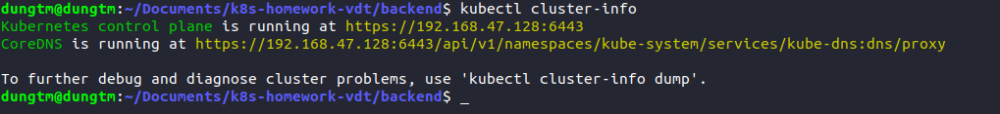

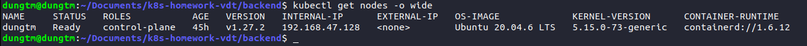
#### 2. Triển khai cơ sở dữ liệu
- Do cơ sở dữ liệu cần có các trường thông tin để có thể đăng nhập cơ sở dữ liệu và các trường thông tin này không thể để giá trị cụ thể mà cần phải được mã hóa. Em xây dựng `kind: Secret` để lưu trữ các giá trị này.
- Các giá trị cần được mã hóa dưới dạng base64 bằng câu lệnh trong hệ điều hành ubuntu `echo -n <value> | grep base64` như sau:

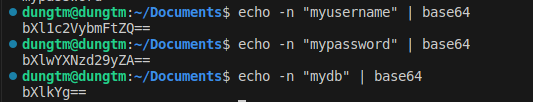
- Mã nguồn Secret:

```yml
apiVersion: v1
kind: Secret
metadata:
  name: db-secret
type: Opaque
data:
  db-user: bXl1c2VybmFtZQ==
  db-password: bXlwYXNzd29yZA==
  db-name: bXlkYg==
```
- Tiếp theo em xây dựng file cấu hình gồm cả kind `Deployment` và `Service`

```yml
apiVersion: apps/v1
kind: Deployment
metadata:
  name: db-deployment
spec:
  replicas: 1
  selector:
    matchLabels:
      app: db-pod
  template:
    metadata:
      labels:
        app: db-pod
    spec:
      containers:
      - name: db-container
        image: tranmanhdung582001/db
        resources:
          limits:
            memory: "128Mi"
            cpu: "500m"
        ports:
        - containerPort: 5432
        env:
          - name: POSTGRES_USER
            valueFrom:
              secretKeyRef:
                name: db-secret
                key: db-user
          - name: POSTGRES_PASSWORD
            valueFrom:
              secretKeyRef:
                name: db-secret
                key: db-password
          - name: POSTGRES_DB
            valueFrom:
              secretKeyRef:
                name: db-secret
                key: db-name
        volumeMounts:
          - mountPath: /var/lib/postgresql/data
            name: postgredb
      volumes:
        - name: postgredb


---
apiVersion: v1
kind: Service
metadata:
  name: db-service
spec:
  selector:
    app: db-pod
  ports:
  - port: 5432
    targetPort: 5432
  type: ClusterIP
```
- Với database em chỉ chọn `replicas: 1` bởi vì đối với hệ thống cơ sở dữ liệu sẽ không thể xây dựng cân bằng tải như backend hay frontend bởi vì còn liên quan đến vấn đề đồng bộ dữ liệu ở các pod database. Thông thường với hệ thống cơ bản, cơ sở dữ liệu nếu scale thì sẽ có 1 pod db chính (primary) có nhiệm vụ write hoặc có cả read data. Và thêm vào đó là các pod db phụ (stand by) có nhiệm vụ read data. Giải quyết vấn đề đồng bộ dữ liệu giữa pod primary với các pod stand by thì sau 1 khoảng thời gian ngắn thì pod primary sẽ tạo và gửi bản replicate data sang cho các pod stand by.
- `Service` sẽ có `type: ClusterIP` để đảm bảo là chỉ có các pod trong cluster này giao tiếp được với pod database.
- Một số hình ảnh kết quả:

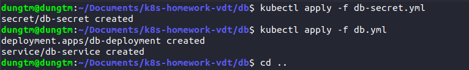

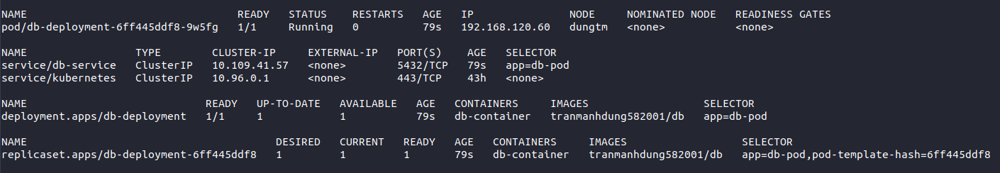
#### 3. Triển khai backend
- Sau khi dịch vụ database đã chạy ở trạng thái ổn định. Em xây dựng file gồm type `Deployment` và `Service` cho image backend - em đã đẩy image lên docker hub cá nhân (tranmanhdung582001/api). 
- Ngoài ra cần phải thêm các biến môi trường để backend có thể kết nối được với pod db đã dựng được ở trên. Các biến như là: Host - Service IP, user db, password,...

```yml
apiVersion: apps/v1
kind: Deployment
metadata:
  name: backend-deployment
spec:
  replicas: 3
  selector:
    matchLabels:
      app: backend-pod
  template:
    metadata:
      labels:
        app: backend-pod
    spec:
    
      containers:
      - name: backend-container
        image: tranmanhdung582001/api:k8s
        env:
          - name: DB_NAME
            valueFrom:
              secretKeyRef:
                name: db-secret
                key: db-name
          - name: DB_USER
            valueFrom:
              secretKeyRef:
                name: db-secret
                key: db-user
          - name: DB_PASSWORD
            valueFrom:
              secretKeyRef:
                name: db-secret
                key: db-password
          - name: DB_HOST
            value: "10.109.41.57"
          - name: DB_PORT
            value: "5432"

        resources:
          limits:
            memory: "128Mi"
            cpu: "500m"
        ports:
        - containerPort: 8000

---
apiVersion: v1
kind: Service
metadata:
  name: backend-service
spec:
  selector:
    app: backend-pod
  ports:
  - port: 8000
    targetPort: 8000
  type: ClusterIP
```
- Một số hình ảnh kết quả:

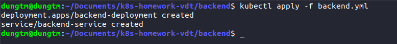

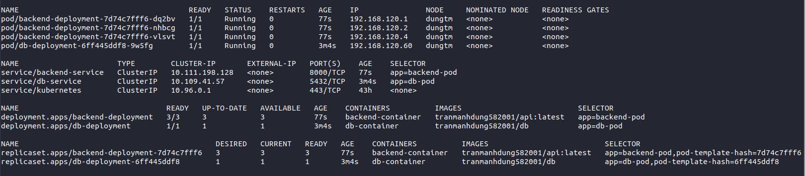
- Theo yêu cầu, Service backend có `type: ClusterIP` nên ta chỉ có thể kiểm tra backend đã kết nối thành công được với database hay chưa bằng cách truy cập vào địa chỉ của service kèm port. Đây là kết quả: 


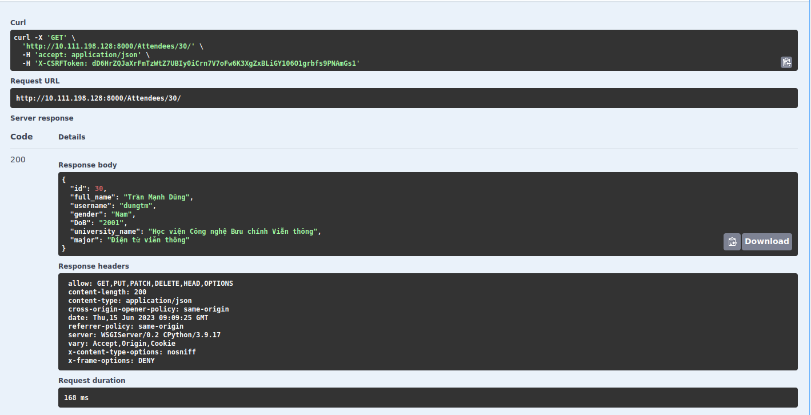
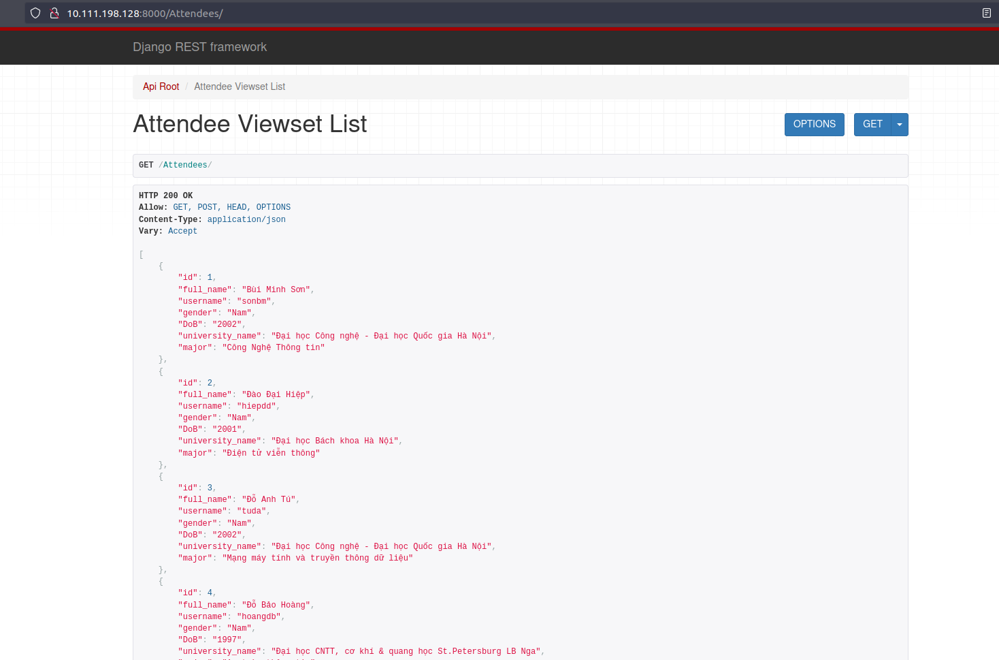
#### 4. Triển khai frontend
- Cuối cùng em triển khai nốt phần frontend sử dụng docker image đã được đẩy lên docker hub cá nhân (tranmanhdung582001/web).

```yml
apiVersion: apps/v1
kind: Deployment
metadata:
  name: frontend-deployment
spec:
  replicas: 1
  selector:
    matchLabels:
      app: frontend-pod
  template:
    metadata:
      labels:
        app: frontend-pod
    spec:
      containers:
      - name: frontend-container
        image: tranmanhdung582001/web:k8s
        resources:
          limits:
            memory: "128Mi"
            cpu: "500m"
        ports:
        - containerPort: 80

---
apiVersion: v1
kind: Service
metadata:
  name: frontend-service
spec:
  type: NodePort
  selector:
    app: frontend-pod
  ports:
  - port: 80
    targetPort: 80
    nodePort: 30080
```

- Service của pod frontend sẽ có `type: NodePort` khác so với 2 thành phần trên, để đảm bảo user có thể truy cập thông qua địa chỉ IP của node kèm theo nodePort có giá trị đặt là 30080.
- Một số hình ảnh kết quả:

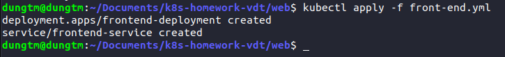

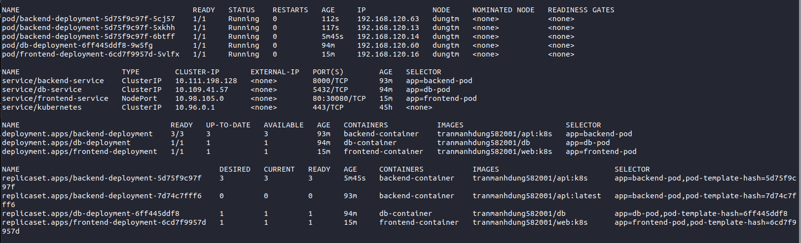

- Truy cập frontend pod thông qua địa chỉ IP của node kèm port 30080

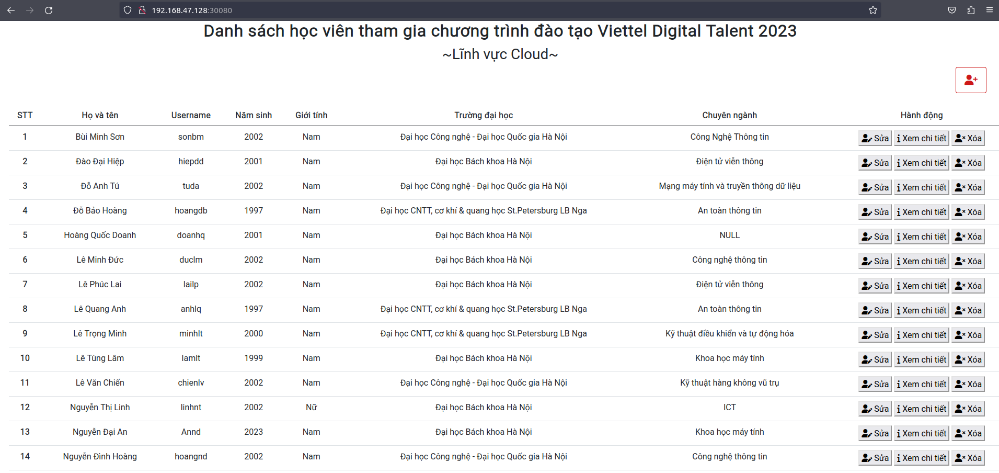

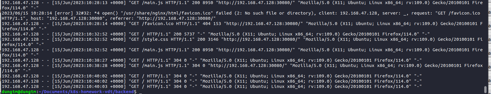


### Tổng kết

1. Tự dựng thành công một cụm k8s cluster single node.
2. Triển khai thành công được các thành phần (frontend, db, backend) đáp ứng được yêu cầu về kết nối. Frontend có thể được truy cập từ bên ngoài cluster, còn backend và database thì chir truy cập từ bên trong cluster.
3. Đảm bảo tính bảo mật (mã hóa các trường thông tin quan trọng như mật khẩu, username database,...)