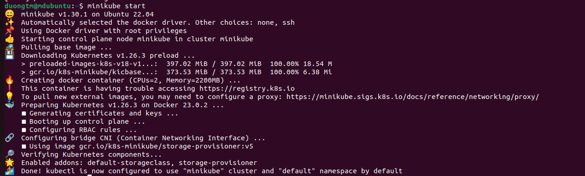
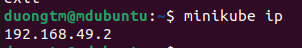
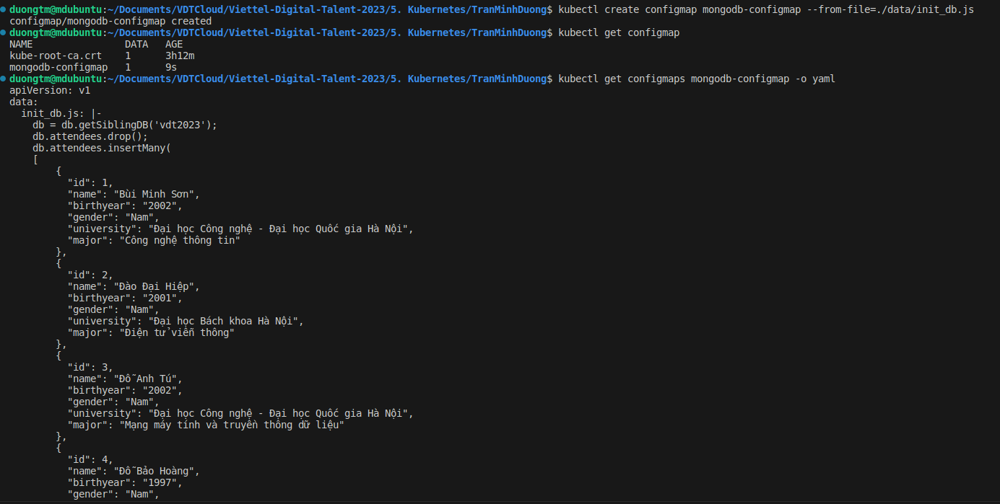
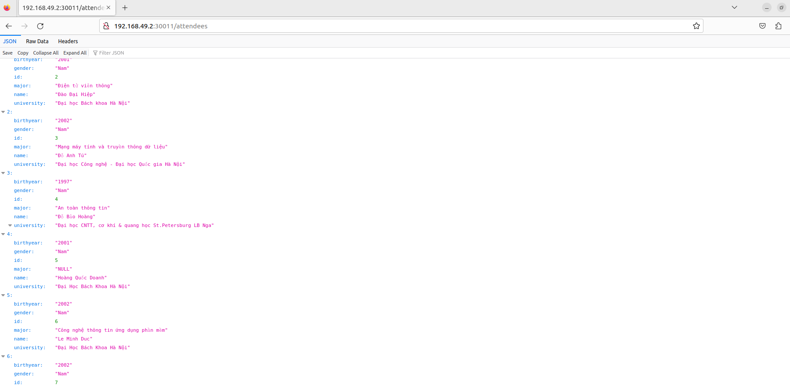
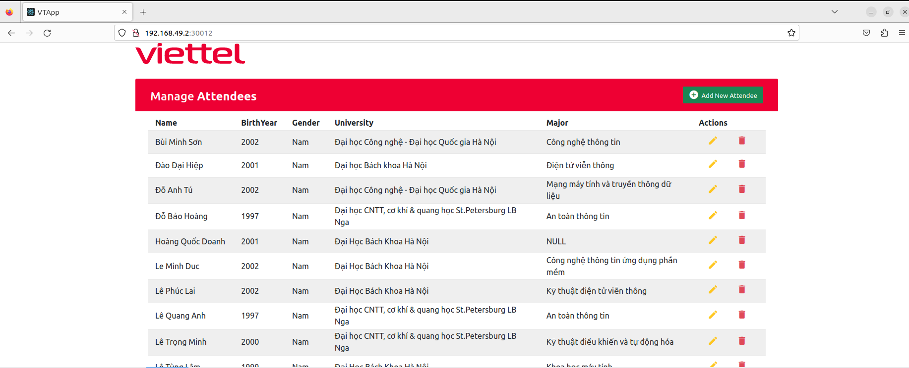
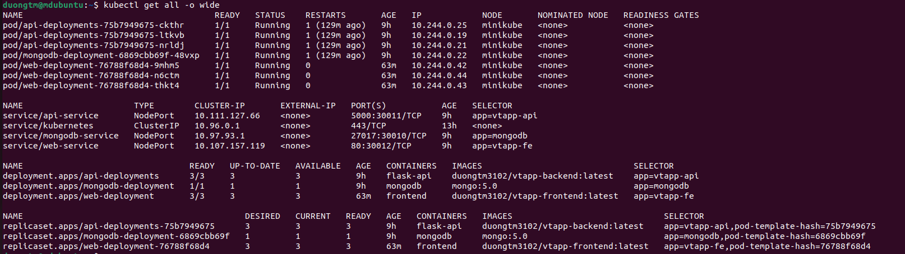

# **Assignment**: Deploy a Multi-tier Application on Kubernetes

Sinh viên: **Trần Minh Dương**

###

## I.Chuẩn bị:

### 1, 3-tier app

Em sử dụng lại 3-tier app ở các bài trước. Các image frontend và backend đã được push lên Dockerhub.

- Frontend: ReactJS - Image: `duongtm3102/vtapp-frontend:latest`
- Backend: Flask - Image: `duongtm3102/vtapp-backend:latest`
- Database: MongoDB - Image: `mongo:5.0`

### 2, Môi trường

Máy Ubuntu đã set up `kubectl`, `minikube`.

## II.Triển khai:

### 1. Tạo K8s Cluster

Vì là bài tập thực hành nên để triển khai thuận tiện, em sử dụng `minikube` để set up 1 K8s cluster.

```bash
minikube start
```

<div align="center">
    
</div>

Minikube node có địa chỉ ip là **192.168.49.2**

<div align="center">
    
</div>

### 2. Triển khai `database`

#### a, Tạo secret cho **username** và **password**

Encode username và password của MongoDB bằng **base64**.

Tạo file [mongodb-secret](./db/mongodb-secret.yaml).

```yaml
apiVersion: v1
kind: Secret
metadata:
  name: mongodb-secret
type: Opaque
data:
  username: bW9uZ29BZG1pbg==
  password: YWRtaW4xMjM=
```

#### b, Tạo **Configmap** để khởi tạo dữ liệu

Em khởi tạo dữ liệu cho database bằng cách đưa file [init_db.js](./data/init_db.js) vào đường dẫn `/docker-entrypoint-initdb.d/` trong Mongodb container.

Để làm được, trước tiên em tạo Configmap từ file dữ liệu:

```bash
kubectl create configmap mongodb-configmap --from-file=./data/init_db.js
```

Kiểm tra configmap `mongodb-configmap` đã được tạo.

<div align="center">
    
</div>

**Configmap** này sẽ được mount khi tạo **deployment**.

#### c, Tạo **PersistentVolumes (PV)** và **Persistent Volume Claims (PVC)**:

[PersistentVolumes (PV)](./db/mongodb-pv.yaml):

```yaml
apiVersion: v1
kind: PersistentVolume
metadata:
  name: mongodb-pv
spec:
  accessModes:
    - ReadWriteOnce
  capacity:
    storage: 500Mi
  hostPath:
    path: /data/mongodb
  persistentVolumeReclaimPolicy: Retain
  storageClassName: standard
```

[Persistent Volume Claims (PVC)](./db/mongodb-pvc.yaml):

```yaml
apiVersion: v1
kind: PersistentVolumeClaim
metadata:
  name: mongodb-pvc
spec:
  accessModes:
    - ReadWriteOnce
  volumeName: mongodb-pv
  resources:
    requests:
      storage: 500Mi
  storageClassName: standard
```

c, Tạo **Deployment** và **Service**

[MongoDB Deployment](./db/mongodb-deployment.yaml)

```yaml
apiVersion: apps/v1
kind: Deployment
metadata:
  labels:
    app: mongodb
  name: mongodb-deployment
spec:
  replicas: 1
  selector:
    matchLabels:
      app: mongodb
  template:
    metadata:
      labels:
        app: mongodb
    spec:
      containers:
        - image: mongo:5.0
          name: mongodb
          env:
            - name: MONGO_INITDB_ROOT_DATABASE
              value: "vdt2023"
            - name: MONGO_INITDB_ROOT_USERNAME
              valueFrom:
                secretKeyRef:
                  name: mongodb-secret
                  key: username
            - name: MONGO_INITDB_ROOT_PASSWORD
              valueFrom:
                secretKeyRef:
                  name: mongodb-secret
                  key: password
          volumeMounts:
            - name: "mongo-data-dir"
              mountPath: "/data/db"
            - name: "init-database"
              mountPath: "/docker-entrypoint-initdb.d/"
      volumes:
        - name: "mongo-data-dir"
          persistentVolumeClaim:
            claimName: "mongodb-pvc"
        - name: "init-database"
          configMap:
            name: mongodb-configmap
```

[MongoDB Service](./db/mongodb-service.yaml)

```yaml
apiVersion: v1
kind: Service
metadata:
  name: mongodb-service
spec:
  selector:
    app: mongodb
  ports:
    - protocol: TCP
      port: 27017
      targetPort: 27017
      nodePort: 30010
  type: NodePort
```

#### d, Triển khai

```bash
cd db
kubectl apply -f .
```

### 3. Triển khai `backend`

[API Deployment](./backend/api-deployment.yaml):

```yaml
apiVersion: apps/v1
kind: Deployment
metadata:
  name: api-deployments
  labels:
    app: vtapp-api
spec:
  replicas: 3
  selector:
    matchLabels:
      app: vtapp-api
  template:
    metadata:
      labels:
        app: vtapp-api
    spec:
      containers:
        - name: flask-api
          image: duongtm3102/vtapp-backend:latest
          resources:
            requests:
              memory: "512Mi"
              cpu: "0.5"
            limits:
              memory: "1Gi"
              cpu: "1"
          ports:
            - containerPort: 5000
          env:
            - name: MONGO_HOST
              value: "10.97.93.1"
            - name: MONGO_PORT
              value: "27017"
            - name: MONGO_USERNAME
              valueFrom:
                secretKeyRef:
                  name: mongodb-secret
                  key: username
            - name: MONGO_PASSWORD
              valueFrom:
                secretKeyRef:
                  name: mongodb-secret
                  key: password
            - name: ANSIBLE_HOST
              valueFrom:
                fieldRef:
                  fieldPath: status.podIP
```

- Image: `duongtm3102/vtapp-backend:latest`.
- Replicas: 3.
- Các biến **username, password** MongoDB được lấy từ **secret** đã tạo ở trên.

[API Service](./backend/api-service.yaml):

```yaml
apiVersion: v1
kind: Service
metadata:
  name: api-service
spec:
  selector:
    app: vtapp-api
  ports:
    - protocol: TCP
      port: 5000
      targetPort: 5000
      nodePort: 30011
  type: NodePort
```

- Type: **NodePort**
- Cổng: 30011.

Apply các file trên:

```bash
cd backend
kubectl apply -f .
```

Kiểm tra kết nối giữa `backend` và `database`:

<div align="center">
    
</div>

### 4. Triển khai **Frontend**

[Frontend Deployment](./frontend/web-deployment.yaml):

```yaml
apiVersion: apps/v1
kind: Deployment
metadata:
  name: web-deployment
  labels:
    app: vtapp-fe
spec:
  replicas: 3
  selector:
    matchLabels:
      app: vtapp-fe
  template:
    metadata:
      labels:
        app: vtapp-fe
    spec:
      containers:
        - name: frontend
          image: duongtm3102/vtapp-frontend:latest
          ports:
            - containerPort: 80
          resources:
            requests:
              memory: "512Mi"
              cpu: "0.5"
            limits:
              memory: "1Gi"
              cpu: "1"
          env:
            - name: REACT_APP_BACKEND_URL
              value: "http://192.168.49.2:30011"
```

- Image: `duongtm3102/vtapp-frontend:latest`.
- Replicas: 3.
- REACT_APP_BACKEND_URL: http://192.168.49.2:30011

[Frontend Service](./frontend/web-service.yaml):

```yaml
apiVersion: v1
kind: Service
metadata:
  name: web-service
spec:
  selector:
    app: vtapp-fe
  ports:
    - protocol: TCP
      port: 80
      targetPort: 80
      nodePort: 30012
  type: NodePort
```

- Type: **NodePort**
- Cổng: 30012.

Apply các file trên:

```bash
cd frontend
kubectl apply -f .
```

Đến đây, em đã triển khai xong 3-tier web trên K8S cluster.

<div align="center">
    
</div>

### 5. Kết quả

Xem tất cả các deployment, service đã triển khai:

<div align="center">
    
</div>
