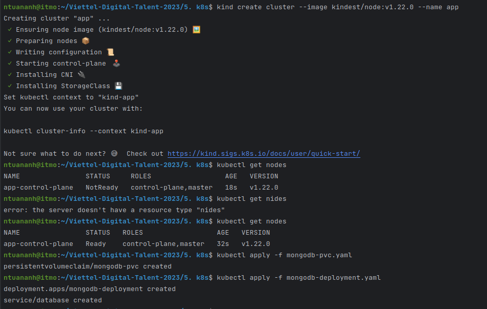
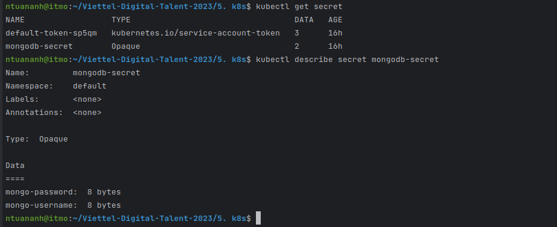
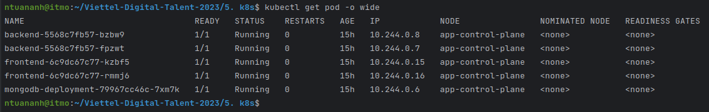
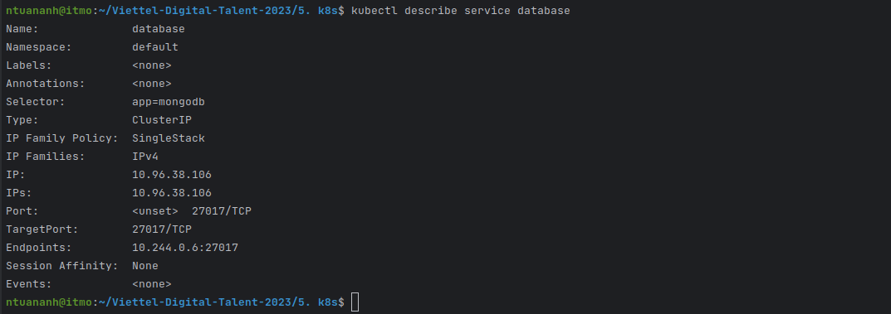
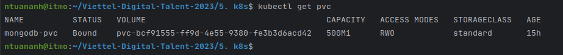
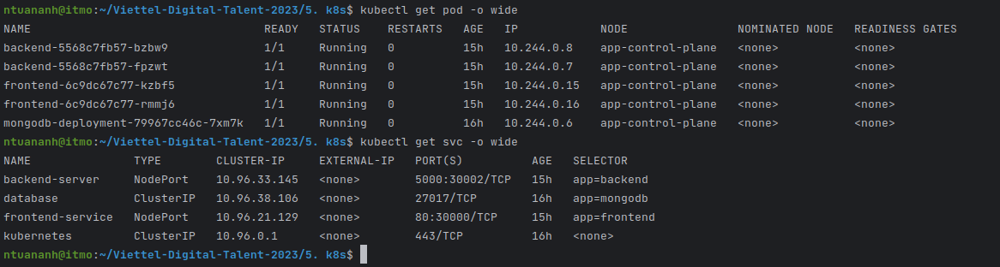
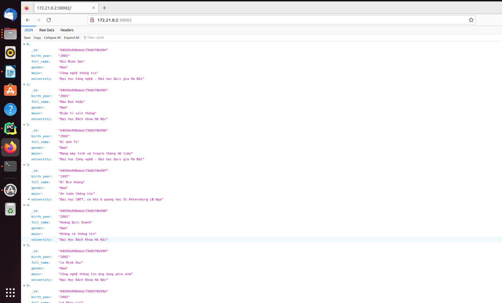
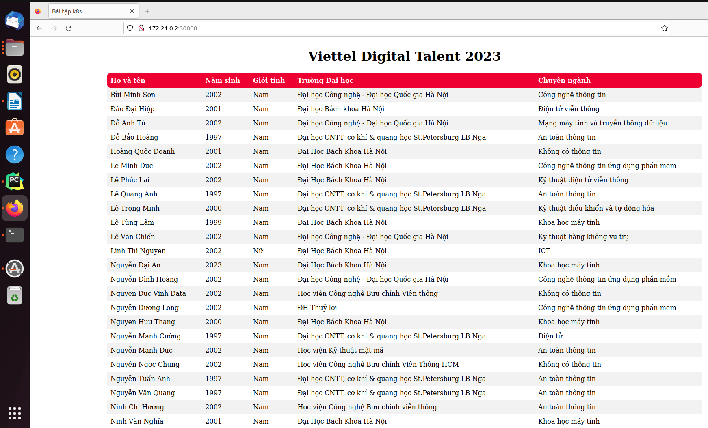

# Viettel-Digital-Talent-2023: Kuberneste Homework

## 1. Requirements

**Assignment**: Deploy a Multi-tier Application on Kubernetes

**Objective**: The objective of this assignment is to apply the concepts learned in the hands-on labs and deploy a multi-tier application on Kubernetes. The application consists of a frontend web server, a backend API server, and a database.

**Instructions**:
1. Design and create the necessary YAML files to deploy the following components:
   - Frontend Deployment and Service: Deploy a frontend web server (e.g., Nginx) with multiple replicas. Expose the frontend service to access it from outside the cluster
   - Backend Deployment and Service: Deploy a backend API server (e.g., Node.js, Flask, or any other framework) with multiple replicas. Expose the backend service within the cluster.
   - Database Deployment and Service: Deploy a database (e.g., MySQL or PostgreSQL) with persistent storage for data persistence. Expose the database service within the cluster.
2. Configure the appropriate networking between the frontend, backend, and database components.
    - The frontend should be able to communicate with the backend API server.
    - The backend API server should be able to access the database for data storage and retrieval.
3. Test the application by accessing the frontend web server from outside the cluster and verifying that it communicates with the backend API server and retrieves data from the database.
4. Document the steps followed to deploy the application, including the YAML files created and any necessary configuration details.
5. Submit the documentation and the YAML files as the assignment deliverables.
## 2. Set up Kind
**Install Kind and create Cluster**:

```
[ $(uname -m) = x86_64 ] && curl -Lo ./kind https://kind.sigs.k8s.io/dl/v0.19.0/kind-linux-amd64
[ $(uname -m) = aarch64 ] && curl -Lo ./kind https://kind.sigs.k8s.io/dl/v0.19.0/kind-linux-arm64
chmod +x ./kind
sudo mv ./kind /usr/local/bin/kind
kind create cluster --image kindest/node:v1.22.0 --name app
```
**Install Kubectl**:

```
snap install kubectl --classic
```
<div align="center">
       
       <br/>
       <i>Create Cluster Kubernetes using Kind.</i>
</div>


## 3. Secret mongodb

```
apiVersion: v1
kind: Secret
metadata:
    name: mongodb-secret
type: Opaque
data:
    mongo-username: dXNlcm5hbWU=
    mongo-password: cGFzc3dvcmQ=
```

```
kubectl apply -f mongodb_secret.yaml
```
<div align="center">
       
       <br/>
       <i>Secret in the Cluster.</i>
</div>

## 4. Database Deployment and Service
**Deployment**:
```
apiVersion: apps/v1
kind: Deployment
metadata:
  name: mongodb-deployment
  labels:
    app: mongodb
spec:
  replicas: 1
  selector:
    matchLabels:
      app: mongodb
  template:
    metadata:
      labels:
        app: mongodb
    spec:
      containers:
      - name: mongodb
        image: mongo:5.0.17
        resources:
          limits:
            memory: "256Mi"
            cpu: "500m"
        volumeMounts:
          - name: db-data
            mountPath: /data/db
        ports:
        - containerPort: 27017
        env:
        - name: MONGO_INITDB_ROOT_USERNAME
          valueFrom:
            secretKeyRef:
              name: mongodb-secret
              key: mongo-username
        - name: MONGO_INITDB_ROOT_PASSWORD
          valueFrom:
            secretKeyRef:
              name: mongodb-secret
              key: mongo-password
      volumes:
        - name: db-data
          persistentVolumeClaim:
            claimName: mongodb-pvc
```
**Headless Service**
```
apiVersion: v1
kind: Service
metadata:
  name: database
spec:
  selector:
    app: mongodb
  ports:
    - protocol: TCP
      port: 27017
      targetPort: 27017
```

**Apply a Deployment and a Service for database in Cluster**:

```
kubectl apply -f mongodb-deployment.yaml
```
<div align="center">
       
       <br/>
       <i>Get Database Pods.</i>
</div>

<div align="center">
       
       <br/>
       <i>Service for database named as database.</i>
</div>

<div align="center">
       
       <br/>
       <i>PVC for Database Pods.</i>
</div>

## 5. Backend Deployment and Service
**Deployment**:

```
apiVersion: apps/v1
kind: Deployment
metadata:
  name: frontend
spec:
  replicas: 2
  selector:
    matchLabels:
      app: frontend
  template:
    metadata:
      labels:
        app: frontend
    spec:
      containers:
      - name: frontend
        image: mathvie17/web
        ports:
        - containerPort: 80
```

**Service**:

``` 
apiVersion: v1
kind: Service
metadata:
  name: frontend-service
spec:
  type: NodePort
  selector:
    app: frontend
  ports:
    - protocol: TCP
      port: 80
      targetPort: 80
      nodePort: 30000
```

``` 
kubectl apply -f api-deployment.yaml
```
<div align="center">
       
       <br/>
       <i>Pods and service for backend.</i>
</div>


## 6. Frontend Deployment and Service

**Deployment**:

```
apiVersion: apps/v1
kind: Deployment
metadata:
  name: backend
spec:
  replicas: 2
  selector:
    matchLabels:
      app: backend
  template:
    metadata:
      labels:
        app: backend
    spec:
      containers:
      - name: backend
        image: mathvie17/api
        ports:
        - containerPort: 5000
        env:
        - name: USER_NAME
          valueFrom:
            secretKeyRef:
              name: mongodb-secret
              key: mongo-username

        - name: USER_PWD
          valueFrom:
            secretKeyRef:
              name: mongodb-secret
              key: mongo-password
```

**Service**:

``` 
apiVersion: v1
kind: Service
metadata:
  name: backend-server
spec:
  type: NodePort
  selector:
    app: backend
  ports:
    - protocol: TCP
      port: 5000
      targetPort: 5000
      nodePort: 30002
```

``` 
kubectl apply -f web-deployment.yaml
```
<div align="center">
       
       <br/>
       <i>Pods and service for frontend.</i>
</div>

## 7. Web Application

<div align="center">
       
</div>
<div align="center">
       
       <br/>
       <i>Demo three-tier Web Application</i>
</div>
