# 🦌 k8s-3tier-webapp
## Requirements

Installed CLI commands.

-   :computer: docker
-   :computer: kubectl
-   :computer: minikube


## 3tier webapp
- a three-tier CRUD web application that displays the course attendees’ information

- Database: [mongodb](https://hub.docker.com/layers/vinhphieu098/test/db/images/sha256-313f4090b1ef7e94575472638ec872372da72a2b13555ea13ae88030c88ebb1c?context=repo)
- Backend: [backend](https://hub.docker.com/layers/vinhphieu098/test/flask/images/sha256-503c282666a91e2d810b3e9d0bfed41a1610513e1367db8909cd22a10b1fa664?context=repo)
- Fontend: [frontend](https://hub.docker.com/layers/vinhphieu098/test/nginx1/images/sha256-86ea3b279179a1449cc88fb4bd58a221cd493b1c2422d75be885302c10d87b80?context=repo)


## 1. Design and create the necessary YAML files to deploy the following components:

### Database Deployment and Service: Deploy a database (MongoDB) with persistent storage for data persistence. Expose the database service within the cluster.
- Database StatefulSet:
``` text
apiVersion: apps/v1
kind: StatefulSet
metadata:
  name: db-statefulset
spec:
  replicas: 3
  selector:
    matchLabels:
      app: database
  serviceName: db-service
  template:
    metadata:
      labels:
        app: database
    spec:
      containers:
      - name: db
        image: ndvinhcn/test:db
        ports:
        - containerPort: 27017
        volumeMounts:
        - name: data-volume
          mountPath: /data/db
  volumeClaimTemplates:
  - metadata:
      name: data-volume
    spec:
      accessModes: [ "ReadWriteOnce" ]
      storageClassName: standard
      resources:
        requests:
          storage: 1Gi


```
- Database: Service

``` text
apiVersion: v1
kind: Service
metadata:
  name: db
spec:
  selector:
    app: database
  ports:
  - protocol: TCP
    port: 27017
    targetPort: 27017
``` 

### Backend Deployment and Service: Deploy a backend API server (Flask) with multiple replicas. Expose the backend service within the cluster.

- Backend deployment:
``` text

apiVersion: apps/v1
kind: Deployment
metadata:
name: api-deployment
spec:
replicas: 3
selector:
    matchLabels:
    app: api
template:
    metadata:
    labels:
        app: api
    spec:
    containers:
    - name: flask
        image: ndvinhcn/test:flask
        ports:
        - containerPort: 9090
```

- Backend service: 
  
``` text
apiVersion: v1
kind: Service
metadata:
name: flask
spec:
selector:
    app: api
ports:
- protocol: TCP
    port: 9090
    targetPort: 9090
```

### Frontend Deployment and Service: Deploy a frontend web server (e.g., Nginx) with multiple replicas. Expose the frontend service to access it from outside the cluster.

- Frontend Deployment:

``` text
apiVersion: apps/v1
kind: Deployment
metadata:
name: nginx-deployment
spec:
replicas: 3
selector:
matchLabels:
    app: nginx
template:
metadata:
    labels:
    app: nginx
spec:
    containers:
    - name: nginx-container
    image: vinhphieu098/test:nginx1
    ports:
    - containerPort: 81
```

- Frontend Service: 
``` text 
apiVersion: v1     
kind: Service
metadata:
name: nginx-service
spec:
selector:
app: nginx
ports:
- protocol: TCP
port: 81
targetPort: 81
nodePort: 30000
type: NodePort

```

### 2. Configure the appropriate networking between the frontend, backend, and database components.
- The simplest way to connect tiers within the application on Kubernetes is by using Kubernetes Services. 
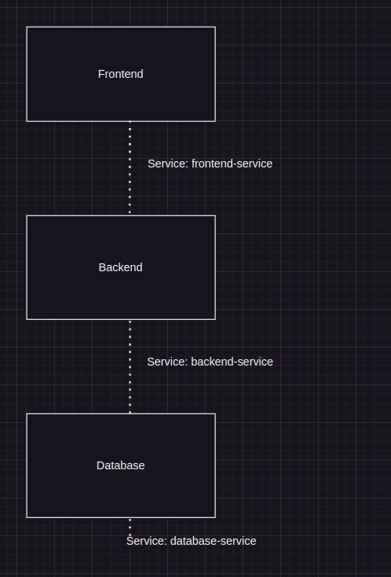


## Deploying the application on Kubernetes
- Start minikube

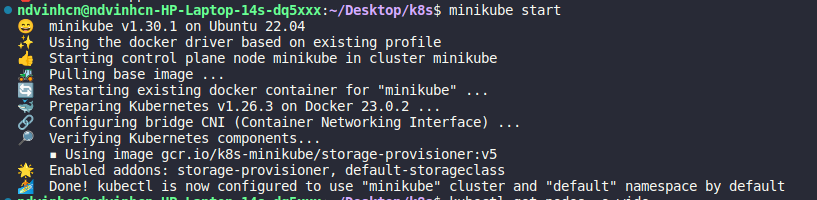
1. Deploy the database:
``` bash
kubectl apply -f database.yaml
```
Result:

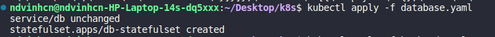


2. Deploy the backend:
``` bash
kubectl apply -f backend.yaml
```
Result:

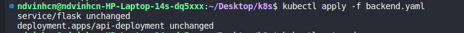


3. Deploy the frontend:
``` bash
kubectl apply -f frontend.yaml
```
Result: 

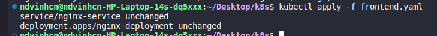

4. Verify the deployment:
``` bash
kubectl get pods
```
Result: all the pods are running and ready.

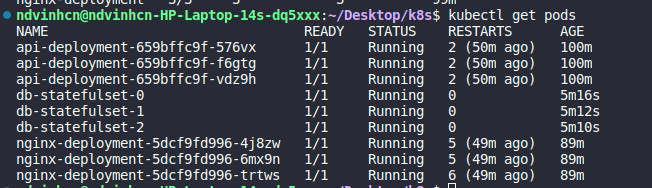

5. Verify the service:
```bash
kubectl get service 
```
Result: 

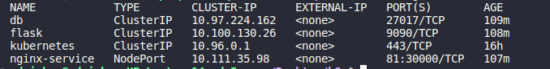
6. Access the application:

- Run the following command to get the frontend URL:
``` bash
minikube service nginx-service --url
```
Open the URL in your web browser to access the application.

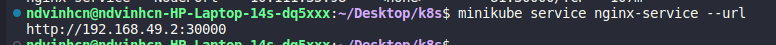

7. Test webapp

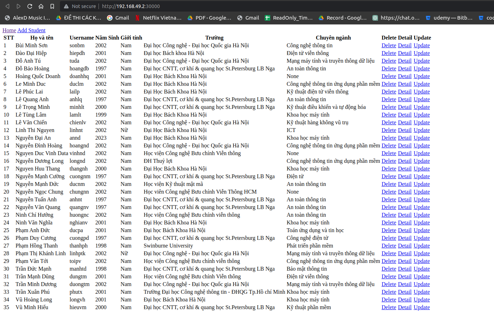

- Test add 1 student
  
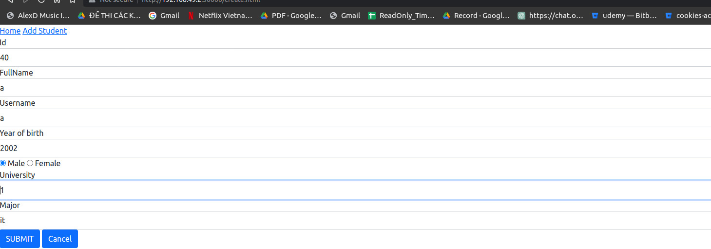
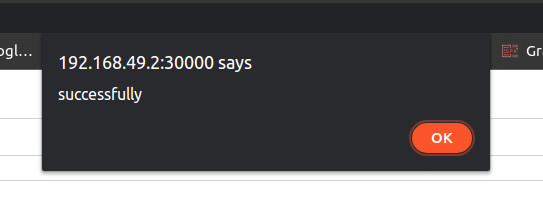
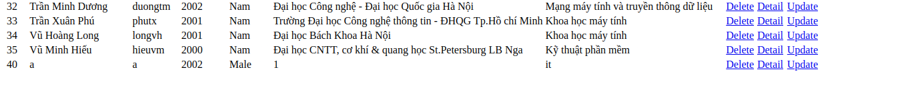

- Test delele 1 student: delete a student with ID 40
  
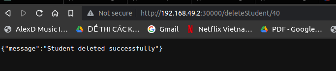
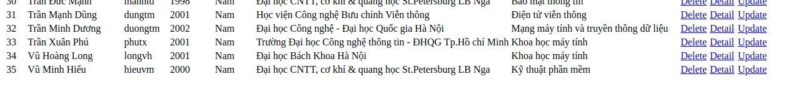

8. Cleanup: To delete the deployed resources, run the following commands:
``` bash 
kubectl delete -f frontend.yaml
kubectl delete -f backend.yaml
kubectl delete -f database.yaml
```