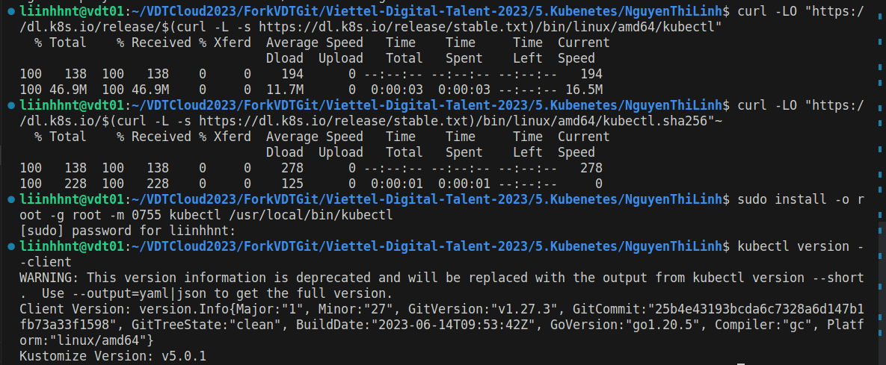
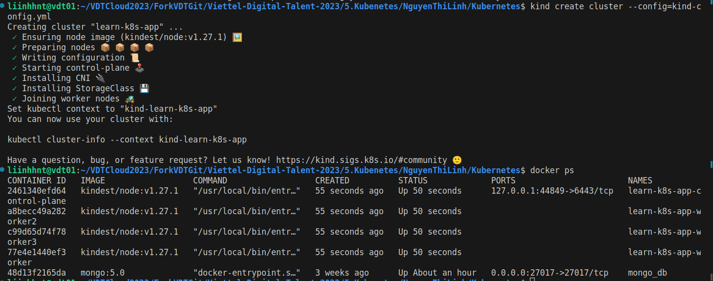
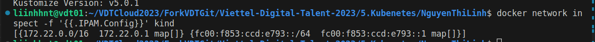
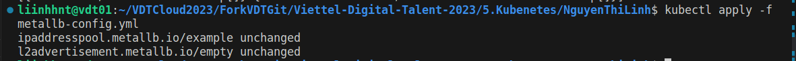
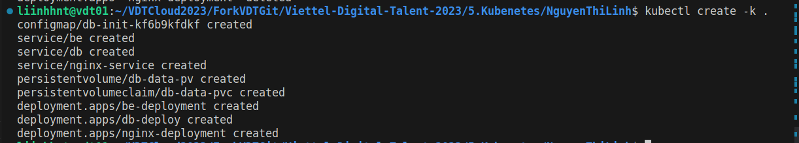
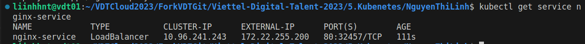
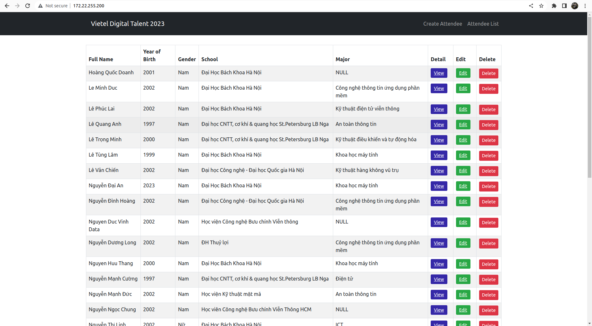
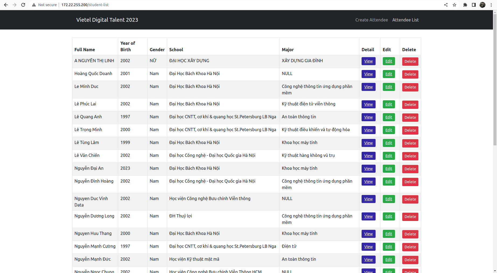
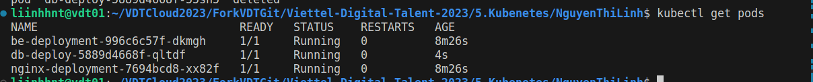

# Deploy a Multi-tier Application on Kubernetes <!-- omit in toc -->

Author: **Nguyen Thi Linh**

## Table of Contents <!-- omit in toc -->

- [1. Install kubectl, Kind and create Cluster](#1-install-kubectl-kind-and-create-cluster)
- [2. Load Balancer for KinD Cluster](#2-load-balancer-for-kind-cluster)
- [3. Declarative Management of Kubernetes Objects Using Kustomize](#3-declarative-management-of-kubernetes-objects-using-kustomize)
- [4. Deploy a database](#4-deploy-a-database)
- [5. Deploy a backend API server](#5-deploy-a-backend-api-server)
- [6. Deploy a frontend web server Nginx](#6-deploy-a-frontend-web-server-nginx)
- [7. Results](#7-results)
- [8. References](#8-references)


## 1. Install kubectl, Kind and create Cluster

- Install kubectl:

  ```shell
  # Download the latest release 
  curl -LO "https://dl.k8s.io/release/$(curl -L -s https://dl.k8s.io/release/stable.txt)/bin/linux/amd64/kubectl"
  # Validate the binary
  curl -LO "https://dl.k8s.io/$(curl -L -s https://dl.k8s.io/release/stable.txt)/bin/linux/amd64/kubectl.sha256"
  # Install kubectl
  sudo install -o root -g root -m 0755 kubectl /usr/local/bin/kubectl
  ```

  Check the version after installed:
  ```shell
  kubectl version --client
  ```

  Output:
  

- Install KinD:

  ```shell
  # For AMD64 / x86_64
  [ $(uname -m) = x86_64 ] && curl -Lo ./kind https://kind.sigs.k8s.io/dl/v0.19.0/kind-linux-amd64
  # For ARM64
  [ $(uname -m) = aarch64 ] && curl -Lo ./kind https://kind.sigs.k8s.io/dl/v0.19.0/kind-linux-arm64
  chmod +x ./kind
  sudo mv ./kind /usr/local/bin/kind
  ```

- Then create a multi node cluster with the following config `kind-config.yml`:

  ```yml

  # Cluster with 1 control-plane node and 3 workers
  kind: Cluster
  apiVersion: kind.x-k8s.io/v1alpha4
  nodes:
  - role: control-plane
  - role: worker
  - role: worker
  - role: worker
  ```

- To specify a configuration file when creating a cluster, use the --config flag:

  ```shell
  kind create cluster --config kind-config.yml
  ```

- Result:


## 2. Load Balancer for KinD Cluster

### Apply MetalLB manifest 🔗︎
- Since version 0.13.0, MetalLB is configured via CRs and the original way of configuring it via a ConfigMap based configuration is not working anymore

  ```shell
  kubectl apply -f https://raw.githubusercontent.com/metallb/metallb/v0.13.7/config/manifests/metallb-native.yaml
  ```

- Wait until the MetalLB pods (controller and speakers) are ready:

  ```shell
  kubectl wait --namespace metallb-system \
                  --for=condition=ready pod \
                  --selector=app=metallb \
                  --timeout=120s
  ```
### Setup address pool used by loadbalancers

- To complete layer2 configuration, we need to provide MetalLB a range of IP addresses it controls. We want this range to be on the docker kind network.

  ```shell
  docker network inspect -f '{{.IPAM.Config}}' kind
  ```

- The output will contain a cidr such as 172.19.0.0/16. We want our loadbalancer IP range to come from this subclass. We can configure MetalLB, for instance, to use 172.19.255.200 to 172.19.255.250 by creating the IPAddressPool and the related L2Advertisement.



- In my case, the output is `172.22.0.0/16`. I will choose the range `172.22.255.200-172.22.255.250` in the following config `metallb-config.yml`:

  ```yml

  apiVersion: metallb.io/v1beta1
  kind: IPAddressPool
  metadata:
    name: example
    namespace: metallb-system
  spec:
    addresses:
    - 172.22.255.200-172.22.255.250
  ---
  apiVersion: metallb.io/v1beta1
  kind: L2Advertisement
  metadata:
    name: empty
    namespace: metallb-system
  ```

- Apply the contents:
  
  ```shell
  kubectl apply -f metallb-config.yml
  ```



## 3. Declarative Management of Kubernetes Objects Using Kustomize

- Kustomize is a tool for customizing Kubernetes configurations. It has the following features to manage application configuration files:

    - generating resources from other sources
    - setting cross-cutting fields for resources
    - composing and customizing collections of resources


- To later initialize the database, I will use a ConfigMap. Kustomize has a `configMapGenerator` feature to generate a ConfigMap from files.

- In `kustomization.yml`, I add `attendees.csv` and `init.sh` entries to the files list in `configMapGenerator` to generate ConfigMap, used for initialize database later:

  ```yml
  # kustomization.yml

  resources:
    - ./db/db-data-pv.yml
    - ./db/db-data-pvc.yml
    - ./db/db-deploy.yml
    - ./db/db-service.yml
    - ./be/be-deploy.yml
    - ./be/be-service.yml
    - ./nginx/nginx-deployment.yml
    - ./nginx/nginx-service.yml
  configMapGenerator:
    - name: db-init
      files:
        - attendees.csv
        - init.sh
  ```

## 4. Deploy a database

- To persist data, I use pv and pvc. Even if pods go down, data will not lost

  ```yml
  # db-data-pv.yml

  apiVersion: v1
  kind: PersistentVolume
  metadata:
    name: db-data-pv
  spec:
    capacity:
      storage: 500Mi
    accessModes:
      - ReadWriteOnce
    persistentVolumeReclaimPolicy: Retain
    storageClassName: standard
    hostPath:
      path: /data/mongodb
  ```

  ```yml
  # db-data-pvc.yml

  apiVersion: v1
  kind: PersistentVolumeClaim
  metadata:
    name: db-data-pvc
  spec:
    accessModes:
      - ReadWriteOnce
    volumeName: db-data-pv
    resources:
      requests:
        storage: 500Mi
    storageClassName: standard

  ```

- I mount `db-data-pvc` to `/data/db` in the `db` container

- I also mount `ConfigMap` volume `db-init`, which genetated from `configMapGenerator` in `kustomization.yml`, to `/docker-entrypoint-initdb.d` in the `db` container. It will then execute all the scripts in `/docker-entrypoint-initdb.d` to initialize the database.


  ```yml
  # db-deploy.yml

    apiVersion: apps/v1
    kind: Deployment
    metadata:
    name: db-deploy
    
    spec:
    selector:
        matchLabels:
        app: db-port
    template:
        metadata:
        labels:
            app: db-port
        spec:
        containers:
            - name: db
            image: mongo:5.0
            resources:
                limits:
                memory: "256Mi"
                cpu: "500m"
            volumeMounts:
                - name: db-init
                mountPath: /docker-entrypoint-initdb.d
                - name: db-data
                mountPath: /data/db
            ports:
                - containerPort: 27017
        volumes:
            - name: db-init
            configMap:
                name: db-init
            - name: db-data
            persistentVolumeClaim:
                claimName: db-data-pvc
  ```


- Then, create a Kubernetes service `db` to expose the `db` pod internally, for backend API can access database for data storage and retrieval:

  ```yml
  # db-svc.yml

  apiVersion: v1
  kind: Service
  metadata:
    name: db
  spec:
    selector:
      app: db-port
    ports:
      - port: 27017
        targetPort: 27017
  ```

## 5. Deploy a backend API server

- I use the image `liinhhnt/vdt-backend:k8s` for containers

- Create a Kubernetes deployment `be`:

  ```yml
  apiVersion: apps/v1 
  kind: Deployment
  metadata:
    name: be-deployment
    labels:
      app: be
  spec:
    replicas: 1
    selector:
      matchLabels: 
        app: be
    template:
      metadata:
        labels:
          app: be
      spec:
        containers:
        - name: be-container
            image: liinhhnt/vdt-backend:k8s
            resources:
              limits:
                memory: "256Mi"
                cpu: "500m"
            ports:
              - containerPort: 5000

  ```

- To connect database, I use `db` service name in MONGOURI `db:27017`

- Finally, create a Kubernetes service `be` and expose this service within the cluster:

  ```yml

  apiVersion: v1
  kind: Service
  metadata:
    name: be
  spec:
    selector:
      app: be
    ports:
      - nodePort: 31234
        port: 5000
        targetPort: 5000
  ```

## 6. Deploy a frontend web server Nginx

- I use the image `liinhhnt/vdt-frontend:k8s` for containers. I change the `proxy_pass` (in `nginx.conf`) to `http://be:5000` in order to communicate with the backend API server.

- Create a Kubernetes deployment `nginx-deployment`:

```yml
apiVersion: apps/v1
kind: Deployment
metadata:
  name: nginx-deployment
  labels:
    app: nginx
spec:
  replicas: 1
  selector:
    matchLabels: 
      app: nginx
  template:
    metadata:
      labels:
        app: nginx
    spec:
      containers:
      - name: nginx
        image: liinhhnt/vdt-frontend:k8s
        resources:
          limits:
            memory: "256Mi"
            cpu: "500m"
        ports:
          - containerPort: 80
```

- Finally, create a Kubernetes service `nginx-service` (pod using previously created `LoadBalancer`) to expose the service to access it from outside the cluster:

  ```yml

  apiVersion: v1
  kind: Service
  metadata:
    name: nginx-service
  spec:
    selector:
      app: nginx
    type: LoadBalancer
    ports:
      - protocol: TCP
        port: 80
        targetPort: 80
  ```

## 7. Results

- To apply all YAML files, simply run:

  ```shell
  # kubectl apply -k <kustomization_directory>
  $ kubectl apply -k .
  ```

- Output:


- To get the external IP of the `nginx-service`, run:

  ```shell
  $ kubectl get service nginx-service
  ```

  

- In this case, the external IP is `172.22.255.200` and the port is `80`. Visit `http://172.22.255.200` or `http://172.18.255.200:80` to see the result:

  

- Now, test the pv, pvc by adding new attendee:

  

- Delete the `db-deploy` pod and let Kubernetes will recreate it (self healing):

  ```shell
  kubectl delete pod db-deploy-5889d4668f-55sh5
  ```
  

- After the deployment is ready, we get the same data:


## 8. References

[1] [Install and Set Up kubectl on Linux](https://kubernetes.io/docs/tasks/tools/install-kubectl-linux/?fbclid=IwAR26CTrkeiadHrEm4rH3anAHTK5YTJkB3-OGD2EpWXTRxjfd7geO24Hmh5s#install-using-native-package-management)

[2] [Kind Quick Start](https://kind.sigs.k8s.io/docs/user/quick-start/)

[3] [Kind Load Balancer](https://kind.sigs.k8s.io/docs/user/loadbalancer/)

[4] [Declarative Management of Kubernetes Objects Using Kustomize](https://kubernetes.io/docs/tasks/manage-kubernetes-objects/kustomization/)

[5] [Connect a Frontend to a Backend Using Services](https://kubernetes.io/docs/tasks/access-application-cluster/connecting-frontend-backend/)

[6] [Persistent Volumes](https://kubernetes.io/docs/concepts/storage/persistent-volumes/)
