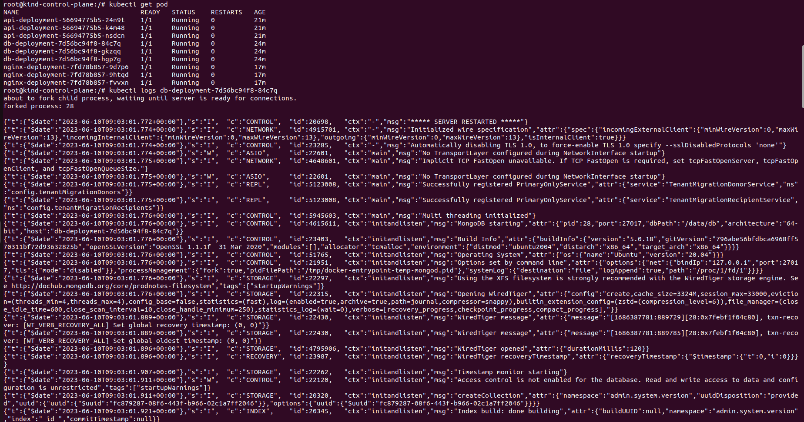
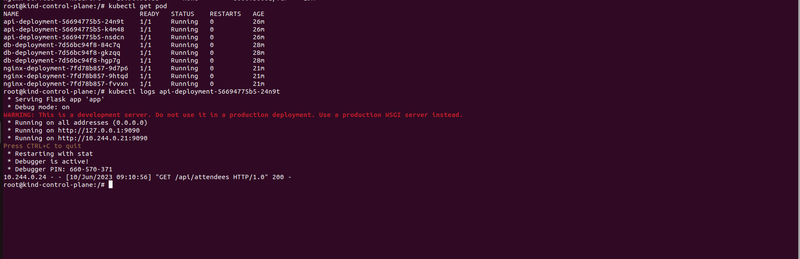
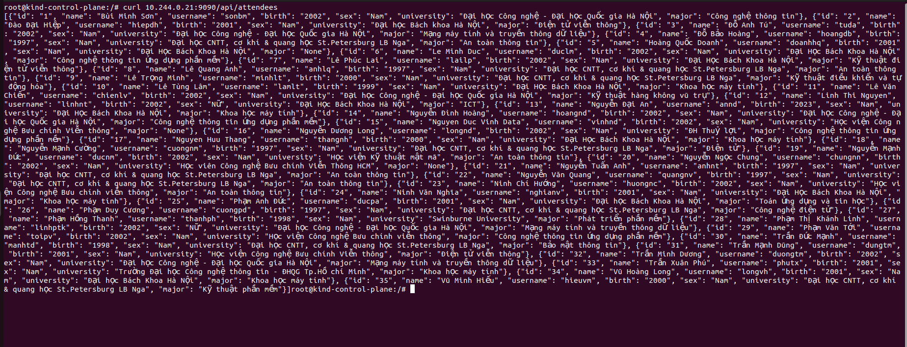
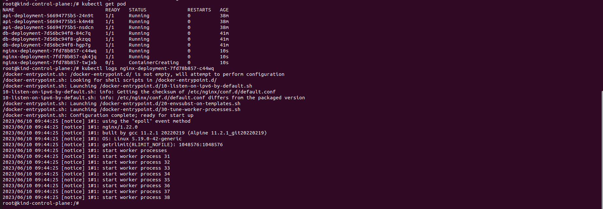
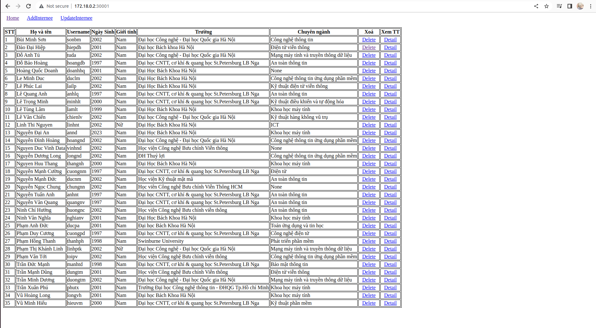
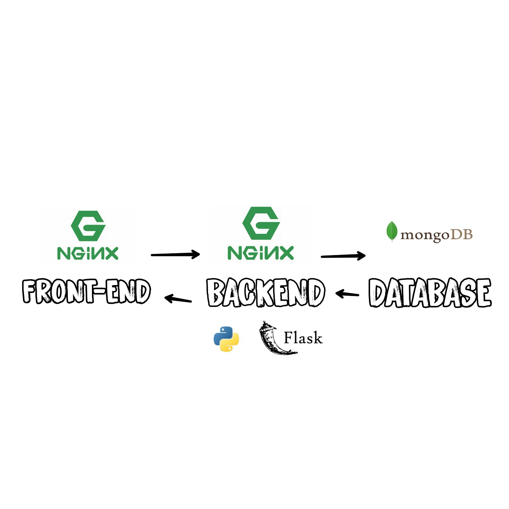

# Deploy a Multi-tier Application on Kubernetes

## Build web 3 Tiers

Source code in the folder: [sources_code/]()
Image in Dockerhub:
- Database: [crvt4722/k8s-db](https://hub.docker.com/repository/docker/crvt4722/k8s-db/general)
- Backend: [crvt4722/k8s-api](https://hub.docker.com/repository/docker/crvt4722/k8s-api/general)
- Frontend: [crvt4722/k8s-nginx](https://hub.docker.com/repository/docker/crvt4722/k8s-nginx/general)

## Detailed step-by-step instructions to deploy the application by Kubenetes

#### Install Kind and create Cluster
```sh
[ $(uname -m) = x86_64 ] && curl -Lo ./kind https://kind.sigs.k8s.io/dl/v0.19.0/kind-linux-amd64
[ $(uname -m) = aarch64 ] && curl -Lo ./kind https://kind.sigs.k8s.io/dl/v0.19.0/kind-linux-arm64
chmod +x ./kind
sudo mv ./kind /usr/local/bin/kind
docker pull kindest/node:v1.22.0
kind create cluster --image kindest/node:v1.22.0
```

docker ps

docker exec -it kind-container-name bash

#### Create the database deployment (Mongodb)

```yaml
cat <<EOF | kubectl apply -f -
apiVersion: apps/v1
kind: Deployment
metadata:
  name: db-deployment
spec:
  replicas: 3
  selector:
    matchLabels:
      app: db
  template:
    metadata:
      labels:
        app: db
    spec:
      containers:
      - name: mongodb-server
        image: crvt4722/k8s-db
        ports:
        - containerPort: 27017
```
kubectl get pod

kubectl logs db-pod-name

- Example:


#### Create the database service 

```yaml
cat <<EOF | kubectl apply -f -
apiVersion: v1
kind: Service
metadata:
  name: mongodb-server
spec:
  selector:
    app: db
  ports:
  - protocol: TCP
    port: 27017
    targetPort: 27017
  type: NodePort
EOF
```

kubectl get service 

#### Create the backend deployment (Python Flask)
```yaml
cat <<EOF | kubectl apply -f -
apiVersion: apps/v1
kind: Deployment
metadata:
  name: api-deployment
spec:
  replicas: 3
  selector:
    matchLabels:
      app: api
  template:
    metadata:
      labels:
        app: api
    spec:
      containers:
      - name: mongodb-server
        image: crvt4722/k8s-api
        ports:
        - containerPort: 9090
```

kubectl get pod

kubectl logs db-pod-name

- Example:


- Check if backend connected with the database successfully or not.
curl 10.244.0.21:9090/api/attendees



#### Create the backend service
```yaml
cat <<EOF | kubectl apply -f -
apiVersion: v1
kind: Service
metadata:
  name: flask-app
spec:
  selector:
    app: api
  ports:
  - protocol: TCP
    port: 9090
    targetPort: 9090
  type: NodePort
EOF  
```

#### Create the web deployment (Nginx)
```yaml
cat <<EOF | kubectl apply -f -
apiVersion: apps/v1
kind: Deployment
metadata:
  name: nginx-deployment
spec:
  replicas: 3
  selector:
    matchLabels:
      app: nginx
  template:
    metadata:
      labels:
        app: nginx
    spec:
      containers:
      - name: nginx-container
        image: crvt4722/k8s-nginx
        ports:
        - containerPort: 8000
```

kubectl get pod

kubectl logs db-pod-name

- Example:


#### Create the web service 
```yaml
cat <<EOF | kubectl apply -f -
apiVersion: v1
kind: Service
metadata:
  name: nginx-service
spec:
  selector:
    app: nginx
  ports:
  - protocol: TCP
    port: 8000
    targetPort: 8000
    nodePort: 30001
  type: NodePort
EOF
```

## Result (DEMO)
Webpage


Api


## Web 3 Tiers Architecture


