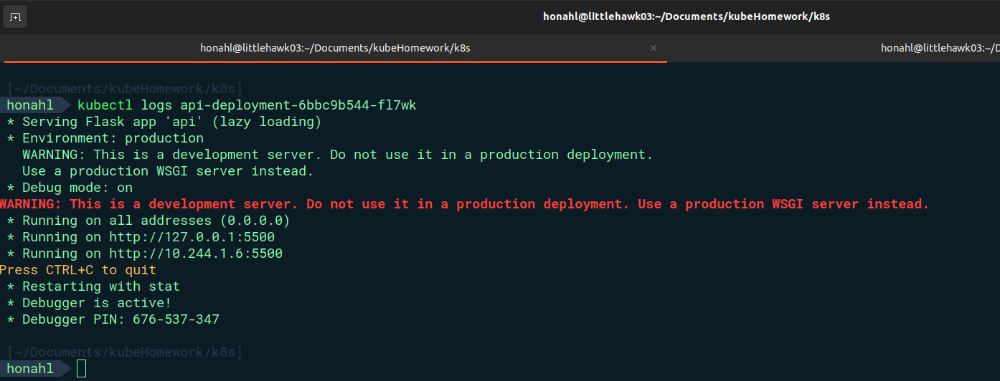

# KUBERNETES PROJECT FROM VIETTEL DIGITAL TALENT

### _LittleHawk03-Nguyễn Mạnh Đức_


## Table of contents


#### Install Kind and create Cluster

To install kind and create Cluster:

```sh
    [ $(uname -m) = x86_64 ] && curl -Lo ./kind https://kind.sigs.k8s.io/dl/v0.19.0/kind-linux-amd64
    [ $(uname -m) = aarch64 ] && curl -Lo ./kind https://kind.sigs.k8s.io/dl/v0.19.0/kind-linux-arm64
    chmod +x ./kind
    sudo mv ./kind /usr/local/bin/kind
    kind create cluster --image kindest/node:v1.22.0
```

and run the ```docker ps``` to check the container is running :

<div align="center">
  
</div>

You can create a multi node cluster with the following config:

```yaml
  kind: Cluster
  apiVersion: kind.x-k8s.io/v1alpha4
  # One control plane node and three "workers".
  #
  # While these will not add more real compute capacity and
  # have limited isolation, this can be useful for testing
  # rolling updates etc.
  #
  # The API-server and other control plane components will be
  # on the control-plane node.
  #
  # You probably don't need this unless you are testing Kubernetes itself.
  nodes:
  - role: control-plane
  - role: worker
```

```sh
  kind create cluster --name=nodes --config=workerNodes.yaml
```


<div align="center">
  
</div>

to config cluster ta will run command bash in container worker-control-plane :

<div align="center">
  
</div>

copy all file in k8s project :

```sh
  docker cp k8s/ worker-control-plane:/k8s/
```

<div align="center">
  
</div>

####Install database using mongodb

#####creat volume and configMap

<div align="center">
  
</div>

1. Create PersistentVolume [db_volume_pv.yaml](k8s/db/db_volume_pv.yaml)

```yaml
  apiVersion: "v1"
  kind: PersistentVolume
  metadata:
    name: db-pv
  spec:
    volumeMode: Filesystem
    capacity:
      storage: 1Gi
    # PV không bị xóa tự động và vẫn giữ lại trạng thái của nó sau khi PVC bị xóa.
    persistentVolumeReclaimPolicy: Retain
    # manual, nghĩa là PV không được đặt trong bất kỳ StorageClass cụ thể nào
    storageClassName: manual
    accessModes: 
      - ReadWriteOnce
    hostPath:
      path: /data/mongo
```

2. Create Persistent Volume Claim [db_volume_pvc.yaml](k8s/db/db_volume_pvc.yaml)

```yaml
  apiVersion: v1
  kind: PersistentVolumeClaim
  metadata:
    name: db-pvc
  spec:
    volumeMode: Filesystem
    accessModes:
      - ReadWriteOnce
    resources:
      requests:
        storage: 1Gi
    storageClassName: manual
```

3. Create ConfigMap for init data in database. [db_configmap.yaml](k8s/db/db_configmap.yaml)

```yaml
  apiVersion: v1
  kind: ConfigMap
  metadata:
    name: db-config
  data:
    init.js: |
      db = db.getSiblingDB("list_candidate_VDT");
      db.article.drop();
      db.candidate.save( {
          "STT": 1,
        "fullname": "Bùi Minh Sơn",
        "year of birth": 2002,
        "gender": "Nam",
        "university": "Đại học Công nghệ - Đại học Quốc gia Hà Nội",
        "Username": "sonbm",
        "field": "Công nghệ thông tin"
      });

      db.candidate.save( {
          "STT": 2,
        "fullname": "Đào Đại Hiệp",
        "year of birth": 2001,
        "gender": "Nam",
        "university": "Đại học Bách khoa Hà Nội",
        "Username": "hiepdd",
        "field": "Điện tử viễn thông"
      });
```

4. Create Deployment [db_deployment.yaml](k8s/db/db_deployment.yaml)

```yaml
  apiVersion: apps/v1
  kind: Deployment
  metadata:
    name: db-deployment
  spec:
    replicas: 1
    selector: 
      matchLabels:
        app: db-mongo
    template:
      metadata:
        labels:
          app: db-mongo
      spec:
        containers:
          - name: db
            image: mongo:5.0
            ports:
              - containerPort: 27017
            volumeMounts:
              - name: db-storage
                mountPath: data/db
              - name: init-data
                mountPath: /docker-entrypoint-initdb.d
        volumes:
          - name: db-storage
            persistentVolumeClaim:
              claimName: db-pvc
          - name: init-data
            configMap:
              name: db-config
```


5. Create Service [db_service.yaml](k8s/db/db_service.yaml)

```yaml
  apiVersion: v1
  kind: Service
  metadata:
    name: api-service
  spec:
    selector:
      app: api
    type: NodePort
    ports:
      - protocol: TCP
        port: 5500
        targetPort: 5500

```

run of the command after to deploy database:

```sh
  # deploy the mongo database
  kubectl apply -f db/db_volume_pv.yaml
  kubectl apply -f db/db_volume_pvc.yaml
  kubectl apply -f db/db_configmap.yaml
  # deployment
  kubectl apply -f db/db_deployment.yaml
  #service
  kubectl apply -f db/db_service.yaml
```

<div align="center">
  
</div>

see the log from db_deployment :

<div align="center">
  
</div>


#### Install API 

1, Create Deployment image api ```littlehawk03/api:v1.7.0```

```yaml
  apiVersion: apps/v1
  kind: Deployment
  metadata:
    name: api-deployment
  spec:
    replicas: 1
    selector:
      matchLabels:
        app: api
    template:
      metadata:
        labels:
          app: api
      spec:
        containers:
          - name: api
            image: littlehawk03/api:v1.6.0
            ports:
              - containerPort: 5500
            env:
              - name: MONGO_HOST
                value: db-service
              - name: MONGO_PORT
                value: "27017"
```

2. Create Service

```yaml
  apiVersion: v1
  kind: Service
  metadata:
    name: api-service
  spec:
    selector:
      app: api
    type: NodePort
    ports:
      - protocol: TCP
        port: 5500
        targetPort: 5500
```

run of the command after to deploy database:

```sh
 # deploy the api 
  kubectl apply -f api/api_deployment.yaml
  kubectl apply -f api/api_service.yaml
```
<div align="center">
  
</div>

see the log from db_deployment :


<div align="center">
  
</div>

get service random post and node ip:

<div align="center">
  
</div>

resurlt api get request:

<div align="center">
  
</div>

#### Install web UI


1. install deployment

```yaml
  apiVersion: apps/v1
  kind: Deployment
  metadata:
    name: web-deployment
  spec:
    replicas: 3
    selector:
      matchLabels:
        app: web
    template:
      metadata:
        labels:
          app: web
      spec:
        containers:
          - name: web 
            image: littlehawk03/web:v1.7.0
            ports:
              - containerPort: 5000
            env:
              - name: API_HOST
                value: api-service
              
              - name: API_POST
                value: "5500"
```

2. intall service

```yaml
  apiVersion: v1
  kind: Service
  metadata:
    name: web-service
  spec:
    selector:
      app: web
    type: NodePort
    ports:
      - port: 5000
        targetPort: 5000
```
run of the command after to deploy database:

```sh
 # deploy web ui
  kubectl apply -f web/web_deployment.yaml
  kubectl apply -f web/web_service.yaml
```
<div align="center">
  
</div>

get service random post and node ip:

<div align="center">
  
</div>

result:

<div align="center">
  
</div>

All pods:

<div align="center">
  
</div>


## author's words

Em cảm ơn tất cả các anh,chị mentor đã dành thời gian để chấm bài cho em ạ. Chương trình học mọi người xây dựng thực sự hay và giúp em biết thêm được nhiều kiến thức thực tế bên ngoài trường đại học. Em cảm ơn.