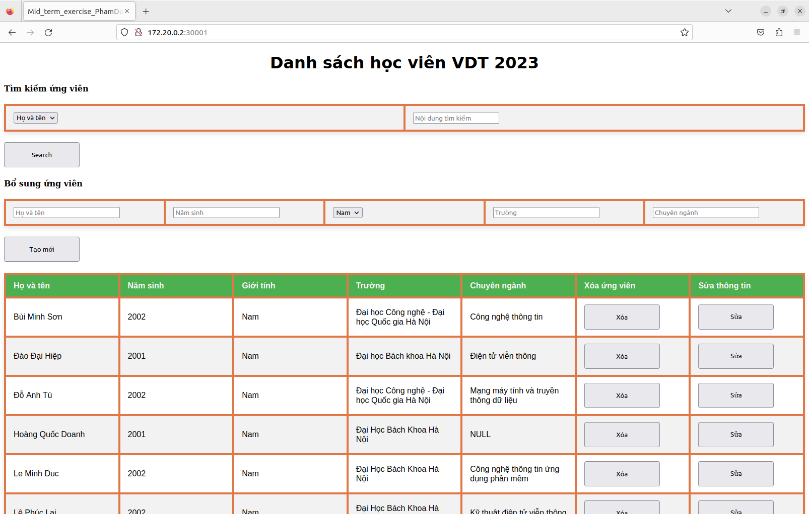

# Deploy a Multi-tier Application on Kubernetes

## Build web 3 Tiers

## Detailed step-by-step instructions to deploy the application by Kubenetes

### Install Kind and create Cluster

```
[ $(uname -m) = x86_64 ] && curl -Lo ./kind https://kind.sigs.k8s.io/dl/v0.19.0/kind-linux-amd64
[ $(uname -m) = aarch64 ] && curl -Lo ./kind https://kind.sigs.k8s.io/dl/v0.19.0/kind-linux-arm64
chmod +x ./kind
sudo mv ./kind /usr/local/bin/kind
docker pull kindest/node:v1.22.0
kind create cluster --image kindest/node:v1.22.0 --name app
```

### Create `db-secrets.yaml` the database credentials (Mongodb)

```yaml
apiVersion: v1
kind: Secret
metadata:
  name: db-credentials
type: Opaque
data:
  user: dmR0MjM=
  password: MTIzNDU2
  url: bW9uZ29kYjovL3ZkdDIzOjEyMzQ1NkBtb25nb2RiLXNlcnZlcjoyNzAxNy8=
```

```
kubectl apply -f db-secrets.yaml
```
### Create `db-pvc.yaml` to storage persistent volume (Mongodb)
```yaml
apiVersion: v1
kind: PersistentVolumeClaim
metadata:
  name: db-data-pvc
spec:
  accessModes:
    - ReadWriteOnce
  resources:
    requests:
      storage: 100Mi
```
```
kubectl apply -f db-pvc.yaml
```
### Create `db-deploment.yaml`(Mongodb)

```yaml
apiVersion: apps/v1
kind: Deployment
metadata:
  name: db
spec:
  replicas: 1
  selector:
    matchLabels:
      app: db
  template:
    metadata:
      labels:
        app: db
    spec:
      containers:
      - name: mongodb-server
        image: mongo:5.0
        ports:
        - containerPort: 27017
        env:
        - name: MONGO_INITDB_ROOT_USERNAME
          valueFrom:
            secretKeyRef:
              name: db-credentials
              key: user
        - name: MONGO_INITDB_ROOT_PASSWORD
          valueFrom:
            secretKeyRef:
              name: db-credentials
              key: password
        volumeMounts:
        - name: db-data
          mountPath: /var/lib/mongo/data
      volumes:
      - name: db-data
        persistentVolumeClaim:
          claimName: db-data-pvc

apiVersion: v1
kind: Service
metadata:
  name: mongodb-server
spec:
  selector:
    app: db
  ports:
    - protocol: TCP
      port: 27017
      targetPort: 27017
  type: NodePort
```
```
kubectl apply -f db-deployment.yaml
```
### Create api deployment and service files
```yaml
apiVersion: apps/v1
kind: Deployment
metadata:
  name: api
spec:
  replicas: 2
  selector:
    matchLabels:
      app: api
  template:
    metadata:
      labels:
        app: api
    spec:
      containers:
      - name: api
        image: pdc1997/api
        ports:
        - containerPort: 5000
        env:
        - name: DATABASE_URL
          valueFrom:
            secretKeyRef:
              name: db-credentials
              key: url

apiVersion: v1
kind: Service
metadata:
  name: api
spec:
  selector:
    app: api
  ports:
    - protocol: TCP
      port: 5000
      targetPort: 5000
      nodePort: 30005
  type: NodePort
```
```
kubectl apply -f api-deployment.yaml
```

### ### Create web deployment and service files
```yaml
apiVersion: apps/v1
kind: Deployment
metadata:
  name: web
spec:
  replicas: 2
  selector:
    matchLabels:
      app: web
  template:
    metadata:
      labels:
        app: web
    spec:
      containers:
      - name: web
        image: pdc1997/web
        ports:
        - containerPort: 80
      
apiVersion: v1
kind: Service
metadata:
  name: web-service
spec:
  selector:
    app: web
  ports:
    - protocol: TCP
      port: 80
      targetPort: 80
      nodePort: 30001
  type: NodePort
```
```
kubectl apply -f web-deployment.yaml
```

## Logs and test the application
- List of pods and logs from api and web pods
<div align="center">
  
</div>

- Interface the application

<div align="center">
  
</div>

- Test search API with attendees's YoB = 2002

<div align="center">
  
</div>
