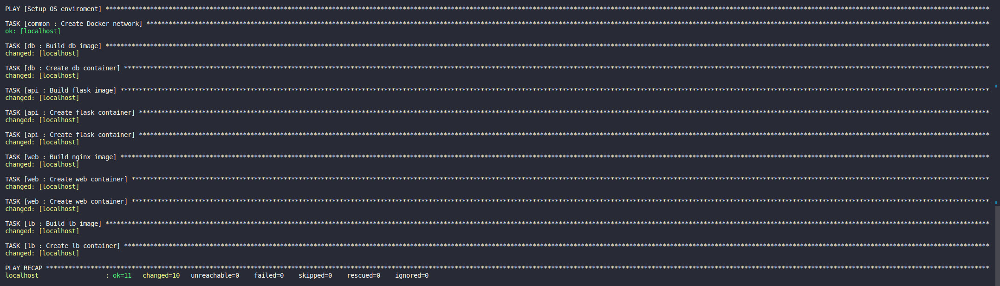

# Bài tập lớn giữa kỳ chương trình VDT 2023 lĩnh vực Cloud
# Table of content
## [I. Phát triển một 3-tier web application đơn giản (2đ)](#mot)
## [II. Triển khai web application sử dụng các DevOps tools & practices(8đ)](#hai)
  - ### [1. Containerization](#Containerization)

  - ### [2. CI](#CI)
  
  - ### [3. CD & Ansible](#CD)

  - ### [4. Monitoring](#Monitoring)

  - ### [5. Logging](#Logging)


# **I. Phát triển một 3-tier web application đơn giản :**

#### Yêu cầu:
- Viết một CRUD web application đơn giản thực hiện các chức năng:
- Liệt kê danh sách sinh viên tham gia khóa đào tạo chương trình VDT 2023 lĩnh vực cloud dưới dạng bảng (0.5đ)
- Cho phép xem chi tiết/thêm/xóa/cập nhật thông tin sinh viên (0.5đ)
- Thiết web: Giao diện web viết bằng HTML + CSS + Javascript được triển khai trên nền web server nginx
- api: RESTful API viết bằng ngôn ngữ lập trình tùy chọn (prefer Python), có đầy đủ các chức năng: list, get, create, update, delete các bản ghi thông tin sinh viên
- db: Database SQL hoặc NoSQL lưu trữ thông tin sinh viên (dữ liệu khởi tạo của DB này được cho bởi bảng trong Phụ lục I.)
- Viết unit tests cho các chức năng APIs (0.5đ)
- * Viết unit tests cho các chức năng giao diện, viết integration tests
#### Output:
- Mã nguồn của từng dịch vụ

#### Solution
- Applicatoweb application đơn giản
  - DB: Mongodb
  - Web: HTML, CSS, Javascript
  - API: Python (Flask Restful API) 

- `app.py`: https://github.com/vnMarcus/Viettel-Digital-Talent-2023/blob/main/Midterm/roles/api/files/app.py
  
``` text
from flask import Flask, jsonify, render_template, redirect, request
from pymongo import MongoClient
import json

app = Flask(__name__)

client = MongoClient("mongodb://db:27017/")
db = client["internees"]


@app.route('/list', methods=['GET'])
def index():
    attendees = list(db.internees.find({}, {"_id": 0}))  # Exclude _id field
    api_json = []
    for attendee in attendees:
        api_json.append(attendee)
    return json.dumps(api_json, ensure_ascii=False).encode('utf-8')


@app.route("/addStudent", methods=['POST'])
def add_student():
    data = request.get_json()
    id = data["id"]
    name = data["name"]
    username = data['username']
    year = int(data["birth"])
    gender = data["sex"]
    school = data["university"]
    major = data["major"]
    db.internees.insert_one({
        'id': id,
        'name': name,
        'username': username,
        'birth': year,
        'sex': gender,
        'university': school,
        'major': major
    })
    return jsonify({'message': 'Student added successfully'}), 201


@app.route('/deleteStudent/<int:id>', methods=['DELETE'])
def delete_student(id):
    id = str(id)
    db.internees.delete_one({'id': id})
    return jsonify({'message': 'Student deleted successfully'}), 200


@app.route('/view/<int:id>', methods=['GET'])
def view_student(id):
    id = str(id)
    student = db.internees.find_one({'id': id}, {"_id": 0})
    api_json = []
    api_json.append(student)
    return json.dumps(api_json, ensure_ascii=False).encode('utf-8')


@app.route('/updateStudent/<int:id>', methods=['POST'])
def update_student(id):
    id = str(id)
    student = db.internees.find_one({'id': id})
    if not student:
        return jsonify({'message': 'Student not found'}), 404

    data = request.get_json()
    name = data["name"]
    username = data['username']
    year = int(data["birth"])
    gender = data["sex"]
    school = data["university"]
    major = data["major"]

    db.internees.update_one(
        {'id': id},
        {"$set": {
            'name': name,
            'username': username,
            'birth': year,
            'sex': gender,
            'university': school,
            'major': major
        }}
    )
    return jsonify({'message': 'Student updated successfully'}), 200


if __name__ == '__main__':
    app.run(host='0.0.0.0', port=9090)
```

- Khởi tạo database: https://github.com/vnMarcus/Viettel-Digital-Talent-2023/blob/main/Midterm/roles/db/templates/init-db.js


- Front-end: https://github.com/vnMarcus/Viettel-Digital-Talent-2023/tree/main/Midterm/roles/web/templates/font-end


- Demo: 


- Unit tests cho các chức năng của API `test_main.py`:https://github.com/vnMarcus/Viettel-Digital-Talent-2023/blob/main/Midterm/roles/api/files/test_main.pymongo
  
``` text
import unittest
import requests

URL = "http://localhost"

class AppTestCase(unittest.TestCase):
    def test_get_all_attendees(self):
        response = requests.get(f"{URL}/list")
        self.assertEqual(response.status_code, 200)

    def test_add_student(self):
        data = {
            "id": "1",
            "name": "John Doe",
            "username": "johndoe",
            "birth": 1990,
            "sex": "Male",
            "university": "ABC University",
            "major": "Computer Science"
        }
        response = requests.post(f"{URL}/addStudent", json=data)
        self.assertEqual(response.status_code, 201)

        # Kiểm tra xem sinh viên đã được thêm thành công vào cơ sở dữ liệu chưa
        response = requests.get(f"{URL}/view/1")
        self.assertEqual(response.status_code, 200)

    def test_delete_student(self):
        # Thêm một sinh viên vào cơ sở dữ liệu để xóa sau đó
        data = {
            "id": "1",
            "name": "John Doe",
            "username": "johndoe",
            "birth": 1990,
            "sex": "Male",
            "university": "ABC University",
            "major": "Computer Science"
        }
        requests.post(f"{URL}/addStudent", json=data)

        response = requests.delete(f"{URL}/deleteStudent/1")
        self.assertEqual(response.status_code, 200)


    def test_update_student(self):
        # Thêm một sinh viên vào cơ sở dữ liệu để cập nhật sau đó
        data = {
            "id": "1",
            "name": "John Doe",
            "username": "johndoe",
            "birth": 1990,
            "sex": "Male",
            "university": "ABC University",
            "major": "Computer Science"
        }
        requests.post(f"{URL}/addStudent", json=data)

        updated_data = {
            "name": "Jane Doe",
            "username": "janedoe",
            "birth": 1991,
            "sex": "Female",
            "university": "XYZ University",
            "major": "Data Science"
        }
        response = requests.post(f"{URL}/updateStudent/1", json=updated_data)
        self.assertEqual(response.status_code, 200)

        # Kiểm tra xem sinh viên đã được cập nhật thành công trong cơ sở dữ liệu chưa
        response = requests.get(f"{URL}/view/1")
        self.assertEqual(response.status_code, 200)
        student = response.json()[0]
        self.assertEqual(student["name"], "Jane Doe")
        self.assertEqual(student["username"], "janedoe")
        self.assertEqual(student["birth"], 1991)
        self.assertEqual(student["sex"], "Female")
        self.assertEqual(student["university"], "XYZ University")
        self.assertEqual(student["major"], "Data Science")

if __name__ == '__main__':
    unittest.main()
```


# **II. Triển khai web application sử dụng các DevOps tools & practices :**

## 1. Containerization

#### Yêu cầu:
  - Viết Dockerfile để đóng gói các dịch vụ trên thành các container image (0.5đ)
  -  Yêu cầu image đảm bảo tối ưu thời gian build và kích thước chiếm dụng, khuyến khích sử dụng các thủ thuật build image đã được giới thiệu (layer-caching, optimized RUN instructions, multi-stage build, etc.) (0.5đ) 
#### Output:
  - File Dockerfile cho từng dịch vụ kế hệ thống với ba dịch vụ: (0.5đ)
  - Output câu lệnh build và thông tin docker history của từng image

#### Solution:

- Docker file cho  `api`: sử dụng một số các thủ thuật build image: layer caching, optimized RUN instructions, multi-stage build

``` text
    ARG DOCKER_BUILDKIT=1
    FROM python:3.9-alpine as builder
    WORKDIR /app
    COPY requirements.txt /app
    RUN pip3 install --no-cache-dir -r requirements.txt

    FROM builder as dev-envs
    WORKDIR /src
    COPY --from=builder /app /src
    COPY . .
    EXPOSE 9090
    CMD ["python", "-u", "app.py"]
```
#### My output: 
- Build flask image


- Docker history of flask image:


- Docker file cho `db` mongo:
  ``` text
  FROM mongo:5.0

  COPY ./init-db.js /docker-entrypoint-initdb.d/init-db.js

  ```

#### My output: 
- Build db image


- Docker history of db image:


- Dockerfile cho `web` nginx:
``` text
    FROM nginx:1.22.0-alpine

    COPY ./nginx.conf /etc/nginx/conf.d/default.conf

    COPY ./font-end/ /usr/share/nginx/html

    EXPOSE 80
```

#### My output:
- Build web image:


- Docker history of web image:


### Result


## 2. CI
- Luồng hoạt động của CICD:


#### Yêu cầu:
-  Tự động chạy unit test khi tạo PR vào branch main (0.5đ)
-  Tự động chạy unit test khi push commit lên một branch (0.5đ)
#### Output:
-  File setup công cụ CI
-  Output log của luồng CI
-  Các hình ảnh demo khác
#### Solution:

- File set up công cụ CI `ci.yml`:
``` text
name: Test

on:
  pull_request:
    branches:
      - main
  push:
    branches:
      - '*'
jobs:
  Test:
    runs-on: ubuntu-latest
    steps:
      - uses: actions/checkout@v3

      - name: Check PEP8 compliance
        run: pip install pycodestyle && pycodestyle --ignore=W504,E501,E275 Midterm/roles/api/files/app.py

      - name: Run container
        run: |
          docker network create homework
          docker build -t db_image Midterm/roles/db/templates
          docker run -d --name db --network homework db_image
          docker build -t flask_image Midterm/roles/api/files
          docker run -d --name flask --network homework flask_image
          docker build -t nginx_image Midterm/roles/web/templates
          docker run -d -p 81:81 --name nginx --link flask:flask --network homework nginx_image

      - name: Run Unit Test
        run: python3 Midterm/roles/api/files/test_main.py
```
- Output luồng họat động CI: https://github.com/vnMarcus/Viettel-Digital-Talent-2023/actions/runs/5037471379/jobs/9034326058


- Hình ảnh khác:


## 3. CD vs Ansible

#### Yêu cầu:
- Viết luồng release dịch vụ bằng công cụ CI/CD của GitHub/GitLab, thực hiện build docker image và push docker image lên Docker Hub khi có event một tag mới được developer tạo ra trên GitHub (1đ)
- Viết ansible playbook thực hiện các nhiệm vụ:
    - Setup môi trường: Cài đặt docker trên các node triển khai dịch vụ (1đ)
    - Deploy các dịch vụ theo version sử dụng docker (1đ)
    - * Triển khai các dịch vụ trên nhiều hosts khác nhau
- Đảm bảo Mỗi dịch vụ web và api được triển khai trên ít nhất 02 container khác nhau (0.5đ) Requests đến các endpoint web và api được cân bằng tải thông qua các công cụ load balancer, ví dụ: nginx, haproxy và traefik (0.5đ)
- * Các công cụ load balancer cũng được triển khai theo mô hình cluster
- * Triển khai db dưới dạng cluster

#### Output:
- Ảnh minh họa kiến trúc triển khai và bản mô tả
- Thư mục chứa ansible playbook dùng để triển khai dịch vụ, trong thư mục này cần có
- File inventory chứa danh sách các hosts triển khai Các file playbook
- Thư mục roles chứa các role:
    - common: Setup môi trường trước deploy
    - web: Triển khai dịch vụ web
    -  api: Triển khai dịch vụ api
    - db: Triển khai dịch vụ db
    - lb: Triển khai dịch vụ load balancing
- File setup CD
- Output của luồng build và push Docker Image lên Docker Hub
- Hướng dẫn sử dụng ansible playbook để triển khai các thành phần hệ thống
- Output log triển khai hệ thống

#### Solution: 
- File set up CD: `cd.yml`:
  ``` text
    name: Publish Docker Image to Docker Hub

    on:
    push:
        branches: ['main']
        tags:
        - '**'

    jobs:
    release:
        runs-on: ubuntu-latest

        steps:
        - uses: actions/checkout@v3

        - name: Log in to Docker Hub
            uses: docker/login-action@f054a8b539a109f9f41c372932f1ae047eff08c9
            with:
            username: ${{ secrets.DOCKER_USERNAME }}
            password: ${{ secrets.DOCKER_PASSWORD }}

        - name: Build and Push Docker images
            run: |
            docker build -t ${{ secrets.DOCKER_USERNAME }}/test:db_image Midterm/roles/db/templates && docker push ${{ secrets.DOCKER_USERNAME }}/test:db_image
            docker build -t ${{ secrets.DOCKER_USERNAME }}/test:flask_image Midterm/roles/api/files && docker push ${{ secrets.DOCKER_USERNAME }}/test:flask_image
            docker build -t ${{ secrets.DOCKER_USERNAME }}/test:nginx_image Midterm/roles/web/templates && docker push ${{ secrets.DOCKER_USERNAME }}/test:nginx_image

  ```


- Output: CD


- Docker hub:


#### Thiết lập ansible
- Kiến trúc và bản triển khai mô tả


#### Mô tả

- Hệ thống được thực hiện trên một host,  trong đó mỗi dịch vụ web và api được triển khai trên 2 container khác nhau, api: flask và flask2, web là nginx và nginx 2
- 1 con nginx sẽ được triển khai trên máy chính nhằm thực hiện việc cân bằng tải
- Để scale hệ thống lên nhiều node, có thể sử dụng công cụ quản lý cụm như Kubernetes hoặc Docker Swarm
- Cấu hình load balancer
``` text
upstream api {
    server flask:9090; 
    server flask2:9090; 
}
upstream web{
    server nginx:81;
    server nginx2:82; 
}

server {
    listen 3000;
    server_name localhost;
    
    location / {
        proxy_pass http://web;
    }

    location /list {
        proxy_pass http://api/list;
    }

    location /updateStudent {
        proxy_pass http://api/updateStudent;
        proxy_method POST;
    }

    location /addStudent {
        proxy_pass http://api/addStudent;
        proxy_method POST;
    }

    location ~ ^/deleteStudent/(?<id>[0-9]+)$ {
        proxy_pass http://api/deleteStudent/$id;
        proxy_method DELETE;
    }

    location ~ ^/view/(?<id>[0-9]+)$ {
        proxy_pass http://api/view/$id;
        proxy_method GET;
    }
}
  ```

#### Thư mục chứa ansible playbook
```text
.
├── inventory.yml
├── roles
│   ├── api
│   │   ├── files
│   │   │   ├── app.py
│   │   │   ├── Dockerfile
│   │   │   ├── __pycache__
│   │   │   │   ├── app.cpython-310.pyc
│   │   │   │   └── test_app.cpython-310-pytest-7.3.1.pyc
│   │   │   ├── requirements.txt
│   │   │   ├── test_main.py
│   │   │   └── tests
│   │   │       ├── __pycache__
│   │   │       │   └── test_app.cpython-310-pytest-7.3.1.pyc
│   │   │       └── test_app.py
│   │   └── tasks
│   │       └── main.yml
│   ├── common
│   │   ├── tasks
│   │   │   └── main.yml
│   │   └── vars
│   │       └── main.yml
│   ├── db
│   │   ├── tasks
│   │   │   └── main.yml
│   │   └── templates
│   │       ├── Dockerfile
│   │       └── init-db.js
│   ├── lb
│   │   ├── tasks
│   │   │   └── main.yml
│   │   └── templates
│   │       ├── Dockerfile
│   │       └── nginx.conf
│   ├── logging
│   │   ├── tasks
│   │   └── templates
│   ├── monitor
│   │   ├── tasks
│   │   │   └── main.yml
│   │   └── templates
│   │       ├── alert.rules
│   │       └── prometheus.yml
│   └── web
│       ├── tasks
│       │   └── main.yml
│       └── templates
│           ├── Dockerfile
│           ├── font-end
│           │   ├── index.html
│           │   ├── insert.html
│           │   ├── script.js
│           │   └── update.html
│           └── nginx.conf
├── secrets.yml
└── setup.yml
```

#### Hướng dẫn sử dụng ansible playbook để triển khai các thành phần hệ thống
- Install virtualenv
```text
sudo apt install python3-virtualenv
```
- Active virtualenv
``` text
virtualenv venv && source venv/local/bin/activate
```
Install ansible 
``` text
pip install ansible
```
Run the command:
``` text
ansible-playbook -i inventory.yml playbooks/ansible.yml
```
- File `setup.yml`:
``` text
---
- name: Setup OS enviroment
  hosts: all
  become: true
  gather_facts: false
  roles:
    - common
    - db
    - api
    - web
    - lb
    - monitor
```
#### Output


## 4. Monitoring

### Luồng hoạt động


#### Yêu cầu:
- Viết ansible playbook roles monitor thực hiện các nhiệm vụ:
- Cài đặt các dịch vụ node exporter và cadvisor dưới dạng container
- Đẩy thông số giám sát lên hệ thống giám sát Prometheus tập trung
- Chú ý: Tên các container có tiền tố là <username>_ để phân biệt thông số giám sát dịch vụ của các sinh viên trên hệ thống giám sát tập trung. Thông tin <username> của từng sinh viên cho bởi bảng trong Phụ lục I.
#### Output:
- Role monitor chứa các playbook và cấu hình giám sát cho hệ thống
- Ảnh chụp dashboard giám sát nodes & containers, có thể sử dụng hệ thống prometheus tập trung ở 171.236.38.100:9090
  
#### Solution:
- File cấu hình `prometheus.yml`: https://github.com/vnMarcus/Viettel-Digital-Talent-2023/blob/main/Midterm/roles/monitor/templates/prometheus.yml

- Cài đặt node exporter ,cadvisor, prometheus dưới dạng container.
``` text
- name: Run cadvisor container
  community.docker.docker_container:
    image: gcr.io/cadvisor/cadvisor:latest
    name: cadvisor
    networks: 
      - name: homework
    ports:
      - 8080:8080
    volumes:
      - /:/rootfs:ro
      - /var/run:/var/run:rw
      - /sys:/sys:ro
      - /var/lib/docker/:/var/lib/docker:ro

- name: Run node exporter container
  community.docker.docker_container:
    image: prom/node-exporter:latest
    name: node_exporter
    networks: 
      - name: homework
    ports:
      - 9100:9100
    restart_policy: "unless-stopped"

- name: Run Prometheus container
  community.docker.docker_container:
    name: prometheus
    image: prom/prometheus
    restart: true
    published_ports: "9090:9090"
    networks: 
      - name: homework
    volumes:
      - "./roles/monitor/templates/prometheus.yml:/etc/prometheus/prometheus.yml"
```

### Output
- Ảnh chụp dashboard giám sát nodes & containers
  
  

## 5. Logging

#### Yêu cầu:
- Viết ansible playbook thực hiện các nhiệm vụ:
    - Cài đặt dịch vụ logstash hoặc fluentd để collect log từ các dịch vụ web, api và db
    - Đẩy log dịch vụ lên hệ thống Elasticsearch tập trung 171.236.38.100:9200
    - Log phải đảm bảo có ít nhất các thông tin: IP truy cập, thời gian, action tác động, kết quả (thành công/không thành công/status code)
    - Log được index với tiền tố <username>_ để phân biệt log dịch vụ của các sinh viên khác nhau. Thông tin <username> của từng sinh viên cho bởi bảng trong Phụ lục I.
#### Output:
- Ansible playbook triển khai các dịch vụ collect log (tách module logging)

- Ảnh chụp sample log từ Kibana 171.236.38.100:5601

### Solution

#### Luồng hoạt động


- Cấu hình  `Dockerfile`

``` text
FROM fluent/fluentd:v1.12.0-debian-1.0
USER root
RUN ["gem", "install", "elasticsearch", "--no-document", "--version", "< 8"]
RUN ["gem", "install", "fluent-plugin-elasticsearch","--no-document","--version", "5.2.2"]
USER fluent

```

- Cấu hình  `fluentd.conf`

``` text
<source>
	@type forward
	port 24224
	bind 0.0.0.0
</source>

<filter *.>
    @type record_transformer
    <record>
        Hostname vinhnd
    </record>
</filter>
<match **>
	 @type copy
	 <store>
        	@type elasticsearch
        	host 171.236.38.100
	        port 9200
	        logstash_format true
	        logstash_prefix "vinhnd"
	        logstash_dateformat %Y%m%d
	        include_tag_key true
	        flush_interval 1s
	</store>
	<store>
		@type stdout
	</store>
</match>
```

- Build a fluentd container `main.yml`

``` text
---
- name: Build a fluentd image
  community.docker.docker_image:
    name: fluentd_image
    build:
       path: ./roles/logging/templates
    source: "build"
    force_source: true

- name: Build a fluentd container
  community.docker.docker_container:
    name: fluentd
    image: fluentd_image
    volumes: "./roles/logging/templates/fluentd.conf:/fluentd/etc/fluent.conf"
    networks:
      - name: homework
    ports:
      - 24224:24224
      - 24224:24224/udp
    restart_policy: unless-stopped

```
### Output
- Ảnh chụp sample log từ Kibana 171.236.38.100:5601


