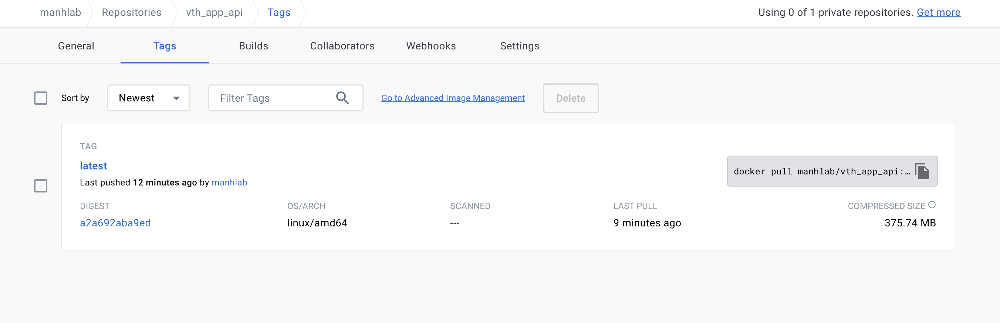
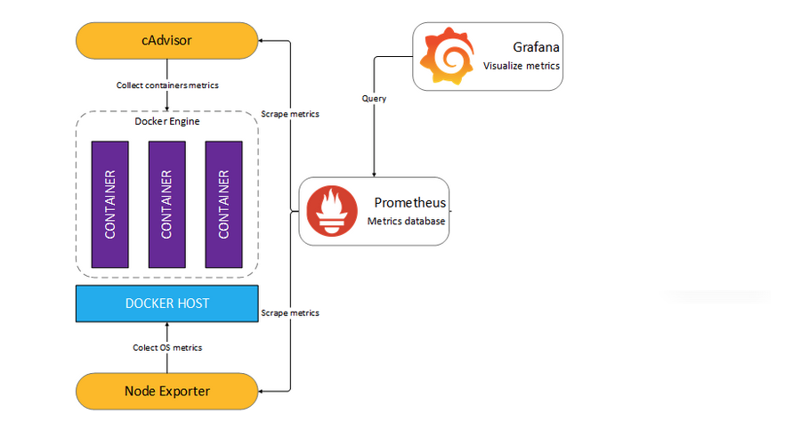

### 1. Phát triển một 3-tier web application đơn giản (2đ)
#### Yêu cầu:
- Viết một CRUD web application đơn giản thực hiện các chức năng:
- Liệt kê danh sách sinh viên tham gia khóa đào tạo chương trình VDT 2023 lĩnh vực cloud dưới dạng bảng (0.5đ)
- Cho phép xem chi tiết/thêm/xóa/cập nhật thông tin sinh viên (0.5đ)
- Thiết web: Giao diện web viết bằng HTML + CSS + Javascript được triển khai trên nền web server nginx
- api: RESTful API viết bằng ngôn ngữ lập trình tùy chọn (prefer Python), có đầy đủ các chức năng: list, get, create, update, delete các bản ghi thông tin sinh viên
- db: Database SQL hoặc NoSQL lưu trữ thông tin sinh viên (dữ liệu khởi tạo của DB này được cho bởi bảng trong Phụ lục I.)
- Viết unit tests cho các chức năng APIs (0.5đ)
- * Viết unit tests cho các chức năng giao diện, viết integration tests
#### Output:
- Mã nguồn của từng dịch vụ
#### Solution
- api: FastAPI with crud operation in: https://api.viettelcloud.site/docs
- webserver: HTML+CSS+JS render by FastAPI template+Nginx service
- db: mongodb 5.0
- Unit test APIs CRUD: https://github.com/manhtd98/Viettel-Digital-Talent-2023/blob/main/1.%20Containerization/Tran-Duc-Manh/api/test_user.py
- Unit test UI:
#### Result: 
- Success to write and deploy webserver on : https://api.viettelcloud.site


### Part 2: 1. Containerization (1đ)
#### Yêu cầu:
- Viết Dockerfile để đóng gói các dịch vụ trên thành các container image (0.5đ)
-  Yêu cầu image đảm bảo tối ưu thời gian build và kích thước chiếm dụng, khuyến khích sử dụng các thủ thuật build image đã được giới thiệu (layer-caching, optimized RUN instructions, multi-stage build, etc.) (0.5đ) Output:
- File Dockerfile cho từng dịch vụ kế hệ thống với ba dịch vụ: (0.5đ)
- Output câu lệnh build và thông tin docker history của từng image
### Solution:
- Dockerfile API: https://github.com/manhtd98/Viettel-Digital-Talent-2023/blob/main/1.%20Containerization/Tran-Duc-Manh/api/Dockerfile
- Dockerfile Webserver: https://github.com/manhtd98/Viettel-Digital-Talent-2023/blob/main/1.%20Containerization/Tran-Duc-Manh/webapp/Dockerfile
- History build: API: https://github.com/manhtd98/Viettel-Digital-Talent-2023/blob/main/1.%20Containerization/Tran-Duc-Manh/api.build
- History build webserver: https://github.com/manhtd98/Viettel-Digital-Talent-2023/blob/main/1.%20Containerization/Tran-Duc-Manh/webapp.build


### 2. Continuous Integration (1đ)
#### Yêu cầu:
-  Tự động chạy unit test khi tạo PR vào branch main (0.5đ)
-  Tự động chạy unit test khi push commit lên một branch (0.5đ)
#### Output:
-  File setup công cụ CI
-  Output log của luồng CI
-  Các hình ảnh demo khác
#### Solution:
- Github actions config in file: https://github.com/manhtd98/Viettel-Digital-Talent-2023/blob/main/.github/workflows/docker-image.yml
- Build history: https://github.com/manhtd98/Viettel-Digital-Talent-2023/actions/runs/4935221930
- Demo image:


#### Result: 
- Success to Deploy CI on Github actions: https://github.com/manhtd98/Viettel-Digital-Talent-2023/actions

### 3. Continuous Delivery (4đ)
#### Yêu cầu:
- Viết luồng release dịch vụ bằng công cụ CI/CD của GitHub/GitLab, thực hiện build docker image và push docker image lên Docker Hub khi có event một tag mới được developer tạo ra trên GitHub (1đ)
- Viết ansible playbook thực hiện các nhiệm vụ:
    - Setup môi trường: Cài đặt docker trên các node triển khai dịch vụ (1đ)
    - Deploy các dịch vụ theo version sử dụng docker (1đ)
    - * Triển khai các dịch vụ trên nhiều hosts khác nhau
- Đảm bảo Mỗi dịch vụ web và api được triển khai trên ít nhất 02 container khác nhau (0.5đ) Requests đến các endpoint web và api được cân bằng tải thông qua các công cụ load balancer, ví dụ: nginx, haproxy và traefik (0.5đ)
- * Các công cụ load balancer cũng được triển khai theo mô hình cluster
- * Triển khai db dưới dạng cluster
#### Output:
- Ảnh minh họa kiến trúc triển khai và bản mô tả
- Thư mục chứa ansible playbook dùng để triển khai dịch vụ, trong thư mục này cần có
- File inventory chứa danh sách các hosts triển khai Các file playbook
- Thư mục roles chứa các role:
    - common: Setup môi trường trước deploy
    - web: Triển khai dịch vụ web
    -  api: Triển khai dịch vụ api
    - db: Triển khai dịch vụ db
    - lb: Triển khai dịch vụ load balancing
- File setup CD
- Output của luồng build và push Docker Image lên Docker Hub
- Hướng dẫn sử dụng ansible playbook để triển khai các thành phần hệ thống
- Output log triển khai hệ thống

#### Result:
- File setup CD Github Actions: https://github.com/manhtd98/Viettel-Digital-Talent-2023/blob/main/.github/workflows/docker-image.yml
- Output của luồng build và push Docker Image lên Docker Hub: 


- Output log triển khai hệ thống: https://github.com/manhtd98/Viettel-Digital-Talent-2023/tree/main/Midterm/Tran%20Duc%20Manh/logs
- File inventory chứa danh sách các hosts triển khai: https://github.com/manhtd98/Viettel-Digital-Talent-2023/blob/main/Midterm/Tran%20Duc%20Manh/inventories/multinode.yml

##### Install docker on multi node (2 worker node+master node)
```
ansible-playbook -i ./inventories/multinode.yml playbooks/playbook-docker.yml >> logs/multinode-setup.run
```
##### Install FastAPI on multi node (2 worker node+master node)
```
ansible-playbook -i ./inventories/multinode.yml playbooks/api.yml >> logs/api.run
```
##### Install Webserver on multi node (2 worker node+master node)
```
ansible-playbook -i ./inventories/multinode.yml playbooks/playbook-docker.yml >> logs/multinode-setup.run
```
- Thư mục chứa ansible playbook dùng để triển khai dịch vụ, trong thư mục này cần có: https://github.com/manhtd98/Viettel-Digital-Talent-2023/tree/main/Midterm/Tran%20Duc%20Manh/playbooks
- Thư mục roles chứa các role: https://github.com/manhtd98/Viettel-Digital-Talent-2023/tree/main/Midterm/Tran%20Duc%20Manh/roles

### 4. Monitoring (1đ)
#### Yêu cầu:
- Viết ansible playbook roles monitor thực hiện các nhiệm vụ:
- Cài đặt các dịch vụ node exporter và cadvisor dưới dạng container
- Đẩy thông số giám sát lên hệ thống giám sát Prometheus tập trung
- Chú ý: Tên các container có tiền tố là <username>_ để phân biệt thông số giám sát dịch vụ của các sinh viên trên hệ thống giám sát tập trung. Thông tin <username> của từng sinh viên cho bởi bảng trong Phụ lục I.
#### Output:
- Role monitor chứa các playbook và cấu hình giám sát cho hệ thống
- Ảnh chụp dashboard giám sát nodes & containers, có thể sử dụng hệ thống prometheus tập trung ở 171.236.38.100:9090

#### Solution:

- Ansible monitor: https://github.com/manhtd98/Viettel-Digital-Talent-2023/tree/main/Midterm/Tran%20Duc%20Manh/roles/monitor
- Log deploy: https://github.com/manhtd98/Viettel-Digital-Talent-2023/tree/main/Midterm/Tran%20Duc%20Manh/logs/monitor.run
- Image run:


### 5. Logging (1đ)
#### Yêu cầu:
- Viết ansible playbook thực hiện các nhiệm vụ:
    - Cài đặt dịch vụ logstash hoặc fluentd để collect log từ các dịch vụ web, api và db
    - Đẩy log dịch vụ lên hệ thống Elasticsearch tập trung 171.236.38.100:9200
    - Log phải đảm bảo có ít nhất các thông tin: IP truy cập, thời gian, action tác động, kết quả (thành công/không thành công/status code)
    - Log được index với tiền tố <username>_ để phân biệt log dịch vụ của các sinh viên khác nhau. Thông tin <username> của từng sinh viên cho bởi bảng trong Phụ lục I.
#### Output:
- Ansible playbook triển khai các dịch vụ collect log (tách module logging)

- Ảnh chụp sample log từ Kibana 171.236.38.100:5601

### Solution

- Ansible logstash: https://github.com/manhtd98/Viettel-Digital-Talent-2023/tree/main/Midterm/Tran%20Duc%20Manh/roles/ansible-role-logstash
```
ansible-playbook -i ./inventories/local.yml playbooks/logstash.yml >> logs/logstash.run 
```

