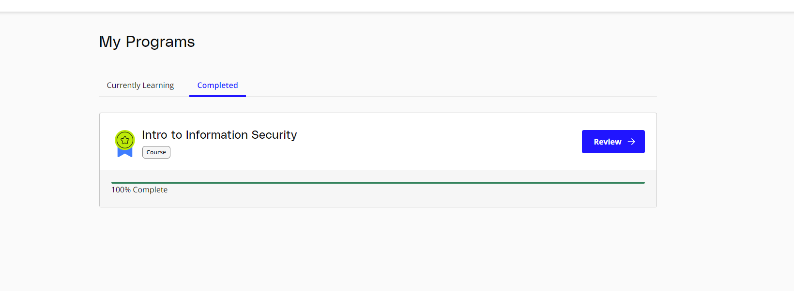

# Homework
## I. Hoàn thành 1 khóa học về ATTT cơ bản 





## II. Thực hành 1 hệ thống ATTT online viết báo cáo: Sandbox/Phishing Mail
- `VirusTotal` là một dịch vụ trực tuyến mà người dùng có thể sử dụng để phân tích và kiểm tra tệp tin hoặc địa chỉ URL xem có chứa phần mềm độc hại hay không. 


- Kết quả khi phân tích 1 file HTML


- `Urlscan` là một dịch vụ trực tuyến cho phép người dùng kiểm tra và phân tích các địa chỉ URL hoặc trang web để xác định tính an toàn và tiềm năng đe dọa. Một số thông tin về việc sử dụng Urlscan:

    - Kiểm tra độ an toàn của URL: Bạn có thể nhập một địa chỉ URL vào Urlscan để kiểm tra xem trang web đó có chứa các yếu tố đáng ngờ, độc hại hoặc liên quan đến các hoạt động đen tối không.

    - Phân tích các thành phần của trang web: Urlscan cung cấp thông tin về các thành phần của trang web như tệp tin JavaScript, CSS, hình ảnh, các liên kết và các yêu cầu mạng khác. Điều này giúp người dùng hiểu rõ hơn về cấu trúc và nội dung của trang web.

    - Phát hiện mã độc và các mối đe dọa: Urlscan sử dụng các kỹ thuật phân tích tự động để phát hiện các mã độc, phần mềm độc hại và các mối đe dọa khác trên trang web. Nếu trang web chứa các thành phần đáng ngờ, Urlscan sẽ cung cấp thông tin chi tiết để giúp bạn hiểu rõ hơn về tiềm năng đe dọa.

    - Thống kê và tóm tắt: Urlscan cung cấp các thống kê và tóm tắt về các thành phần của trang web, bao gồm các liên kết, tên miền, cổng và giao thức sử dụng. Điều này giúp bạn có cái nhìn tổng quan về trang web và đánh giá tính an toàn.
- Giao diện

- Ví dụ khi scan 1 website:
    - Summary (Tóm tắt): Thuộc tính "Summary" cung cấp một cái nhìn tổng quan về trang web đã được quét. Nó có thể bao gồm các thông tin như tiêu đề trang, tiêu đề HTTP, trạng thái phản hồi và kích thước tệp tin. Tóm tắt này giúp bạn nhanh chóng hiểu về các thông tin quan trọng của trang web.
  
    - HTTP: Thuộc tính "HTTP" cung cấp chi tiết về yêu cầu và phản hồi HTTP trong quá trình truy cập trang web. Nó bao gồm thông tin về các yêu cầu HTTP, như yêu cầu GET hoặc POST, tiêu đề HTTP, mã phản hồi và nội dung phản hồi từ máy chủ. Điều này giúp bạn theo dõi các yêu cầu và phản hồi HTTP để phân tích và hiểu hoạt động của trang web.
    
    - Links (Liên kết): Thuộc tính "Links" cung cấp danh sách các liên kết (URL) mà trang web đã được quét. Đây là các đường dẫn khác được tìm thấy trong mã nguồn của trang web hoặc trong các yêu cầu và phản hồi HTTP. Thông qua thuộc tính này, bạn có thể xem các liên kết mà trang web liên kết tới và khám phá các tài nguyên liên quan khác.
    

## III. Tìm hiểu kiến trúc và tính năng 1 công cụ ATTT
- Kiến trúc của DefectDojo


  - `NGINX`: Là máy chủ web được sử dụng để phục vụ nội dung tĩnh như hình ảnh, tệp JavaScript hoặc tệp CSS.

  - `uWSGI`: Là máy chủ ứng dụng chạy trên Python/Django, đảm nhận việc cung cấp nội dung động cho DefectDojo.

  - `Message Broker`: Là một hệ thống gửi/nhận tin nhắn để thực thi các tác vụ không đồng bộ. RabbitMQ là một lựa chọn phổ biến cho Message Broker trong DefectDojo.

  - `Celery Worker` Là một worker (người thực hiện) trong hệ thống Celery, được sử dụng để thực hiện các tác vụ không đồng bộ như deduplication (loại bỏ các bản sao) hoặc đồng bộ hóa với JIRA.

  - `Celery Beat`: Là một công cụ trong Celery được sử dụng để lập lịch và chạy các tác vụ được lập lịch trước đó, ví dụ như thông báo về các cuộc thử nghiệm sắp tới.

  - `Initializer`: Là thành phần khởi tạo, thực hiện thiết lập và duy trì cơ sở dữ liệu, cũng như đồng bộ và chạy các phiên bản sau khi nâng cấp. Sau khi hoàn thành tất cả các tác vụ, Initializer sẽ tắt bản thân.

  - `Database`: Là cơ sở dữ liệu lưu trữ tất cả dữ liệu ứng dụng của DefectDojo. Hiện tại, DefectDojo hỗ trợ MySQL và PostgreSQL.

### Các tính năng DefectDojo

#### Risk Acceptance
- Findings cannot always be remediated or addressed for various reasons. A finding 'status' can be change to 'accepted' by doing the following: Findings are accepted in the engagement view. To locate the engagement from the finding click the link to engagement as shown below.


- Then, in the engagement view click the plus icon in the 'Risk Acceptance' box and fill in the details to support the risk acceptance.


- The engagement view is now updated with the risk.


- The finding status changes to 'Accepted' with a link to the risk acceptance.


#### Deduplication
- Deduplication is a feature that when enabled will compare findings to automatically identify duplicates. When deduplication is enabled, a list of deduplicated findings is added to the engagement view. The following image illustrates the option deduplication on engagement and deduplication on product level:


- Upon saving a finding, DefectDojo will look at the other findings in the product or the engagement (depending on the configuration) to find duplicates

- When a duplicate is found:

    - The newly imported finding takes status: inactive, duplicate
    - An "Original" link is displayed after the finding status, leading to the original finding
- There are two ways to use the deduplication:

    - Deduplicate vulnerabilities in the same build/release. The vulnerabilities may be found by the same scanner (same scanner deduplication) or by different scanners (cross-scanner deduplication). this helps analysis and assessment of the technical debt, especially if using many different scanners; although detecting duplicates across scanners is not trivial as it requires a certain standardization.
    - Track unique vulnerabilities across builds/releases so that DefectDojo knows when it finds a vulnerability that has seen it before. this allows you keep information attached to a given finding in a unique place: all further duplicate findings will point to the original one.

- Deduplication configuration
    - Global configuration
        - The deduplication can be activated in "System Settings" by ticking "Deduplicate findings".
        - An option to delete duplicates can be found in the same menu, and the maximum number of duplicates to keep for the same finding can be configured.

    - Engagement configuration
        - When creating or editing an engagement, the "Deduplication within engagement only" checkbox can be ticked.

            - If activated: Findings are only deduplicated within the same engagement. Findings present in different engagements cannot be duplicates
            - Otherwise: Findings are deduplicated across the whole product
- Note that currently deduplication does not occur across different products.

##### Deduplication algorithms
- The behavior of the deduplication can be configured for each parser in settings.dist.py (or settings.py after install) by configuring the DEDUPLICATION_ALGORITHM_PER_PARSER variable, or via the env variable (useful for Kubernetes deployments) DD_DEDUPLICATION_ALGORITHM_PER_PARSER with a JSON string like

``` text
{"ScannerName":"algorithm"}
```
- The environment variable will override the settings in settings.dist.py, replacing by matching the keys.

The available algorithms are:

DEDUPE_ALGO_UNIQUE_ID_FROM_TOOL
DEDUPE_ALGO_HASH_CODE
DEDUPE_ALGO_LEGACY

#### Reports
Instant reports

- Instant reports can be generated for:
    - Product types
    - Products
    - Engagements
    - Tests
    - List of Findings
    - Endpoints
- Filtering is available on all report generation views to aid in focusing the report for the appropriate need.

Custom reports

- Custom reports, generated with the Report Builder, allow you to select specific components to be added to the report. These include:

  - Cover Page
  - Table of Contents
  - WYSIWYG Content
  - Findings
  - Vulnerable Endpoints
  - Page Breaks
- DefectDojo’s reports can be generated in HTML and AsciiDoc.

#### Metrics
- DefectDojo provides a number of metrics visualization in order to help with reporting, awareness and to be able to quickly communicate a products/product type's security stance.

- The following metric views are provided:

##### Product Type Metrics
- This view provides graphs displaying Open Bug Count by Month, Accepted Bug Count by Month, Open Bug Count by Week, Accepted Bug Count by Week as well as tabular data on Top 10 Products by bug severity, Detail Breakdown of all reported findings, Opened Findings, Accepted Findings, Closed Findings, Trending Open Bug Count, Trending Accepted Bug Count, and Age of Issues.


##### Product Type Counts
- This view provides tabular data of Total Current Security Bug Count, Total Security Bugs Opened In Period, Total Security Bugs Closed In Period, Trending Total Bug Count By Month, Top 10 By Bug Severity, and Open Findings. This view works great for communication with stakeholders as it is a snapshot in time of the product.


##### Simple Metrics
- Provides tabular data for all Product Types. The data displayed in this view is the total number of S0, S1, S2, S3, S4, Opened This Month, and Closed This Month.


##### Engineer Metrics
- Provides graphs displaying information about a tester's activity.


##### Metrics Dashboard
- Provides a full screen, auto scroll view with many metrics in graph format. This view is great for large displays or "Dashboards."


### Users 
- DefectDojo users inherit from django.contrib.auth.models.User.

- A username, first name, last name, and email address can be associated with each user. Additionally the following attributes describe the type of users:

##### Active
- Designates whether this user should be treated as active and can login to DefectDojo. Unselect this instead of deleting accounts.
##### Superuser status
- Designates that this user can configure the system and has all permissions for objects without explicitly assigning them.
- A superuser may force a password reset for any user at any given time. This can be set when creating a new user, or when editing an existing one, requiring the user to change their password upon their next login.

- DefectDojo enforces the following password rules for all users:

    - Must meet a length requirement of 9 characters
    - Must be unique (not commonly used)
    - Must contain one of each of the following: a number (0-9), uppercase letter (A-Z), lowercase letter (a-z), and symbol ()[]{}|~!@#$%^&*_-+=;:`'",<>./?

### Calendar
- The calendar view provides a look at all the engagements and tests occurring during the month d, week or day displayed. Each entry is a direct link to the respective engagement or test view page.


